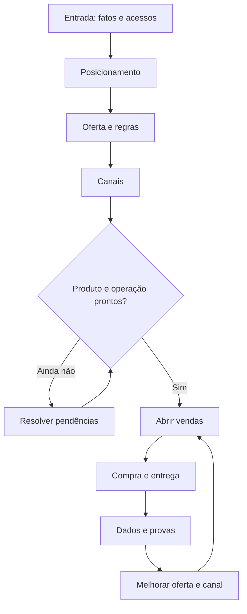
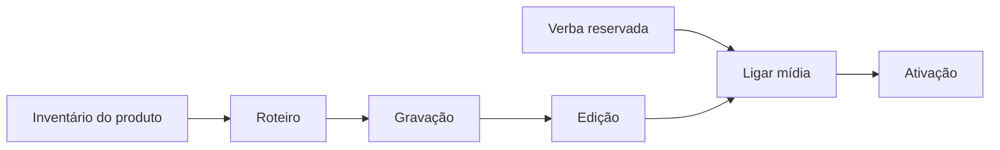

# MÉTODO — Camada de Ver

> **Tipo:** framework · secundário: blueprint (§3, §7-bis), gate (§5, §7) *(reclassificado 26/09/2026 por auditoria independente de leitura integral; antes: sem campo)*
> **Abrir por momento:** decidir §0–§1 · produzir §3 e §7-bis · conferir §7 *(mapa proposto pela auditoria de 26/09 — conferir no primeiro uso)*
> **Instituído em:** 18/09/2026 · **Alçada:** Victor · **Aplica-se a:** todo artefato que pede decisão — proposta, plano, funil, cronograma, pauta, entrega de cliente
> **Gatilho:** *"para a proposta do Danilo, eu mesmo não estava conseguindo VER."* O documento existia, estava correto, e o autor não conseguia enxergá-lo. **Um fluxograma resolveu em uma tela.**
> **Gate:** `00-core/COMPLIANCE-DE-OUTPUT.md` §Camada de ver.

---

## 0. A TESE

> ## Todo artefato de decisão tem duas camadas: **a de LER e a de VER.** Entregamos sempre a primeira e quase nunca a segunda.

**E a evidência é interna, não teórica:**

| Quem | O que disse |
|---|---|
| **Débora**, sobre a estratégia | `[16/09 10:13:21]` *"eu ainda **não consigo visualizar**"* |
| **Débora**, sobre o funil | `[15/09 17:12]` *"**não consigo imaginar** vender mentoria pra público frio"* |
| ⭐ **Victor**, sobre a própria proposta | `[18/09]` *"eu mesmo **não estava conseguindo VER**"* |

> ## 🔴 A dificuldade de visualização não é da cliente. É do leitor de decisão — e o autor do material é um deles.
>
> **Quem escreve enxerga porque construiu o modelo enquanto escrevia.** Quem lê recebe o texto e **não recebe o modelo** — tem que reconstruí-lo sozinho, e quase nunca reconstrói.

---

## 1. 🔴 O DIAGNÓSTICO — o que produzíamos não era diagrama

**Caso real, nosso, de 27/08:** o "BPMN" da Débora. Seis fases × quatro raias, cada célula com ~30 palavras.

| O que fizemos | O que funciona |
|---|---|
| **matriz** — raias × fases | ⭐ **grafo** — nós e setas |
| ~30 palavras por célula | **3 a 6 palavras por nó** |
| nenhuma decisão | **losango, com as duas saídas rotuladas** |
| nenhum retorno | **loop de volta** para quem não passou |
| lê-se como tabela | **segue-se com o dedo** |

> ## A matriz responde *"o que existe em cada cruzamento"*. O grafo responde *"o que acontece depois"*.
>
> 🔴 **E decisão é sempre sobre o que acontece depois.** Por isso a matriz informa e não destrava: **ela é uma tabela que aprendeu a desenhar.**

⚠️ **Isso não condena a matriz** — ela é boa para inventário, cobertura e comparação. **É a peça errada para decisão.**

---

## 2. A GRAMÁTICA — as seis regras do nó e da seta

| # | Regra |
|---|---|
| **1** | **3 a 6 palavras por nó.** Acima de 7, é texto dentro de caixa |
| **2** | **Um conceito por nó.** *"Página, checkout, nota fiscal e frete"* já está no limite; cinco seria outro diagrama |
| **3** | 🔴 **Losango é pergunta binária, e as duas saídas vão ROTULADAS** — *"Sim"* / *"Ainda não"*. Saída sem rótulo obriga o leitor a adivinhar |
| **4** | ⭐ **Todo processo real tem loop.** Quem não passou volta para algum lugar. **Diagrama sem retorno é otimismo desenhado** |
| **5** | **Uma direção só** — de cima para baixo. Ramos voltam e se reencontram; o eixo não gira |
| **6** | 🔴 **Sem legenda.** Se precisa de legenda para ser lido, falhou. Cor e forma carregam no máximo uma distinção |

**E a régua de posição, que vale mais que as seis:**

> ## 🔴 O diagrama ABRE o documento. Nunca fecha.
>
> **Diagrama no fim é ilustração do que já foi lido** — chega tarde demais para reduzir carga. **Diagrama na abertura é o modelo mental que o leitor usa para ler o resto.**

---

## 3. OS QUATRO PADRÕES

### 3.1 ⭐ Fluxo de decisão — *"como funciona e onde eu entro"*

**Quando:** proposta, funil, processo comercial, operação. **É o padrão default.**
**Anatomia:** entrada → transformações → **losango** → dois caminhos → reencontro → saída, **com loop**.

### 3.2 Cadeia de dependência — *"o que trava o quê"*

**Quando:** cronograma, bloqueadores, sequência de entrega.
**Anatomia:** o que bloqueia aponta para o que é bloqueado. **Nó sem seta entrando é o que pode começar hoje.**

### 3.3 Antes × depois — *"o que muda"*

**Quando:** proposta e diagnóstico. ⭐ **É o padrão que vende**, porque o custo da inação fica visível em vez de argumentado.
**Anatomia:** dois subgrafos, o mesmo fluxo, um com o buraco e outro sem.

### 3.4 Mapa de decisão pendente — *"o que falta e de quem é"*

**Quando:** pauta de call, elicitação, estado de conta.
**Anatomia:** cada nó é uma decisão aberta; a cor ou o prefixo diz **de quem é**. 🔴 **Decisão nossa e decisão do cliente nunca no mesmo formato** — é a `REGRA Nº 0` desenhada.

---

## 4. O FORMATO — Mermaid, e a razão é de governança

| Critério | Por que Mermaid |
|---|---|
| **Versionável** | é texto. Entra no repo, aceita diff, sobrevive a este repositório não ter git ativo |
| **Editável** | qualquer agente altera uma linha. Imagem exige refazer |
| **Renderizável** | Codex, GitHub, artefatos e o gerador de PDF do `90-templates/pdf-continuum/` |
| **Barato** | segundos, não minutos — **e é isso que torna o gate exequível** |

🔴 **Imagem exportada é saída, nunca fonte.** O `.mmd` ou o bloco no `.md` é o original.

---

## 5. OS QUATRO MODOS DE FALHA

| # | Falha | Como se reconhece | Correção |
|---|---|---|---|
| **1** | **Decorativo** | desenha o que o texto já disse, na mesma ordem | se o diagrama não substitui nenhum parágrafo, ele não trabalha |
| **2** | **Enciclopédico** | 20+ nós, não cabe em uma tela | ⭐ **partir em dois: o mapa e o detalhe.** Nunca comprimir a fonte |
| **3** | 🔴 **Sem decisão** | nenhum losango, nenhuma bifurcação | é **lista vertical**, e lista se escreve melhor como lista |
| **4** | **Com legenda** | precisa de chave para ser lido | tirar a distinção que exige a legenda. **Uma distinção visual, no máximo** |

---

## 6. 🔴 QUANDO **NÃO** DESENHAR

**Nem todo documento tem um grafo dentro, e forçar produz o modo de falha 1.**

| Não desenhar | Por quê |
|---|---|
| tabela de preço, inventário, léxico | **não há fluxo** — é acervo |
| registro de conversa, destilação | é cronológico e literal. **O índice de destino de uso já faz esse trabalho** |
| peça de copy | a sequência é a peça. Diagramar copy é explicar a piada |
| documento de um passo | não há "depois" |

> **O gatilho de obrigatoriedade, e ele é binário:** o documento **pede decisão do leitor** ou **descreve processo com 3+ passos e ao menos uma bifurcação**. **Se sim, o diagrama é obrigatório e abre o documento.**

---

## 7. O TESTE — um só, e de cinco segundos

> ## 🔴 **O leitor consegue apontar com o dedo onde ele está?**
>
> Se ele precisa ler para localizar, **é texto em caixa**. Se ele aponta, é diagrama.

**E o teste de suficiência, no padrão do `CLAUDE.md` §11.4:**

> **Alguém que só olhe o diagrama, sem ler uma linha do documento, saberia dizer o que precisa decidir?**

---

## 7-bis. 🔴 ⭐ O DOCUMENTO INTEIRO COMO SEQUÊNCIA DE DIAGRAMAS (19/09/2026)

> **Instituído um dia depois do método, ao aplicá-lo pela primeira vez numa entrega de cliente.** A §2 diz que **o diagrama abre a seção**. Esta diz o que acontece quando um documento tem muitas seções — e **a resposta não é "um diagrama por seção e pronto".**

### O problema que aparece na segunda seção

**Um diagrama por seção resolve a seção e não resolve o documento.** O leitor entende cada parte e **continua sem saber onde cada parte fica** — porque nada nunca mostrou o conjunto. É o modo de falha 2 (**enciclopédico**) visto do lado oposto: em vez de um diagrama grande demais, vários pequenos demais, sem moldura.

### A arquitetura, e a página 2 é a regra

| # | Página | Função |
|---|---|---|
| 1 | capa | — |
| **2** | 🔴 **o mapa inteiro, um diagrama só** | dá o modelo mental antes do primeiro parágrafo |
| 3+ | **uma seção por caixa do mapa**, cada uma com o próprio diagrama | detalha um nó |
| n−1 | o que falta, **nosso × seu** | transforma entusiasmo em cronograma |
| n | **o que o documento NÃO faz** | nomeia o que só se sabe depois |

> ## ⭐ A frase que faz a página 2 trabalhar: *"tudo que vem depois é o detalhe de uma destas caixas."*
>
> **Sem ela, o mapa é só mais um diagrama.** Com ela, ele vira o índice — e toda seção seguinte tem um lugar onde encaixar.

### 🔴 O teste de correspondência

> **Toda caixa do mapa tem uma seção? Toda seção tem uma caixa?**
>
> **Caixa sem seção é promessa não cumprida** — o leitor a procura e não acha. **Seção sem caixa é conteúdo que entrou por fora** — e quase sempre é conteúdo que não pertence ao documento.

**É o teste mais barato deste método inteiro**, porque se responde contando, não julgando.

> ### ⭐ A exceção, encontrada ao rodar o teste contra o primeiro caso real (§7.1.4 do `CLAUDE.md`)
>
> **Nó TERMINAL que declara destino, e não etapa, se responde na própria página do mapa — não pede seção.**
>
> No funil da Débora, as duas caixas finais (*"mentoria, quando ele quiser"* e *"a empresa dele"*) não têm seção, e **isso está correto: elas dizem para onde o funil leva, não o que o funil faz.** O documento se chama *"o funil, peça por peça"*, e destino não é peça.
>
> 🔴 **A condição que torna a exceção legítima, e sem ela vira desculpa: o destino precisa estar respondido na nota da página do mapa.** Se a caixa terminal aparece no desenho e não é mencionada em lugar nenhum, **volta a ser promessa não cumprida.**
>
> **Distinção prática:** caixa desenhada no eixo principal, com o mesmo peso visual das outras → **pede seção**. Caixa fora do eixo, menor, em texto secundário → **é destino, e a nota basta.**

### O que isto NÃO autoriza

⚠️ **Não é licença para dividir um diagrama grande em seis.** O mapa precisa caber em uma tela **e ser legível** — se ele já não cabe, o documento tem escopo demais, e a correção é cortar escopo, não fatiar desenho.

**Aplicação canônica desta arquitetura, com as três classes de documento que ela produziu: `90-templates/pdf-noturno/README.md` §3-bis.**

---

## 8. O QUE ESTE MÉTODO NÃO FAZ

**Não substitui o texto.** O diagrama dá o modelo; o texto dá a razão. **Diagrama sozinho vira organograma bonito que ninguém sabe defender.**

**Não autoriza mais volume.** ⚠️ Ele existe para **reduzir** carga de leitura, não para somar uma seção. **Se o documento cresceu, o diagrama falhou** — e o `METODO-ESTIMATIVA-DE-CARGA.md` §3 já registrou que a nossa velocidade de produção ultrapassou a velocidade de absorção da cliente.

**Não é design.** Nada de paleta, ícone ou cuidado estético. ⭐ **O diagrama do Codex que funcionou não é bonito: é legível.** São retângulos e setas.

---

*Instituído em 18/09/2026, alçada Victor. Roteado em `CLAUDE.md` §6 e §7, com o gate em `00-core/COMPLIANCE-DE-OUTPUT.md`. Primeira aplicação real na mesma tarefa: `clientes/Débora Delgado/FUNIL-DR-ESTRUTURA-2026-09-18.md`, cuja matriz de raias foi substituída por grafo.*
