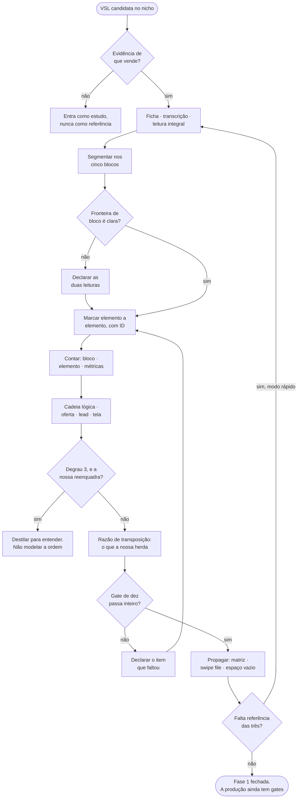

# MÉTODO — DESTILAÇÃO DE VSL

> **Tipo:** método · secundário: gate (§10, §12), trilho (§11) *(reclassificado 26/09/2026 por auditoria independente de leitura integral; antes: "método-raiz (camada 2)")* · **Instituído:** 20/09/2026 · **Alçada:** Victor
> 🟡 **VIGENTE PARA EXECUTAR, SEM VIGÊNCIA DEFINITIVA.** `CLAUDE.md` §7.1 item 4 exige que gate novo rode contra um caso real antes de virar definitivo. **A primeira referência destilada é o teste deste método, e o que ela quebrar volta para cá como correção — não como exceção.**
> 🔴 ⭐ **GALHO DE `METODO-DIRECT-RESPONSE.md`.** Os princípios gerais (40/40/20, prova vence promessa, hierarquia de lista, done for you) vivem no tronco e não se repetem aqui.
> **O que este método é, em uma linha:** o **motor executável das Fases B e C do `METODO-BENCHMARKING.md`**, aplicado a VSL, e a metade **EXTRAIR** do `METODO-ESTRUTURA-INVISIVEL.md` §7.1.
> **Consome:** transcrição de uma VSL de terceiro que passou o gate de evidência · **Entrega:** `clientes/<cliente>/benchmark-vsl/` preenchido e o razão de transposição que a nossa VSL executa.

---

## O CAMINHO INTEIRO, NUMA TELA



---

## 0. ÍNDICE POR DESTINO DE USO

| Se você vai... | Leia |
|---|---|
| **Destilar uma VSL agora, do zero** | §4 (as nove etapas) — e nada antes |
| Decidir SE esta referência merece ser destilada | §3 (gatilho e pré-requisitos) — **começa aqui** |
| Saber o que exatamente se extrai | §5 (os doze eixos) |
| Contar palavras, blocos e elementos sem errar | §6 |
| Reconstituir o argumento da referência | §7 |
| Saber o que a peça **não** entrega | §8 — **ler antes de prometer conclusão ao cliente** |
| Preencher o artefato de saída | §9 + `90-templates/benchmark-vsl/DESTILACAO-VSL.md` |
| Fechar a destilação | §10 (gate) e §11 (propagação) |
| Entender por que não se destila qualquer VSL | §12 |

**Legenda de procedência, herdada de `METODO-ARQUEOLOGIA-DE-ICP.md`:** `D` direta (o próprio público falou) · `R` relatada (o concorrente diz que a dor é essa) · `I` inferida (nossa leitura) · `[B]` benchmark de mercado (padrão medido em peça de terceiro).

---

## 1. POR QUE ESTE MÉTODO EXISTE

Em 13/09/2026 instituímos quatro peças do eixo de VSL — funil, benchmarking, estrutura invisível e pontos lógicos. Elas entregam **a teoria** (por que a ordem transfere e as palavras não), **o vocabulário** (hoje 35 rótulos controlados), **as 15 dimensões** e **os templates de saída**.

🔴 **Nenhuma delas entrega o procedimento.** A captura inteira cabe em três linhas no `METODO-BENCHMARKING.md` §4 — *transcrever, normalizar, registrar a ficha* — e a extração em cinco passos no `METODO-ESTRUTURA-INVISIVEL.md` §7.1. **Entre "transcreva a VSL" e "a MATRIZ preenchida" existe o trabalho inteiro, e ele não estava escrito em lugar nenhum.**

**A consequência é previsível e é de alucinação:** sem procedimento, quem abre um transcript de 8.000 palavras segmenta por intuição, rotula com palavra livre, conta o que lembra de contar, e produz uma matriz que **parece** dado e é impressão formatada. Matriz assim é pior que matriz vazia — ela passa o gate de saída do benchmarking sem ter medido nada.

> **A régua que governa tudo abaixo, e é a irmã da régua de calls:**
>
> **Resumir uma VSL é dizer do que ela fala. Destilar uma VSL é recuperar a sequência de decisões que outra pessoa já pagou para descobrir.**
>
> A primeira serve a uma conversa. A segunda é insumo de construção.

### 1.1 A diferença que separa este método do de calls

**São dois métodos de destilação e não são variações um do outro.** O objeto é de natureza distinta, e confundi-los produz o erro mais caro do repositório.

| | `METODO-DESTILACAO-DE-CALLS.md` | **Este método** |
|---|---|---|
| **Objeto** | uma conversa gravada com cliente, prospect ou contraparte | **uma peça de conversão publicada por terceiro** |
| **O que se extrai** | **fato** — preço, decisão, dor, compromisso, voz | **estrutura** — ordem, dose, mecanismo, tipo de prova |
| **Grau da fala capturada** | 🟢 `D` — a pessoa falou conosco | 🔴 **`R` ou `I`, sempre** — é o que o concorrente *acha* que a dor é |
| **Vai para copy como** | cena, fala, dor — **conteúdo** | sequência e volume — **arquitetura** |
| **Eixo que audita a nossa língua** | 13 (existe) | **não existe** — não há fala nossa numa peça alheia |
| **Citação literal** | núcleo do método | ⚠️ **âncora curta de análise, entre aspas, e nada além** |

> 🔴 **O erro que esta tabela existe para impedir:** tratar a VSL de um concorrente como se fosse uma call com o nosso público, e colher dela cena, dor e fala. **É exatamente o erro que custou a conta Bárbara Rosa** (`clientes/Bárbara Rosa/ENCERRAMENTO-2026-09-10.md`), cometido com outra fonte.

---

## 2. FRONTEIRAS — o que este método NÃO é

| Não é | É de quem |
|---|---|
| O benchmarking inteiro | `METODO-BENCHMARKING.md` — **este método executa as Fases B e C; a seleção (A), a leitura (E) e a síntese (F) continuam lá** |
| A teoria da estrutura invisível | `METODO-ESTRUTURA-INVISIVEL.md` — **aqui está o como; lá está o porquê.** Ler §2 a §6 de lá antes da primeira marcação |
| O método de construir a nossa VSL | `METODO-FUNIL-DE-VSL.md` — este entrega o insumo, aquele constrói a peça |
| Destilação de call | `METODO-DESTILACAO-DE-CALLS.md` — §1.1 |
| Autorização para colher cena, dor ou fala do público | 🔴 **ninguém.** `METODO-ARQUEOLOGIA-DE-ICP.md` é a única fonte de fala de público, e ela exige grau `D` |

### 2.1 🔴 As quatro travas, e nenhuma é negociável

1. **Não se cola copy alheia no artefato.** Registra-se ordem, dose, categoria e mecanismo. Trecho literal entra **só como âncora curta de análise**, entre aspas, com a posição na peça. Copy publicada é obra de terceiro.
2. **Estrutura se modela, cena se colhe.** A peça alheia diz **em que ordem as objeções morrem**. Ela nunca diz o que o nosso público sente.
3. **Benchmark informa, não decide.** Quem decide a estrutura somos nós — `CLAUDE.md` §8, REGRA Nº 0. **Referência é insumo, jamais veredito**, e o dono da oferta entra com objeção de congruência, não com escolha de estrutura.
4. ⭐ **Padrão observado não é causa provada.** Anúncio ativo e tempo de veiculação provam **investimento sustentado**, não lucro, e não dizem **qual** elemento produziu o resultado. **A destilação gera hipótese informada. A hipótese ainda precisa ser testada.**

---

## 3. GATILHO E PRÉ-REQUISITOS

### 3.1 Quando roda

| Situação | Profundidade |
|---|---|
| **Fase 1 do `METODO-FUNIL-DE-VSL.md`, conta nova** | completa na referência-base · **modo rápido** nas duas secundárias (§4.10) |
| Nossa VSL não converte e a causa não está na mídia | completa na referência-base · **recontagem comparativa: as métricas da nossa peça contra as da referência** (§6.5) |
| Referência nova apareceu no nicho e está escalando | completa |
| Revisão trimestral de conta ativa | eixos 1, 2, 3, 11 e 12 — **o degrau se move** |
| Peça de outro formato (página, anúncio, e-mail) | 🔴 **não é aqui.** `METODO-BENCHMARKING.md` §10 |

### 3.2 🔴 O pré-requisito que vem antes de transcrever

**Não se destila uma VSL que não passou o gate de evidência** (`METODO-BENCHMARKING.md` §3.2). Transcrever e marcar custa horas de colheita — e **hora de colheita não comprime** (`METODO-ESTIMATIVA-DE-CARGA.md`, camada B). Gastar essas horas numa peça bonita e morta contamina a leitura das outras duas e o swipe file inteiro.

**Antes da primeira linha de transcrição, três respostas escritas:**

- [ ] **Qual a evidência de que esta peça está vendendo?** nº de anúncios ativos · tempo em veiculação · tráfego medido
- [ ] **Ela é do nicho, ou de nicho adjacente?** Se adjacente, **qual adjacência e por quê** (mesmo tipo de decisão de compra, mesmo nível de ticket, ou mesma estrutura de objeção)
- [ ] **É evidência ou eco?** `METODO-BENCHMARKING.md` §7.3 — referência que só repete a mais antiga **vale um terço do que parece**

⚠️ **Nenhuma das três apurável: a peça entra como estudo, não como referência**, e o artefato diz isso na primeira linha.

---

## 4. AS NOVE ETAPAS

> **A ordem não é sugestão.** Marcar antes de ler inteiro produz rótulo enviesado pelo começo; contar antes de marcar produz número sem significado; concluir antes de contar é a impressão de sempre, agora com tabela.

### Etapa 1 — Ficha de coleta, antes de tudo

| Campo | Regra |
|---|---|
| **Referência** | `R1`, `R2`, `R3` — o ID que acompanha todo elemento depois |
| Quem | expert ou marca · nicho |
| Onde | URL da página e da peça · biblioteca de anúncios, quando houver |
| **Evidência** | §3.2, com o número e a data da apuração |
| **Duração original** | `hh:mm:ss` — **é o denominador de metade das métricas** |
| Data da coleta | o mercado muda; leitura sem data envelhece sem avisar |
| **Fonte da transcrição** | ASR automático (qual ferramenta) · legenda oficial · manual |

**A fonte bruta é preservada e nunca editada:** `clientes/<cliente>/benchmark-vsl/fontes/R1-BRUTO.<ext>`. É a única prova de que a âncora citada é literal.

### Etapa 2 — Transcrever e normalizar

**O que se remove:** marcação de player, timestamps duplicados, repetição de legenda, ruído de reconhecimento evidente.
**O que NUNCA se remove:** repetição que a pessoa fez de propósito, hesitação que marca transição, e **a ordem**.

🔴 **Três regras de fidelidade, herdadas do método de calls e válidas igual aqui:**

1. **ASR erra.** Trecho duvidoso vai marcado `[transcrição incerta]` com a grafia provável ao lado. **Nunca corrigir silenciosamente** — a palavra que o concorrente escolheu é dado.
2. **Limpeza por script, nunca à mão.** Limpeza manual introduz edição silenciosa no material que existe justamente para ser inegociável. O script do `METODO-DESTILACAO-DE-CALLS.md` §6 serve, com a adaptação de falante único.
3. ⭐ **O que é falado e o que é mostrado são duas trilhas.** VSL tem tela: demonstração, gráfico, depoimento em vídeo, texto sobreposto. **A transcrição captura só uma delas.** Registrar a segunda numa coluna própria (§6.4) ou ela some — e é nela que mora a prova mais forte do formato.

**Saída:** `benchmark-vsl/fontes/R1-LIMPO.md`, com a contagem total de palavras impressa no rodapé.

### Etapa 3 — Ler integralmente, e nunca por busca

**Sem exceção e sem amostragem.** O achado de maior valor de uma VSL quase nunca está onde o índice sugere: aparece numa transição, numa objeção respondida de lado, num número dito de passagem.

> **Ler por busca encontra o que já se sabia procurar. É o inverso do que a destilação serve para produzir.**

Transcript grande: ler em blocos sequenciais, **na ordem**, sem pular para a oferta.

### Etapa 4 — Segmentar em cinco blocos

**Os CINCO pontos de virada, e o marcador é a TRANSIÇÃO, nunca o assunto:**

`promete → se apresenta → ensina → conta como nasceu → oferece`

| Bloco | Começa | Termina |
|---|---|---|
| **LEAD** | primeira palavra | quando para de prometer e começa a falar de quem fala |
| **HISTÓRIA** | apresentação de quem fala | quando começa a ensinar algo técnico |
| **MECANISMO** | primeira explicação de como funciona | quando começa a contar como o produto nasceu |
| ⭐ **CONSTRUÇÃO** | o relato de quem aplicou primeiro | **quando o produto é nomeado** |
| **OFERTA** | o produto nomeado | fim |

> 🔴 **Eram quatro até 20/09/2026.** A CONSTRUÇÃO foi instituída como bloco próprio (`METODO-FUNIL-DE-VSL.md` §5.3-bis): expert aplicou → resultado → cascata → foi obrigado a criar. **Peça sem ela existe e é comum — registra-se `ausente`, porque ausência é dado.**

🔴 **A regra que resolve a ambiguidade, e é onde a marcação automática erra:** citar o próprio nome na lead **não abre a história**; citar o mecanismo de passagem na lead **não abre o mecanismo**; citar o produto dentro de uma prova **não abre a oferta**. **A virada é de FUNÇÃO DOMINANTE do trecho, não de aparição de palavra.**

⚠️ **Fronteira duvidosa se declara, não se decide no silêncio.** Registrar `fronteira LEAD→HISTÓRIA incerta entre E12 e E15` e seguir. **Duas leituras registradas valem mais que uma escolhida sem critério** — e a diferença entre elas é quase sempre menor que a margem da própria contagem.

### Etapa 5 — Marcar elemento a elemento, com ID estável

**Cada trecho recebe UM rótulo do vocabulário controlado de 35** (`METODO-BENCHMARKING.md` §5.2 — **eram 34 até 20/09/2026; o rótulo novo é `apelido`**). **Vocabulário fechado, porque rótulo livre impede comparação entre referências** — que é a única coisa que a matriz serve para fazer.

**Convenção de ID, e ela é o que torna o artefato citável:**

| Família | Formato | Numeração |
|---|---|---|
| **Elemento** | `R1-E01`, `R1-E02`… | sequencial **na peça inteira**, nunca reaproveitada, atravessa os blocos |
| **Ponto lógico** | `R1-PL1`, `R1-PL2`… | **independente**, só dentro do mecanismo — são elo de cadeia, não item de lista |

**Cada elemento carrega quatro campos, sempre:**

| Campo | Regra |
|---|---|
| **ID** | `R1-E07` |
| **Bloco** | lead · história · mecanismo · oferta |
| **Rótulo** | um dos 34. **Um só** |
| **Palavras** | a contagem do trecho |

**E dois campos quando houver:** `âncora` (trecho literal curto entre aspas, só quando a forma for o achado) e `tela` (o que aparece em imagem enquanto aquilo é dito).

🔴 **A regra da função dominante, e é ela que impede a contagem dobrada:** *"Se você já tem um curso e precisa organizar o vídeo que vai apresentá-lo"* segmenta **e** nomeia uma necessidade. **Conta-se a função dominante uma vez.** A secundária vai em observação, **sem somar as mesmas palavras duas vezes.**

> ⚠️ **A marcação é manual por decisão, não por limitação.** A IA pré-categoriza e erra justamente nas transições, que é o que importa. **E marcar à mão é o que constrói o repertório** — terceirizar a marcação inteira entrega a planilha e não entrega o olho (`METODO-ESTRUTURA-INVISIVEL.md` §7.1).

### Etapa 6 — Contar

Os três níveis, na ordem: **bloco → elemento → métricas derivadas.** Procedimento completo em §6.

### Etapa 7 — Reconstituir as três camadas que só a VSL tem

**A contagem dá a forma. Estas três dão o argumento** — e são o que separa esta destilação de uma planilha de palavras:

1. **A cadeia lógica** do mecanismo, elo a elo, com o teste de encadeamento (§7)
2. **A anatomia da oferta**, nas onze posições canônicas, com presença e ordem real
3. **A anatomia da lead**: ângulo · os quatro elementos essenciais · o que cabe nos primeiros 30 segundos

### Etapa 8 — Ler o negativo

**Duas leituras diferentes, e as duas são obrigatórias:**

| Leitura | Pergunta | Onde vai |
|---|---|---|
| **O que a peça não diz** | que argumento, prova ou objeção **nenhuma** das referências toca? | `ESPACO-VAZIO.md` — dimensão 15 |
| **O que a peça não pode dizer** | o que esta destilação **não tem como saber**? | §8 — e vai declarado, não estimado |

> 🔴 **A segunda é a que protege contra alucinação, e é a que ninguém escreve.** Uma VSL destilada não informa lucro, conversão, retenção, custo de aquisição nem qual elemento causou o resultado. **Escrever isso dentro do artefato é o que impede a próxima pessoa de ler a matriz como se fosse dado de performance.**

### Etapa 9 — Fechar o razão de transposição, e só então propagar

**O artefato não termina na leitura da referência. Termina na decisão sobre a nossa peça.**

| Da referência | Para a nossa | Régua |
|---|---|---|
| a **sequência** de elementos | idêntica | `METODO-ESTRUTURA-INVISIVEL.md` §7.2 |
| a **dose** por bloco e por elemento | ±15% | calibração de partida, não medida nossa |
| a **posição** dos elementos de prova | equivalente | distribuída, não concentrada no fim |
| a **dose lógica** (nº de elos) | 5 a 8 | acima de 10, a referência está complicando |
| ❌ as palavras | 🔴 **nunca** | o texto é nosso |
| ❌ a cena, a dor, a fala | 🔴 **nunca** | grau `R`/`I` — vem do `lexico-icp/`, com grau `D` |
| ❌ a promessa | 🔴 **nunca** | é decisão de estrutura, e é nossa (REGRA Nº 0) |

### 4.10 Modo rápido — as duas referências secundárias

**Destilação completa roda na referência-base.** As outras duas — que ficam como estudo de oferta, dor e ângulo — rodam a **versão curta**: eixos 1, 2, 3, 9, 11 e 12, contagem só de **nível 1** (bloco), sem marcação elemento a elemento.

🔴 **A escolha da base é anterior e não se faz por gosto: a que mais vendeu; sem essa informação, a mais simples de entender** (navalha de Occam). **Não se monta a estrutura-base misturando pedaços das três** — a mistura arbitrária destrói exatamente a propriedade que a ordem carrega. **Para as aberturas de teste, referências diferentes são admitidas** (`METODO-FUNIL-DE-VSL.md` §5.1).

---

## 5. ⭐ OS DOZE EIXOS DE EXTRAÇÃO

**A classificação é por natureza da informação, nunca por entregável** — cada natureza tem destino e vida útil diferentes. **Eixo vazio some do artefato; eixo não se inventa para preencher tabela.**

| # | Eixo | O que entra | Grau | Vida útil | Destino |
|---:|---|---|---|---|---|
| **1** | **Promessa** | a transformação em uma frase, com métrica e prazo **se houver** · onde ela aparece primeiro (posição em palavras) · quantas vezes se repete | `[B]` | até o degrau mudar | dimensão 1 · nossa promessa (decisão nossa) |
| **2** | ⭐ **Mecanismo e apelido** | a **tese** de por que funciona · o *reason why* · o **apelido** que ancora o mecanismo · ⭐ **a curva do apelido: onde aparece primeiro, quantas vezes repete e SE REPETE IDÊNTICO** · **e a distinção que quase ninguém faz: nome ≠ explicação** | `[B]` | anos | dimensão 2 · §7 · `METODO-MECANISMO-E-ONE-BELIEF.md` |
| **3** | **Oferta completa** | produto · preço · forma de pagamento · bônus · garantia (prazo e condição) · ancoragem usada · escassez, e se é real | `[B]` | até mudarem | dimensão 3 · a faixa de ticket que o nicho sustenta |
| **4** | ⭐ **Sequência de elementos** | a ordem, bloco a bloco, por ID — **o achado central da peça** | `[B]` | **permanente enquanto o nicho for o mesmo** | `ESTRUTURA-INVISIVEL.md` |
| **5** | 🔴 **Volume e dose** | palavras por bloco · % do total · palavras por elemento · duração e ritmo de fala medido | `[B]` | permanente | §6 · **o erro mais previsível do método** |
| **6** | ⭐ **Arsenal de prova** | tipo (depoimento, demonstração, número, autoridade, mídia, antes-e-depois) · **dose** · **posição** · **distância até a primeira** | `[B]` | anos | **diz em que o nicho acredita — que é diferente do que ele diz querer** |
| **7** | **Cadeia lógica** | os elos `PL`, na ordem, com o que cada um prova · resultado do teste de encadeamento | `[B]` | anos | §7 · `METODO-PONTOS-LOGICOS.md` |
| **8** | **Ângulo e abertura** | o ângulo da lead · os quatro elementos essenciais presentes · **o que cabe nos primeiros 30 segundos** · o gancho de entrada | `[B]` | meses — **é a dimensão de maior variância** | `METODO-FUNIL-DE-VSL.md` §5.1 · `METODO-EMPILHAMENTO-DE-HOOKS.md` |
| **9** | 🔴 **Dores e objeções, com a ORDEM** | as dores nomeadas · as objeções que morrem **e em que sequência** — **a ordem é o achado, a lista não** | 🔴 `R` | meses | dimensões 9 e 10 · **jamais para o `lexico-icp/`** |
| **10** | ⭐ **Segmentação e exclusão** | quem a peça chama · **quem ela dispensa** — o *"não é para você se"* revela o ICP real melhor que todo o resto | `R` | meses | dimensão 11 |
| **11** | **Consciência e degrau** | quanto a peça pressupõe que a pessoa já sabe · em qual dos três degraus está · quantos ocupam o mesmo degrau | `I` | trimestral | dimensões 12, 13, 14 · decide **modelar ou reenquadrar** |
| **12** | **Formato e produção** | duração · cenário · nível de produção · quem aparece · recursos de tela · o que é demonstrado | `[B]` | meses | Fase 3 do `METODO-FUNIL-DE-VSL.md` |

> 🔴 **O eixo 9 é o único marcado `R` no artefato inteiro, e a marcação não é formalidade.** É o que impede que a dor que o concorrente **acha** que existe entre na nossa copy como se o nosso público tivesse dito. **Grau `I` ou `R` em bloco de espelho reprova a peça** (`METODO-ARQUEOLOGIA-DE-ICP.md`).

### 5.1 O eixo que NÃO existe aqui, e por que isso importa

**O método de calls tem o eixo 13 — a auditoria da nossa própria língua.** Aqui ele não tem equivalente: **não há fala nossa numa peça de terceiro.**

⚠️ **A tentação é substituí-lo por um eixo de "qualidade da escrita alheia". Não se faz.** Julgar a redação do concorrente é impressão disfarçada de análise — e **a peça que vende no frio quase sempre parece mais pobre do que sabemos fazer** (`METODO-FUNIL-DE-VSL.md` §7-ter). **Uma peça "mal escrita" com razão prova/promessa alta é exatamente o padrão que escala**, e chamá-la de ruim é como se perde o achado.

---

## 6. A CONTAGEM, OPERACIONAL

### 6.1 Nível 1 — bloco

| Bloco | Palavras | % do total | Duração |
|---|---:|---:|---:|
| Lead | | | |
| História | | | |
| Mecanismo | | | |
| ⭐ Construção *(ou `ausente`)* | | | |
| Oferta | | | |
| **TOTAL** | | 100% | |

**Faixas `[benchmark]` do infoproduto brasileiro para frio, a calibrar por nicho:** lead 200–300 · história 400–800 · mecanismo 1.500–3.000 · oferta 3.000+. ⚠️ **São ponto de partida, nunca alvo.**

### 6.2 🔴 A divergência de régua que este método declara e NÃO resolve por conta própria

**O `METODO-BENCHMARKING.md` §5.3 carrega duas medidas de lead que não fecham entre si, e as duas vieram da mesma fonte:**

| Régua | Valor | Numa VSL de 5.000 palavras |
|---|---|---|
| Absoluta | 200–300 palavras | **4–6%** do total |
| Proporcional | 15–20% do total | **750–1.000 palavras** |

**São incompatíveis, e a incompatibilidade está no material de origem — não é erro de transcrição nosso.** (Registro da divergência: `900-criação-implementação-victor/GUIA-BLOCOS-ELEMENTOS-VSL-2026-09-15.md` §6.)

> 🔴 **A regra operacional, e ela vale a partir de hoje: a medição da referência decide. As duas faixas `[benchmark]` são ponto de partida, jamais alvo.**
>
> **Registrar as duas medidas — absoluta e proporcional — e anotar de qual das réguas a referência se aproxima.** Acumuladas três referências do mesmo nicho, é a nossa medição que passa a valer, e a faixa `[benchmark]` sai.

⚠️ **Escolher uma das duas sem medir é o comportamento que este método existe para impedir.** A divergência fica declarada aqui e em `METODO-BENCHMARKING.md` §5.3; **resolver o canônico é alçada do Victor e depende de `n ≥ 3` medido.**

### 6.3 Palavra × minuto — as duas medidas não se substituem

```
duração estimada = palavras faladas ÷ ritmo medido de fala + tempo não sobreposto à fala
```

- **O ritmo se mede, não se presume:** `ritmo = palavras do transcript ÷ duração original`. É o número mais fácil de apurar da destilação inteira, e o mais esquecido.
- **150 palavras por minuto é premissa de cálculo, nunca recomendação de locução.** Usar só quando a duração original não estiver disponível — e declarar que se usou.
- **Não somar duas vezes:** imagem exibida enquanto a pessoa fala **já está contada na fala**. Demonstração silenciosa, pausa e tela de leitura acrescentam duração **e não acrescentam palavra**.
- **Depoimento em vídeo:** ou conta como fala (transcrito), ou é cronometrado à parte. **Nunca os dois.**

### 6.4 A trilha de tela

**Uma coluna no artefato, e ela existe porque a prova mais forte do formato não é falada.**

| ID | Bloco | O que aparece | Tipo | Sustenta o quê |
|---|---|---|---|---|
| `R1-E23` | mecanismo | | demonstração · gráfico · print · depoimento em vídeo · texto sobreposto | |

🔴 **Demonstração é o elemento de maior densidade do formato, e é invisível num transcript.** Peça que demonstra e peça que afirma que funciona têm o mesmo texto e não são a mesma copy.

### 6.5 Nível 3 — as métricas derivadas

**São o que a contagem crua não mostra.** Fórmulas em `METODO-BENCHMARKING.md` §5.3.

| Métrica | O que revela |
|---|---|
| **Densidade de prova** | quanto o nicho precisa de prova. Alta = nicho cético |
| ⭐ **Razão prova/promessa** | **a métrica que mais separa peça que escala de peça que não** |
| **Distância até a primeira prova** | quanto crédito o nicho dá antes de exigir |
| **Distância até o preço** | quanto convencimento o ticket exige |
| **Densidade lógica** | nº de elos. Faixa saudável 5–8 |
| **Peso da oferta** | quanto do trabalho é fechar |
| **Presença de `exclusão`** | quem usa costuma qualificar melhor |
| **Presença de `demonstração`** | 🔴 a prova mais forte que existe |
| ⭐ **Curva do apelido** | se a âncora foi instalada depois do estado, e se variação de termo a quebrou |

> ⭐ **A régua 1 da gramática da sequência, medida:** *promessa gera dívida de prova.* A razão prova/promessa é essa dívida em número — **e explica em uma linha por que prova vence promessa: não é que promessa seja ruim, é que promessa sem lastro é dívida, e o leitor cobra na hora.**

---

## 7. A CADEIA LÓGICA RECONSTITUÍDA

**Fonte canônica: `METODO-PONTOS-LOGICOS.md` (autoria: João Campos).** Aqui está só a extração.

**Para cada elo:**

| ID | O que o elo afirma | Com que se sustenta | O que ele abre |
|---|---|---|---|
| `R1-PL1` | | demonstração · dado · caso · explicação | a pergunta que o elo 2 responde |

🔴 **O teste de encadeamento, aplicado à referência:** remova o elo `N`. **Se o elo `N+1` continua se sustentando sozinho, não era cadeia — era lista.** Uma referência que reprova aqui **não deixa de ser referência**: ela informa dose, ordem e prova, **e não informa argumentação.** Registrar isso é o achado, não o defeito.

**Três regras de contagem que evitam o erro típico:**

1. **Quantidade de provas ≠ quantidade de elos.** Um elo pode precisar de duas evidências; duas evidências podem sustentar a mesma afirmação sem criar dois passos.
2. **Dose: 5 a 6, chegando a 8.** Vinte elos é o erro típico, e produz argumento denso que ninguém acompanha.
3. ⭐ **A conclusão não se escreve.** Se a referência escreve a conclusão, registrar isso — **o último passo é do leitor, e é por isso que ele o defende.**

**Padrão de organização, quando houver:** a fonte propõe o arranjo *o que fazer* / *como fazer*, com metade do volume para cada e três a quatro elos dentro de cada parte. **É porta de entrada declarada, não o método completo** — registrar se a referência o usa, não exigir que use.

---

## 8. 🔴 O QUE ESTE MÉTODO NÃO ENTREGA — e não se infere

**Bloco obrigatório no artefato, escrito antes de fechar. É o que impede que a matriz seja lida como dado de performance.**

| Não se sabe pela peça | Por quê | Onde há resposta, quando há |
|---|---|---|
| **Se ela dá lucro** | veiculação prova investimento sustentado, não margem | nenhuma |
| **A conversão** | não é observável de fora | nenhuma |
| 🔴 **A curva de retenção** | é o instrumento de diagnóstico do formato, e a peça não o expõe | 🔴 **lacuna declarada** — `METODO-FUNIL-DE-VSL.md` §10-bis, item 2 |
| **Qual elemento causou o resultado** | a peça é uma variável só, observada uma vez | só teste nosso resolve |
| 🔴 **O upsell** | está fora da peça, e **é onde a margem aparece** | 🔴 **lacuna declarada** — §10-bis, item 1 |
| **O checkout e o atrito** | fora da peça | 🔴 lacuna declarada — item 3 |
| **O anúncio que trouxe o tráfego** | fora da peça | ⚠️ **parcialmente recuperável** na biblioteca de anúncios da Meta — **e vale a pena: o par a casar é anúncio ↔ LEAD**, não anúncio ↔ página (`METODO-TRAFEGO-PAGO.md` §4) |
| **A lista e a temperatura reais** | fora da peça | nenhuma |
| **O que o público sente** | 🔴 a peça diz o que o **concorrente acha** que o público sente | `METODO-ARQUEOLOGIA-DE-ICP.md`, grau `D` |

> ⚠️ **E a limitação de fundo, que vale dizer ao cliente antes e não depois: a estrutura invisível é descritiva, não prescritiva.** Ela diz o que funcionou. **Não garante o que vai funcionar** — e a vantagem se consome à medida que todos modelam.

### 8.1 O que a destilação resolve, e o que continua bloqueando escala

**Destilar bem as três referências fecha a Fase 1 e não abre a produção.** Os gates de entrada do `METODO-FUNIL-DE-VSL.md` §2 continuam inteiros:

| Gate | Este método resolve? |
|---|---|
| **Congruência** — P1 e P4 do teste de pilares · `lexico-icp/` preenchido | 🔴 **não.** Benchmark não substitui pilar |
| **Caixa** — capital reservado para 2 a 3 tentativas | 🔴 **não.** Nenhuma leitura de mercado gera capital de teste |
| **Ativos mínimos** — rosto · produto na faixa · prova coletável | 🔴 **não** |

---

## 9. O ARTEFATO E ONDE VIVE

```
clientes/<cliente>/benchmark-vsl/
├── fontes/
│   ├── R1-BRUTO.<ext>          fonte intacta, nunca editada
│   └── R1-LIMPO.md             transcrição normalizada, com total de palavras
├── DESTILACAO-R1.md            ⭐ a saída deste método (template em 90-templates/)
├── MATRIZ.md                   as 15 dimensões × 3 referências
├── ESTRUTURA-INVISIVEL.md      a sequência e a dose da referência-base
└── ESPACO-VAZIO.md             a leitura negativa
```

**Template de partida:** `90-templates/benchmark-vsl/` — copiar a pasta inteira no onboarding da conta, **nunca na primeira peça, porque na primeira peça já é tarde.**

**Acumulativo da casa:** `30-comercial/swipe-file/mercado/vsl.md` — **registra-se padrão, nunca texto** (`CLAUDE.md` §11.5).

---

## 10. 🔴 GATE DE SAÍDA

**Uma destilação de VSL só está pronta quando as dez respostas forem sim:**

- [ ] **1.** A evidência de veiculação está registrada, **com número e data** (§3.2)
- [ ] **2.** A fonte bruta está preservada e a transcrição limpa tem o total de palavras impresso
- [ ] **3.** Os cinco blocos estão segmentados, e **toda fronteira duvidosa foi declarada** (Etapa 4)
- [ ] **4.** Todo elemento tem **ID estável** e **um único rótulo** do vocabulário de 35
- [ ] **5.** A contagem de **nível 1, 2 e 3** está feita — inclusive **ritmo de fala medido**
- [ ] **6.** As **duas medidas de lead** (absoluta e proporcional) estão registradas (§6.2)
- [ ] **7.** A **cadeia lógica** está reconstituída e o **teste de encadeamento** foi rodado (§7)
- [ ] **8.** A **trilha de tela** está preenchida — ou declarado que a peça não tem recurso visual
- [ ] **9.** 🔴 **Todo o eixo 9 está marcado `R`**, e **nenhuma cena, dor ou fala foi transposta**
- [ ] **10.** 🔴 O bloco **"o que não se sabe pela peça"** (§8) está escrito **dentro do artefato**

**E o teste final, o mesmo do `CLAUDE.md` §11.4:**

> **Outra IA, abrindo só este arquivo, conseguiria montar o esqueleto da nossa VSL — sequência, dose e posição de prova — sem assistir ao vídeo e sem perguntar nada a ninguém?**

Se a resposta for não, falta a **sequência com ID** (eixo 4) ou falta a **dose** (eixo 5).

⚠️ **Item não cumprido se declara no artefato.** Destilação parcial declarada é utilizável; destilação parcial silenciosa produz decisão sobre buraco.

---

## 11. PROPAGAÇÃO — na mesma tarefa, ou está incompleta

| Destino | O que vai |
|---|---|
| `clientes/<cliente>/benchmark-vsl/MATRIZ.md` | eixos 1, 2, 3, 9, 10, 11, 12 → as 15 dimensões |
| `clientes/<cliente>/benchmark-vsl/ESTRUTURA-INVISIVEL.md` | eixos 4, 5, 6, 7 |
| `clientes/<cliente>/benchmark-vsl/ESPACO-VAZIO.md` | a leitura negativa (Etapa 8) |
| **`30-comercial/swipe-file/mercado/vsl.md`** | 🔴 **obrigatório** — `CLAUDE.md` §11.5. Peça que passou o gate de evidência entra, **como leitura de padrão** |
| `clientes/<cliente>/PILARES.md` | ⚠️ **só se a destilação revelar incongruência nossa** — e aí a VSL para, não continua |
| `100-métodos/` | quando a referência revelar padrão que nenhum método nosso cobre — **volta como correção, não como exceção** |

🔴 **O que NUNCA propaga:** nada desta destilação entra em `clientes/<cliente>/lexico-icp/`. **O banco de léxico é de grau `D`, e esta fonte não produz `D`.**

**Gate:** enquanto a propagação não estiver feita, a destilação está **incompleta**, não "pronta para depois".

---

## 12. CONDIÇÕES DE RECUSA

**Não se destila uma VSL quando:**

1. 🔴 **Não há evidência de que a peça está vendendo.** Peça bonita e morta contamina as outras duas e o swipe file (§3.2).
2. 🔴 **O pedido é para copiar.** Se o que se quer é o texto e não a estrutura, **não é destilação e não sai daqui** (§2.1, trava 1).
3. 🔴 **A intenção é colher dor, cena ou fala de público.** Fonte errada — `METODO-ARQUEOLOGIA-DE-ICP.md` (§1.1).
4. ⚠️ **A referência está no degrau 3 (reenquadre) e a nossa peça também vai estar.** Lá **a sequência se quebra de propósito**, e modelar a ordem neutraliza a virada (`METODO-ESTRUTURA-INVISIVEL.md` §6.4). **Destilar para entender, sim; para modelar, não.**
5. ⚠️ **É uma referência só.** Uma peça é anedota; três é padrão. **Destilar uma e chamar de benchmark é o erro que o gate existe para impedir.**
6. ⚠️ **A conta não passou P1 ou P4 do teste de pilares.** A destilação vai ficar pronta e não vai poder ser usada — **e a hora de colheita não volta.**

---

## 13. O QUE É DA FONTE E O QUE É NOSSO

| Da fonte (podcast *Segredos da Escala* #161 — Tiago Filemon e João Campos) | Nosso |
|---|---|
| Estrutura de blocos (quatro na fala, **cinco no material de ensino — adotamos cinco**) · estrutura invisível e o procedimento de marcar elementos · volume como parte do modelo · a escolha da referência-base (a que mais vendeu; sem isso, a mais simples) · não misturar as três · lead como ponto de maior variância · a aposta dos 30 segundos · a sequência canônica da oferta · fascinations · demonstração como prova mais forte · as faixas de volume | **§1.1** (a fronteira com a destilação de calls) · **§2.1** (as quatro travas) · **§3.2** (o pré-requisito antes de transcrever) · **§4** (as nove etapas e a convenção de ID) · **§5** (os doze eixos) · **§5.1** (por que não há eixo 13) · **§6.2** (a divergência de régua declarada) · **§6.4** (a trilha de tela) · **§8** (o que não se sabe pela peça) · **§10** (o gate) · **§12** (as condições de recusa) · a procedência marcada em tudo |
| **Pontos lógicos e o arranjo "o que fazer / como fazer" — de João Campos**, não de Filemon | — |

---
*Instituído em 20/09/2026, alçada Victor. Origem: `900-criação-implementação-victor/DESTILACAO-VSL-FILEMON.md` e `900-criação-implementação-victor/GUIA-BLOCOS-ELEMENTOS-VSL-2026-09-15.md`, que passa a ser a leitura didática deste método. **Nenhum número deste arquivo é `[dado nosso]`** — todos são `[benchmark]` do infoproduto brasileiro para frio, e se substituem pela medição do nicho real na primeira aplicação. 🟡 **Verificação em caso real pendente** (`CLAUDE.md` §7.1 item 4).*
