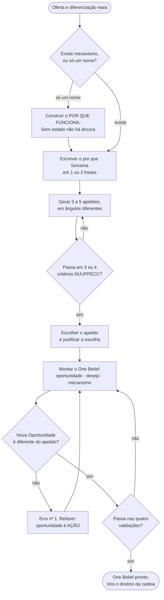

# MÉTODO — MECANISMO, APELIDO E ONE BELIEF

> **Tipo:** método · secundário: framework (§3), gate (§10), política (§11) *(reclassificado 26/09/2026 por auditoria independente de leitura integral; antes: "método-raiz (camada 2)")* · **Instituído:** 20/09/2026 · **Alçada:** Victor
> **Abrir por momento:** decidir §11 · produzir §9 · conferir §10 *(mapa proposto pela auditoria de 26/09 — conferir no primeiro uso)*
> 🟡 **VIGENTE PARA EXECUTAR, VERIFICAÇÃO EM CASO REAL PENDENTE** (`CLAUDE.md` §7.1, item 4). Roteado desde o primeiro dia, como manda a REGRA Nº 1.
> 🔴 ⭐ **GALHO DE `METODO-DIRECT-RESPONSE.md`.** Os princípios gerais de resposta direta vivem no tronco e não se repetem aqui.
> **Origem:** `900-criação-implementação-victor/DESTILACAO-PACK-PROMPTS-VSL-FILEMON.md` §5.1 e §5.2 (Método E3, com linhagem em Evaldo Albuquerque e Max Peters), **reescrito como método nosso** — com a tese de ancoragem, os gates e as condições de recusa que a fonte não tem.
> **Consome:** oferta real, diferenciação real, desejo do público colhido · **Entrega:** o mecanismo explicado, o apelido que o ancora e o One Belief — que é o **destino** da cadeia de pontos lógicos.

---

## O CAMINHO, NUMA TELA



---

## 0. ÍNDICE POR DESTINO DE USO

| Se você vai... | Leia |
|---|---|
| **Nomear um mecanismo** | §3 (a tese da âncora) · §4 (ângulos) · §5 (NUUPPECC) |
| **Montar o One Belief** | §7 — e §8 para ligá-lo à cadeia |
| Entender por que apelido não é "nome bonito" | ⭐ **§3** |
| Saber a diferença entre mecanismo, apelido, método e produto | §2 e §6 |
| Traduzir material do Método E3 para o nosso vocabulário | §2.2 |
| Executar do zero | §9 · gate em §10 |
| Saber quando NÃO nomear | §11 |

---

## 1. POR QUE ESTE MÉTODO EXISTE

**Duas lacunas, e as duas eram de roteamento antes de serem de conteúdo.**

**A primeira:** o `CLAUDE.md` §6.1 roteia *"nomear mecanismo"* para a skill de copy **desde que a skill existe — e a skill nunca teve régua de nomeação.** O pedido caía num lugar que não sabia respondê-lo.

**A segunda, e é a maior:** o `METODO-PONTOS-LOGICOS.md` institui que **a conclusão não se escreve — o último passo é do leitor.** Está certo, e estava incompleto:

> 🔴 **O método sabia montar a cadeia e nunca nomeava O QUE o leitor precisa concluir.**
>
> Sem destino declarado, o teste de encadeamento não detecta o pior defeito possível: **uma cadeia em que cada elo é verdadeiro, cada elo puxa o seguinte, e o conjunto não aponta para lugar nenhum.** Todos os elos passam. A peça não vende. E ninguém sabe por quê.

**O One Belief é o destino escrito ANTES da cadeia, para que a cadeia tenha para onde ir.**

---

## 2. 🔴 O VOCABULÁRIO — decidido em 20/09/2026, alçada Victor

**As quatro coisas, e confundi-las é o erro mais comum do assunto:**

| Termo | O que é | Teste |
|---|---|---|
| **MÉTODO** | o procedimento que alguém executa | *o que a pessoa faz?* |
| **MECANISMO** | 🔴 **o BLOCO** — a explicação de por que aquele procedimento produz o resultado | *por que isso funciona?* |
| **APELIDO** | ⭐ **parte integrante do mecanismo** — o termo único que, dito sozinho, elicia o mecanismo inteiro | *uma palavra traz tudo de volta?* |
| **PRODUTO** | o veículo comercial que dá acesso ao procedimento | *o que a pessoa compra?* |

> ⭐ **A formulação que decide, e é do Victor:** **o mecanismo RECEBE um apelido.** Não são duas coisas paralelas e o apelido não substitui o mecanismo. **O apelido é o que dá cara de único a algo que já existe** — e existe porque o mecanismo foi construído antes.

**Consequências imediatas, e as três são operacionais:**

1. `mecanismo` **continua sendo o nome do bloco** e o rótulo da taxonomia (`METODO-BENCHMARKING.md` §5.2).
2. `apelido` entra como **rótulo próprio** na taxonomia — porque a posição e a repetição dele são fato estrutural medível, não estilo (§3.4).
3. **Não existe apelido sem mecanismo.** Nomear primeiro e explicar depois é a inversão que produz rótulo vazio (§6).

### 2.2 Tabela de tradução — lendo material do Método E3

**A fonte usa outro vocabulário. Quem ler o pack de prompts traduz assim, sempre:**

| No Método E3 | Aqui |
|---|---|
| **Tese** (nome do bloco) | **MECANISMO** (nome do bloco) |
| **Mecanismo** (a peça 3 do One Belief) | **APELIDO** |
| Apelido | Apelido ✅ |
| Nova Oportunidade · Desejo | mesmos nomes ✅ |

🔴 **Traduzir é obrigatório antes de usar qualquer trecho da fonte.** Carregar os dois vocabulários juntos produz ambiguidade exatamente em cima do elemento mais importante da peça.

---

## 3. ⭐ A TESE: O APELIDO É UMA ÂNCORA

> **Esta é a parte nossa, e ela não vem da fonte.** A fonte diz que o apelido *"cola na cabeça como chiclete"* — o que descreve o efeito e não explica nada, e por isso não produz regra. **O que o apelido faz tem nome, tem mecanismo descrito e tem condições de instalação: é ancoragem.**

**Ancoragem, na PNL** (fonte da casa: `METODO-GERACAO-DE-RESULTADOS.md`, O'Connor; primária em `..\LIVROS\`): **um estímulo associado a um estado passa a re-eliciar aquele estado.** O estímulo não carrega o conteúdo — ele **puxa de volta** o que já estava lá.

**Aplicado ao apelido:**

> **O apelido não descreve o mecanismo. Ele RE-ELICIA o mecanismo inteiro — a explicação, a prova, a sensação de "agora eu entendi" — em um termo só.**
>
> Por isso funciona na conversa, na indicação e no boca a boca: **a pessoa fala uma palavra e o interlocutor não recebe uma palavra, recebe o modelo.**

⚠️ **E a distinção que evita confusão com o que já temos:** o `METODO-GERACAO-DE-RESULTADOS.md` §3.2 trata da **afirmação-âncora**, que ancora um estado **em quem fala**. Aqui a âncora se instala **em quem ouve**. Mesmo mecanismo, aplicação oposta.

### 3.1 🔴 As cinco condições de instalação — e cada uma vira uma regra

**A PNL descreve o que faz uma âncora pegar. Cada condição produz uma regra de copy que a fonte não tinha como derivar:**

| # | Condição da âncora | 🔴 A regra que ela impõe |
|---:|---|---|
| **1** | **Intensidade do estado** no momento da ancoragem | **Não se nomeia no frio.** O apelido se instala **depois** de o mecanismo ter sido explicado e provado — quando a compreensão está no auge. Nomear antes ancora vazio |
| **2** | **Timing** — ancora-se no pico, não na subida | **O ponto de nomeação é o fim do bloco de mecanismo**, não o começo |
| **3** | **Singularidade do estímulo** | **O termo não pode ser genérico nem poderia ser do concorrente.** É isto que o critério *Único* do NUUPPECC mede, e é por isso que *"método avançado"* nunca ancora |
| **4** | 🔴 ⭐ **Replicação EXATA** | **O apelido se repete idêntico, sempre. Sinônimo quebra a âncora.** Variar *"Protocolo 21 Dias"* para *"o protocolo de três semanas"* não é elegância de escrita — **é desancorar** |
| **5** | **Repetição em estado alto** | **Poucas vezes, em posições de alta voltagem.** Repetir em passagem morta não reforça: dilui |

> ⭐ **A condição 4 é a que mais muda a prática, e vai contra o instinto de quem escreve bem.** A régua da linguagem manda variar para não virar metrônomo. **O apelido é a exceção declarada: ele é a única expressão da peça que se repete literal, e repetir é a função.**

### 3.2 ⭐ O que isso explica, e a fonte não explicava

| Prática da fonte | O que ela é, na tese da âncora |
|---|---|
| *"Apelido na lead é ISCA, não argumento — nomeia e não explica"* | ✅ **exatamente correto, e agora com razão:** na lead **ainda não existe estado para ancorar.** O que se faz lá é abrir um laço em torno de um termo — a instalação acontece no mecanismo |
| *"O apelido reaparece em posições fixas da oferta"* | ✅ **é a condição 5:** reforço da âncora em pontos de decisão, não enfeite |
| *"O apelido é território exclusivo do bloco de mecanismo; nunca aparece na história"* | ✅ **é a condição 1:** a história constrói estado sem nomear, para que a nomeação caia no pico |

**Três regras que a fonte aplicava por prática, e que agora têm causa.** Regra com causa sobrevive à pressão de prazo; regra sem causa é a primeira a ser cortada.

### 3.3 🔴 O corolário que protege contra o erro mais comum

> **Ancoragem sem estado é rótulo vazio.**
>
> **Se não há mecanismo construído, não há o que ancorar** — e o apelido vira adjetivo caro. É o mesmo defeito que a fonte nomeia de outro jeito (*"nomear o método não demonstra que ele funciona"*), visto pelo lado que produz a correção: **o problema não é o nome ser fraco; é não haver estado por trás dele.**

### 3.4 Por que `apelido` vira rótulo da taxonomia

**Porque as condições 2, 4 e 5 são medíveis em peça de terceiro:** onde o apelido aparece pela primeira vez, quantas vezes repete, e **se repete idêntico**. Isso é estrutura invisível — fato modelável, não impressão.

🔴 **A taxonomia passa de 34 para 35 rótulos** (`METODO-BENCHMARKING.md` §5.2), e a destilação de VSL passa a medir a **curva do apelido**.

---

## 4. OS DEZ ÂNGULOS DE APELIDO

| # | Ângulo | Forma |
|---:|---|---|
| 1 | **Ingrediente ou substância** | o componente que faz o trabalho |
| 2 | **Técnica ou processo** | a ação central, nomeada |
| 3 | **Vilão neutralizado** | o que o mecanismo bloqueia |
| 4 | **Acrônimo** | quando o método tem 3 a 5 partes reais |
| 5 | **Origem geográfica ou cultural** | de onde veio, quando for verdade |
| 6 | **Número marcante** | a quantidade que define o método |
| 7 | **Metáfora visual** | a imagem que explica o funcionamento |
| 8 | **Superestrutura** | referência famosa + contraste (*"X natural"*, *"Y caseiro"*) |
| 9 | **Contraintuitivo** | o que parece contradizer o senso comum do nicho |
| 10 | **Ritual ou truque** | o gesto repetível |

**Três regras de variação:**

- **Sempre variar o ângulo** — nunca três candidatos do mesmo tipo.
- **Havendo matéria-prima para acrônimo, pelo menos um candidato é acrônimo** — e a sigla precisa formar palavra pronunciável. Acrônimo forçado não ancora, porque viola a condição 4: ninguém repete o que não sabe falar.
- **Superestrutura só com referência que o público conhece de fato.** Contraste com o desconhecido não contrasta.

---

## 5. NUUPPECC — o checklist de Max Peters

**Cada candidato passa em pelo menos 3 ou 4 dos oito:**

| | Critério | Pergunta |
|---|---|---|
| **N** | Novo | é diferente de tudo que este público já ouviu? |
| **U** | Urgente | carrega energia de agora? |
| **Ú** | Único | 🔴 **poderia ser do concorrente?** Se sim, reprova |
| **P** | Perigoso | toca em algo que assusta? |
| **P** | Pessoal | fala com o grupo deste público? |
| **E** | Específico | é concreto, não genérico? |
| **C** | Controverso | vai contra o senso comum? |
| **C** | Concreto | cria imagem mental clara? |

> ⭐ **`Único` e `Concreto` não são critérios entre oito: são as condições 3 e 1 da âncora.** Um apelido pode reprovar em `Perigoso` e `Controverso` e ancorar perfeitamente. **Reprovar em `Único` é não ancorar** — o estímulo não é distinguível. Reprovar em `Concreto` é ancorar no vago.

**O que nunca vira apelido:** termo genérico (*"meu método"*, *"fórmula natural"*, *"sistema avançado"*) · mais de 4 palavras, exceto acrônimo · adjetivo vazio (*"revolucionário"*, *"definitivo"*, *"exclusivo"*) · qualquer coisa que serviria ao concorrente sem alteração.

---

## 6. 🔴 NOME ≠ EXPLICAÇÃO

> **Nomear o método não demonstra que ele funciona.**

**O bloco de mecanismo precisa mostrar quatro coisas, e o apelido não substitui nenhuma:**

1. **o que muda** — a intervenção
2. **por que essa mudança importa** — o *reason why*
3. **como ela se produz** — o caminho
4. **o que sustenta as afirmações** — a prova

**Acrescentar um título grandioso não cria entrega nem sustenta promessa.** É a mesma régua do `METODO-DIRECT-RESPONSE.md`: **prova vence promessa** — e apelido sem mecanismo é promessa com nome próprio.

---

## 7. ⭐ O ONE BELIEF

> ### **"[NOVA OPORTUNIDADE] é a chave para [DESEJO] e só é possível através do [APELIDO]."**

**Três peças, e são coisas diferentes. Confundi-las é o erro nº 1 do assunto.**

| Peça | O que é | O que NÃO é |
|---|---|---|
| **1 · NOVA OPORTUNIDADE** | uma **ação ou abordagem** — quase sempre **verbo no infinitivo**: evitar, atacar, alinhar, bloquear, reverter, ativar, automatizar. Responde: *o que esta pessoa precisa FAZER ou ACEITAR para conseguir o que quer?* | ❌ o nome do produto · ❌ o apelido · ❌ o resultado final · ❌ uma característica |
| **2 · DESEJO** | o **estado emocional** que o público quer alcançar | ❌ a promessa. *"Perder 10 kg"* é promessa; *"voltar a se sentir bem no próprio corpo"* é desejo |
| **3 · APELIDO** | o **instrumento** que entrega a oportunidade — o apelido do mecanismo, **e só aqui** | ❌ a abordagem |

### 7.1 O erro nº 1, com o contraste que o ensina

| | |
|---|---|
| ❌ **ERRADO** | *"O Método [X] é a chave para ter liberdade financeira, e só é possível através do Método [X]."* |
| | **Mesmo termo nas duas posições. A frase não diz nada** — e, pior, **desancora**: a âncora é apresentada como se fosse o próprio estado |
| ✅ **CERTO** | *"Automatizar criativos, copy e segmentação com três agentes de IA é a chave para ter liberdade financeira sem depender de cliente, e só é possível através do Método [X]."* |
| | A Nova Oportunidade descreve **ação**; o apelido é o **instrumento**. Nunca a mesma coisa |

### 7.2 Como extrair cada peça

| Peça | De onde vem | Como se transforma |
|---|---|---|
| **Nova Oportunidade** | da diferenciação real do produto | pega-se o que o torna único **e converte-se em AÇÃO com verbo** |
| **Desejo** | do público, colhido — `lexico-icp/`, grau `D` | pega-se o lado **emocional**, nunca o resultado físico |
| **Apelido** | de §4 e §5 | é o recomendado, sem alteração |

🔴 **A Nova Oportunidade e o Desejo são decisão de estrutura — nossa, sempre** (`CLAUDE.md` §8, REGRA Nº 0). **O que se pergunta ao cliente é o FATO por trás: o que o produto faz de diferente, e o que o público disse querer.** Perguntar a ele *"qual é a sua promessa?"* é o erro que a REGRA Nº 0 existe para impedir.

### 7.3 🔴 Validação obrigatória — as quatro, antes de entregar

- [ ] **1.** A Nova Oportunidade começa com verbo ou descreve uma ação?
- [ ] **2.** A Nova Oportunidade é **diferente** do apelido?
- [ ] **3.** O Desejo é **emocional**, e não só o resultado físico?
- [ ] **4.** A frase **faz sentido lida em voz alta**, sem travar e sem repetir?

**Falhou uma, refaz. Não se entrega para conferir depois.**

---

## 8. ⭐ O ONE BELIEF É O DESTINO DA CADEIA

**É aqui que este método fecha o `METODO-PONTOS-LOGICOS.md`.**

```
One Belief escrito PRIMEIRO  →  é o destino
         ↓
a cadeia se monta DE TRÁS PARA FRENTE, a partir dele
         ↓
cada elo aproxima o leitor de aceitá-lo
         ↓
🔴 o último elo NÃO o enuncia — o leitor chega nele sozinho
```

> 🔴 **A regra que não muda, e é a que dá potência às duas coisas juntas: o One Belief é escrito por nós e NÃO vai escrito na peça.** Ele é o alvo da cadeia, não a frase final dela. **Escrevê-lo na peça é explicitar a conclusão — o modo de falha nº 5 do método de pontos lógicos.**

**E o teste novo que essa ligação torna possível, que o teste de encadeamento sozinho não fazia:**

> **TESTE DE DESTINO.** Leia a cadeia inteira sem o One Belief à vista. **A conclusão que se forma é ele?**
>
> Se a conclusão que se forma é outra, ou é nenhuma, **a cadeia está tecnicamente correta e apontando para o lugar errado** — e o teste de encadeamento aprovaria essa cadeia elo por elo.

**Qual padrão de cadeia usar depende de como o mecanismo funciona** (`METODO-PONTOS-LOGICOS.md` §3): causa raiz · solução superior · oportunidade.

---

## 9. O PROCEDIMENTO

| # | Passo | Saída |
|---:|---|---|
| **1** | Reunir o **fato**: o que o produto entrega · o que o torna diferente · como o método funciona por dentro (pilares, etapas, partes) · o desejo colhido do público | insumo, sem invenção |
| **2** | Escrever o **POR QUE FUNCIONA** em 1 ou 2 frases — a causa, o diferencial ou a janela | o mecanismo em forma curta |
| **3** | Gerar **3 a 5 apelidos**, em ângulos diferentes (§4) | candidatos |
| **4** | Rodar **NUUPPECC** em cada um (§5) | aprovados |
| **5** | **Escolher um e justificar** — ligando ao público ou à diferenciação | o apelido |
| **6** | Montar o **One Belief** (§7) | a frase |
| **7** | Rodar as **quatro validações** (§7.3) | aprovado ou refaz |
| **8** | Declarar **onde o apelido se instala e onde reaparece** (§3.1, condições 2 e 5) | a curva do apelido na peça |

🔴 **Nada se inventa:** ingrediente, estudo, origem, número ou dado que não estejam no material **não entram.** Campo vago se sinaliza e se entrega o melhor possível com a lacuna marcada — nunca se preenche com plausível.

---

## 10. 🔴 GATE DE SAÍDA

- [ ] **1.** O **por que funciona** está escrito, e mostra as quatro coisas do §6
- [ ] **2.** Há **3 a 5 candidatos**, em ângulos diferentes
- [ ] **3.** O apelido escolhido passa em **3 ou 4 critérios NUUPPECC**, incluindo obrigatoriamente **`Único`**
- [ ] **4.** O apelido tem **no máximo 4 palavras** (acrônimo é exceção) e é pronunciável
- [ ] **5.** As **quatro validações do One Belief** passaram
- [ ] **6.** 🔴 A **Nova Oportunidade é ação com verbo, e é diferente do apelido**
- [ ] **7.** O **Desejo veio de fala colhida** com grau `D`, não de inferência nossa
- [ ] **8.** Está declarado **onde o apelido se instala e em que posições reaparece**
- [ ] **9.** 🔴 Está declarado que o One Belief **não vai escrito na peça**
- [ ] **10.** Nada foi inventado — ingrediente, estudo, origem, número

**E o teste final:** *dito o apelido sozinho, para alguém que viu a peça, o mecanismo inteiro volta?* **Se não volta, não é âncora: é nome.**

---

## 11. CONDIÇÕES DE RECUSA

**Não se nomeia mecanismo quando:**

1. 🔴 **Não há mecanismo construído.** Ancoragem sem estado é rótulo vazio (§3.3). **Primeiro o por que funciona, depois o nome — nunca o contrário.**
2. 🔴 **A diferenciação não existe de fato.** Apelido não cria diferencial; ele ancora o que existe. Nomear o igual é mentir com elegância.
3. 🔴 **O desejo do público não foi colhido.** Sem `lexico-icp/` com grau `D`, a peça 2 do One Belief é invenção nossa (`METODO-ARQUEOLOGIA-DE-ICP.md`).
4. ⚠️ **A conta reprova em P1 ou P4 do teste de pilares.** ICP indefinido ou oferta divergente produzem One Belief que muda de sentido a cada conversa.
5. ⚠️ **O cliente quer escolher o apelido por gosto.** Ele tem **objeção de congruência** — apontar onde o nome não bate com o que ele entrega. **A escolha é nossa, e a explicação da recusa é obrigatória e por escrito** (REGRA Nº 0).

---

## 12. O QUE É DA FONTE E O QUE É NOSSO

| Da fonte (Método E3 · Evaldo Albuquerque · Max Peters) | Nosso |
|---|---|
| A fórmula do One Belief e as três peças · o erro nº 1 · as quatro validações · os 10 ângulos de apelido · o checklist NUUPPECC · *"nomear o método não demonstra que funciona"* · apelido na lead é isca · o apelido não aparece na história | ⭐ **§3 inteira — a tese da ancoragem, as cinco condições e as regras que elas impõem** (a fonte descrevia o efeito e não a causa) · **§2** (o vocabulário decidido: mecanismo é bloco, apelido é parte dele) · **§2.2** (tabela de tradução) · **§3.3** (ancoragem sem estado) · **§3.4** (apelido como rótulo da taxonomia) · **§8** (o One Belief como destino da cadeia **e o teste de destino**) · **§10** e **§11** (gate e recusas) · a amarração com REGRA Nº 0 e com a régua de procedência |

---
*Instituído em 20/09/2026, alçada Victor. **A decisão de vocabulário do §2 é dele, registrada na sessão de 20/09**, e é o que destrava o uso do Método E3 no nosso repositório. Fonte de PNL da casa: `METODO-GERACAO-DE-RESULTADOS.md` (O'Connor); primárias em `..\LIVROS\`. **Nenhum número deste arquivo é `[dado nosso]`.** 🟡 Verificação em caso real pendente.*
