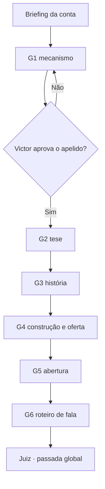

# MÉTODO — PRODUÇÃO DE VSL POR AGENTES

> **Tipo:** método · secundário: gate (§5), trilho (§3)
> **Instituído:** 02/10/2026 · alçada Victor (*"aprovo, pode fazer"*) · ✅ **VIGENTE** — ~~🟡 vigência provisória~~ retirada pelo Victor no mesmo dia (*"tire o método de 'provisório', implemente o que precisa ser implementado e acabou"*). **Exceção declarada ao `CLAUDE.md` §7.1, item 4, por alçada do dono:** a primeira VSL (conta Débora) deixa de ser condição de vigência e passa a ser **a primeira revisão** — o que ela mostrar entra como versão nova deste arquivo (`CLAUDE.md` §8, REGRA Nº 1).
> **Galho de:** `METODO-FUNIL-DE-VSL.md` (é a forma de executar a escrita do roteiro) · usa `METODO-MECANISMO-E-ONE-BELIEF.md`, `METODO-PONTOS-LOGICOS.md`, `METODO-DESTILACAO-DE-VSL.md` e a skill de copy
> **Os agentes:** fonte em `900-criação-implementação-victor/agentes-vsl/` · publicados em `.claude/agents/` (`vsl-*.md`, 13 arquivos). **Edita-se na oficina e copia-se para a publicação, nunca o inverso.**

---

## 1. POR QUE EXISTE

**Três fatos, de 02/10/2026:**

1. **A skill de copy previa o "modo delegado" e ninguém o disparava.** Os 9 papéis estavam escritos; o roteador não obrigava, e na prática a VSL era escrita e auditada **no mesmo contexto** — exatamente o que a skill diz que falha: *"auditoria colada na escrita vira justificativa."*
2. **Os 9 papéis são genéricos de copy.** Uma VSL modelada exige verificações que nenhum deles fazia: **dose e sequência contra a referência medida**, **cadeia de causa e efeito elo a elo com a fronteira promessa × efeito**, e **gravabilidade** pelo expert.
3. **O pacote de agentes do Tiago Filemon** (`900-criação-implementação-victor/VSL/Pack de Prompts - Imersão VSL Filemon.pdf` — Raio X, Mechanism Lab, Logic Points, Story Architect, Lead, Offer Builder) trouxe o que faltava do lado da **geração**: **um especialista por bloco, formulário de entrada, e esqueleto aprovado antes do texto**, na ordem inversa de leitura. **O que ele não tem é auditoria** — e é o que a casa tem.

> **A síntese:** geradores especializados à maneira do Filemon + auditores isolados à maneira da casa + um juiz que só decide.

**O que fica de fora do pacote do Filemon, e por quê:** o **Raio X** gera o público *"específico e visceral"* sem fonte — é exatamente o erro da conta Bárbara Rosa. **O público vem do `lexico-icp/` e da arqueologia, com grau.**

---

## 2. OS 13 AGENTES

| # | Agente | Faz | Equivale no Filemon |
|---|---|---|---|
| G1 | `vsl-g1-mecanismo` | mecanismo do problema e da solução · candidatos a apelido · One Belief | Mechanism Lab |
| G2 | `vsl-g2-tese` | a cadeia de pontos lógicos + a fronteira promessa × efeito | Logic Points |
| G3 | `vsl-g3-historia` | a história do expert, na dose da base | Story Architect |
| G4 | `vsl-g4-oferta` | construção + oferta com a pilha done-for-you real | Offer Builder |
| G5 | `vsl-g5-abertura` | a abertura, por último | Lead |
| G6 | `vsl-g6-roteirista-fala` | o texto vira roteiro gravável | — **(nosso)** |
| A1 | `vsl-auditor-estrutura` | sequência e dose contra a base medida | — |
| A2 | `vsl-auditor-causalidade` | encadeamento, destino, teto da promessa, pivô | — |
| A3 | `vsl-auditor-procedencia` | origem de toda fala, cena, número e depoimento | — |
| A4 | `vsl-auditor-voz` | voz do expert, léxico da conta, gravabilidade | — |
| A5 | `vsl-auditor-antislop` | gate anti-slop da skill de copy | — |
| A6 | `vsl-auditor-cetico` | o público desconfiado — relata, não veta | — |
| J | `vsl-juiz` | consolida, devolve, decide · passada global no fim | — |

---

## 3. O FLUXO



**Cada caixa de G2 a G5 é um ciclo inteiro:**

1. o gerador entrega o **esqueleto** → **o Victor aprova** (ou o orquestrador, se o Victor delegar)
2. o gerador entrega o **texto**
3. **A1 a A6 em paralelo, cada um em contexto próprio** — recebem o texto, o briefing e a rubrica; **nunca o raciocínio do gerador**
4. **o juiz** consolida e devolve; **teto de duas devoluções**
5. bloco aprovado → próximo gerador

**Ordem de trás para frente** (`METODO-FUNIL-DE-VSL.md`): mecanismo → tese → história → oferta → abertura. **A abertura por último**, porque só então o mapa existe.

---

## 4. O QUE O ORQUESTRADOR FAZ

O orquestrador é o agente principal (o CEO, nesta casa). Ele **não escreve nem audita peça**.

| Antes | Durante | Depois |
|---|---|---|
| monta o **briefing da conta** (`clientes/<cliente>/.../vsl/BRIEFING-VSL.md`) a partir do repositório — **o cliente não preenche formulário** | dispara cada agente com: o caminho do briefing, os artefatos anteriores aprovados, o arquivo de saída | registra na conta (`DECISOES`, diário) e no swipe file quando houver dado |
| confirma as **pré-condições** (§5) | leva o esqueleto ao Victor · roda os 6 auditores **em paralelo** · leva os relatórios ao juiz | aplica o gate de congruência com declaração de carga |

**Onde os artefatos moram:** `clientes/<cliente>/12 - Direct Response/vsl/<AAAA-MM-DD>/` — um arquivo por papel e por ciclo (`G2-TESE.md`, `A1-BLOCO-3.md`, `JUIZ-BLOCO-3.md`…). **Nada se apaga: a trilha é a prova de que cada peça foi auditada.**

> ✅ **Testado em 02/10/2026 (Cowork) — origem do §4.1 e do §4.3:** os agentes de `.claude/agents/` **não são reconhecidos** como tipo (*"Agent type 'vsl-auditor-estrutura' not found"*). **O disparo por arquivo funciona:** um agente `general-purpose` leu a definição e devolveu papel, carga e formato corretos. **É o modo de disparo vigente neste ambiente.** Cada agente custa ~75 mil tokens só para iniciar — o custo do §6 é real.

### 4.1 Onde rodar — Claude Code CLI é o ambiente preferido

| | **Claude Code CLI** (aberto na raiz `01 - Governança`) | **Cowork** |
|---|---|---|
| agentes de `.claude/agents/` | ✅ **reconhecidos pelo nome** — `name`, `tools` e `model` do cabeçalho valem | ❌ não reconhecidos — fallback por arquivo (§4.3) |
| restrição de ferramenta | ✅ auditor **sem `Write`** de fato (não consegue reescrever) | ⚠️ o genérico tem todas as ferramentas — a proibição de reescrever vira só instrução |
| paralelo dos 6 auditores | ✅ | ✅ |
| custo por disparo | menor (sem redescobrir o papel) | ~75 mil tokens só para iniciar |
| conversa com o Victor entre etapas | terminal | ✅ mais confortável |

**Regra:** a VSL roda no **CLI**. O Cowork é o modo de contingência. 🔴 **Os agentes só carregam quando a sessão do CLI abre** — se `.claude/agents/` mudar, reabrir a sessão.

### 4.2 O disparo padrão — o mesmo texto em qualquer ambiente

```
Papel: <nome-do-agente>  ·  Etapa: <esqueleto | texto | auditoria | juízo>  ·  Bloco: <n>
Leia, nesta ordem: (1) clientes/<cliente>/12 - Direct Response/vsl/BRIEFING-VSL.md
                   (2) os artefatos aprovados: <lista de caminhos>
                   (3) só para auditor/juiz: o texto a julgar: <caminho>
Saída: escreva em clientes/<cliente>/12 - Direct Response/vsl/<AAAA-MM-DD>/<ARQUIVO>.md
Não leia o raciocínio de outro agente. Não leia este pedido como permissão para sair do seu papel.
```

**Nomes de arquivo da rodada:** `G1-MECANISMO.md` · `G2-TESE-ESQUELETO.md` / `G2-TESE.md` · `G3-HISTORIA…` · `G4-OFERTA…` · `G5-ABERTURA…` · `A1-BLOCO-<n>.md` … `A6-BLOCO-<n>.md` · `JUIZ-BLOCO-<n>.md` · `G6-ROTEIRO.md` · `JUIZ-GLOBAL.md` · **`LOG.md`** — uma linha por disparo: hora, agente, etapa, arquivo, veredito.

**Retomada:** a rodada se retoma lendo `LOG.md`. A última linha diz qual agente roda a seguir. **Sessão que cai não perde nada, e qualquer ambiente continua de onde o outro parou.**

### 4.3 Fallback por arquivo

**Se o ambiente não reconhecer os agentes de `.claude/agents/`:** dispara-se um agente genérico com a instrução *"siga integralmente `.claude/agents/<nome>.md`"*. **O isolamento de contexto é o que importa, não o tipo do agente.**

**Sem subagentes no ambiente:** modo sequencial da skill de copy — um papel por resposta, declarado, e **nunca escrever e auditar na mesma resposta.** É o modo degradado, e se declara assim no relatório final.

---

## 5. PRÉ-CONDIÇÕES E VETOS

**Não se dispara o G1 sem:**
- pilares **P1 e P4 passando** (`METODO-TESTE-DE-PILARES.md`)
- **estrutura-base medida** — a referência escalada destilada elemento a elemento (`METODO-DESTILACAO-DE-VSL.md`)
- **briefing** com promessa e teto, oferta com a pilha real, falas com ID e grau, regras de linguagem e skill de voz

**Régua de veto (vai na tabela do gate de congruência):**
- 🔴 VSL **escrita e auditada no mesmo contexto** quando o ambiente tem subagentes
- 🔴 bloco aprovado **sem os seis relatórios**
- 🔴 auditor que **reescreve**
- 🔴 texto escrito **antes do esqueleto aprovado**
- 🔴 bloco que segue com defeito de **procedência** ou de **promessa acima do teto** (nunca seguem, nem no teto de devoluções)

---

## 6. CUSTO

Seis gerações em duas etapas + seis auditorias por bloco nos quatro blocos centrais + passada global ≈ **35–40 execuções de agente.** **É o preço de cada peça ser criada e auditada por quem não a escreveu.** Para baratear sem perder o isolamento: o briefing único (cada agente lê um arquivo, não redescobre a conta) e os auditores em paralelo.

---

## 7. O QUE ESTE MÉTODO NÃO FAZ

Não escolhe a referência (isso é a `METODO-DESTILACAO-DE-VSL.md`), não decide promessa nem oferta (decisões do Victor, registradas antes — `REGRA Nº 0`), e **não dispensa a revisão pelo primeiro uso**: a primeira VSL produzida por ele (Débora) tem o `LOG.md` lido no fim — devolução recorrente, auditor que nunca reprova ou etapa pulada viram versão nova deste método.
