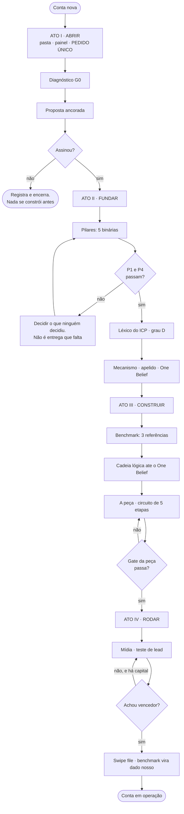

# MÉTODO — TRILHO DE CONTA NOVA

> **Tipo:** trilho · secundário: gate (§4), política (§7), framework (§1) *(reclassificado 26/09/2026 por auditoria independente de leitura integral; antes: "método-raiz (camada 2)")* · **Instituído:** 20/09/2026 · **Alçada:** Victor
> **Abrir por momento:** decidir §7 · ordenar §3 · conferir §4 *(mapa proposto pela auditoria de 26/09 — conferir no primeiro uso)*
> 🟡 **VIGENTE PARA EXECUTAR, VERIFICAÇÃO EM CASO REAL PENDENTE.** Roteado desde o primeiro dia (REGRA Nº 1).
> **O que é:** a **ordem única** de construir uma conta do zero. Não é método novo de nada — **é o trilho que os métodos existentes percorrem, com uma entrada, uma saída e um gate por etapa.**
> **Por que existe:** temos 20+ métodos e nenhum lugar que diga **em que ordem**. Quem abre uma conta nova hoje decide a ordem por memória — e **memória de operador não é mecanismo** (`CLAUDE.md` §8, REGRA Nº 1).
> **Onde se opera:** `clientes/<cliente>/PAINEL.md` — **uma tela, e é a única coisa que se abre para saber onde a conta está.**

---

## O TRILHO INTEIRO, NUMA TELA

---

## 1. AS DUAS COISAS QUE PRODUZEM PENDÊNCIA — e como o trilho mata as duas

**Pendência não nasce de desorganização. Nasce de duas causas mecânicas:**

| Causa | O que produz | Como o trilho mata |
|---|---|---|
| **1 · Gate que bloqueia tarde** | descobre-se no dia da copy que o ICP nunca foi decidido — e aí já há trabalho feito para jogar fora | 🔴 **todo gate bloqueante vive no ATO II.** Depois dele, nada mais bloqueia: só se produz |
| **2 · Etapa que espera dois insumos** | a etapa fica aberta esperando o segundo, e "aberta" vira "parada" | 🔴 **uma etapa, uma entrada.** Etapa que precisa de duas coisas **é duas etapas, ou a ordem está errada** |

### 1.1 ⭐ E a terceira, que é a mais cara: latência

`METODO-ESTIMATIVA-DE-CARGA.md` separa três camadas — **A produção** (comprime muito), **B colheita** (não comprime), **C latência** (não comprime, e às vezes piora). **O gargalo de conta nova é quase sempre C.**

> **Na conta Débora foram 33 dias esperando um ICP que levou 1 hora para decidir.**

**O antídoto é estrutural e é a peça mais importante deste método:**

> ### 🔴 O PEDIDO ÚNICO
>
> **Tudo o que precisamos do cliente vai numa lista só, entregue na ABERTURA — nunca em seis pedidos espalhados por seis semanas.**
>
> Cada pedido separado é um ciclo de latência inteiro: a mensagem, o esquecimento, a cobrança, a resposta parcial. **Seis pedidos não custam seis vezes mais que um: custam seis latências.**

🔴 **E o pedido único só contém LACUNA DE FATO.** Promessa, mecanismo, narrativa, ângulo, ordem de elemento e recorte de público **não entram na lista, porque não se perguntam** (`CLAUDE.md` §8, REGRA Nº 0). Template: `90-templates/conta-nova/PEDIDO-UNICO.md`.

---

## 2. OS QUATRO ATOS

**Dez etapas, quatro atos. Um ato termina quando o artefato dele existe — não quando parece pronto.**

| Ato | Termina quando | Camada dominante |
|---|---|---|
| **I · ABRIR E DECIDIR** | a proposta foi assinada — ou a conta foi encerrada com registro | 🔴 **C · latência** |
| **II · FUNDAR** | o **One Belief** está escrito | **B · colheita** |
| **III · CONSTRUIR** | a peça passou no gate e está publicada | **A · produção** |
| **IV · RODAR E COLHER** | há um vencedor, e o benchmark virou dado nosso | C, depois A |

> ⭐ **A leitura que isto permite, e ela muda o cronograma:** o Ato I é lento por natureza e **não se acelera produzindo mais**. O Ato III é o único que comprime de verdade. **Prometer prazo curto no Ato I é prometer contra a física.**

---

## 3. AS DEZ ETAPAS

**Cada etapa: uma entrada, uma saída, um dono, um gate. Nada mais.**

### ATO I · ABRIR E DECIDIR

| # | Etapa | Entrada | Saída | Gate |
|---:|---|---|---|---|
| **0** | **Abrir a conta** | o nome | `clientes/<cliente>/` com pasta, `PAINEL.md`, `DECISOES.md` e o **PEDIDO ÚNICO** enviado | o painel existe e o pedido saiu **no mesmo dia** |
| **1** | **Diagnóstico G0** | o pedido único respondido | o diagnóstico | **`METODO-DIAGNOSTICO-DE-OPERACAO.md`** (ICP A) ou **`METODO-ALICERCE.md`** (ICP B). 🔴 **Não se mistura trilho** (`ICP.md` §4-bis) |
| **2** | **Proposta** | o diagnóstico | proposta enviada | 🔴 **`CLAUDE.md` §9.1: âncoras → folha interna → veredito → proposta.** As 7 âncoras + os 6 gates do `METODO-ANCORAGEM-DE-PROPOSTA.md`. **Sem G0, toda a economia é `n=0` e se escreve assim** |

🔴 **Nada do Ato II começa antes da assinatura.** Construir antes de assinar é a forma mais cara de fazer diagnóstico de graça.

### ATO II · FUNDAR — 🔴 é aqui que tudo que bloqueia, bloqueia

| # | Etapa | Entrada | Saída | Gate |
|---:|---|---|---|---|
| **3** | **Pilares** | o diagnóstico | `PILARES.md` | 🔴 **`METODO-TESTE-DE-PILARES.md`** — 5 binárias. **P1 (ICP em uma frase) ou P4 (mesma lista em todo lugar) reprovando BLOQUEIA produção de copy** |
| **4** | **Léxico do ICP** | as fontes de fala do público | `lexico-icp/BANCO.md` | 🔴 **`METODO-ARQUEOLOGIA-DE-ICP.md`** — grau `D`. **Banco vazio PARA a produção.** Hipótese de IA entra como pauta de pergunta, nunca como fala (§6-ter de lá) |
| **5** | **Mecanismo, apelido e One Belief** | pilares + léxico | o mecanismo explicado, o apelido escolhido, o One Belief escrito | 🔴 **`METODO-MECANISMO-E-ONE-BELIEF.md`** — gate de 10. **Sem mecanismo construído não há o que ancorar** |

> 🔴 **A reprovação em P1 ou P4 quase nunca é entrega que falta: é decisão que ninguém tomou.** E decisão de estrutura é nossa (REGRA Nº 0). **Devolver ao cliente aqui é devolver o produto sem entregá-lo.**

### ATO III · CONSTRUIR

| # | Etapa | Entrada | Saída | Gate |
|---:|---|---|---|---|
| **6** | **Benchmark** | o nicho definido no pilar P1 | `benchmark-<peça>/` preenchido | **`METODO-BENCHMARKING.md`** (gate de 8) · VSL extrai por **`METODO-DESTILACAO-DE-VSL.md`** (gate de 10). **Referência sem evidência não entra** |
| **7** | **Cadeia lógica** | o One Belief (etapa 5) + o degrau (etapa 6) | a cadeia, elo a elo | **`METODO-PONTOS-LOGICOS.md`** — teste de encadeamento **e teste de destino**. Dose 5 a 8 |
| **8** | **A peça** | a cadeia + o benchmark | a peça publicada | **circuito de 5 etapas** (`CLAUDE.md` §6.3) · VSL roda **`METODO-FUNIL-DE-VSL.md`** com os 3 gates de entrada. Copy cruza os 11 passes |

### ATO IV · RODAR E COLHER

| # | Etapa | Entrada | Saída | Gate |
|---:|---|---|---|---|
| **9** | **Mídia** | a peça no ar | criativos, matriz, teste | **`METODO-TRAFEGO-PAGO.md`** · construção em **`METODO-CONSTRUCAO-DE-CRIATIVOS-DR.md`** · 🔴 **capital para 2–3 tentativas, nunca uma** |
| **10** | **Colher** | os dados da veiculação | entrada no `swipe-file/` + benchmark virando dado nosso | 🔴 **`CLAUDE.md` §11.5** — peça que bateu gatilho entra **na mesma tarefa em que o dado aparece** |

> ⭐ **A etapa 10 é a que ninguém faz, e é a única que se paga com o tempo.** Toda faixa `[benchmark]` deste repositório vira `[dado nosso]` aqui — e a segunda conta do mesmo nicho começa na etapa 6 consultando, não medindo.

---

## 4. 🔴 O GATE DE PASSAGEM — as mesmas três perguntas, em toda etapa

**Não existe checklist diferente por etapa. Existe este, e ele é de trinta segundos:**

- [ ] **1.** O artefato desta etapa **existe**, no caminho canônico?
- [ ] **2.** O **`PAINEL.md`** foi atualizado — etapa, estado e data?
- [ ] **3.** 🔴 **A próxima etapa tem tudo o que precisa?** Se não, **a pendência nasce declarada**: o que falta · de quem depende · o que a destrava.

> **É a terceira que impede pendência silenciosa.** Pendência declarada no nascimento é trabalho; pendência descoberta três semanas depois é retrabalho.

### 4.1 O que NÃO se faz em paralelo

**Paralelismo é o que cria a teia de dependências que este método existe para cortar.**

| Nunca em paralelo | Por quê |
|---|---|
| copy **e** léxico | a copy usaria o banco incompleto, e o passe 11 reprova depois |
| cadeia lógica **e** mecanismo | a cadeia sem destino aponta para lugar nenhum (`METODO-PONTOS-LOGICOS.md` §2-bis) |
| peça **e** pilares | P1/P4 reprovando invalida a peça inteira |
| mídia **e** peça | criativo casa com a lead, e a lead não existe ainda |

✅ **O que PODE correr junto:** benchmark (etapa 6) com léxico (etapa 4) — **são fontes diferentes, graus diferentes e não se contaminam**, desde que a régua *estrutura se modela, cena se colhe* esteja à vista.

---

## 5. O PAINEL — uma tela, e é a única que se abre

`clientes/<cliente>/PAINEL.md`, do template. **Uma linha por etapa, quatro colunas: etapa · estado · data · o que destrava.**

**Quatro estados, e só quatro:** `—` não começou · `⏳` em curso · `✅` fechada · `🔴` **bloqueada** (com o que destrava escrito na linha).

> 🔴 **Estado `🔴` sem a coluna "o que destrava" preenchida é proibido.** Bloqueio sem saída escrita é o que transforma conta em limbo — e limbo não aparece em relatório nenhum.

**O painel não é relatório de cliente.** É o nosso instrumento. O que vai para o cliente é outra coisa, e passa pelas regras de peça que sai da casa (`COMPLIANCE-DE-OUTPUT.md`).

---

## 6. QUANDO O TRILHO ENCOLHE

**Conta nova roda inteiro. Os outros casos encolhem, e o que encolhe se declara no painel:**

| Situação | Etapas |
|---|---|
| **Conta existente, peça nova** | 6 → 10 (pilares e léxico já existem; **conferir a data deles**) |
| **Conta existente, pivô de oferta** | 3, 5, 6, 7, 8 — **pilares refazem, porque a oferta mudou** |
| **Só auditar o que existe** | 6 e 8 (etapa 5 do circuito, o gate) |
| **Diagnóstico avulso pago** | 0, 1, 2 — **e para** |

🔴 **Nunca encolhem:** a **etapa 0** (abrir e pedir de uma vez), o **ATO II inteiro** quando a oferta é nova, e a **etapa 10**.

---

## 7. CONDIÇÕES DE RECUSA

1. 🔴 **Não há capacidade de entrega e não há decisão de contratar.** Falta de hora aciona contratação, não recusa — mas **a decisão precisa existir** (`METODO-GATE-DE-CONTRATACAO.md`).
2. 🔴 **O cliente recusa responder o pedido único, e o que falta é fato.** Sem fato não há G0, e sem G0 a proposta é `n=0` sobre `n=0`.
3. ⚠️ **O cliente quer começar pela peça.** É o pedido mais comum e o mais caro de aceitar. **Urgência real reduz volume, nunca dependência** — uma peça com procedência vale mais que dez sem (`CLAUDE.md` §6.1).
4. ⚠️ **ICP B (constrói do zero) com outra conta B já em curso.** Teto de 1 simultânea (`ICP.md` §4-bis).

---

## 8. A FORMA CURTA

> **Uma entrada, uma saída, um gate — por etapa.**
> **Tudo o que bloqueia, bloqueia no Ato II. Depois dele só se produz.**
> **Tudo o que se pede ao cliente, pede-se de uma vez, na abertura — e só se pede FATO.**
> **E a pendência ou nasce declarada, ou vira limbo.**

---
*Instituído em 20/09/2026, alçada Victor. **Não cria método: ordena os que existem.** Template da conta: `90-templates/conta-nova/`. Ordem obrigatória de conta nova herdada de `CLAUDE.md` §9.1. Camadas de carga: `METODO-ESTIMATIVA-DE-CARGA.md`. 🟡 Verificação em caso real pendente — **a primeira conta que percorrer o trilho é o teste dele.***
