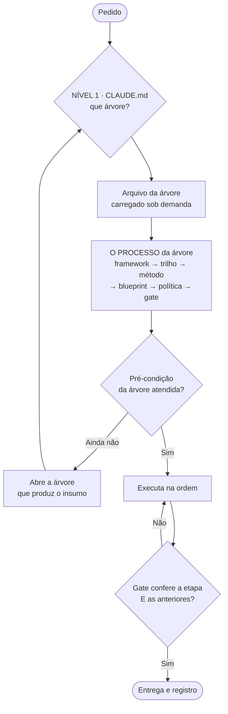

# AUDITORIA DE ROTEAMENTO — e o plano de iteração que ela abre

> **Tipo:** registro · secundário: trilho (§8, as ondas) · **Data:** 26/09/2026 · **Alçada:** Victor
> **Pedido, literal:** *"é preciso fazer uma auditoria de roteamento, para aumentar a eficiência e diminuir a fricção e uso de tokens, com maior qualidade nas entregas. regra: nunca diminuir a qualidade de output em detrimento de redução de tokens. um roteador forte precisa estar operante: requisição é x, então vai pra árvore de skills y."*
> **Método:** medição por script · **5 auditores independentes** (leitura integral, sem acesso a este arquivo) sobre as 49 linhas · verificador de propagação (`ferramentas/verificar-propagacao.py`).
> **Anexos:** `auditoria-roteamento-2026-09-26/ROTEADOR-v1-SNAPSHOT.md` (as 49 linhas antes de qualquer mudança) · `auditoria-roteamento-2026-09-26/LINHAS-COMPACTAS.md` (a migração pronta, linha a linha).

---

## 0. VEREDITO

> ## 🔴 Temos um índice gordo, não um roteador.
>
> **Ele cumpre metade do que um roteador faz — diz ONDE está cada coisa — e não cumpre a outra metade: dizer EM QUE ORDEM carregar.** Por isso a proteção contra o erro Bárbara existe no repositório **como prosa, e não como estrutura.**

**E a regra da qualidade decide a favor de compactar, não contra:**

> ⭐ **O roteador gordo não é o roteador mais completo — é uma segunda cópia dos métodos, e a segunda cópia já envelheceu em quatro lugares.** Dizia *"3 gates"* onde a proposta tem 6, *"2 padrões"* onde pontos lógicos tem 3, *"6 famílias"* onde o benchmarking tem 7, e tinha a lista de clientes ativos errada. **Cada linha longa é uma chance de o agente ler a versão velha em vez da fonte.** Encurtar o roteador **aumenta** a qualidade, desde que nada se perca — e a auditoria mostrou que quase nada vive só nele.

---

## 1. AS MEDIDAS

| Medida | Valor |
|---|---|
| `CLAUDE.md` | **14.292 palavras · ~25 mil tokens**, carregado em toda sessão |
| `AGENTS.md` | clone — **o custo se paga duas vezes** |
| §6 roteador · §6.1 árvore de copy · §6.3 circuito · §7 mapa | 5.201 · 1.312 · 491 · 3.049 palavras |
| **Soma das seções de navegação** | 🔴 **~10 mil palavras — 70% do kernel** |
| Linhas do roteador | **49** · mediana **68 palavras** · a maior **370** (PDF) |
| Linhas com **histórico** dentro (datas, casos) | **27 de 49** |
| Marcadores 🔴/⭐ só no §6 | **106** — quando tudo é vermelho, nada é |
| **Pares de colisão** (mesmo pedido cai em duas linhas) | 🔴 **14** |
| Artefatos de `100-métodos/` **fora do alcance** do roteador | 🔴 **4** — o Mapa da Ordem entre eles |

---

## 2. OS SEIS ACHADOS

| # | Achado | Evidência | Custo |
|---:|---|---|---|
| **1** | **Conteúdo duplicado** — as células carregam tese, regra e caso copiados do método | auditores: quase 100% `DUP` nas linhas pesadas | tokens × 2 (× 4 com o clone) |
| **2** | 🔴 **A cópia envelheceu** | 4 fatos vencidos: gates, padrões, famílias, lista de clientes | **qualidade** — o agente lê a versão velha |
| **3** | **Roteamento plano por palavra-chave** | 14 pares de colisão · *"proposta"* em 5 linhas · *"criativo"* em 5 · *"cliente"* em 10 | arbitragem a cada pedido, carga parcial |
| **4** | 🔴 **Sem processo** — a linha aponta para arquivo, nunca para a ordem dos tipos | nenhuma linha declara framework → trilho → método → blueprint → política → gate | **o erro Bárbara é possível por construção** |
| **5** | **Pontos cegos** | `DIAGNOSTICO-DE-OPERACAO` · `ALICERCE` · `PIVO-DE-CONVERSAO` · `MATRIZ-LEITURA-CONTEUDO` | método que só se ativa na mão |
| **6** | **Estado e histórico no lugar de rota** | 27 linhas com data · lista de clientes fixa | pago em toda sessão, e envelhece |

> **O achado 4 é o que responde ao seu ponto sobre a Bárbara.** Em 10/09, nove roteiros passaram em todos os gates com cenas de ICP inventadas. O pedido era *"escrever roteiro"* → caiu na linha da skill de copy (método) → que tem gate (forma). **Nada no roteador obrigava a passar antes pelo trilho de conta** (ICP colhido, pilares aprovados). A régua que hoje protege está escrita no §6.1 — **em prosa, e prosa se lê ou se pula.**

---

## 3. O QUE FOI CORRIGIDO HOJE — seguro, aditivo, sem esperar o redesenho

| | Feito | Onde |
|---|---|---|
| **G1** | ✅ **Os 5 órfãos migrados** para o arquivo de destino, com marca de proveniência | criativos DR §1 · tráfego §4.4 · rito do Codex (topo) · destilação de calls (fronteira call × peça de terceiro) |
| **G2** | ✅ **Os 5 fatos vencidos corrigidos** (tachado + correção) | `CLAUDE.md` §6 e §7 |
| — | ✅ **Os 4 pontos cegos roteados** — já no formato-alvo (árvore · processo · veto) | `CLAUDE.md` §6 e §7 |
| — | ✅ `Tipo:` reclassificado nos 32 arquivos + `Abrir por momento` em 18 híbridos | `100-métodos/` |
| — | ✅ **Verificador de propagação** criado, roteado e com veto | `ferramentas/verificar-propagacao.py` |
| — | ✅ **O PROCESSO** integrado à taxonomia, com a leitura estrutural do erro Bárbara | `00-core/TAXONOMIA-DE-ARTEFATOS.md` §4.2 |

---

## 4. O DESENHO-ALVO — "requisição é X, então vai para a árvore Y"

### 4.1 Dois níveis

- **Nível 1 — sempre carregado (`CLAUDE.md` §6):** 7 árvores, cada uma com seus sinais-âncora, **a linha do processo preenchida** e a pré-condição. **~120 palavras por árvore.**
- **Nível 2 — sob demanda (`00-core/roteador/ARVORE-<X>.md`, tipo `trilho`):** as linhas compactas daquela árvore, o desempate interno e os vetos. **Carrega-se UMA por tarefa.**

### 4.2 As sete árvores — e o processo de cada uma *(rascunho para a sessão de reescrita confirmar)*

| Árvore | Pedidos | framework → trilho → método → blueprint → política → gate |
|---|---|---|
| **NEGÓCIO** | ICP, oferta, preço, caixa, contratação, G0, prospecção nossa | `DIRECT-RESPONSE` · `GERACAO-DE-RESULTADOS` → **§9.1** (G0 → âncoras → folha → veredito) → `DIAGNOSTICO` · `ALICERCE` · `ABORDAGEM-FRIA` → `diagnostico-operacao/` → `POLITICAS` · `ICP` · `oferta` · `GATE-DE-CONTRATACAO` → `GATE-DE-CONGRUENCIA` |
| **CONTA** | cliente novo, conta travada, pilares, alçada, repo de cliente, cliente nominal | `ESTIMATIVA-DE-CARGA` → **`TRILHO-DE-CONTA-NOVA`** → `ARQUEOLOGIA` · `DESTILACAO-DE-CALLS` → `conta-nova/` · `lexico-icp/` · `repo-cliente/` → `ALCADA-DE-ESTRUTURA` (REGRA Nº 0) → **`TESTE-DE-PILARES`** |
| **LEITURA** | destilar call, VSL alheia, benchmark, concorrente, voz, perfil | `ESTRUTURA-INVISIVEL` · `MATRIZ-LEITURA-CONTEUDO` → *(quem ordena é a árvore que pediu a leitura)* → `DESTILACAO-DE-CALLS` \| `DESTILACAO-DE-VSL` \| `BENCHMARKING` \| `ARQUEOLOGIA` \| MEL → `benchmark-vsl/` · `lexico-icp/` → **REGRA Nº 2** (escala) → gate de cada método |
| **ESCRITA** | copy, página, VSL, anúncio, proposta, roteiro, mecanismo | `DIRECT-RESPONSE` · `ESTRUTURA-INVISIVEL` · `PONTOS-LOGICOS` · `PIVO` → circuito §6.3 · fases do `FUNIL-DE-VSL` → skill de copy · `CRIATIVOS-DR` · `EMPILHAMENTO` · `LATERALIZACAO` · `MECANISMO` · `ANCORAGEM` → templates → **REGRA Nº 0 · Nº 2** · voz → 11 passes · `GATE-DE-CONGRUENCIA` |
| **OPERAÇÃO** | tráfego, entrega, rotina, PDF, diagrama, prazo, heads | `CAMADA-DE-VER` · `ESTIMATIVA-DE-CARGA` → fases do `TRAFEGO-PAGO` → `TRAFEGO-PAGO` → `pdf-noturno` · `pdf-continuum` → classes de PDF → `COMPLIANCE-DE-OUTPUT` |
| **CASA** | o próprio repo: mapa, taxonomia, Codex, propagação, congruência | **`TAXONOMIA`** → **REGRA Nº 1** · `RITO-INTEGRACAO-CODEX` → — → `CONTRATO-EXECUTOR` → §8 → **`verificar-propagacao.py`** · `GATE-DE-CONGRUENCIA` |
| **JURÍDICO** | contrato, disputa, LGPD, societário | — → — → blue-team · contratos → `80-juridico/contratos/` → `POLITICAS-JURIDICAS` → CLO |

### 4.3 🔴 ⭐ A pré-condição que transforma o erro Bárbara de regra em estrutura

> **Pedido da árvore ESCRITA para um cliente só entra se a árvore CONTA já passou:** `clientes/<cliente>/PILARES.md` sem P1 nem P4 reprovando **e** `lexico-icp/` com ao menos uma fonte de grau `D`. **Senão, o roteador manda para CONTA — inclusive sob urgência.**
>
> É a régua do §6.1 (*"reduz-se o volume, nunca a dependência"*) **deixando de ser prosa que se lê e passando a ser portão que se atravessa.** E é verificável por script: dois arquivos existem ou não existem.

### 4.4 ⭐ A regra de desempate — uma só, e ela é o próprio processo

> **Quando um pedido cai em duas árvores, abre primeiro a que produz o INSUMO da outra.**

Resolve as 14 colisões sem tabela de exceções: proposta → **NEGÓCIO** (âncoras) antes de **ESCRITA** (a peça) · VSL com referência → **LEITURA** antes de **ESCRITA** · roteiro para cliente → **CONTA** antes de **ESCRITA** · *"estado da conta parece velho"* → **CASA** (antessala do Codex) antes de **CONTA**.

### 4.5 O formato de linha — e o que nunca mais entra nela

`sinais (únicos na árvore) | arquivos na ordem do processo, com o tipo | UMA frase de veto` — **até 35 palavras na coluna de carga.**

🔴 **Nunca na linha:** tese (mora no método) · histórico e data (mora no `STATUS`) · estado, como lista de clientes (mora na pasta e no `STATUS`) · contagem de itens do método (envelhece — foi o que envelheceu).

---

## 5. 🔴 AS CINCO GUARDAS DA QUALIDADE — a sua regra, operacionalizada

> **Nenhuma redução de token passa sem as cinco. Faltar uma reprova a reescrita.**

| # | Guarda | Estado |
|---:|---|---|
| **G1** | **Órfão migrado antes de a linha ser encurtada** — nada vive só no roteador | ✅ feito (5 de 5) |
| **G2** | **Fato vencido corrigido na fonte**, não carregado adiante | ✅ feito (5 de 5) |
| **G3** | **Roteador v1 preservado íntegro** — ponteiro no lugar, conteúdo no anexo | ✅ íntegro em `00-core/_legado/ROTEADOR-v1-2026-09-26.md` · ponteiros no §6.1 e §6.3 |
| **G4** | 🔴 **Replay com pedidos reais (§6): o roteador novo carrega TUDO que o antigo carregava e era necessário — e declara a ordem.** Pedido em que o novo carrega menos = **reprova** | ✅ **reprovou na 1ª rodada (2 casos) — corrigido e revalidado** (§10) |
| **G5** | **Verificador estendido:** todo artefato em ≥1 árvore (alcance) · sinal que aparece em 2 árvores (colisão) · árvore com os 6 lugares do processo preenchidos ou justificados | ✅ árvores · processo · alcance · colisão, no verificador |

**Economia esperada — estimativa, não medição:** o carregado sempre cai de ~10 mil para ~1,8 mil palavras nas seções de navegação (**~−14 mil tokens por sessão, em dobro com o clone**); cada tarefa soma um arquivo de árvore (~1 mil palavras). **O número vale só depois do G4 passar — economia que custou qualidade não é economia.**

---

## 6. O TESTE DE REPLAY — doze pedidos reais desta semana

| # | Pedido (literal ou fiel) | Árvore(s), na ordem | O que tem que carregar | Armadilha que o teste pega |
|---:|---|---|---|---|
| 1 | *"ok, faça a mensagem"* (fechamento Renata) | NEGÓCIO → ESCRITA | condição de pagamento vigente · voz-victor · abordagem | carregar a copy antes da condição — foi o erro do 18x no Pix |
| 2 | *"a proposta foi por questões urgentes de caixa… registre"* | CASA → NEGÓCIO | §11 quatro camadas · POLITICAS | tratar como pedido de copy |
| 3 | *"destile o transcript do podcast do Filemon"* | LEITURA | destilação de **peça de terceiro** (grau `R`), não de call | 🔴 cair em destilação de CALL e colher fala de terceiro como grau `D` |
| 4 | *"vamos mudar a régua-mãe… VSL como máquina"* | NEGÓCIO → CASA | §9 · FUNIL-DE-VSL · REGRA Nº 1 | alterar regra sem propagar |
| 5 | *"benchmarking precisa ser um método separado"* | CASA → LEITURA | taxonomia · REGRA Nº 1 · benchmarking | criar sem `Tipo:` e sem veto |
| 6 | *"Done For You no método de Direct Response"* | CASA → ESCRITA | DIRECT-RESPONSE · ancoragem (onboarding) | não propagar para a proposta |
| 7 | *"fluxograma visual do repo"* | CASA → OPERAÇÃO | MAPA · CAMADA-DE-VER | matriz no lugar de grafo |
| 8 | *"repo exclusivo… já entra para o Danilo"* | CASA (antessala) → CONTA → NEGÓCIO | **STATUS-CODEX primeiro** · repo-cliente · ancoragem | 🔴 decidir sem ler os áudios de 23/09 na antessala |
| 9 | *"diferencie framework, método, blueprint"* | CASA | taxonomia | responder por definição de manual |
| 10 | *"escreve 10 roteiros para a cliente X, é urgente"* — sem `PILARES.md` | 🔴 **CONTA**, não ESCRITA | trilho de conta · pilares · léxico | 🔴 **o caso Bárbara: ir direto para a skill de copy** |
| 11 | *"o Danilo mandou áudio, o que ele quis dizer?"* | CASA → LEITURA | STATUS-CODEX · transcrição · destilação de call | ler só o canônico |
| 12 | *"manda em PDF para a Débora"* | OPERAÇÃO | classe do PDF **antes** do gerador | escolher o gerador antes da classe |

> **Os casos 3, 8 e 10 são os que importam.** São os três em que o roteador atual já errou, ou erraria, **e custaram ou custariam uma conta.**

---

## 7. O QUE NÃO SE FAZ

- 🔴 **Não se reescreve o §6 nesta sessão** — ver §8.
- **Não se renomeia nenhum arquivo.** O `Tipo:` e a árvore resolvem o que o nome não resolve.
- **Não se cria oitava árvore por conveniência** — pedido que não cabe em nenhuma das sete é sinal de árvore mal desenhada, não de árvore faltando.
- **Não se toca o §8 (regras permanentes) nem o §9.** Eles ficam sempre carregados, e é por isso que as árvores não os repetem.

---

## 8. O PLANO DE ITERAÇÃO — ondas, dono e onde parar

| Onda | O quê | Quem | Estado |
|---|---|---|---|
| **0** | Registro completo: vetos da taxonomia e do repo-cliente, `MAPA` com o processo, `STATUS` | nós | ✅ 26/09 |
| **1** | Taxonomia reconciliada (5 auditores) · `Tipo:` nos 32 · `Abrir por momento` · o PROCESSO | nós + auditores | ✅ 26/09 |
| **2** | Verificador de propagação — a REGRA Nº 1 mecanizada | nós | ✅ 26/09 |
| **3** | Auditoria de roteamento · G1 · G2 · 4 pontos cegos roteados | nós + auditores | ✅ 26/09 |
| **4** | **10 réguas de veto faltantes** — uma por dia, extraídas do gate que o próprio método declara | ~~rotina das 04h00~~ **feito em sessão, 27/09** — extraído do gate de cada arquivo por auditor independente | ✅ 27/09 |
| **5** | 🔴 **REESCRITA DO ROTEADOR** — nível 1 no `CLAUDE.md`, 7 arquivos de árvore, §6.1 e §6.3 migrados para a árvore ESCRITA, G3 · G4 · G5 | ~~sessão dedicada~~ **executada no mesmo dia, a pedido do Victor (`go`)**, com o replay feito por auditores cegos | ✅ 26/09 — ver §10 |
| **6** | Segunda passada de órfãos, agora no §7 (mapa, 3 mil palavras) — e só então compactá-lo | nós + 3 auditores | ✅ 27/09 — ver §11 |
| **7** | Fonte única da matriz de leitura (`MATRIZ-LEITURA-CONTEUDO` §3 × `DIAGNOSTICO` §5.4) | nós | ✅ 27/09 — ver §11 |
| **—** | 🔴 **Framework da CASA** (lacuna do §3.5 da taxonomia) | sessão dedicada, raciocínio máximo | **fora deste plano, por decisão** |

### 8.1 Por que parar antes da onda 5 — e não é cautela genérica

1. **É a única mudança que toda sessão futura herda.** Um erro aqui não quebra uma entrega: quebra o roteamento de todas.
2. **Esta sessão tem contexto muito longo** — e o buraco 4 do gate de congruência (autoauditoria no mesmo contexto) acabou de ser confirmado com dado **duas vezes hoje**: no número da taxonomia e no ato 5 pulado. **A reescrita pede contexto limpo.**
3. **Tudo o que a torna barata já está pronto:** órfãos migrados, fatos corrigidos, linhas compactas escritas, árvores rascunhadas, replay definido. **A sessão dedicada executa e testa; não precisa descobrir nada.**

### 8.2 O comando para a sessão dedicada — colar como está

> *"Execute a onda 5 de `40-operacao-rotinas/AUDITORIA-ROTEAMENTO-2026-09-26.md`. Entrada: §4 (desenho), §5 (guardas) e `auditoria-roteamento-2026-09-26/LINHAS-COMPACTAS.md`. Crie `00-core/roteador/ARVORE-<X>.md` para as 7 árvores (tipo trilho), com a linha do processo preenchida, a pré-condição e o desempate. Reescreva o `CLAUDE.md` §6 como nível 1; migre §6.1 e §6.3 para a árvore ESCRITA deixando ponteiro; preserve o §6 antigo íntegro em `00-core/_legado/`. Estenda o `verificar-propagacao.py` com alcance, colisão e os 6 lugares do processo (G5). Rode o replay do §6 comparando o roteador antigo com o novo — pedido em que o novo carrega menos reprova a reescrita. Regenere o `AGENTS.md`, rode o verificador, registre no `STATUS.md`. Regra: nunca reduzir a qualidade do output por economia de tokens."*

---
*Auditoria de 26/09/2026, alçada Victor. As 49 linhas lidas por cinco auditores independentes; o desenho e a decisão de parar são do CEO. **A economia de tokens do §5 é estimativa e só vale depois do replay passar.***

---

## 10. ✅ RESULTADO DA ONDA 5 — executada em 26/09/2026

**Decisão:** o §8.1 recomendava parar e fazer a reescrita em sessão dedicada. **O Victor mandou seguir (`go`).** O risco que justificava parar — revisar o próprio trabalho no mesmo contexto — foi neutralizado de outro jeito: **o replay foi feito por auditores independentes, às cegas, cada um só com o seu roteador**, e a comparação dos resultados foi mecânica.

### 10.1 O que mudou

| | Antes | Depois |
|---|---|---|
| `CLAUDE.md` §6 | 7.319 palavras (tabela + §6.1 + §6.2 + §6.3) | **700** — nível 1: sete árvores, pré-condições, desempate, réguas transversais |
| `CLAUDE.md` inteiro, carregado em toda sessão | 14.292 palavras | **8.149 (−43%)** — e o mesmo no `AGENTS.md`, que é clone |
| Por tarefa | — | **+ uma árvore**: de 287 (JURÍDICO) a 2.961 palavras (ESCRITA, que guarda íntegros o §6.1 e o §6.3) |
| Linhas de roteamento | 49 numa tabela plana | 53 em 7 árvores · **0 sinais repetidos entre árvores** |

⚠️ **A economia está medida em palavras, não em tokens de uso real.** O número confiável é o do kernel; o custo por tarefa depende da árvore.

### 10.2 O replay (G4) — e ele reprovou antes de aprovar

**1ª rodada — 12 pedidos, dois auditores cegos:**
- **10 de 12:** o novo carrega tudo o que o antigo carregava, e mais — **inclusive a ordem NEGÓCIO → ESCRITA no fechamento da Renata**, que é a classe do erro do 18x no Pix.
- ⭐ **Caso 3 (podcast):** o auditor do roteador ANTIGO declarou que *"nenhuma linha cobre podcast educacional de terceiro"* e roteou por analogia. **O novo classifica a fonte na entrada.**
- 🔴 **Caso 11 (áudio do Danilo): o novo não carregava o `STATUS` da conta.** Causa: a linha *"cliente nominal"* do roteador antigo casava com qualquer pedido; no novo ela ficou presa dentro da árvore CONTA. **Correção de causa: virou régua transversal no nível 1** — pedido que cita cliente carrega o estado dele em qualquer árvore.
- 🔴 **Caso 12 (PDF da Débora): o novo não carregava a gramática do diagrama.** Correção: classe ESTRUTURA carrega `METODO-CAMADA-DE-VER` e o exemplar da mesma classe.
- **Caso 7:** o auditor do novo notou que o `MAPA-DO-REPO` tinha ficado para trás. **Atualizado** (§2 com as sete árvores; 8 diagramas validados no parser).

**2ª rodada — os casos 11 e 12, auditor novo:** os dois carregam mais que o antigo. ✅ **E achou um defeito meu:** o portão da ESCRITA dizia *"peça para cliente"* e **bloqueou o PDF da Débora** porque o `PILARES.md` dela tem **P4 reprovando hoje**. O portão estava largo demais — travaria até proposta. **Escopo corrigido:** o portão vale para peça que fala com o **público** do cliente; documento **para o próprio cliente** não trava, mas **declara o pilar reprovando dentro dele.**

⚠️ **Não houve 3ª rodada:** as correções finais só **acrescentam** carga (destilação na promoção de áudio) ou **estreitam** um bloqueio sem retirar leitura. Declarado aqui porque a regra do G4 é sobre carregar menos, e nenhuma correção final reduz carga.

### 10.3 O que fica aberto

- **Onda 4** — 10 réguas de veto, pela fila das 04h00 (itens 11–20).
- **Onda 6** — o §7 (mapa, ~3 mil palavras) é agora **a maior seção do kernel**; precisa da mesma caça a órfãos antes de compactar.
- **Onda 7** — fonte única da matriz de leitura.
- 🟡 **Vigência provisória do roteador em árvores até o primeiro uso real em conta** (`CLAUDE.md` §7.1, item 4). Replay de 12 casos não é uso real.

---

## 11. ✅ ONDAS 4, 6 E 7 — executadas em 27/09/2026

**Pedido:** *"dispare subagentes pra auxiliar, mas faça tudo."* Quatro auditores em paralelo; as decisões e a aplicação são do CEO.

| Onda | Resultado |
|---|---|
| **4 · vetos** | **10 réguas na tabela do gate de congruência, extraídas do gate de cada arquivo com a citação que prova** — nenhuma inventada. `SALESFORCE-INBOUND` não declara critério: registrado como *candidato a gate*, que é o que o §3 do gate manda fazer. Itens 11–20 da fila marcados como feitos em sessão |
| **6 · §7** | **de 3.163 para 1.020 palavras.** Três auditores conferiram as 22 entradas contra os arquivos descritos. **Órfãos reais: 2** — a regra de que skill portátil não carrega roteamento (migrada para o §7.1) e a das referências externas (mantida no §7). **Descartados com motivo:** "hierarquia de lista" (confusão com a "lista" do pontos lógicos; a regra está no DR §2) · "roteados em 26/09" (está no `STATUS` e nesta auditoria — o grep do auditor não cobriu) · "G0 do ICP A/B" (vive no §9.1). A lista de `100-métodos/` agora é **gerada do campo `Tipo:`** — não pode mais envelhecer em relação aos arquivos. Legado íntegro em `00-core/_legado/MAPA-S7-v1-2026-09-27.md` |
| **7 · matriz** | **Não havia contradição, havia cópia parcial:** 8 linhas na `MATRIZ-LEITURA-CONTEUDO` §3, 6 no `DIAGNOSTICO` §5.4, as 6 idênticas. Fonte única: a MATRIZ; o diagnóstico aponta para ela e a tabela antiga fica como registro |

**Resultado mecânico:** `verificar-propagacao.py` → **✅ nada a propagar — primeira vez desde a criação.** `CLAUDE.md`: **14.292 → 6.045 palavras (−58%)** ao longo das ondas 3 a 7.

### 11.1 🔴 O fato que a onda 6 trouxe e que muda uma premissa da casa

O §11 do `CLAUDE.md` dizia *"não há histórico de git ativo"*. **Conferido: há git, com 8 commits — o último em 31/08/2026 — e 424 arquivos alterados sem commit em 27/09.** A premissa foi corrigida no próprio §11 (tachado + fato). **Não se fez commit nesta tarefa**, por escopo e por risco técnico (commit feito do ambiente Linux sobre pasta Windows pode marcar mudança de permissão em todos os arquivos). **Recomendação ao Victor: um commit feito da máquina dele, hoje** — é a única rede real contra perda que o repositório tem, e está parada há 27 dias.

### 11.2 O que segue aberto

- 🟡 **Vigência provisória do roteador em árvores até o primeiro uso real em conta.**
- **Framework da casa** — fora de plano por decisão; ver o registro no `STATUS` de 27/09.
