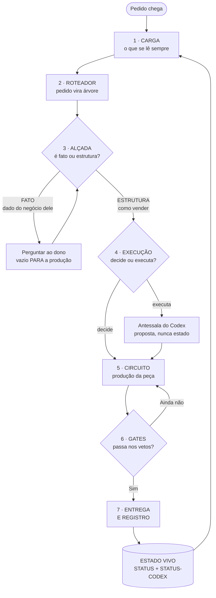
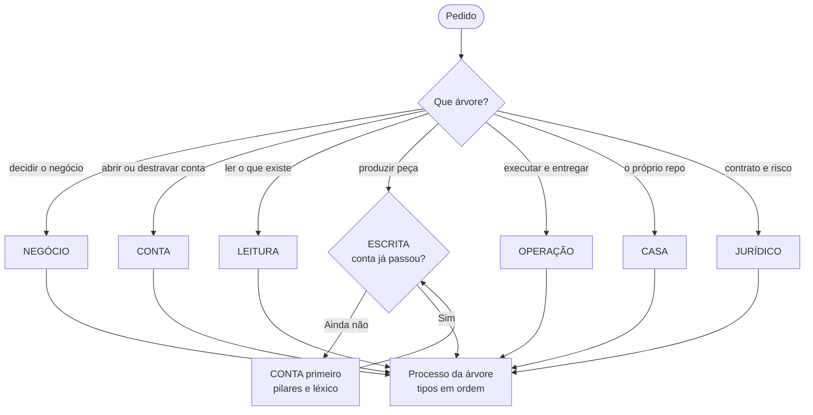
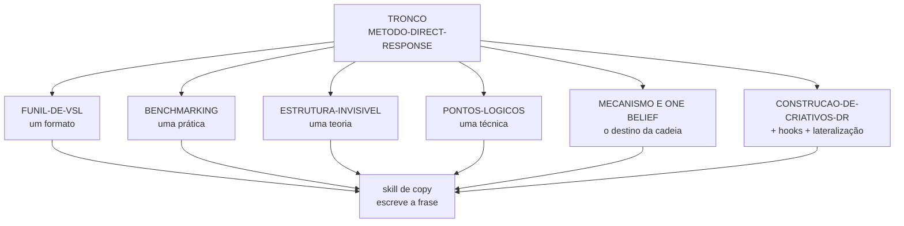
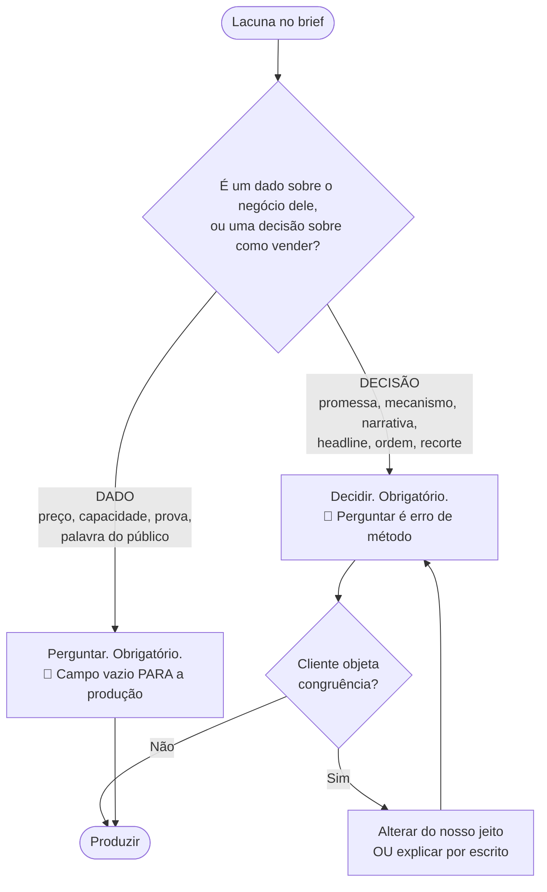
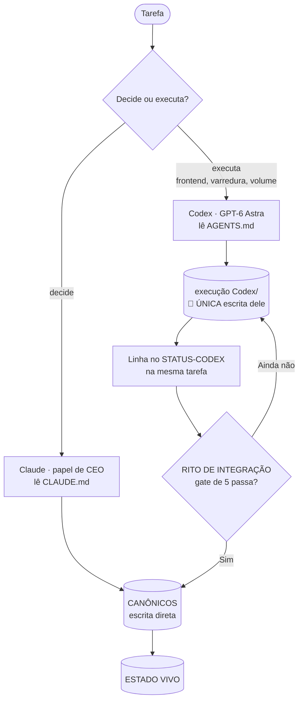
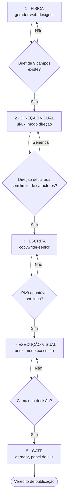
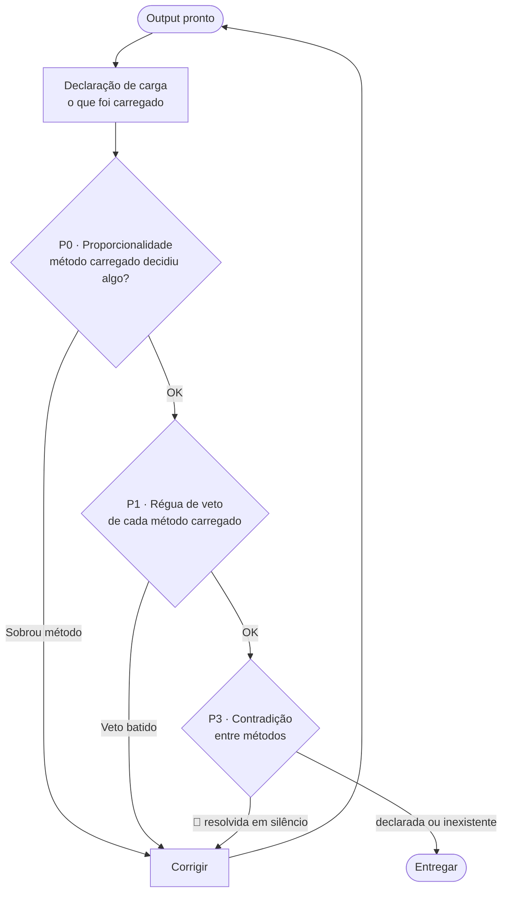
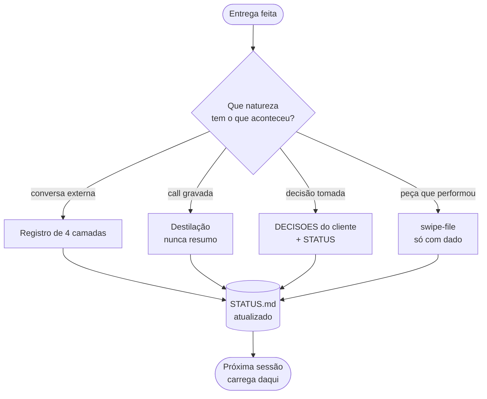

# MAPA DO REPO — como a Continuum decide, roteia, produz e registra

> **Tipo:** índice *(antes: "navegação"; 26/09/2026)* · camada 3 · **Instituído:** 20/09/2026 · **Alçada:** Victor
> **Método aplicado:** `100-métodos/METODO-CAMADA-DE-VER.md` — arquitetura do §7-bis (o mapa inteiro primeiro, uma seção por caixa depois), gramática do §2, formato Mermaid do §4.
> **Versão visual:** `MAPA-DO-REPO.html` — mesmo conteúdo, diagramas renderizados. **Este `.md` é a fonte; o HTML é saída.**
> **Complementa o `README.md`**, que é índice de arquivos. Este é o grafo de funcionamento: o README diz *o que existe*, este diz *o que acontece depois*.

---

## 0. O MAPA INTEIRO

**Um pedido entra por cima e sai por baixo, e o que sai volta a alimentar o que entra.**

> ## ⭐ Tudo que vem depois é o detalhe de uma destas sete caixas.

**As três coisas que este desenho diz e nenhum texto do repo dizia junto:**

| # | O que o grafo mostra |
|---:|---|
| **1** | 🔴 **A alçada vem ANTES da produção, não durante.** O losango 3 é a `REGRA Nº 0`, e ele está no caminho — não é uma checagem que se faz depois de escrever |
| **2** | **Há dois loops, e são os dois lugares onde o trabalho volta:** gate que reprova devolve à produção · pacote do Codex que não passa no rito **fica na antessala** |
| **3** | ⭐ **O ciclo fecha.** O registro alimenta o estado, e o estado é o que se carrega no próximo pedido. **Registro que não acontece quebra o círculo — e o próximo pedido começa cego** |

---

## 1 · CARGA — o que se lê antes de qualquer coisa

> ⚠️ **Esta seção não tem diagrama, e a ausência é o método funcionando.** Carga e precedência são **acervo**, não processo — `METODO-CAMADA-DE-VER.md` §6: *"não há fluxo, é acervo"*. Forçar um grafo aqui produziria o modo de falha 3, lista vertical fingindo de fluxograma.

**Carga obrigatória, toda sessão:**

| Arquivo | Camada | O que dá |
|---|---|---|
| `CLAUDE.md` | — | autoridade, roteador, método, regra de registro |
| `00-core/*` | **Identidade** | princípio, cultura, e as **políticas que têm os números** |
| `STATUS.md` | **Estado** | o que É |
| 🔴 `execução Codex/STATUS-CODEX.md` | **Estado** | o que está **na antessala** |
| 1 skill dominante | — | escolhida no roteador (§2 abaixo) |

> 🔴 **Estado = os dois arquivos, sempre.** Ler o canônico sem a antessala dá retrato incompleto **e sem aviso** — o trabalho existe, está pronto, e o estado não o menciona. Aconteceu em 16/09: destilação entregue às 12h16, estado da conta parado no dia anterior.

🔴 ⭐ **Ordem de carga por tipo — o PROCESSO** (`00-core/TAXONOMIA-DE-ARTEFATOS.md` §4.2, 26/09): `framework → trilho → método → blueprint → política → gate`. **Pular etapa é o erro da conta Bárbara Rosa:** gate de forma aprovou peça cuja etapa anterior — o ICP — nunca rodou. **Gate não substitui etapa anterior.**

**Precedência em conflito:** `CLAUDE.md` → `POLITICAS-DE-DECISAO.md` → skill dominante → artefato de área.
**Exceções que invertem:** fato comercial → `30-comercial/ICP.md` · estado atual → `STATUS.md`.
🔴 **Pacote em `execução Codex/` nunca prevalece sobre canônico, por mais recente que seja.**

---

## 2 · ROTEADOR — como um pedido vira método carregado

**O `CLAUDE.md` §6 tem 30+ linhas de roteamento. ~~Elas se agrupam em seis famílias, e é a família que decide o que carregar.~~ **Reescrito em 26/09: o §6 virou SETE ÁRVORES, cada uma com arquivo próprio em `00-core/roteador/` e a linha do PROCESSO preenchida. A ESCRITA tem portão — peça para cliente só entra com a CONTA passada.****

### 2.1 A família que mais cresceu — escrever para vender

**Desde 18/09 ela tem tronco.** Antes eram quatro métodos irmãos sem nada que os ligasse.

> **A regra de precedência dentro da família, e ela resolve quase todo conflito:** **em conflito, vence o método de FORMATO** — ele conhece a física do canal. **Mas formato não revoga princípio:** se aplicar um formato parece exigir violar a fronteira de margem do DFY ou a régua de prova, o errado é a aplicação.

### 2.2 As três regras de leitura do `10-skills/`

| Tipo | Regra |
|---|---|
| **Ponteiro** (`# PONTEIRO —`) | 🔴 **nunca é fonte.** Seguir para onde ele aponta |
| **Legado** (`_legado/`) | 🔴 **nunca se carrega.** Serve para entender por que uma regra existe |
| **Portátil / persona / método** | fonte ativa |

> 🔴 **`REGRA Nº 1` do §8: nunca se ativa método na mão.** Se aplicar um método depende de alguém **lembrar** de carregá-lo, ele não está em produção — está guardado. **O roteador é o único mecanismo de carga que existe.**

---

## 3 · ALÇADA — o losango mais importante da casa

**`REGRA Nº 0`, instituída 15/09 depois de a conta Débora perder a alçada da estrutura por 18 dias.**

> **Por que a alçada é legítima e não arrogância:** o cliente contrata **porque não sabe estruturar aquilo para vender.** Devolver a decisão de estrutura a ele é devolver o produto sem entregá-lo — e é entregar a pior versão, porque ele escolhe pelo que soa confortável, não pelo que converte.
>
> **O contrapeso que a torna justa:** ele tem **direito de objeção de congruência.** A mudança passa sempre por nós — **ou alteramos, ou explicamos por que não. Sempre, e por escrito.** Nunca silêncio, nunca acatamento automático.
>
> ⚠️ **E propriedade do ativo não é autoria da estrutura.** O site, o perfil e a marca são dele; o que dentro deles faz vender é nosso.

---

## 4 · EXECUÇÃO — quem decide, quem executa, e a antessala

**As duas regras que o desenho torna visíveis:**

| Regra | Por que existe |
|---|---|
| 🔴 **O Codex só escreve em `execução Codex/`** | §0 do `AGENTS.md`. Sem isso, proposta vira estado sem ninguém decidir |
| 🔴 **Pacote isolado é PROPOSTA, nunca estado** | e **a promoção é sempre nossa** — divergência entre antessala e canônico é sinal de promoção pendente, não de canônico desatualizado |

> ⚠️ **O buraco que o rito existe para fechar, e ele é real:** a §0 proíbe o Codex de escrever nos canônicos e o §11.3 exige que nada termine sem registro. **Sem rito, as duas regras se anulam** — o trabalho é feito, fica na antessala, e a memória não recebe.
>
> 🔴 **E o `AGENTS.md` hoje é um CLONE do `CLAUDE.md` + a §0**, por decisão de 15/09. **A fronteira "quem decide × quem executa" existe como desenho e não como estado.** A contenção real vem da §0 e da `REGRA Nº 0`. **Quem altera o `CLAUDE.md` regenera o `AGENTS.md` na mesma tarefa** — replicar à mão foi tentado duas vezes e falhou as duas.

---

## 5 · CIRCUITO — como uma peça de conversão é produzida

**"Criar uma página" não carrega uma skill: abre um circuito de três skills em cinco etapas.**

**Por que a ui-ux entra duas vezes:** antes, para **dar restrição** — quem escreve precisa saber quantos caracteres cabem num título. Depois, porque **desenhar sobre texto real é diferente de desenhar sobre texto simulado.**

**Fronteiras que não se cruzam:** quem faz a física não escreve a frase nem escolhe a fonte · quem escreve não muda a ordem das dobras · quem desenha não reescreve a copy nem move o clímax. **Violação volta para o dono do artefato.**

**Quando encolhe:** auditar página existente → 1 e 5 · trocar oferta → 1 parcial, 3, 5 · refazer só o visual → 2, 4, 5.
🔴 **Nunca encolhem:** a classificação, o brief e o gate.

> ⭐ **Proposta comercial entra aqui desde 17/09.** Proposta não é documento, é peça de conversão — e segue o circuito como qualquer página.

---

## 6 · GATES — o que reprova, e quem checa

**Havia sete métodos com gate declarado, três com gate sob outro nome e dois juízes de skill. Nenhum auditava o CONJUNTO.**

> ⭐ **As duas peças que tornam o gate barato: a DECLARAÇÃO DE CARGA no fecho, e a TABELA DE VETOS** — uma linha por método, com o que reprova sozinho. **O auditor checa essas linhas, não relê os métodos.**

**Os vetos que mais reprovam, e todos são binários:**

| Veto | De onde vem |
|---|---|
| cena ou fala de ICP **sem fonte apontável** | procedência (§6.1) |
| peça **sem pivô** E · Mas · Por isso | skill de copy |
| **P1 ou P4 reprovando** nos pilares | bloqueia produção de copy |
| proposta **sem bloco de onboarding** | Gate F da ancoragem |
| elo de cadeia **que não desaba** ao remover o anterior | pontos lógicos |
| peça no swipe file **sem dado de performance** | §11.5 |
| 🔴 **contradição entre métodos resolvida em silêncio** | gate de congruência |

---

## 7 · ENTREGA E REGISTRO — onde o ciclo fecha

> **Premissa:** este repositório é o **único sistema de memória da empresa.** Sem CRM, sem git ativo, sem segundo lugar. **Se algo só existe na conversa com a IA, não existe** — some no fim da sessão.

**As quatro camadas de todo registro de interação externa — e faltar uma quebra a continuidade:**

| # | Camada | Sem ela |
|---:|---|---|
| 1 | fatos e números | não se sabe onde estamos |
| 2 | decisões **e o descartado** | alguém refaz o caminho já andado |
| 3 | ⭐ **tom e conduta** | **é a que sempre falta.** A próxima mensagem quebra o clima que a anterior construiu |
| 4 | mensagens literais | não se sabe o que a outra parte já ouviu |

> **O teste de suficiência, e é um só:** *outra IA, abrindo só este arquivo, escreveria a próxima mensagem no tom certo e sem repetir erro nosso?*
> Se não, **falta a camada 3 ou a 4.**

---

## 8. O QUE FALTA — nosso × seu

| O quê | De quem | Estado |
|---|---|---|
| Promover os pacotes do Codex pendentes | **nosso** | 🔴 fila no `RITO-INTEGRACAO-CODEX.md` §9 |
| Inventário Done For You (`30-comercial/oferta.md` §7-bis) | **nosso** | 🔴 tabela criada e vazia |
| Verificação em caso real dos métodos 🟡 provisórios | **nosso** | pendente |
| Conferir se este mapa bate com o repo depois de cada método novo | **nosso** | ⭐ ver §9 |

---

## 9. O QUE ESTE MAPA NÃO FAZ

- **Não substitui o `CLAUDE.md`.** O mapa dá o modelo; o kernel dá a autoridade e os detalhes. **Diagrama sozinho vira organograma bonito que ninguém sabe defender.**
- **Não é fonte de regra.** Se este arquivo divergir do `CLAUDE.md`, **vale o `CLAUDE.md`** e a divergência é sinal de que o mapa envelheceu.
- **Não lista todos os métodos.** Lista as seis famílias. O acervo completo está no `§7` do kernel.
- 🔴 **Não se mantém sozinho.** Método novo muda o roteador, e o roteador é a §2 daqui. **Este arquivo entra na mesma tarefa da `REGRA Nº 1`** — ou vira o desenho de um repositório que não existe mais.

---
*Instituído em 20/09/2026. Aplicação do `METODO-CAMADA-DE-VER.md`: arquitetura do §7-bis, gramática do §2, Mermaid do §4. **Teste de correspondência: sete caixas no mapa, sete seções — fecha.** A §1 é deliberadamente sem diagrama (acervo, §6 do método).*
