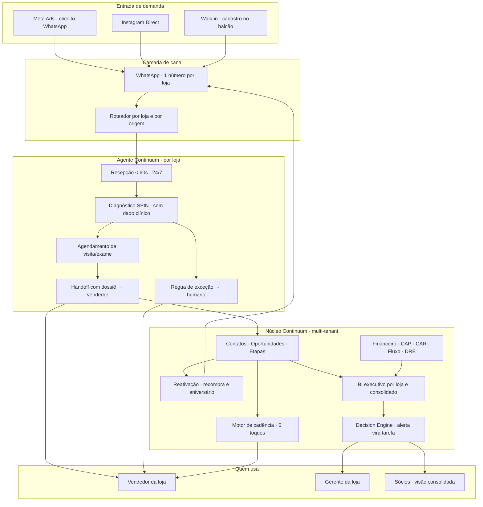

# BLUEPRINT — Sistema Continuum multi-loja para a operação Carolina

> **Tipo:** desenho de arquitetura (pré-diagnóstico) · **Data:** 28/08/2026 · **Dono:** Victor
> **Status:** 🟡 desenho de referência. **Nada aqui é escopo contratado.** Vira escopo depois do diagnóstico e da DEC-CA-04.
> **Base de produto:** `30-comercial/produtos.md` §1 (Continuum OS · Financial Core Runtime) e §2 (multiagente VPS).

---

## 0. O princípio: o sistema dela é este repositório, virado software

O que a Continuum faz para si mesma neste repositório é exatamente o que o sistema precisa fazer para ela. **A tradução é literal, e é ela que separa isto de um chatbot:**

| Aqui, na Governança | Lá, no sistema dela |
|---|---|
| `CLAUDE.md` — **identidade e regra que não muda** | configuração da marca, voz, oferta e política de cada loja |
| `POLITICAS-DE-DECISAO.md` — **os números que decidem** | régua da loja: faixa de desconto, alçada, SLA de resposta, ciclo de recompra |
| `STATUS.md` — **fonte única de fato atual** | painel de estado por loja: funil, caixa, pendências. Um número, um lugar |
| `DECISOES.md` — decisão **com o descartado e o porquê** | log de decisão da operação: quem mudou preço, quem deu desconto, por quê |
| **Precedência declarada** | RBAC: quem pode sobrepor o quê, e quando |
| **Régua de exceção** | o que a IA faz quando o caso sai do trilho — em vez de inventar |
| **Gates** (nada avança sem gate) | aprovação humana em ponto nomeado, nunca "a IA decidiu" |

⭐ **A frase que resume a diferença:** um atendente de IA responde mais rápido. **Um sistema de governança faz a operação continuar coerente quando a Carolina não está olhando** — e é isso que a terceira loja exige.

---

## 1. Topologia

---

## 2. RBAC — quem vê o quê

O pedido do Victor, escrito como matriz. **É o que separa "sistema da loja" de "sistema da rede".**

| Recurso | Vendedor | Gerente da loja | Sócios (Carolina + Ítalo) | Admin (Continuum) |
|---|---|---|---|---|
| Leads e conversas **da própria loja** | ✅ | ✅ | ✅ | ✅ |
| Leads de **outra loja** | ❌ | ❌ | ✅ | ✅ |
| Base de clientes da loja | leitura | ✅ | ✅ | ✅ |
| Metas e ranking individual | **só o próprio** | equipe da loja | todas | todas |
| Financeiro da loja (CAP/CAR/caixa) | ❌ | ⚙️ configurável | ✅ | ✅ |
| **DRE e consolidado da rede** | ❌ | ❌ | ✅ | ✅ |
| Distribuição societária | ❌ | ❌ | ✅ | ❌ |
| Configuração do agente (voz, oferta, desconto) | ❌ | proposta | ✅ aprova | ✅ implementa |
| Log de decisões | próprias | da loja | todas | todas |

**Isolamento técnico:** `loja_id` em toda linha + **RLS no Supabase**, não filtro na aplicação. Filtro em front é conveniência; RLS é fronteira. `[decisão de arquitetura]`

---

## 3. Camada por camada

### 3.1 Canal
Um número de WhatsApp **por loja** — a loja de Tijucas não pode responder com a agenda de Itapema. Roteamento por origem do anúncio quando a agência marcar campanha por unidade.
Contingência: se a API oficial não for viável no curto prazo, o mesmo agente roda sobre borda governada, sem mudar as camadas de cima. `[decisão de arquitetura: canal é substituível, núcleo não]`

### 3.2 Agente por loja
Mesma espinha, **parametrização por loja**: voz, oferta vigente, faixa de preço, teto de desconto, agenda, horário, endereço, equipe de plantão.
Faz: recepciona, qualifica por SPIN, responde dúvida operacional (horário, convênio, endereço, formas de pagamento), **agenda a visita ou o exame**, entrega o dossiê ao vendedor no canal dele.
**Não faz:** fechar venda sozinho, dar desconto fora da faixa, prometer prazo de lente, tocar em grau ou receita.
**Régua de exceção:** três tentativas sem entendimento, pedido fora do escopo, cliente irritado, ou qualquer menção clínica → **handoff imediato com o histórico**, não improviso.

### 3.3 Motor de cadência — a planilha de 6 toques, executada
O processo dela já existe no papel. O sistema só faz o que a planilha manda e ninguém consegue cumprir.

| Toque | Quando | Quem | Corta se |
|---|---|---|---|
| T1 | < 60s da chegada | agente | responder |
| T2 | +2h (janela útil) | agente | responder / agendar |
| T3 | +1 dia | agente | agendar |
| T4 | +3 dias | **vendedor**, com contexto pronto | — |
| T5 | +7 dias | agente, ângulo novo (oferta/prova) | — |
| T6 | +15 dias | **vendedor**, último toque nomeado | — |
| — | +45 dias | entra na base de reativação | — |

**Regra dura:** toque humano é **agendado como tarefa com dono**, não sugerido. Cadência que depende de alguém lembrar é a planilha de novo, com outro nome.

### 3.4 Reativação e LTV
- **Ciclo de recompra:** disparo em D+`ciclo` a partir da **data da última compra**. `[nunca por grau — DEC-CA-05]`
- **Aniversário:** voucher, com validade e código rastreável (senão não se mede).
- **Pós-venda:** confirmação de retirada, ajuste, satisfação — vira dado de CS, não cortesia.
- **Inativos:** régua por faixa de tempo, com teto de frequência por contato (anti-queima de base).

### 3.5 Financeiro (o módulo que muda o dia dela)
Sobre o **Financial Core Runtime** que já existe no repo: contas a pagar, contas a receber, fluxo de caixa, fechamento de competência, **DRE por loja e consolidado**, distribuição societária.
Visão dupla obrigatória: **cada loja isolada** e **a rede somada** — inclusive as Eskimó, se entrarem no escopo.
`[leitura]` É a única entrega que a Carolina consome pessoalmente todo mês. Comercial ela delega; financeiro, não.

### 3.6 BI executivo + Decision Engine
Indicadores por loja e consolidados: leads, **tempo de primeira resposta**, cobertura de contato, lead→visita→venda, ticket, margem, recompra, LTV, ranking de vendedor, CAC por loja (com o dado que a agência já entrega).
**Decision Engine:** alerta não é gráfico vermelho — é **tarefa com dono, prazo e escalonamento**. *"Tijucas com TMR acima de 10 min por 3 dias"* vira tarefa para o gerente, com SLA e escalada para os sócios se estourar.

---

## 4. Fronteira LGPD (cláusula, não rodapé)

| Entra no núcleo Continuum | **Nunca entra** |
|---|---|
| nome, contato, origem, etapa, loja | grau, receita oftálmica, laudo |
| data da última compra, ciclo de recompra | histórico clínico, patologia ocular |
| data de nascimento (aniversário) | qualquer conteúdo do exame |
| valor, margem, forma de pagamento | — |

Dado clínico permanece no prontuário / sistema do franqueador. O agente **agenda o exame e passa a bola**. (DEC-CA-05)

---

## 5. Reuso — o que já existe e o que é construção nova

Isto é o que torna a Oferta B viável ou inviável, e por isso está escrito antes do preço.

| Componente | Estado no repo | Esforço aqui |
|---|---|---|
| Financial Core Runtime (DRE, CAP/CAR, fluxo, distribuição) | Fases 0–5 concluídas; Fase 6 (persistência Supabase) em andamento | **configuração + multi-tenant** |
| Shell Continuum OS (8 módulos) | existe | configuração |
| RLS / RBAC / AuthService | existe; **CRUD autenticado pendente de credenciais, 0 Edge Functions em produção** | 🔴 **caminho crítico** |
| Malha de agentes (SDR, follow-up, handoff) | backend fases 1–6 no ar na VPS | parametrização por loja |
| Canal WhatsApp governado | **pendente** no repo | 🔴 **caminho crítico** |
| Integração Meta Ads (CAC por loja) | MCP disponível | baixo |
| Integração com sistema do franqueador IVS | **desconhecida** | ❓ depende do bloco 4 da call |

⭐ **Leitura honesta:** a Oferta A depende de dois itens que hoje estão pendentes no próprio repo (WhatsApp governado e persistência autenticada). **Isso não é detalhe de implementação: é o prazo da G1.** Prometer 30 dias sem fechar esses dois é prometer G3 no prazo de G1 — dentro de casa, dessa vez.

⭐ **E é exatamente esse o caminho crítico que a primeira contratação existe para destravar.** As três linhas 🔴 desta tabela são **faixa D1 — execução técnica sob spec e gate**, a única já liberada para delegação (`POLITICAS` §4-bis). Não são decisão de arquitetura, são build. **Arquitetura, diagnóstico, oferta e preço continuam 100% do Victor** — é o produto, não o insumo.

---

## 6. Curva de gerações (o cronograma que a proposta vai herdar)

| Geração | O que existe ao fim | **Gate nomeado para a próxima** |
|---|---|---|
| **G0 · medição** (~7 dias) | baseline medido: TMR, cobertura de resposta, toques realizados, conversão, base | baseline aceito por ela, por escrito |
| **G1 · Itapema no ar** (~30 dias) | agente + cadência de 6 toques + handoff + painel de funil da loja | **TMR mediano < 2 min em 90% dos leads** e **cobertura de 1º contato ≥ 95%**, medidos 14 dias seguidos |
| **G2 · duas lojas + LTV** (~60 dias) | Tijucas no ar, reativação e aniversário rodando, CS pós-venda | **margem incremental atribuível ≥ mensalidade**, medida na janela combinada |
| **G3 · governança** (~90–120 dias) | RBAC completo, financeiro consolidado, DRE por loja, BI executivo, Decision Engine | painel usado nas decisões dela sem planilha paralela por 30 dias |
| **G4 · escala** | Palhoça e Eskimó entram por **configuração, não por projeto** | custo unitário por loja cai |

**A regra que vale por todas:** G1 existe para **gerar dado**, não lucro. Quem cobrar lucro de G1 está vendendo a geração errada.

---

## 7. O que este sistema **não** faz

- Não substitui vendedor. Recepciona, qualifica, entrega contexto — **quem fecha é a equipe dela**.
- Não gerencia mídia paga (DEC-CA-02).
- Não guarda nem discute dado clínico (DEC-CA-05).
- Não troca o sistema do franqueador sem autorização dele.
- Não decide sozinho fora da régua: exceção vai para humano nomeado.
- Não promete faturamento. Promete **tempo de resposta, cobertura de contato e visibilidade** — as três medíveis sem interpretação.
