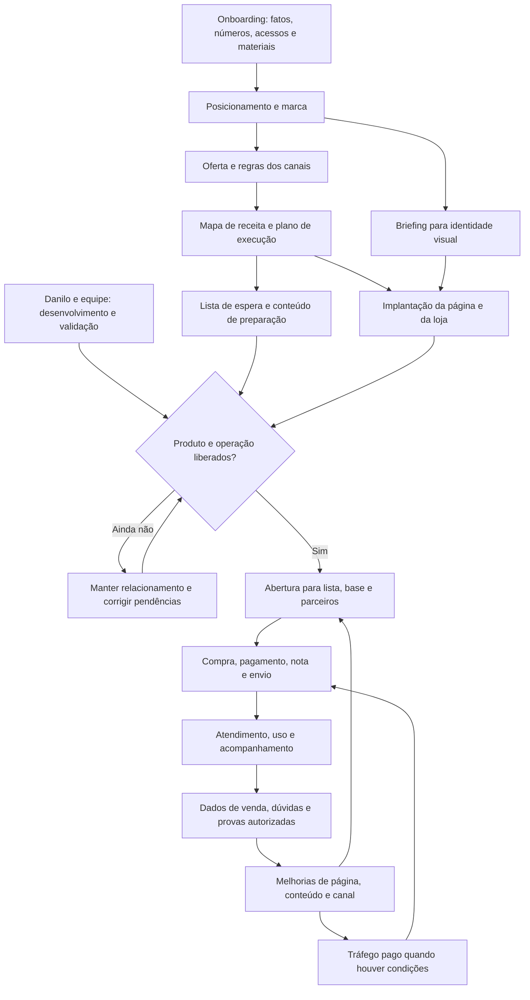

🟢 PROMOVIDO em 02/10/2026 · destinos: clientes/Danilo/STATUS.md

# Kraken — operação completa da proposta

Data: 18/09/2026. Explicação interna para Victor: consolidação da proposta de 18/09, correções dos áudios e planejamento da implantação. Não é nova proposta comercial, aceite de Danilo nem alteração do estado canônico. A contratação da implantação e da continuidade ainda exige delimitação de preço/prazo/volume.

## 1. Objetivo e fronteira

Nosso papel proposto é estruturar e conduzir marketing e vendas da Kraken, começando pelo Logger e construindo ativos reutilizáveis. Danilo continua concentrado em produto; nós conectamos posicionamento, oferta, canal, conteúdo e compra. A Kraken mantém fabricação/validação, atendimento técnico, expedição e execução financeira. Implantar sistemas de venda não equivale a gerir toda a empresa.

Três camadas: A — alicerce estratégico; B — implantação da jornada de compra; C — operação contínua e melhoria. A proposta escrita precificava A; a necessidade declarada depois adicionou implementação à conversa. C estava descrita, sem nova mensalidade definida.

## 2. Fluxo geral

O fluxo é uma arquitetura proposta. Não transforma interesse em venda garantida. Antes de abrir, validar produto, promessa, preço, estoque ou prazo real, fiscal, pagamentos, logística e suporte.

## 3. Entrada e onboarding

Reunião inicial proposta de 40 minutos. Antes dela, nós organizamos o que já existe e levamos somente lacunas factuais. Recuperar fluxo da operação, materiais de marca, catálogo, fontes de prova, calendário de eventos, canais e números disponíveis.

Dados mínimos: receitas e margens por frente, produtos próprios/terceiros, royalty e condições, modelos de parceiro, capacidade de entrega, estado do Logger e compromissos de marca. Não supor que todo evento gera receita Kraken, que toda venda Compass pode passar pela loja Kraken, ou que a base de clientes de terceiros está disponível para ativação.

Saída: brief factual, lista de lacunas com responsável e quadro de execução. Contas pertencem à Kraken. Acessos por convite quando disponível; sem credenciais em documentos.

## 4. Alicerce — três entregas originalmente propostas em 15 dias úteis

### Entrega 1 — posicionamento e marca

Definir público prioritário e papéis de compra; separar competidor, organizador e parceiro, sem assumir que compram a mesma coisa. Definir proposta de valor, diferenciação sustentada por evidência, relação entre marca Kraken e seus produtos, narrativa e limites de promessa.

Entregar documento de posicionamento e briefing para o designer do book. Nós construímos a direção estratégica; designer executa identidade. Logo/book não entram automaticamente no nosso serviço. Provas existentes de outro equipamento não validam o Logger novo.

Aceite: equipe consegue explicar para quem cada oferta serve, por que comprá-la e quais evidências sustentam isso.

### Entrega 2 — oferta e canais

Desenhar compra direta, indicação e revenda. Definir quem vende, recebe, fatura, entrega e atende em cada modelo. Registrar percentuais, descontos, base de cálculo, atribuição, venda sem parceiro, devolução e calendário de repasse. Danilo fornece fatos e formaliza as condições com seus parceiros; nós estruturamos o funcionamento e os materiais necessários.

Indicação: parceiro traz comprador, Kraken vende/recebe/envia, parceiro recebe comissão. Revenda: parceiro compra lote com desconto, recebe estoque, vende/recebe/envia por conta própria. Sem comissão dupla presumida. Marketplace próprio da Kraken fora do início; marketplaces de parceiros não são a mesma frente.

Aceite: uma venda em cada cenário pode ser percorrida sem dúvida sobre dinheiro, estoque ou suporte. Lista de espera não é pré-venda paga.

### Entrega 3 — mapa de receita e ordem de execução

Mapear negócios de equipamentos, eventos/serviços, aluguel e royalties conforme dados reais. Para cada frente: comprador, oferta, condição, canal de entrada, passo até recebimento, responsável e dado de acompanhamento.

Loja não absorve automaticamente serviços, royalties ou locação. Organizadores podem exigir venda por conversa/proposta; o desenho preciso vem do levantamento. Royalties entram como receita a acompanhar segundo acordo existente, não como checkout novo.

Entregar mapa, plano dos seis meses seguintes com prioridades e indicadores e devolutiva proposta de 90 minutos. Plano de seis meses não equivale a seis meses de serviço contratados.

Aceite: cada ação tem objetivo, responsável, dependência e critério de conclusão.

## 5. Preparação de demanda antes da abertura

Criar página/formulário de interesse, base organizada e confirmação de inscrição. Campos mínimos propostos: nome, contato, equipamento atual, campeonato/região e origem/parceiro quando aplicável. Usar canal de contato autorizado; evitar cadastro excessivo.

Segmentar competidores, organizadores e parceiros. Interesse registrado é sinal de demanda, não pedido, faturamento ou garantia de lote vendido.

Ativar perfil: bio com destino, destaque do produto e conteúdos com chamada adequada à fase. Nós definimos pauta, sequência, argumentos, textos e destino; Danilo/equipe fornecem demonstrações e fatos do desenvolvimento. Gravação/edição/publicação cotidiana precisam ter volume e dono definidos na continuidade; não presumir produção audiovisual ilimitada.

Manter lista informada por canal acordado, com progresso real, demonstrações e respostas a dúvidas. Não criar expectativa de data, prioridade ou funcionalidade sem sustentação. Reaproveitar ativos entre captura e venda, conferindo se o editor suporta o formulário necessário; custo adicional de aplicativo de captura ainda não orçado.

## 6. Implantação da compra

Arquitetura proposta, pesquisada no plano técnico anterior: Nuvemshop + Nuvem Pago + Bling + Nuvem Envio; piloto Ovni para atribuição por link. Página sob nossa execução, dentro da loja como primeira escolha. Configurar produto, preço, estoque, checkout, fiscal, frete e parceiros.

Fluxo-alvo: página → checkout e frete → pagamento aprovado → pedido integrado → NF-e autorizada → etiqueta → expedição. Pedido e pagamento pendentes não devem disparar expedição. Configurar somente um emissor fiscal e um emissor de etiquetas; evitar duplicidade e baixa dupla de estoque.

Pontos pendentes de homologação: emissão fiscal sem clique residual; campos da NF chegando à logística; elegibilidade financeira; atribuição e fechamento mensal no Ovni. Split fica fora da primeira versão proposta, se Danilo confirmar acerto periódico. Caso integração nativa não complete um requisito, especificar complemento e custo antes de prometer solução.

Estoque da Kraken separado do estoque já vendido aos parceiros. Pedidos B2B de lotes podem começar assistidos, sem portal completo.

Aceite: compra, pagamento, fiscal, etiqueta, rastreio e indicação verificados; também testar cancelamento, recusa, Pix não pago, nota rejeitada, falta de estoque e ausência de parceiro.

## 7. Abertura do lançamento

Pré-condições: produto validado pela equipe responsável, promessa compatível, preço e condições fechados, quantidade disponível ou prazo de entrega explícito, suporte e expedição designados e compra testada. Novembro e datas da proposta antiga não são compromisso atual.

Operação proposta: avisar a lista pelo canal acordado; orientar parceiros com links e condições; atualizar perfil e página; direcionar conteúdo; acompanhar diariamente dúvidas, compras e falhas na janela de abertura. Reativar base anterior somente se acessível à Kraken e apta para esse contato.

Não fabricar escassez nem usar inscrição em lista como contagem de compradores. Comparar interesse, intenção e compra efetiva para decidir lote seguinte. Se produto não estiver liberado, manter captação/relacionamento sem receber venda normal inadvertidamente.

## 8. Rotina depois da venda

Kraken confere pedidos, trata exceções, emite/acompanha fiscal, separa e expede, atende tecnicamente e executa repasses. Nós revisamos o funcionamento comercial: onde perderam compras, quais dúvidas voltam, parceiros que geram pedidos e ajustes necessários na comunicação.

Planejar orientações de primeiro uso e encaminhamento ao suporte; Danilo valida conteúdo técnico. Nós podemos estruturar os materiais e o fluxo, dentro de volume definido. Recolher feedback e solicitar autorização para uso de depoimentos/provas, sem transformar teste de um produto em promessa de outro.

Retenção e compra adicional só entram com necessidade real e produto disponível. Não inventar assinatura/recorrência na Kraken.

## 9. Operação contínua de marketing e vendas

Frentes: direção de conteúdo; manutenção da ligação Instagram/lista/página; relacionamento com base e parceiros; melhoria de conversão; acompanhamento de oportunidades B2B; leitura de resultados; tráfego pago na condição prevista pela proposta.

Quadro simples para conversas B2B: contato → necessidade identificada → oferta/proposta → negociação → ganho/perdido → recebimento. Pedidos online seguem os estados da loja. Não duplicar todos os pedidos num CRM só para parecer organizado.

Tráfego pago: nesta proposta, começa depois de destino funcionando e evidência de conversão orgânica. Exige verba definida e conta econômica por canal; não está automaticamente incluído nas assinaturas de ferramenta nem nos R$ 6.500. Nós operamos mídia se essa frente for contratada. Ajustes por objetivo e evidência, sem prometer escala de nicho.

Mensalmente: revisar margem por canal, receita recebida, comissões, custos de ferramentas/mídia e pipeline. Receita não é lucro; pedido não é caixa; lista não é receita.

## 10. Cadência proposta e responsabilidades

- Entrada: reunião de 40 minutos, coleta concentrada e acessos.
- Durante alicerce: entrega semanal e reunião de 30 minutos; fechamento final de 90 minutos substitui a reunião curta dessa semana.
- Durante implantação: resumo escrito de avanço, bloqueios e próxima entrega; pedidos de acesso/validação agrupados.
- Continuidade: reunião semanal de 30 minutos mais leitura mensal de resultado; operador Kraken verifica pedidos diariamente.
- Disponibilidade de Danilo: reservar até 2h/semana durante estruturação, como hipótese de planejamento a validar, incluindo reuniões/respostas. Semana de coleta/aprovações pode exigir mais. Não manter promessa conflitante de apenas meia hora total.

| Frente | Nós | Kraken / terceiros |
|---|---|---|
| Estratégia, estrutura de conversão, copy | Executamos | Informam fatos e apontam incongruências |
| Identidade visual/book | Briefing estratégico | Designer contratado executa |
| Produto, testes e especificações | Traduzimos em comunicação fiel | Danilo/Cubos validam e entregam |
| Página e integrações prontas | Implantamos e testamos | Contas, acessos e condições |
| Fiscal | Configuração técnica | Contabilidade define parâmetros |
| Conteúdo | Direção e escrita no volume acordado | Captação/demonstração; edição/publicação a delimitar |
| Pedidos, atendimento e envio | Desenho do fluxo e melhoria | Operador Kraken executa |
| Parceiros | Modelo, materiais e controle | Danilo formaliza acordos e Kraken paga |
| Tráfego | Gestão se contratada | Kraken financia mídia |

## 11. Indicadores que orientam decisões

Captura: visitas, inscrições, conversão, origem e região. Venda: visitas de produto, checkout, aprovação, pedidos e recebimentos. Canal: indicação, revenda, venda direta, comissão/desconto e margem. Operação: pedidos pendentes, rejeições fiscais, prazo de expedição e problemas de entrega. Pós-venda: dúvidas repetidas, devoluções, satisfação e evidências autorizadas. B2B: oportunidades, avanço, propostas, fechamento e pagamento.

Consolidar primeiro uma base simples e verificável; dashboard complexo só depois se o volume justificar. Separar desempenho observado de hipótese causal.

## 12. Escopo comercial e cronograma

Alicerce: R$ 6.500 e 15 dias úteis eram os termos da proposta escrita para três entregas estratégicas. Implantação por nós é adição posterior à conversa e não pode ser declarada toda incluída ou toda adicional sem acordo. Continuidade precisa de preço, volume e prazo próprios. Ferramentas e mídia são custos separados.

Estimativa anterior de 10–15 dias úteis para implantação vale como hipótese após insumos/acessos e piloto, não substitui nem se soma mecanicamente aos 15 dias do alicerce. Cadastro de contas e dados pode rodar em paralelo; copy depende das decisões e compra depende da homologação. Calendário fechado só após essas dependências.

A conta de retorno precisa usar margens reais e receitas das frentes efetivamente beneficiadas. Não repetir projeções históricas invalidadas ou garantir pagamento do investimento. Não reeditar preço comercial nesta explicação.

## 13. O que fica fora agora

Marketplaces próprios da Kraken, book visual, desenvolvimento/validação do produto, sistema de locação, portal B2B completo, sincronização de estoque de revendedores, produção audiovisual ilimitada, operação diária de expedição/suporte por nós e promessa de escala.

## 14. Fontes e verificações

Fontes: proposta de 18/09 em `30-comercial/assessoria-prospects/danilo-kraken/PROPOSTA-DANILO-2026-09-18.md`; folha interna PROJETO-E-ANCORAGEM-2026-09-17.md (com ressalvas/revisão de 18/09); OFERTA-E-NARRATIVA.md histórico de 09/08, somente para contextualização; print e transcrições já lidos nesta conversa; análise dos áudios e PLANO-IMPLANTACAO-LOJA-KRAKEN-2026-09-18.md nesta pasta, com fontes oficiais das plataformas.

Precedência factual: últimas falas e correções de Victor prevalecem sobre hipóteses antigas. Afirmações históricas sobre site, receita, eventos, parceiros e prova não foram tratadas como auditoria atual. Skill de operações já carregada usada para limites/responsabilidades.

Verificado: cobertura das três entregas da proposta e das frentes de continuidade; marketplace removido do início; implantação da página conosco; dois modelos de parceiro; prazo/preço sem aceite inventado; cadência corrigida como proposta; nenhuma fonte canônica alterada. Criado somente este registro isolado. Não foram enviadas mensagens, contratadas ferramentas ou publicadas páginas.
