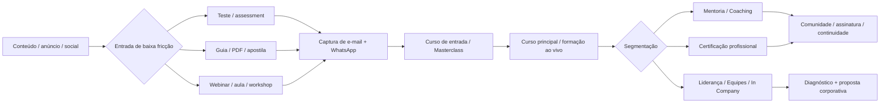

# Benchmark de mercado de cursos, treinamentos e produtos de Eneagrama

## Resumo executivo

A pesquisa mapeou **31 referências reais**, sendo **20 com operação ou oferta direcionada ao Brasil** e **11 referências internacionais relevantes**, cobrindo uma variedade ampla de modelos: cursos de entrada, formações profissionais, certificações, treinamentos corporativos, assessments, mentorias, coaching, retiros, produtos para relacionamentos, liderança, vendas, espiritualidade, parenting, comunidades e assinaturas. A base completa, com uma coluna separada para cada campo solicitado, está disponível em Excel e CSV:

**[Baixar planilha completa em Excel](sandbox:/mnt/data/benchmark_eneagrama_mercado_2026-09-16.xlsx)**  
**[Baixar base em CSV](sandbox:/mnt/data/benchmark_eneagrama_mercado_2026-09-16.csv)**

O primeiro padrão mais forte é que o mercado se divide em quatro grandes “escadas de valor”. A porta de entrada costuma ser gratuita ou de baixo risco — teste, assessment, guia, apostila, aula aberta, live ou webinar. Em seguida aparecem cursos autoguiados e produtos de entrada; depois formações extensas, imersões e programas ao vivo; no topo ficam certificações profissionais, consultoria, coaching executivo e projetos corporativos sob proposta. Cloverleaf, Enea3, Márcio Schultz, ESEDES, The Narrative Enneagram e Your Enneagram Coach ilustram muito bem o uso de testes, materiais gratuitos ou conteúdos de entrada para alimentar etapas posteriores do funil. citeturn19search5turn15search0turn12search7turn24search3turn20search5turn20search7

No Brasil, **o preço tende a desaparecer justamente quando a oferta se aproxima de liderança, equipes e empresas**. IEneagrama, Evoluser, Eneagrama Conecta e outros direcionam o visitante para “diagnóstico”, “especialista”, WhatsApp ou formulário, em vez de expor tabela de preço para In Company. Isso sugere uma venda consultiva com qualificação de demanda, enquanto cursos B2C e produtos digitais têm preço muito mais transparente. citeturn18search1turn18search8turn18search10

Entre preços públicos localizados, a amplitude é grande. Há entradas de **R$47,25/mês** no CP Online brasileiro, Masterclass CP por **R$397,90**, eventos da IEA Brasil a partir de **R$90**, ENIGMA 2.0 por **R$1.997**, programa CP de dez meses por **R$5.997** e a imersão Potencial Oculto da Evoluser divulgada por **R$8.096 à vista**. Internacionalmente, há assessment de **US$20** no Enneagram Institute, iEQ9 de **US$60**, assinatura CP a partir de **US$20,75/mês**, cursos CP de centenas de dólares e certificações do Narrative Enneagram entre **US$2.695 e US$6.595**. citeturn23search7turn23search2turn23search0turn23search9turn23search13turn18search5turn19search13turn20search2turn19search9turn19search4

Outro padrão particularmente relevante é a **verticalização por problema**, em vez de simplesmente vender “um curso de Eneagrama”. Há Eneagrama para vendas e high-ticket no IEneagrama; liderança no Eneagrama Conecta e Evoluser; relações e “Linguagens do Amor” na CP; parenting na CP internacional; desenvolvimento de equipes na ATA e Cloverleaf; cursos para terapeutas/coaches/profissionais no ENIGMA, IDEAIS, Narrative e Márcio Schultz; e espiritualidade no Instituto Nicolai Cursino e em programas da CP. citeturn18search1turn15search1turn18search8turn23search3turn19search12turn11view1turn19search16turn23search9turn18search0turn19search4turn15search9turn23search13

Isso é especialmente compatível com a tese discutida na reunião do projeto: usar um produto de Eneagrama já existente como primeira oferta, combinando conteúdo gravado com encontros ao vivo, e depois criar caminhos para mentoria e soluções corporativas — em vez de depender de um produto único e indiferenciado. fileciteturn0file0

## Escopo da pesquisa e Biblioteca de Anúncios da Meta

Foram priorizados sites oficiais e páginas de venda oficiais, com fontes de terceiros usadas apenas pontualmente para corroborar um dado que não estava exposto no site, como um identificador social. A pesquisa foi atualizada até **16 de setembro de 2026**.

Há uma ressalva importante sobre a Biblioteca de Anúncios da Meta. Durante a pesquisa, as consultas web por URLs no formato `facebook.com/ads/library/?id=...` não retornaram anúncios comerciais indexados, e a tentativa de abrir a própria busca da Ads Library através do navegador de pesquisa falhou no fetch. citeturn16view0 Por isso:

**não atribuí nenhum ID de anúncio a uma empresa sem conseguir verificá-lo.** Nas colunas “anúncio direto ativo” e “anúncio direto histórico”, a planilha registra **“não especificado”** quando não houve recuperação verificável.

Para não deixar essa parte sem utilidade, a planilha contém, **para cada uma das 31 marcas**, dois links de consulta oficial na Meta: uma busca configurada para anúncios ativos e outra com `active_status=all`. Esses links levam diretamente à Biblioteca de Anúncios com o nome da marca já preenchido. Eles devem ser tratados como **links de investigação**, e não como evidência de que existe um anúncio naquela data.

A mesma limitação impediu a obtenção segura de capturas dos criativos da Meta. Não incluí “screenshots” provenientes de fontes secundárias porque não seria possível garantir que correspondessem ao anunciante, período e ID corretos. Para análise competitiva, esse é um caso em que **“não especificado” é preferível a inventar ou associar um criativo ao anunciante errado**.

## Referências brasileiras

A tabela abaixo resume as 20 referências com operação brasileira ou oferta especificamente localizada para o Brasil. A planilha Excel contém os campos separados — organização, país, site, Instagram, links Meta, oferta, público, preço, CTAs, formatos, funil e fonte — em vez das células combinadas usadas aqui para manter a leitura possível.

| Referência | Site / Instagram | Oferta e público declarado | Preço público encontrado | CTA, formatos e evidência de funil | Fonte |
|---|---|---|---|---|---|
| **Instituto Eneagrama — IEneagrama** | [Site](https://ieneagrama.com.br/home/) · [Instagram](https://www.instagram.com/ieneagramabr/) | E-Personalidade, E-Vendas, E-Processual, E-Corpo, In Company e franquias; pessoas físicas, líderes, equipes, vendas e empresas. | **não especificado** | “Agende seu Diagnóstico”, “Falar com Especialista”; páginas por produto, agenda, intensivos, kits, certificação, página de franquia e venda consultiva. | citeturn12search5turn18search1turn18search2turn18search9turn14search1 |
| **Instituto Márcio Schultz de Eneagrama** | [Site](https://www.eneagrama.com.br/) · Instagram: **não especificado** | In Company, GP1/Eneagrama 3.0, Analista, Instrutor, workshops e EAD; líderes, RH, equipes, coaches, terapeutas e consultores. | Exemplo localizado: **R$547 à vista / 12x R$45,60** em curso EAD; demais formações variam. | Teste gratuito, newsletter, “Mais informações”, formulários com e-mail/WhatsApp/Instagram, área de membros, suporte, parcelamento e certificado. | citeturn12search2turn12search4turn12search6turn12search7turn15search14 |
| **Instituto Evoluser** | [Site](https://evoluser.com.br/) · [Instagram](https://www.instagram.com/evoluser/) | ESI®, assessment/app, In Company, online, Potencial Oculto, facilitadores e mentorias; líderes, executivos, RH, equipes e indivíduos. | Potencial Oculto: **R$8.096 à vista ou 4x R$2.024,10** no lote pesquisado. | “Desejo Mais Informações”; relatório executivo imediato no assessment, formulário WhatsApp/e-mail, diagnóstico, cases corporativos, comunidade e continuidade em mentoria. | citeturn18search8turn18search16turn18search5 |
| **Eneagrama Conecta — Guilherme Renz** | [Site](https://www.eneagramaconecta.com.br/) · [Instagram](https://www.instagram.com/eneagrama.conecta/) | Formação presencial de inteligência emocional aplicada à liderança; empresários, gestores, executivos e líderes. | **não especificado** | “Quero garantir minha vaga”; 35h/10 encontros, vídeo institucional, depoimentos, formulário com dados profissionais, WhatsApp/e-mail e consentimento de ofertas. | citeturn15search1turn18search10 |
| **Enea3 Brasil** | [Site](https://enea3.com.br/) · [Instagram](https://www.instagram.com/enea3brasil/) | Curso online, workshops e materiais; autoconhecimento, gestão, liderança e desenvolvimento humano. | **não especificado** | Apostila como material de entrada, “Solicitar acesso”, “Quero ser avisado”, lista por e-mail, WhatsApp e plano de ação de dois meses. | citeturn15search0 |
| **Wover Transformando Mundos** | [Site](https://www.wover.com.br/) · [Instagram](https://www.instagram.com/wover.transformandomundos/) | Curso-base, treinamento vivencial, palestras e empresas; autoconhecimento, relações, grupos e organizações. | **não especificado** | “Ver cursos e eventos”, “Baixar materiais”, formulário com WhatsApp/e-mail/interesse, e-books, vídeos e conteúdo social. | citeturn24search0turn24search1turn24search2 |
| **ESEDES** | [Site](https://esedes.com.br/) · Instagram: **não especificado** | “4 Caminhos para a Evolução”, cursos educacionais/profissionais, liderança e Eneagrama; indivíduo, organização, carreira e capacitação. | **não especificado** | Teste, “obtenha condições especiais”, formulário com e-mail/telefone/canal preferido, live, newsletter e e-mail posterior com informações do curso. | citeturn24search3turn24search4 |
| **Instituto IDEAIS / EneaBusiness** | [Site](https://institutoideais.com.br/) · [Instagram](https://www.instagram.com/institutoideais/) | Formação para atuar profissionalmente em mentorias, imersões e empresas; RH, terapeutas, empresários e novos especialistas. | **não especificado** | “Quero me tornar especialista”, WhatsApp, vagas limitadas/processo seletivo, um ano de mentoria ao vivo, gravações, casos reais e 24 protocolos. | citeturn18search0turn14search13 |
| **Revolução Eneagrama — ENIGMA 2.0** | [Site](https://revolucaoeneagrama.com.br/formacao-profissional-eneagrama) · Instagram: **não especificado** | Formação profissional para terapeutas, coaches, psicólogos, mentores e facilitadores. | **R$1.997 à vista ou 12x R$206,54** | Aulas gravadas, comunidade, mentorias, workshops mensais, Kit Pro, TGP por dois anos, ancoragem >R$7 mil e garantia de 30 dias. | citeturn15search7turn23search9 |
| **Instituto IDEP — Despertar Eneagrama** | [Site](https://eneagrama.institutoidep.com.br/) · Instagram: **não especificado** | Formação para desenvolvimento pessoal/profissional, casais e aplicação em empresas, com mentoria individual. | Oferta pesquisada: **R$799 no Pix**; condições parceladas também expostas. | Landing de matrícula, WhatsApp, encontros em grupo, até três horas de mentoria individual e opção de pagamento por empresa/CNPJ. | citeturn3search4 |
| **CP Enneagram Academy — operação PT-BR** | [Site](https://www.cpenneagram.com.br/) · Instagram: **não especificado** | Masterclass, relacionamentos, assinatura CP Online, programas ao vivo e certificação; iniciantes, profissionais, terapeutas/coaches e público de desenvolvimento pessoal. | Masterclass **R$397,90**; CP Online **R$67/mês ou R$47,25/mês no anual**; programa de energia **R$5.997**. | Trial por **R$1**, Hotmart, aulas gratuitas, webinar, assinatura, Q&A, gravações, comunidade e ascensão para certificação/eventos. | citeturn23search2turn23search3turn23search7turn23search12turn23search13turn23search14 |
| **IEA Brasil** | [Site](https://eneagramabrasil.org.br/) · Instagram: **não especificado** | Associação, congresso, mini-cursos, vivências e acreditação; entusiastas e profissionais. | Encontro **R$90**; Vozes **R$499**; Congresso **R$1.600**; associação a partir de **R$210/ano** na página atual. | “Comprar”, “Associe-se”, cadastro, cupom para membros, e-mail de acesso, desconto progressivo e continuidade via associação. | citeturn23search0turn23search4turn23search15turn23search16turn23search17 |
| **Instituto Nicolai Cursino** | [Site](https://www.nicolaicursino.com/) · Instagram: **não especificado** | Eneagrama Espiritual, Instintos, ENEACOACHING®, cursos online, retiros e eventos; autoconhecimento e espiritualidade. | **não especificado** | Agenda de eventos, WhatsApp, cursos digitais e progressão para experiências/retiros. | citeturn15search9 |
| **SAGGA Evolution Institute** | [Site](https://saggainstitute.com.br/) · Instagram: **não especificado** | Devolutivas, SUPERAÇÃO, Eneagrama para equipes, programas organizacionais e palestras. | **não especificado** | Zoom, sessões individuais, treinamento de impacto, programas corporativos e contato comercial. | citeturn0search11 |
| **Dalton Cortucci / EneaCoach** | [Site](https://www.daltoncortucci.com/) · Instagram: **não especificado** | “O Poder do Eneagrama”, coaching, lives, seminários e treinamentos; individual e profissional/corporativo. | **não especificado** | Vídeo-aulas, lives e seminários como conteúdo e oferta; contato para serviços. | citeturn0search8 |
| **Rosa de Luz** | [Site](https://www.rosadeluz.com.br/eneagrama) · Instagram: **não especificado** | Formação online ao vivo com vertente psicoespiritual e aromaterapia; práticas integrativas/autoconhecimento. | **não especificado** na página pesquisada. | “Cadastre seu interesse”, aula aberta, formulário, WhatsApp/Telegram, pré-inscrição e reserva mediante pagamento inicial. | citeturn15search8 |
| **Ensino Psique** | [Site](https://www.ensinopsique.com.br/curso-de-eneagrama/) · Instagram: **não especificado** | Curso modular do introdutório ao avançado; autoconhecimento, saúde mental, gestores e coordenadores. | **não especificado** | “Faça sua matrícula”, ficha cadastral, quatro módulos e certificado. | citeturn15search12 |
| **Lume CEP — Mastermind Eneagrama Vitruviano** | [Site](https://www.lumecep.com.br/cursos/mastermindeneagrama/) · Instagram: **não especificado** | Treinamento vivencial de 20h/5 encontros; autoconhecimento e aplicação prática para resultados. | **não especificado** | Mastermind, recomendações personalizadas, cinco encontros e página de inscrição. | citeturn15search11 |
| **Instituto Eneágono** | [Site](https://institutoeneagono.com.br/) · Instagram: **não especificado** | Conteúdo e aplicação do Eneagrama em contexto pessoal, familiar e empresarial. | **não especificado** | Artigos como topo de funil e contato institucional. | citeturn12search10 |
| **Angel Novaes / EneagrAma-te** | [Site](https://angelnovaes.com.br/) · Instagram: **não especificado** | EneagrAma-te, retiros, experiências, mentoria e Eneagrama para Líderes. | **não especificado** | Agenda/experiências, inscrição e continuidade em mentoria e liderança. | citeturn0search3 |

Um ponto competitivo relevante no Brasil é a coexistência de três linguagens de posicionamento. **IEneagrama e Márcio Schultz aproximam o Eneagrama de gestão, competências, performance e comportamento organizacional; Evoluser e Eneagrama Conecta dão peso a liderança e inteligência emocional; CP, Nicolai Cursino e parte da oferta de ESEDES preservam uma dimensão psicológica, experiencial ou espiritual mais explícita.** Isso abre espaço para diferenciação pelo problema resolvido, não apenas pela metodologia. citeturn12search2turn18search1turn18search8turn15search1turn23search18turn15search9turn24search3

## Referências internacionais

| Referência | Site / Instagram | Oferta e público declarado | Preço público encontrado | CTA, formatos e evidência de funil | Fonte |
|---|---|---|---|---|---|
| **CP Enneagram Academy** | [Site](https://cpenneagram.com/) · Instagram: **não especificado** | Autoguiados, programas ao vivo, retiros, membership e certificação; iniciantes a profissionais. | Masterclass **US$175**; membership **US$29/mês ou US$20,75/mês anual**; cursos/imersões de centenas a milhares de dólares. | “Get it now”, “Register”, trial, biblioteca de 100+ horas, webinars, Q&A, descontos, WhatsApp em intensivos e certificação high-ticket. | citeturn19search10turn19search9turn19search2turn19search3turn19search11 |
| **Integrative Enneagram Solutions / iEQ9** | [Site](https://www.integrative9.com/) · Instagram: **não especificado** | Assessments para indivíduos, casais, equipes/líderes; practitioner accreditation, software e organizações. | iEQ9 Personal **US$60**, relatório de 23 páginas. | “Get Your Test”, accreditation, relatórios, portal, formulário segmentado por interesse, B2B e rede de practitioners. | citeturn20search2turn20search3turn22search2 |
| **The Narrative Enneagram** | [Site](https://www.narrativeenneagram.org/) · Instagram: **não especificado** | Cursos fundacionais, membership e certificações Typing, Teacher e Practitioner. | Cursos em torno de **US$495–650**; certificações **US$2.695–US$6.595**. | Teste, guia gratuito, e-mail updates, cursos, membership, candidatura, practicum/coaching e payment plans. | citeturn20search5turn19search4turn19search19 |
| **The Enneagram Institute** | [Site](https://www.enneagraminstitute.com/) · Instagram: **não especificado** | RHETI®, IVQ, workshops Riso-Hudson e recursos; indivíduos, grupos e profissionais. | **US$20** por teste; os dois por **US$36**; descontos por volume. | Assessment de baixo ticket → relatório PDF; bundles; conta para administrar grupos; EnneaThought gratuito por e-mail. | citeturn19search13 |
| **Awareness to Action International — ATA** | [Site](https://awarenesstoaction.com/) · Instagram: **não especificado** | Executive Coaching, Personalities @ Work, ATA Teams, Instinctual Selling, Clear Thinking e certificação. | **não especificado** | “Schedule a Consultation/Call”, virtual e presencial, coaching 1:1, grupos, OnDemand assíncrono e certificação. | citeturn11view1 |
| **The Enneagram in Business — Ginger Lapid-Bogda** | [Site](https://theenneagraminbusiness.com/) · Instagram: **não especificado** | Coaching, training e consultoria para líderes/equipes; business applications, learning portal e recursos. | Learning Portal pesquisado: **US$150/ano para três cursos ou US$50 por curso**. | Newsletter → conteúdo/blog → portal de aprendizagem → serviços profissionais e rede global de profissionais. | citeturn11view0turn5search6 |
| **Your Enneagram Coach — Beth McCord** | [Site](https://www.yourenneagramcoach.com/) · [Instagram](https://www.instagram.com/yourenneagramcoach/) | Teste, cursos e coaching para personal, parenting, romantic e workplace; formação/certificação de coaches. | **não especificado** nas páginas pesquisadas. | Teste gratuito, downloads, newsletter, podcast, segmentação por área da vida, cursos, coaching e certificação. | citeturn20search4turn20search7turn21search0 |
| **Cloverleaf** | [Site](https://cloverleaf.me/assessments/enneagram/) · Instagram: **não especificado** | Teste gratuito e SaaS de assessments para equipes; RH, empresas, coaches e indivíduos. | Eneagrama **gratuito**; preço da plataforma varia por time/assessments. | Teste → resultado instantâneo → guia gratuito → free trial/demo/quote; dashboards, Slack/Teams/Gmail/Outlook e coaching diário. | citeturn19search5turn19search16 |
| **HPEI / Enneagram.be** | [Site](https://www.enneagram.be/) · Instagram: **não especificado** | Formação pública e corporativa; Manager avec Impact, Dream Team e Leaderstep. | Programa público localizado a **€99/mês**. | Formação extensa, planos mensais e oferta corporativa sob contato. | citeturn4search8 |
| **The Shift Network — curso com Ginger Lapid-Bogda** | [Site](https://theshiftnetwork.com/) · Instagram: **não especificado** | Curso “Empower Your Deeper Purpose With the Enneagram”; desenvolvimento pessoal e propósito. | Oferta pesquisada: **US$349 ou 3x US$128**. | Landing page longa, autoridade do especialista, bônus PDF, parcelamento e checkout direto. | citeturn5search12 |
| **Raena Hubbell** | [Site](https://www.raenahubbell.com/services/workshops) · Instagram: **não especificado** | Workshops de Eneagrama para equipes, meio período/dia inteiro, presencial ou virtual. | **não especificado** | Página de serviços → contato/contratação direta para organização. | citeturn4search14 |

Os internacionais ajudam a enxergar duas oportunidades menos maduras no Brasil. A primeira é **productização do assessment**: iEQ9, Enneagram Institute e Cloverleaf conseguem transformar o teste em produto ou aquisição de usuário, e depois conectar o resultado a coaching, equipe, plataforma ou formação. citeturn20search2turn19search13turn19search5 A segunda é **recorrência**: CP Online, membership do Narrative e learning portals transformam uma compra episódica de curso em relacionamento continuado com biblioteca, encontros, comunidade ou conteúdo periódico. citeturn19search9turn20search5turn11view0

## Padrões de oferta, preço, públicos e conversão

### A oferta vencedora tende a começar pelo problema, não pela palavra “Eneagrama”

Os concorrentes mais sofisticados raramente deixam “curso de Eneagrama” como única promessa. IEneagrama vende conversão em vendas consultivas e high-ticket; Eneagrama Conecta fala de decisões, comunicação, liderança e performance; Evoluser fala de cultura, liderança e desenvolvimento; ATA cria produtos específicos para vendas, equipes e tomada de decisão; CP fragmenta a metodologia em relacionamentos, parenting, espiritualidade e desenvolvimento profissional. citeturn18search1turn15search1turn18search8turn11view1turn19search12turn23search3

Isso sugere uma arquitetura de portfólio mais potente do que “básico/intermediário/avançado”:

**Eneagrama para mim → Eneagrama para meus relacionamentos → Eneagrama para minha liderança → Eneagrama para minha equipe/empresa → Eneagrama como competência profissional.**

### O mercado apresenta uma escada de preços bastante clara

Na camada de aquisição, há **gratuito a aproximadamente R$100/US$20**: teste Cloverleaf gratuito, evento IEA Brasil de R$90 e tests do Enneagram Institute de US$20. citeturn19search5turn23search0turn19search13

Na camada de produto digital acessível aparecem assinatura CP Brasil por R$47,25–67/mês, Masterclass por R$397,90, cursos da CP de relacionamento por R$397,90 e outras ofertas na casa de centenas de reais/dólares. citeturn23search7turn23search2turn23search3

Na camada de formação estruturada brasileira, a pesquisa encontrou exemplos de **R$799**, **R$1.600** e **R$1.997**, enquanto programas premium presenciais ou de longa duração podem ultrapassar R$5 mil–R$8 mil. citeturn3search4turn23search16turn23search9turn23search13turn18search5

No mercado profissional internacional, certificações de maior autoridade sobem para milhares de dólares: o Narrative publica totais de **US$2.695 a US$6.595**, e a CP detalha, além da taxa do programa, custos de cursos e sessões individuais de coaching. citeturn19search4turn19search11

### B2B é predominantemente “diagnóstico antes da proposta”

No mercado corporativo, a chamada mais comum deixa de ser “Comprar” e vira **“Agende seu diagnóstico”, “Falar com especialista”, “Schedule a Consultation”, “Get a Demo”, “Fale conosco”**. IEneagrama, Evoluser, ATA e Cloverleaf seguem variações dessa lógica. citeturn18search1turn18search8turn11view1turn19search16

A consequência é importante: para corporate, a landing page não precisa vender todo o treinamento imediatamente. Ela precisa provar competência suficiente para **gerar a conversa comercial** — problema, método, casos, público, benefícios, credenciais e um próximo passo de baixa fricção.

### WhatsApp, assessment e material gratuito são os principais mecanismos de entrada encontrados

A codificação das 31 referências mostra forte recorrência de conversa direta/WhatsApp, testes ou diagnósticos, downloads e formulários. O gráfico é uma leitura do benchmark produzido nesta pesquisa, não uma estatística do mercado total.

**[Baixar gráfico em PNG](sandbox:/mnt/data/grafico_taticas_conversao_eneagrama.png)**

Exemplos concretos incluem o teste gratuito de Márcio Schultz, o teste e cadastro da ESEDES, a apostila/lista de espera da Enea3, o assessment de 15 minutos da Evoluser, o teste gratuito do Cloverleaf, o guia gratuito/e-mail updates do Narrative e os free resources de Your Enneagram Coach. citeturn12search7turn24search3turn15search0turn18search16turn19search5turn20search5turn21search0

### Formação profissional é, na prática, uma oferta de carreira

IDEAIS não se limita a ensinar tipos: promete protocolos, atuação com empresas e construção de carreira; ENIGMA oferece estrutura para mapeamentos, devolutivas e atendimento; Márcio Schultz forma analistas/instrutores e explicita aplicações em coaching, mentoring, gestão, casais e terapias; Narrative e CP organizam verdadeiras trilhas profissionais. citeturn18search0turn23search9turn12search4turn12search6turn19search4turn19search11

Esse reposicionamento muda radicalmente a disposição a pagar, porque o concorrente não vende apenas conhecimento pessoal; vende **capacidade profissional, credencial, método aplicável e potencial de monetização**.

### O mercado já valida múltiplos arquétipos além de autoconhecimento

**[Baixar gráfico em PNG](sandbox:/mnt/data/grafico_arquetipos_oferta_eneagrama.png)**

As categorias se sobrepõem propositalmente. Uma mesma organização pode vender simultaneamente B2C, corporate e certificação — exatamente o que ocorre, por exemplo, com Márcio Schultz, Evoluser, CP e Integrative/iEQ9. citeturn12search2turn18search8turn23search18turn20search3

## Funil de conversão observado e implicações estratégicas

A combinação dos melhores padrões encontrados pode ser representada por este fluxo:

Há exemplos de praticamente cada etapa desse desenho. Enea3 usa material + lista de aviso; Wover combina materiais e captura de WhatsApp/e-mail; ESEDES usa teste e cadastro; Márcio Schultz oferece teste gratuito e newsletter; CP usa trial/assinatura e produtos digitais antes de certificações; Narrative conecta conteúdo gratuito, cursos e certification tracks; Cloverleaf conecta teste gratuito a trial/demo; Evoluser leva assessment e conteúdo para programas/mentorias/In Company. citeturn15search0turn24search0turn24search3turn12search7turn23search7turn23search12turn20search5turn19search16turn18search8

Para uma nova operação brasileira, o benchmark sugere uma arquitetura especialmente competitiva:

**Aquisição:** conteúdo social e anúncios centrados em uma dor concreta — liderança, conflitos, comunicação, relacionamentos, decisões, vendas ou autoconhecimento — em vez de anúncios puramente educacionais sobre “o que é Eneagrama”.

**Conversão inicial:** teste/assessment, mini-aula, PDF ou webinar que gere uma primeira descoberta personalizada. O mercado fornece vários precedentes reais para esse modelo. citeturn19search5turn19search13turn18search16turn15search0

**Oferta core B2C:** um curso acessível com promessa de aplicação. O intervalo de aproximadamente R$300–R$800 tem referências concretas como CP e IDEP, enquanto uma formação com ferramenta, comunidade e acompanhamento pode chegar a R$1.997, como o ENIGMA 2.0. citeturn23search2turn23search3turn3search4turn23search9

**Mecanismo de diferenciação:** sessões ao vivo, devolutivas, casos, comunidade e aplicação real. Isso aparece repetidamente em CP, ENIGMA, IDEAIS, Evoluser e formações profissionais internacionais. citeturn23search7turn23search9turn18search0turn18search8turn19search4

**Ascensão:** mentoria individual/grupo para quem quer aprofundar e diagnóstico corporativo para quem é líder, empresário ou RH. O comportamento de IEneagrama, Evoluser, Eneagrama Conecta e ATA sustenta esse desenho. citeturn18search1turn18search8turn15search1turn11view1

**Continuidade:** assinatura/comunidade, biblioteca de aulas, encontros periódicos ou atualização profissional. CP Online é a evidência mais explícita, com cobrança mensal/anual, biblioteca, webinars, Q&A e descontos; Narrative e IEA Brasil também usam membership/associação para manter relacionamento e recorrência. citeturn23search7turn20search5turn23search15

Esse desenho conversa diretamente com a hipótese já levantada no projeto de combinar **curso existente + encontros ao vivo + eventual mentoria/corporativo**, transformando o Eneagrama em porta de entrada para uma esteira maior de desenvolvimento de pessoas e lideranças. fileciteturn0file0

## Entregáveis, leitura da planilha e principais referências a acompanhar

A **[planilha Excel](sandbox:/mnt/data/benchmark_eneagrama_mercado_2026-09-16.xlsx)** contém 31 linhas de benchmark e as seguintes colunas independentes: organização/empresa, país, site oficial, Instagram oficial, categoria principal, descrição da oferta, público-alvo declarado, preço, CTAs, formatos, evidências de funil, anúncio direto ativo encontrado, anúncio direto histórico encontrado, busca ativa na Meta, busca “todos” na Meta, observação sobre a limitação da Ads Library e fonte principal.

O **[CSV](sandbox:/mnt/data/benchmark_eneagrama_mercado_2026-09-16.csv)** contém a mesma base em formato reutilizável para Airtable, Google Sheets, Notion, BI ou enriquecimento posterior.

Entre todas as referências, os benchmarks mais úteis para acompanhamento contínuo são **IEneagrama** para productização B2C+B2B e linguagem de performance; **Márcio Schultz** para escada de certificação e captura via teste; **Evoluser** para liderança premium, assessment e In Company; **Instituto IDEAIS** e **ENIGMA 2.0** para venda da transformação de “aluno” em profissional; **CP Enneagram** para portfólio, assinatura e variedade temática; **iEQ9** para monetização de assessment; **Cloverleaf** para SaaS/team funnel; **Narrative Enneagram** para trilha de autoridade/certificação; **ATA** e **The Enneagram in Business** para linguagem corporativa orientada a problemas de negócio. citeturn12search5turn12search7turn18search8turn18search0turn23search9turn23search7turn20search2turn19search16turn19search4turn11view1turn11view0

O sinal competitivo mais importante do conjunto é que **o Eneagrama funciona melhor comercialmente quando deixa de ser apresentado como o fim da jornada e passa a ser o mecanismo por trás de um resultado específico**: liderar melhor, vender melhor, relacionar-se melhor, compreender a equipe, desenvolver uma carreira como facilitador, melhorar comunicação, aprofundar espiritualidade ou obter uma leitura personalizada de si. Os players que estruturam esse resultado em uma esteira — entrada gratuita, produto acessível, experiência guiada, programa premium e continuidade — apresentam os funis mais completos observados neste benchmark. citeturn18search1turn18search8turn23search3turn19search16turn18search0turn19search9turn20search5