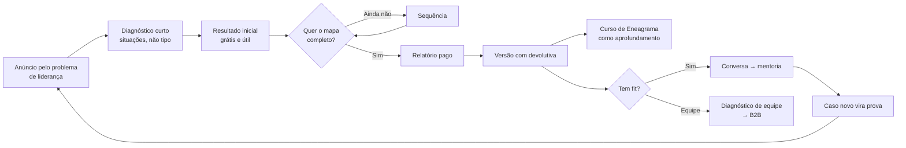
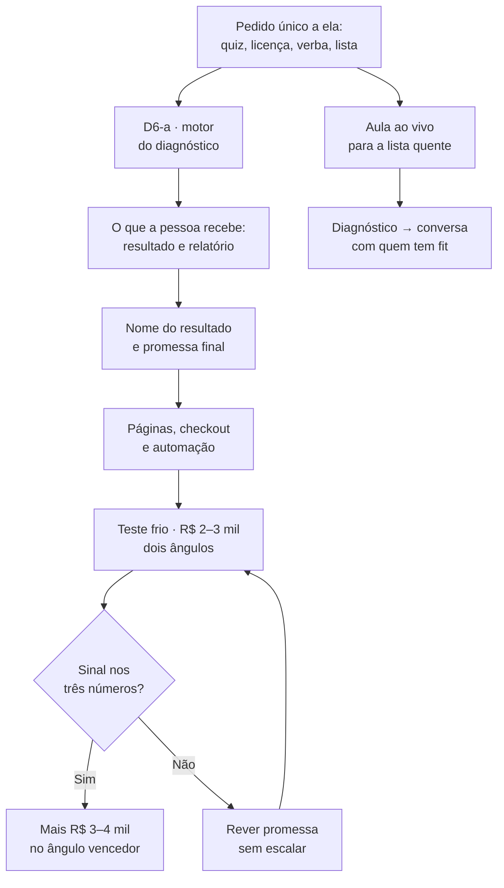

# CONSOLIDAÇÃO DA ESTRUTURA — o que a pesquisa decide, o que ela não decide e a ordem

> **Escrito:** 22/09/2026 · **Dono:** Victor · **Alçada:** `REGRA Nº 0` — estrutura é nossa; o que depende de fato vai para ela, uma vez.
> **Entrada:** `deep-research-report - Débora 22-09-2026.md` (12 referências, graus A/B) + verificação nossa na Biblioteca de Anúncios da Meta (§2).
> **Substitui:** a arquitetura de produto de `OFERTA-MAESTRIA-NATURAL-2026-09-18.md` (curso gravado + VSL como entrada). **Mantém** o que está marcado em §4.
>
> 🔴 **SUPERADO NO MESMO DIA por `ESTRUTURA-ESCALADA-2026-09-22.md`, sob a REGRA Nº 2 (`CLAUDE.md` §8).** Este documento se apoiou em **empresas grandes do setor** (Sólides, ETALENT, Predictive Index), **não em ofertas escaladas por anúncio**, e tratou o **espaço vazio como vantagem de estrutura** — as duas coisas que a regra proíbe. **O que sobrevive:** a entrada por diagnóstico (D1) — agora com a evidência certa, um quiz de Eneagrama com 2.099 anúncios no histórico —, a ficha promovida a produto, e a exigência de resolver o motor do quiz. **O que cai:** a promessa candidata como promessa de entrada, o anti-rótulo como diferencial de estrutura (ele continua valendo como limite de escrita), e a escala de preços, que agora espera a captura das ofertas escaladas.

---

## O QUE MUDA, EM UMA TELA

| Antes (18/09) | Agora |
|---|---|
| entrada = **curso de Eneagrama** vendido por **VSL** | entrada = **diagnóstico com resultado personalizado** |
| a ficha de talentos era **bônus** do curso | ⭐ **a ficha passa a ser o produto** — é o que o mercado paga |
| o curso era o produto principal | o curso vira **aprofundamento**, depois do resultado |
| order bump como peça fixa | **escada de profundidade** (grátis → relatório → relatório com devolutiva) |
| o front-end carregava a meta | ⭐ **o front-end adquire e qualifica; a margem vem da mentoria e do B2B** |

> ⭐ **E há uma coincidência que facilita a conversa com ela:** em 19/09 o Victor escreveu *"além do funil de VSL, estruturo também o funil de Quiz"*. **A pesquisa promove o quiz a porta principal.** Não é recuo, é o que já foi anunciado ganhando prioridade.

---

## 1. A PESQUISA, AUDITADA

### O que ela sustenta — e é sólido porque se repete

**Doze referências, sem relação entre si, chegam à mesma estrutura:**

1. **diagnóstico primeiro, ensino depois** — ETALENT, Sólides, Rock Ensina, Predictive Index, Truity, Gallup
2. **o que se paga é a interpretação personalizada, não mais conteúdo** — a Maper sobe de R$ 95 para R$ 497 acrescentando só devolutiva e plano
3. **no B2B, fala-se do problema e a ferramenta fica como explicação** — ninguém de escala vende "DISC" ou "Eneagrama" na frente
4. **curso gravado aparece depois, como aprofundamento**
5. **a expansão econômica é a equipe e a empresa**

⭐ **Um achado que é nosso a favor:** *"você não é um tipo fixo"*, levado a sério no produto, **é espaço pouco ocupado.** O limite dela contra o rótulo, que tratávamos como restrição, **é diferencial** — desde que apareça no produto (padrões, tensões, contextos), e não só no discurso.

### 🔴 O que ela NÃO sustenta, e é o mais importante para gastar dinheiro

| Afirmação | Situação |
|---|---|
| **R$ 197–497 se paga em tráfego frio** | ❌ **sem prova.** Nenhuma referência brasileira publicou mídia + custo por venda + receita |
| **quiz converte melhor que VSL** | ⚠️ padrão recorrente, **nenhuma comparação direta** |
| **"Eneagrama" no anúncio atrai quem não compra** | ❌ **não provado** — a Truity usa a palavra e opera em escala enorme |
| **aula ao vivo vende mentoria melhor que funil frio** | ⚠️ modelo em uso (Febracis), **sem comparação** |

### 🔴 Três correções nossas à pesquisa

1. **"Grau A" da ETALENT e da Sólides mede resultado do CLIENTE deles** (a Cacau Show, o tempo de recrutamento) — **não prova que o funil deles vende.** Pelo gate do `METODO-BENCHMARKING.md` (*prova de que vende*), **nenhuma referência é grau A para o nosso uso.** O que temos é **convergência estrutural de grau B** — suficiente para decidir estrutura, insuficiente para projetar número.
2. **Metade das referências é software com time de vendas** (Sólides, PI, Crystal, ETALENT). **O padrão transfere; a economia não.** As mais próximas de uma operação de uma pessoa são **Maper, Rock Ensina e Márcio Schultz** — são essas que se modelam.
3. **A pesquisa corrigiu uma sugestão nossa, e tem razão.** Em 22/09 dissemos que a aula ao vivo terminaria em convite para a consultoria. Ela aponta que isso **mantém a dependência de conversa longa** que a nova arquitetura existe para remover. **Correto: aula → diagnóstico curto → conversa só com quem tem fit.** Coincide com o que a Débora já faz (*"como se fosse um processo seletivo"*, `[16/09 09:23:23]`).

---

## 2. A VERIFICAÇÃO NA BIBLIOTECA DE ANÚNCIOS — feita aqui, 22/09

**O que a ferramenta permite:** anúncios ativos, com data de início. **Não mostra** data de fim, gasto nem alcance para anúncio comercial no Brasil. **A busca por palavra é imprecisa** — mistura resultados — e só é confiável com o ID da página.

| O que se procurou | O que se achou |
|---|---|
| anúncios ativos no Brasil com **"eneagrama"** | **205 ativos.** Mercado vivo e disputado |
| **Instituto Você Curitiba** (rede de Eneagrama) | ⭐ **um anúncio ativo desde ~21/07 — cerca de 63 dias no ar.** Os demais rodam de 1 a 25 dias. **Único sinal de "vencedor" encontrado** · `facebook.com/ads/library/?id=4556716097945090` |
| **Instituto Eneagrama Pato Branco** | ~40 anúncios desde ~12/08, trocados a cada poucos dias; vende turma presencial. **Testa muito, não mostra vencedor** |
| Rock Ensina, Maper, ETALENT, Márcio Schultz | ❌ **não localizados** — a busca por nome não isola a página. **Pendente:** abrir as páginas no navegador e pegar o ID |

### ⚠️ O que os títulos dos anúncios ativos revelam

> *"E se o comportamento que você odeia tiver uma lógica?"* · *"Nem todo problema de equipe começa na equipe."* · *"E se o problema não for a comunicação, mas a forma como cada um funciona?"* — Instituto Eneagrama Pato Branco, ativos agora

**O elo 3 do nosso mecanismo** (*"o comportamento que te incomoda quase nunca é o que parece"*) **já está no mercado, em anúncio.** Consequência: **o ângulo "comportamento tem lógica" não é único.** O que pode ser único é **o que a pessoa recebe** (o resultado nomeado) e o limite contra o rótulo. É por isso que o apelido (§3, D4) precisa nomear o **resultado**, não a ideia.

**Próximo passo desta verificação:** abrir o anúncio de 63 dias do Instituto Você e ver para onde ele leva. **Se leva para teste, é a confirmação local que falta.**

---

## 3. AS DECISÕES, NA ORDEM EM QUE UMA DEPENDE DA OUTRA

> **Legenda:** ✅ **decidido** (estrutura — nosso) · 🟡 **hipótese para o primeiro teste** · 🔴 **depende de fato que só ela tem**

### D1 · Produto de entrada — ✅ decidido

> **Um diagnóstico curto, com resultado personalizado, e um relatório pago como primeira venda.** Não o curso. Não um produto de autoconhecimento amplo. Não três ofertas ao mesmo tempo.

**Por quê:** é a estrutura que as doze referências compartilham; **usa o que ela já tem** (quiz, sistema, ficha); **não exige gravação nova** — que é o recurso mais escasso dela; e **resolve o problema dos contratipos**, porque a pessoa não precisa saber o próprio tipo: responde situações.

### D2 · Para quem — 🟡 a variável do primeiro teste

**ICP principal (em uma frase):**

> **Líder que já gerencia pessoas, sente que o time não rende o que poderia, e ainda atribui isso ao jeito das pessoas.**

**Ângulo concorrente, testado no mesmo diagnóstico:** profissional que quer **entender os próprios talentos** para decidir o próximo passo da carreira.

**Por que dois ângulos e um produto só:** a pesquisa não prova qual público compra mais, e verba curta não comporta dois produtos. **Um diagnóstico, duas portas de anúncio — e o dado decide.** O que muda entre as portas é a promessa do anúncio e a primeira tela; o diagnóstico é o mesmo.

⚠️ **Isto não é abrir mão do P1:** o ICP está escrito. **O teste existe para confirmar ou trocar**, com dinheiro limitado e decisão anotada antes.

### D3 · Promessa — 🟡 direção decidida, texto não

- **pelo problema, nunca pela ferramenta** no anúncio — *"Eneagrama"* aparece como explicação, depois do resultado
- ❌ **fora:** *"descubra seu tipo"*, *"conheça seus pontos fortes"*, *"forme times de alta performance"* — **saturado** (pesquisa, §7)
- ⭐ **dentro:** o que ela já disse e o mercado não cumpre — **ver o outro sem colocar numa caixa**
- **a promessa de 18/09 continua candidata para o ângulo principal:** *"parar de tentar consertar as pessoas do seu time — e começar a usar o que elas já fazem sem esforço"*

### D4 · Mecanismo e apelido — 🟡 conteúdo decidido, nome depois

- **os 5 elos continuam** — viram o **conteúdo do resultado e do relatório**, e depois da aula e de qualquer vídeo
- **o apelido nomeia o RESULTADO**, como os vencedores fazem (*36 Talentos*, *Teste das Cores*, *CliftonStrengths*). **Um nome, uma coisa que a pessoa recebe** — a complexidade das ferramentas fica nos bastidores
- 🔴 **não se nomeia agora.** `METODO-MECANISMO-E-ONE-BELIEF.md`: sem o que a pessoa recebe definido, não há o que ancorar. **O nome vem depois de D6-a**

### D5 · Oferta — 🟡 escada decidida, preços a testar

| Camada | Função | Faixa para teste | Modelo |
|---|---|---:|---|
| **resultado inicial** | adquirir | grátis | Truity, 16Personalities |
| **relatório personalizado** | primeira venda | R$ 97–197 | Rock, Maper |
| **relatório + devolutiva** | aumentar o valor | R$ 297–497 | Maper |
| **curso de Eneagrama** | aprofundar | complemento ou pacote | ETALENT, Márcio Schultz |
| **mentoria** | margem | a de hoje | — |
| **diagnóstico de equipe** | porta do B2B | proposta | ETALENT, Rock, PI |

🔴 **A regra que protege a margem, e ela quase escorrega de novo:** *"devolutiva"* não pode ser uma conversa dela com cada comprador. `METODO-DIRECT-RESPONSE.md` §4: **feito uma vez e entregue muitas é ativo; refeito por cliente é serviço com preço de produto.** A devolutiva do degrau R$ 297–497 é **gerada** (texto ou áudio montados a partir do resultado, como a Maper faz com IA) — **nunca uma hora da agenda dela.**

❌ **Order bump sai como peça obrigatória.** Não é dominante entre as referências. Pode entrar depois, se houver dado.

### D6 · Funil — ✅ decidido, com a peça que falta

- **frio:** anúncio pelo problema → diagnóstico → resultado → oferta do relatório. **Sem VSL na primeira versão.** Se houver vídeo, é curto e na página do resultado
- **lista quente:** aula ao vivo → **diagnóstico** → conversa só com quem tem fit (correção de §1)
- **B2B, pelo LinkedIn:** piloto de diagnóstico de equipe — ela já fez isso para a Kinology

### 🔴 D6-a · O motor do diagnóstico — A DECISÃO QUE A PESQUISA NÃO RESOLVE, E TUDO DEPENDE DELA

**Como o questionário chega ao resultado sem pedir que a pessoa se identifique?** Os ativos que existem:

| Ativo | O que se sabe | O que falta saber |
|---|---|---|
| **quiz da liderança** do site | a pessoa dá nota a histórias e chega ao tipo; o Cláudio fez uma versão reduzida (`[28/08 10:38:53]`) | **quantas perguntas, e quanto acerta com contratipo** |
| **teste do Urânio Paes** | ela usa na mentoria, com relatório automático | **licença para vender o resultado** (`C-20` de 16/09: não resolvido) |
| **Desenho Humano** | sai da data, hora e local de nascimento — **automatizável** | se ela aceita a leitura automática como parte do resultado |
| **sistema de conhecimento** | gera PDF de talentos por tipo | **senha global, sem acesso individual** (`C-24`) |

**Isto é, ao mesmo tempo, fato dela (o que o quiz faz, o que a licença permite) e trabalho técnico nosso (montar o motor).** **É a primeira coisa da fila** — e nenhuma página, anúncio ou nome deve ser feito antes.

---

## 4. O QUE SOBREVIVE DE 18/09, E O QUE NÃO

| Item | Situação |
|---|---|
| promessa *"parar de consertar… usar o que já fazem sem esforço"* | ✅ **candidata ao ângulo principal** |
| os 5 elos do mecanismo | ✅ **vira conteúdo do resultado e do relatório** |
| a ficha de talentos, done-for-you e **gerada** | ✅ ⭐ **promovida a produto de entrada** |
| o limite contra o rótulo | ✅ **promovido a diferencial** |
| curso a R$ 397 como produto de entrada | ❌ **vira aprofundamento** |
| VSL como peça principal | ❌ **fora da primeira versão** |
| bump de ficha e upsell *Maestria do Time* | ❌ **substituídos pela escada de profundidade** e pelo diagnóstico de equipe |
| a conta de 18/09 (R$ 31.760 · R$ 12.000 · R$ 48.000) | ❌ **sem base** — assumia vendas de curso por VSL |
| `Funil-Debora-19-09.pdf` e `-v2` | ⚠️ **mostram VSL na entrada.** Não circular mais. A próxima versão sai depois de D6-a |

---

## 5. O QUE ISSO FAZ COM A META DE +R$ 20 MIL

> **Da pesquisa, e a conta é simples:** a R$ 297 são cerca de **68 vendas** para R$ 20 mil brutos, antes de mídia e custos. **Quatro mentorias de R$ 5 mil fazem o mesmo.**

**O front-end não precisa gerar os R$ 20 mil. Precisa trazer, todo mês, pessoas qualificadas para a mentoria e para o B2B — sem depender de indicação e de conversa de 1h30 com quem não tem fit.** É a régua do `CLAUDE.md` §9: via de audiência e via de caixa são coisas diferentes, e **aqui as duas trabalham juntas, com funções diferentes.**

**Consequência:** a primeira métrica do teste frio **não é lucro no relatório.** São três: **custo por diagnóstico completo · quantos compram o relatório · quantos pedem conversa.**

---

## 6. O QUE NÃO SE FAZ AGORA

- ❌ VSL
- ❌ curso de Eneagrama como produto de entrada
- ❌ o produto 2 (Maestria Natural) em tráfego frio — ele fica com a aula para a lista quente
- ❌ testar dois ou três produtos ao mesmo tempo
- ❌ **data de lançamento** — sai da cadeia abaixo, não do desejo

---

## 7. A ORDEM, E ONDE ESTÁ A ESPERA

**A aula ao vivo não espera o motor**: é para a lista quente, e o diagnóstico da aula pode ser o quiz que já existe. **É o que anda primeiro.**

⭐ **O pedido único a ela** (`METODO-TRILHO-DE-CONTA-NOVA.md`) — **só fato, de uma vez, sem nenhuma pergunta de estrutura:**

1. o quiz do site: **quantas perguntas, como chega ao tipo, e se ela sabe quanto ele erra com contratipo**
2. o teste do Urânio Paes: **o que a licença permite** — vender o resultado, usar dentro de um produto pago
3. **verba de mídia** para o teste: quanto dá para separar, em reais
4. **a lista** para a aula: quantas pessoas, e em que canal ela fala com elas

🔴 **Não nesta semana, pelo luto.** Pode ir junto com a resposta sobre a aula, na próxima semana — curto e numerado.

---

## 8. PENDÊNCIAS E DONO

| # | O quê | Dono |
|---|---|---|
| 1 | abrir o anúncio de 63 dias do Instituto Você e ver o destino | Continuum |
| 2 | achar o ID das páginas de Rock Ensina, Maper e Márcio Schultz e verificar anúncios ativos | Continuum |
| 3 | 🔴 **pedido único** (§7) | Victor, semana que vem |
| 4 | 🔴 **D6-a · motor do diagnóstico**, depois do pedido | Continuum |
| 5 | contar a ela a mudança de arquitetura — **com o quiz que ele já anunciou como porta de entrada** — em formato de documento de ESTRUTURA, não de decisão | Continuum + Victor |
| 6 | autorização de imagem, voz e depoimento para a aula | Continuum (`CLO.skill.md`) |
