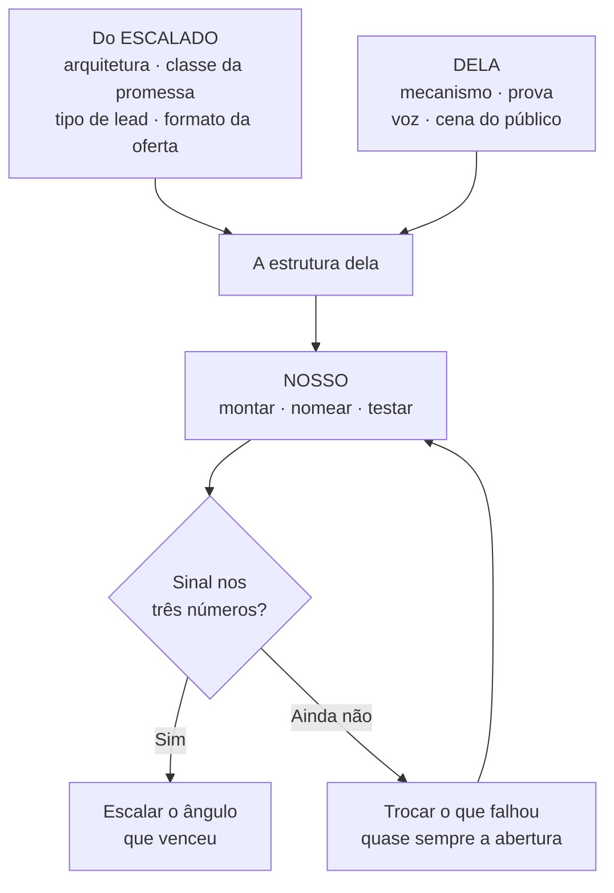

# ESTRUTURA DA DÉBORA — o que vem do escalado, o que vem dela, e como se constrói

> **Escrito:** 22/09/2026 · **Dono:** Victor · **Regra que governa:** `CLAUDE.md` §8 **REGRA Nº 2** · `METODO-DIRECT-RESPONSE.md` §2-bis
> **Evidência:** verificação na Biblioteca de Anúncios da Meta, feita aqui em 22/09 (§1) + `deep-research-report - Débora 22-09-2026.md`
> **Corrige:** `CONSOLIDACAO-ESTRUTURA-2026-09-22.md` — as referências de lá eram **empresas grandes do setor, não ofertas escaladas por anúncio**, e o "espaço vazio" foi tratado como vantagem de estrutura. **O que sobrevive dela está marcado aqui.**

---

## A RESPOSTA, EM UMA TELA

| Peça | O que já temos | Escalado? | O que falta |
|---|---|---|---|
| **Arquitetura** | quiz → resultado → oferta paga | ✅ **sim** — no mesmo nicho (internacional) e em nicho vizinho no Brasil | capturar o funil inteiro das duas referências |
| **Promessa** | classe: **"descubra o seu padrão — e o que ele muda em [contexto]"** | ✅ **a classe, sim** · o texto final, não | ver o que as referências prometem **depois** do teste |
| **ICP** | líder que gerencia pessoas (quem compra dela hoje) | 🟡 carreira escala no Brasil · ⭐ **liderança em escala desde 24/09** (§9.3) | testar os dois ângulos no mesmo quiz |
| **Mecanismo** | problema e solução, **nas palavras dela**, e um diferencial contra a categoria | — **não se modela: é o que diferencia** | a call com ela (§6) + o apelido |
| **Oferta** | ficha de talentos gerada · curso · sistema · mentoria | 🟡 **formato capturado em 24/09** (§9.4): entrada paga = relatório depois do teste · núcleo = formação ~R$ 397 | preço do premium do Qual Carreira (§9.5) |
| **Lead** | o anúncio convida para o teste | ✅ **tipo escalado** | ganchos com as demonstrações dela |
| **VSL** | — | ~~❌ nenhuma VSL escalada no nicho · não entra na primeira versão~~ ✅ **25/09: entra por LATERALIZAÇÃO** — VSLs escaladas de nichos adjacentes (fonte: Filemon) | **dois funis em teste:** `anúncio → quiz → VSL` e `anúncio → VSL` (`DECISOES.md` 25/09) |

> ## A promessa e a arquitetura se modelam do que já escala. O mecanismo, a prova e a voz são dela.

---

## 1. O BENCHMARK DE ESCALA — o que a Biblioteca de Anúncios mostrou

**Como se lê:** no Brasil a biblioteca mostra só anúncio **ativo** — longevidade é a idade do ativo mais antigo; volume é o número de ativos da mesma oferta. **Histórico total só aparece para quem também anuncia na Europa.**

| Referência | Nicho | Onde | Formato | Sinal medido | Estado |
|---|---|---|---|---|---|
| ⭐ **Closer to Yourself** | **Eneagrama** — mesmo nicho | internacional | **quiz** *"Take the Enneagram Test"* | 25 ativos, renovados todo dia · **2.099 anúncios no histórico** | ⭐ **ESCALADO** |
| **Qual Carreira** | temperamento + carreira — vizinho | **Brasil** | **quiz** *"Teste de Temperamento"* | 21 ativos · o mais antigo com ~30 dias · variações novas diárias | 🟡 **EM ESCALA** |
| **Lincoln Poubel e Bruna Abreu** | *"lidar com pessoas difíceis no trabalho"* — **a dor dela** | **Brasil** | destino não visto | 9 ativos · ~32 dias · **mesma promessa em variações** | 🟡 em escala, fraco |
| Instituto Você Curitiba | Eneagrama | Brasil | não visto | ~19 ativos · um com ~63 dias | vencedor local, um anúncio só |
| Instituto Eneagrama Pato Branco | Eneagrama + liderança | Brasil | turma presencial | ~15 ativos · ~41 dias · trocando a cada poucos dias | ❌ testando |
| Natural Advantage | talentos naturais | EUA | assessment | ~23 ativos · 5 dias | ❌ testando |
| Juliano Ramos · Lidera 90 | liderança | Brasil | conversa no WhatsApp | poucos ativos, recentes | ❌ testando |

### O veredito

1. ⭐ **A arquitetura "quiz → resultado → oferta" é a única escalada no nicho.** Confirmada no mesmo nicho (Closer to Yourself) e em escala no Brasil em nicho vizinho (Qual Carreira). **A decisão de entrar por diagnóstico passa na REGRA Nº 2** — agora com a evidência certa.
2. ❌ **Não encontramos nenhuma VSL de Eneagrama ou de liderança escalada no Brasil.** A oferta de 18/09 (curso por VSL) **não tinha e não tem base.** Fica fora.
3. 🟡 **A dor de liderança aparece em escala fraca** (*"lidar com pessoas difíceis no trabalho"*). **O contexto que escala no Brasil é carreira.** Isso decide como o ICP se testa (§3).
4. ⚠️ **O elo 3 do nosso mecanismo já está em anúncio** (*"E se o comportamento que você odeia tiver uma lógica?"*, Pato Branco). **Não é problema: mecanismo não se modela, se diferencia** — e o diferencial está em §5.

🔴 **O que ainda não sabemos, e decide a oferta:** **o que Closer to Yourself e Qual Carreira vendem depois do resultado, por quanto, e com que pilha.** O anúncio só mostra a porta. **Próximo passo nº 1** (§8).

---

## 2. COMO SE CONSTRÓI — as três camadas

| Camada | O que é | De onde vem |
|---|---|---|
| **1 · Do escalado** | a arquitetura do funil, a classe da promessa, o tipo de lead, o formato da oferta | Closer to Yourself, Qual Carreira — **estrutura, nunca texto** |
| **2 · Dela** | **o mecanismo** (problema e solução), a prova, a voz, a cena | as calls, os depoimentos, as demonstrações — **com procedência** |
| **3 · Nossa** | montar, nomear o mecanismo, testar e ler os números | `REGRA Nº 0` — a estrutura é nossa |

---

## 3. ICP

**Quem compra dela hoje** (grau `D`): líderes em mentoria individual, os 5 depoimentos de 15/09, e o piloto de 9 líderes da Kinology. **Quem compra no que escala:** Closer to Yourself vende autoconhecimento amplo; Qual Carreira vende decisão de carreira.

> **ICP principal — o dela, e a porta para o B2B:**
> **Líder que já gerencia pessoas, sente que o time não rende o que poderia, e ainda atribui isso ao jeito das pessoas.**
>
> **Ângulo desafiante — o que escala no Brasil:**
> **Profissional que quer entender os próprios talentos para decidir o próximo passo da carreira.**

**Um quiz só, duas portas de anúncio.** O teste é o mesmo; muda a promessa do anúncio e a primeira tela. **Quem ganhar decide o ICP da conta com dado, não com opinião.**

> ⚠️ **Sequenciado em 25/09:** com dois funis em teste, dois ângulos ao mesmo tempo dariam quatro células para R$ 2–3 mil de verba. **Onda 1 = ângulo A (liderança); ângulo B (carreira) = onda 2, com o curso Reconhecer a sua Maestria** (`LATERALIZACAO-VSL-2026-09-25.md` §5 · `DECISOES.md` 25/09).

⭐ **Uma coincidência que vale anotar:** o ângulo de carreira e talentos **é o território do produto 2 dela (Maestria Natural)**. Se ele vencer, o produto 2 ganha um lugar natural na escada. **Hipótese, não decisão.**

---

## 4. PROMESSA — a classe vem do escalado

**A classe que escala, nos dois casos:** *descubra o seu [padrão / perfil / temperamento] em poucos minutos — e o que isso muda em [um contexto concreto].* **Descoberta aplicada a uma decisão.**

> 🔴 ⭐ **Limite de 25/09 (Victor · princípio 8 da conta): no quiz, a descoberta é UM NORTE, não um veredito** — *"uma visão primária sobre a POSSÍVEL personalidade através da ótica do Eneagrama."* Mantém-se a classe (descoberta rápida); muda o grau de certeza. **Os rascunhos abaixo foram reescritos por isso** — as versões de 22/09 prometiam *"o padrão que define"*.

| Ângulo | Rascunho de promessa | Status |
|---|---|---|
| **A · liderança** | ~~*"Descubra em 10 minutos o padrão que define como você lidera…"*~~ → ~~*"…um primeiro norte sobre o seu possível padrão de liderança…"* (25/09)~~ → *"Em 10 minutos, um primeiro norte sobre como você está liderando, pela ótica do Eneagrama — e uma pista de por que algumas pessoas do seu time rendem e outras travam."* | 🟡 rascunho · 02/10 |
| **B · carreira** | ~~*"Descubra o talento que você usa sem perceber…"*~~ → ~~*"…o talento que você talvez use sem perceber…"* (25/09)~~ → *"Um primeiro norte sobre aquilo que você faz melhor sem esforço — e onde isso pode valer mais."* | 🟡 rascunho · 02/10 · onda 2 |

> **Correção de 02/10:** a versão de 25/09 trazia *"padrão"* na headline (léxico morto em headline, CTA e gancho desde 09/07) e *"talento"* (morto em copy desde 14/07) — `GOVERNANCA-REPO.md`. Substituídos pelas traduções do próprio léxico.

- **nem "tipo", nem "padrão" na headline** — o limite dela contra o rótulo continua valendo (`[16/09 10:27:35]`); *"padrão"* segue permitido em explicação, nunca em headline, CTA ou gancho
- 🔴 **a promessa de 18/09** (*"parar de tentar consertar as pessoas do seu time…"*) **não é de uma classe escalada.** Passa a ser **o que o resultado entrega** — a frase que aparece depois do teste, no relatório — ou um ângulo lateral de teste. **Não é a promessa de entrada.**
- ⚠️ **os rascunhos se ajustam depois de capturar** o que as duas referências prometem na página de resultado. **Antes disso, não se escreve anúncio.**

---

## 5. MECANISMO — problema e solução, e o diferencial está aqui

**Mecanismo não se modela: é o que torna a promessa modelada impossível de copiar.** E ela já tem um que as referências não têm.

### Mecanismo do problema — *por que o que ele já tentou não funcionou*

| # | O mecanismo | Nas palavras dela |
|---|---|---|
| **P1** | **ele lê o time pela própria lente** — presume que todo mundo quer o que ele quer, e por isso ajuda, cobra e corrige do jeito errado | `[16/09 10:25:21]` *"as pessoas pensam que todo mundo pensa como ela"* · `[10:26:06]` *"não é porque eu acho que o outro precisa — é porque eu não consigo lidar com a pessoa sofrendo"* |
| ⭐ **P2** | 🔴 **os testes perguntam como a pessoa SE COMPORTA — e comportamento engana.** Por isso tanta gente faz o teste e não se reconhece | `[16/09 10:49:26]` *"Eu faria toda a identificação com base no que a pessoa pensa"* · `[10:32:33]` seis dos nove líderes do piloto **contratipo** |

> ⭐⭐ **O P2 é o diferencial, e ele vira as duas referências escaladas contra elas mesmas.** Closer to Yourself e Qual Carreira **são testes de comportamento.** O mecanismo dela diz por que esse tipo de teste falha com tanta gente — e ela tem o número (6 de 9). **A promessa é a mesma classe delas; o mecanismo diz por que o resultado delas é outro.**

### Mecanismo da solução — *por que o dela funciona*

| # | O mecanismo | Nas palavras dela |
|---|---|---|
| **S1** | **o teste lê o que move a pessoa, não o que ela faz** | `[10:49:26]` (acima) |
| **S2** | **o comportamento que incomoda é proteção** — a personalidade é o que aquela criança criou para sobreviver | `[10:27:18]` *"é uma proteção"* · `[10:27:56]` *"eu mostro a criança daquela personalidade"* |
| **S3** | **o que parecia defeito é a forma do talento** — e quem vê isso para de consertar e começa a usar | `[10:28:54]` *"você começa a ver talento em todo mundo"* · `[10:31:38]` *"sem fazer esforço"* |

### One Belief — rascunho, destino da cadeia (não vai escrito na peça)

> *"Ler o que move cada pessoa — e não o que ela faz — é a chave para [liderar sem desgaste / usar o talento que você já tem], e só é possível através do [apelido]."*

**Apelido:** 🔴 **não agora.** Nomeia o **resultado** que a pessoa recebe (`METODO-MECANISMO-E-ONE-BELIEF.md`) — e o resultado depende do motor do quiz.

---

## 6. A CALL COM ELA — o que levar e o que não levar

**Faz sentido, e o foco está certo:** mecanismo não vem do mercado, vem dela. **Mas a call colhe FATO; a estrutura não é discutida com ela** (`REGRA Nº 0`). Lead, promessa e oferta **se levam decididos depois**, com a razão.

**Perguntas de fato — cada uma alimenta uma peça** *(8 desde 25/09)*:

| # | Pergunta | Alimenta |
|---|---|---|
| 1 | *"Quando um líder chega em você, o que ele já tentou para resolver o time — e por que não funcionou?"* | mecanismo do problema |
| 2 | *"Como você percebe que alguém fez um teste e se enxergou errado? Me conta um caso."* | **P2**, com prova |
| 3 | *"O que você pergunta, no lugar do comportamento, para chegar no padrão da pessoa?"* | **S1** e o motor do quiz |
| 4 | *"Me conta a última vez que um líder parou de tentar consertar alguém e começou a usar o que a pessoa já fazia. O que mudou?"* | S3 + demonstração |
| 5 | *"Qual a frase que você mais ouve de líder no primeiro encontro?"* | léxico do público (grau `R`) |
| 6 | *"Quem se descobriu no Eneagrama com você e mudou de carreira ou de função por causa disso?"* | ângulo B + prova |
| 7 | *"Na Kinology, qual líder teve o resultado mais visível depois da ficha?"* | prova de grau `D` + porta B2B |
| ⭐ 8 | *"Como funcionam as suas histórias do Eneagrama e o testezinho do site?"* *(25/09 — ela perguntou se o teste era "o das histórias")* | **motor do quiz** — reconhecer-se numa história já é um norte, não um veredito |

🔴 **O que não se leva à call:** as opções de promessa, os ângulos, o nome do mecanismo, a escada de preço. **Tudo isso é nosso, vai decidido.**
**Gravar a call** — a destilação é o que transforma as respostas em mecanismo com procedência.

---

## 7. OFERTA — o formato ainda não foi capturado

**O que ela tem para montar a oferta:**

| Ativo | Papel provável |
|---|---|
| ⭐ **ficha de talentos, gerada** | o que se compra depois do resultado — **done-for-you** |
| curso de Eneagrama (7h) | aprofundamento |
| sistema de conhecimento | aplicação |
| mentoria | margem |
| diagnóstico de equipe | porta do B2B |

🔴 **O que não se decide antes da captura:** o preço de entrada, a pilha, o bump e o upsell. **É exatamente o que a REGRA Nº 2 manda modelar** — e só as duas referências escaladas dizem como fazem.

---

## 8. A ORDEM

| # | O quê | Dono | Depende de |
|---|---|---|---|
| **1** | ⭐ **capturar o funil inteiro de Closer to Yourself e de Qual Carreira** — do anúncio ao checkout: perguntas, página de resultado, oferta, preço, upsell | Continuum | **acesso ao facebook.com e aos sites no navegador** |
| **2** | ver o destino dos anúncios de Lincoln Poubel e Bruna Abreu | Continuum | idem |
| **3** | **call com ela** — as perguntas de §6, gravada | Victor | a semana dela |
| **4** | pedido único: motor do quiz, licença do Urânio Paes, verba, lista | Victor | — |
| **5** | decidir promessa final e oferta — **modeladas** do item 1 | Continuum | 1 e 3 |
| **6** | apelido e One Belief | Continuum | 4 e 5 |
| **7** | construir o quiz, a página de resultado e a oferta | Continuum | 4, 5 e 6 |
| **8** | teste com os dois ângulos | Continuum | 7 + verba |

**A aula ao vivo para a lista dela continua em paralelo** — é público quente e produto dela, e não depende de nada acima.

> ⭐ **Estado em 25/09:** a VSL entrou por lateralização e a oferta foi decidida — **`LATERALIZACAO-VSL-2026-09-25.md` passa a ser o documento vigente de oferta e VSL.** Este continua vigente para quiz, ICP e mecanismo. O R$ 397 de §9.4 foi revisto para **R$ 297**.
>
> **Estado em 24/09:** itens 1 e 2 **executados em parte** — ver §9. O que falta do item 1 está em §9.5 e é **dez minutos no celular do Victor**.

---

## 9. CAPTURA DOS FUNIS — 24/09/2026

> **Como foi feita:** texto e link de destino dos anúncios ativos pelo scraper oficial da Apify sobre a Biblioteca de Anúncios (page IDs `828806866978882`, `862674750253993`, `113054491703626`); páginas de destino renderizadas; preço de app na App Store. **Não foi possível responder os quizzes** — o navegador com JavaScript não estava disponível. **O que ficou dentro do quiz está declarado em §9.5 como não visto.**

### 9.1 · Closer to Yourself — ⚠️ é um APP de assinatura, não um especialista

| Etapa | O que é | Fonte |
|---|---|---|
| Anúncio | vídeo · *"Think you know yourself? Most people don't. Discover your personality type in 2 minutes"* · CTA *Take the Enneagram Test* · **os 8 ativos vistos têm o MESMO texto**, criados em 23/09 — **renova o vídeo todo dia, não a copy** | Apify |
| Destino | `quiz.reself.com/f/enneagram-v1/start` — **quiz web que entrega para um app** | Apify |
| Produto | **ReSelf** (PLAYADA SOFTWARE LIMITED): teste de Eneagrama + cursos por tipo + coach de IA + rituais diários | App Store |
| Preço | **assinatura: US$ 17,49/semana · US$ 38,95/mês · US$ 94,90/trimestre** | App Store |

🔴 **A leitura que muda o documento:** a única referência ESCALADA do nicho é um **negócio de software** (quiz web → paywall → app de assinatura). **Pela REGRA Nº 2 ela valida três coisas e não valida a quarta:**

| Peça | Modela daqui? |
|---|---|
| **Arquitetura** — quiz curto como porta | ✅ **sim** |
| **Lead** — *"você acha que se conhece; a maioria não"* | ✅ **sim — e é a classe exata do P2 dela** (§5). Ocupada lá fora, **livre no Brasil** |
| **Promessa** — descoberta rápida (*"2 minutos"*) | ✅ a classe, sim |
| **Formato da oferta** — assinatura de app | ❌ **não.** Exige produto de software e verba de aplicativo. **O formato da oferta dela tem que vir de referência brasileira** (9.2 e 9.3) |

### 9.2 · Qual Carreira — quiz grátis → relatório com premium

| Etapa | O que é |
|---|---|
| Anúncio | **imagem** · *"Já parou para pensar que o seu temperamento pode definir muita coisa sobre você? A forma como pensa, age e até mesmo como os outros te enxergam"* · 8 ativos vistos, **o mais antigo de 20/08** (~35 dias) |
| Destino | `qualcarreira.com/temperamento` — *"Descubra seu temperamento natural em 7 minutos"* · 67 questões (Eysenck) · **3 passos: questões → contexto pessoal → resultado** |
| O que o resultado promete | tipo · mapa de 6 dimensões · narrativa personalizada · estratégias por dimensão · acesso vitalício |
| Premium | **existe** — depoimento na própria página: *"o premium vale muito pela análise de liderança"* · **preço não visto** |
| Portfólio | já roda um **segundo quiz** (QI) desde ~12/09 e tem vocacional e DISC no site. **A máquina é o quiz; o tema se troca** |

**Padrão da categoria, confirmado fora dela:** teste grátis → **relatório completo pago** (Truity cobra o relatório depois do teste; Enneagram Institute vende o teste a US$ 20).

### 9.3 · Lincoln Poubel e Bruna Abreu — ⭐ a referência mais próxima do ICP dela

| Etapa | O que é |
|---|---|
| Anúncio 1 | vídeo · *"Domine a arte de lidar com pessoas difíceis no trabalho"* → **livro físico** *Gestão de Perfis Problemáticos e Manipulações no Trabalho* · frete grátis · 3x · **ativos desde 20 e 25/08, ainda rodando** |
| Anúncio 2 | vídeo · *"Aprenda a lidar com pessoas difíceis no trabalho"* → **Formação** · **ativo desde 22/09** |
| Formação | **R$ 397 à vista ou 12x R$ 41,06** (*"de R$ 526,90"*, oferta de lançamento) · 6 módulos gravados · scripts de intervenção · **livro físico incluso** · garantia de 7 dias · certificado · 60h |
| Mecanismo deles | **"Método GPS"** · diagnosticar → gerenciar → modificar · **20 perfis problemáticos e 30 manipulações** |

**Estado pela régua:** o **livro** passa de *"em escala, fraco"* para 🟡 **EM ESCALA** (~35 dias contínuos, várias variações da mesma promessa). A **formação** está ❌ **testando** (2 dias). **Não é escalado — mas é a única oferta brasileira em escala na dor exata do ICP A.**

⭐⭐ **E o mecanismo deles é o contrário do dela.** Eles ensinam a **rotular o outro** (*"perfil problemático"*, *"manipulação"*) e corrigir. Ela diz que **o comportamento que incomoda é proteção e o que parece defeito é a forma do talento** (S2, S3). **Mesma dor, mesmo público, mecanismo oposto** — é a diferenciação que a REGRA Nº 2 pede, e ela vem pronta.

### 9.4 · O que isso decide

1. ✅ **Arquitetura confirmada:** quiz → resultado → oferta paga.
2. ✅ **ICP A (liderança) sobe de peso.** A dor *"lidar com pessoas difíceis no trabalho"* está em escala no Brasil há ~35 dias. **Continua o teste com dois ângulos** (§3), mas o A deixa de ser o azarão.
3. ✅ **Lead de entrada:** a classe *"você acha que se conhece — a maioria não"*, que é o P2 dela. **Ocupada lá fora, ninguém usa aqui.**
4. 🟡 **Formato da oferta — duas referências brasileiras, e elas se encaixam na escada dela:**

| Degrau | Modelado de | Nela |
|---|---|---|
| porta | quiz grátis (Qual Carreira, ReSelf) | o teste |
| **entrada paga** | **relatório/premium depois do teste** (Qual Carreira + padrão da categoria) | ⭐ **a ficha de talentos gerada** |
| núcleo | **formação gravada ~R$ 397 em 12x** (Lincoln/Bruna) | o curso dela |
| margem | — | mentoria · diagnóstico de equipe (B2B) |

🔴 **O preço da ficha não se decide ainda:** falta ver o premium do Qual Carreira por dentro (§9.5). **O núcleo tem âncora de mercado: R$ 397.**

### 9.5 · O que ainda NÃO foi visto — e como fechar

| Falta | Por quê importa | Como |
|---|---|---|
| preço e conteúdo do **premium do Qual Carreira** | é o preço da entrada paga (a ficha) | **Victor responde o quiz no celular** (~7 min) e tira print do resultado e da tela de pagamento |
| **número de perguntas e paywall do ReSelf** | tamanho do quiz e momento de pedir e-mail | idem (~3 min), em `quiz.reself.com/f/enneagram-v1/start` |
| preço do livro de Lincoln/Bruna | a página devolveu erro | opcional |

**Onde salvar os prints:** `12 - Direct Response/benchmark-quiz/`. **Com eles, o item 5 da §8 (promessa final e oferta) fecha na mesma sessão.**

**Nada nesta seção é texto para copiar.** Registra-se padrão: formato, sequência, preço, estado.
