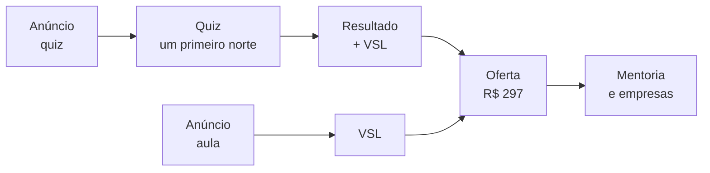

# LATERALIZAÇÃO DAS VSLs ESCALADAS PARA A DÉBORA — e o encaixe do que ela está gravando

> **Escrito:** 25/09/2026 · **Dono:** Victor · **Alçada:** nossa (`REGRA Nº 0`) · **Regra que governa:** `REGRA Nº 2` (escala) e princípio 7 da conta (*não se interrompe o fluxo dela — direciona-se*)
> **Insumo:** `900-criação-implementação-victor/VSL/DESTILACAO-VSLS-FILEMON-2026-09-25.md` (R1–R4, modo rápido) + `ESTRUTURA-ESCALADA-2026-09-22.md` §9 (quiz, 24/09)
> **Decisões de 25/09:** dois funis em teste — `anúncio → quiz → VSL` e `anúncio → VSL` (`DECISOES.md`)
> **Vira documento para ela:** `entregas-cliente/Encaixe-Debora-25-09.pdf` (classe ESTRUTURA)

---

## A RESPOSTA, EM UMA TELA

| Peça | Decidido | Modelado de |
|---|---|---|
| **Formato da VSL** | **uma aula de ~20 min** que ensina algo real antes de vender | R1, R2, R3 — as três de curso se apresentam como aula |
| **Roupagem** | ⭐ **conversa** — ela responde, alguém pergunta | R4b (a mesma oferta escalada, trocada de monólogo para entrevista) + o que ela disse sobre gravar sozinha |
| **Sequência** | lead → **mecanismo do problema** → história e construção → mecanismo da solução **com demonstração** → oferta | R1 (base) com a ordem de R3 e a demonstração de R2 |
| **Oferta** | **o curso de Eneagrama dela + o módulo de aplicação que ela já quer gravar + encontro ao vivo** · **R$ 297 ou 12×** · garantia de 7 dias | R3 (R$ 297) · R1 (R$ 189 + evento ao vivo) · o checkout que já existe (R$ 297) |
| **Promessa** | classe *resultado + tempo mínimo + sem o pré-requisito que falta* | R1–R4, as quatro |
| **Mecanismo** | P2: *os testes perguntam como a pessoa se comporta — e comportamento engana* | **dela** — não se modela |
| **Os dois funis** | a **mesma VSL** nos dois; muda só o primeiro minuto | decisão Victor, 25/09 |
| **O curso novo** (Reconhecer a sua Maestria) | ⭐ **produto da segunda onda**, com porta própria (ângulo carreira) | ESTRUTURA-ESCALADA §3 — o ângulo B |

> ## O que ela já tem é o produto. O que falta é o encaixe — e o módulo que ela quer acrescentar é exatamente a peça que o mercado compra.

---

## 1. O PROSPECT DELA — estado de consciência e estilo de vida

É a lateralização que Victor pediu: **não se escolhe a referência pelo tema, e sim pelo estado de quem compra.**

| Dimensão | Leitura | Grau |
|---|---|---|
| **Quem é** | líder que já gerencia pessoas; o time não rende o que poderia; ele atribui isso ao jeito das pessoas | ICP de 22/09 — decisão nossa sobre fato `D` (mentorias, Kinology) |
| **O que já tentou** | ⭐ **testes de perfil** (DISC, Eneagrama de internet), feedback, treinamento | `D` — seis dos nove líderes do piloto **contratipo** `[16/09 10:32:33]` |

> 🔴 **GRAU RETIRADO EM 03/10 (A3, ciclo 2 da VSL).** O `D` declarado nesta linha se apoia em `[16/09 10:32:33]`, e **o turno original não contém nada disto**: ele trata de contratipo e da dificuldade de autoidentificação. Não há teste de perfil, feedback nem treinamento como tentativa do líder em fonte nenhuma desta conta. **A linha passa a valer como HIPÓTESE nossa, grau `I`, e não pode fundamentar peça.** Era a segunda fonte de legitimação aparente do mesmo item inexistente — a outra era o `BRIEFING-VSL.md` §2, corrigido na mesma tarefa.
| **Consciência** | **sabe que tem o problema, já ouviu as soluções comuns, e algumas falharam com ele** | degrau 2 — igual a R1 e R3 |
| **Estilo de vida** | agenda cheia, reunião, cobrança por resultado do time; desgaste que leva para casa | `I` — **a confirmar na call** (pergunta 5) |
| **Registro** | racional na superfície, emocional por baixo — *"será que o problema sou eu?"* | `I` |

### ⭐ Por isso a base é R1, com a ordem de R3

- **R1** (vendas) é o público mais parecido: **profissional, sofisticado, ouve "te ensinaram errado" e reconhece** — e tem ansiedade por baixo da decisão de trabalho. **Lead curta (~13%), mecanismo longo, oferta ~35%.**
- **R3** (bolos) é o público **queimado**: já tentou e falhou. A peça **explica a falha antes de se apresentar** — *"a receita estava errada desde o início"*. **É o P2 dela, com outra roupa:** *o teste estava errado desde o início, porque perguntava como você se comporta.*
- **R2** (gestação) mostra o que fazer com a prova: **demonstrar ao vivo** (24% da peça). A demonstração dela é **ler uma pessoa real** — o *"você começa a ver talento em todo mundo"* acontecendo na tela.
- **R4b** não é base de nada — é **roupagem**. A mesma oferta escalou de novo trocando monólogo por entrevista. **E ela disse:** *"no Enneagrama, o Danilo gravou comigo"* e gravar sozinha *"não está me dando energia"* `[22/09 11.51.29]`.

🔴 **O tom de R4 não entra, em nada.** Promessa sexualizada e estatística não verificada são o oposto da voz dela e da régua de procedência.

---

## 2. A VSL DELA — estrutura modelada

> 🔴 **SUBSTITUÍDA em 30/09 por `ESTRUTURA-VSL-2026-09-30.md`.** Esta seção montava a sequência misturando R1, R3 e R2 — o `METODO-DESTILACAO-DE-VSL.md` §4.10 proíbe. A nova usa **R1 inteira** (destilada elemento a elemento) e traz o que vinha das outras só como tipo de elemento numa posição de R1 (demonstração) e como roupagem (conversa). Mantida abaixo como registro.

**Alvo:** ~20 minutos, **~3.400–3.700 palavras** *(o ritmo dela ainda não foi medido — as referências vão de 166 a 187 palavras por minuto)*.

| # | Bloco | Dose | Minutos | O que faz | De onde |
|---:|---|---:|---|---|---|
| 1 | **Lead** | 10–13% | 0–2:30 | promessa · *"nos próximos minutos você vai entender por que o teste que você fez não te explicou"* · *"você não precisa decorar tipo nenhum"* · uma prova rápida | R1 |
| 2 | ⭐ **Mecanismo do problema** | ~15% | 2:30–5:30 | **tira a culpa do líder e põe no método:** P1 (lê o time pela própria lente) + **P2 (comportamento engana)** | **R3** — antes da história, porque o público já tentou |
| 3 | **História + construção** | ~12% | 5:30–8:00 | por que ouvi-la: engenharia + estudo de comportamento; **o que ela descobriu aplicando** (os contratipos) | R1 · R2 |
| 4 | **Mecanismo da solução + demonstração** | 25–30% | 8:00–14:00 | S1 (ler o que move, não o que faz) · S2 (o comportamento que incomoda é proteção) · S3 (o defeito é a forma do talento) · ⭐ **ela lê uma pessoa real na tela** · casos com número | R1 (passos) · **R2 (demonstração)** |
| 5 | **Oferta** | ~35% | 14:00–20:00 | o curso + o método de aplicação · encontro ao vivo · âncora na mentoria dela · preço · garantia · dois caminhos | R1 · R3 |

**Roupagem:** ⭐ **conversa gravada** — Victor (ou outra pessoa) pergunta, ela responde. **A autoridade chega dita por quem pergunta; ela só precisa fazer o que já faz nas calls, que é explicar.** Grava-se 40–60 minutos de conversa e edita-se para 20.

🔴 **Antes do roteiro:** destilação **completa** de R1 — marcação elemento a elemento e cadeia lógica (`METODO-DESTILACAO-DE-VSL.md`). O modo rápido dá a forma; o roteiro precisa da sequência exata de elementos.

---

## 3. OS DOIS FUNIS — a mesma VSL, primeiro minuto diferente

| | Funil A · quiz → VSL | Funil B · VSL direto |
|---|---|---|
| Anúncio | convida para o teste | convida para a aula |
| Primeiro minuto da VSL | parte do **norte** que o teste deu: *"o teste te deu um primeiro norte — agora a pergunta é o que ele não consegue mostrar sozinho"* *(corrigido 25/09: a versão anterior tratava o resultado como veredito)* | a lead de R1 inteira |
| Do minuto 2 em diante | **idêntico** | **idêntico** |
| O que o teste mede | custo por aluno e **se o quiz aquece o suficiente para justificar a etapa a mais** | idem |

**Por que a mesma VSL:** se as duas peças diferirem, o teste mede a peça e não o funil. **E ela grava uma vez.**

---

## 4. PROMESSA, MECANISMO E OFERTA — o que já está decidido e o que depende da call

### Promessa — classe escalada, texto em rascunho

> 🔴 ⭐ **Duas promessas, dois graus de certeza (25/09 · princípio 8 da conta).** **Quiz:** *um primeiro norte sobre o possível padrão, pela ótica do Eneagrama* — **nunca** o tipo. **VSL e curso:** o resultado que o método entrega — ler o que move cada pessoa. ⭐ **A diferença é o argumento:** o teste dá o norte; **a leitura do que move a pessoa, que é o método dela, dá a resposta.** É o P2 inteiro, e agora a própria arquitetura do funil o demonstra.

**Classe (R1–R4):** *[resultado concreto] + [tempo ou esforço mínimo] + [sem o pré-requisito que a pessoa acha que não tem].*

> 🟡 **Rascunho:** *"Entenda o que move cada pessoa do seu time — e por que algumas rendem e outras travam — mesmo que você já tenha feito todos os testes de perfil."*

- o terceiro termo aqui é o P2: **"mesmo que já tenha feito os testes"** é o *"sem ser bom em vendas"* de R1
- **falta o tempo concreto**, e ele não se inventa: sai do módulo de aplicação quando existir (*"em X aulas"*, *"em Y semanas"*)
- limites dela valendo: **padrão, não tipo** · ler os outros, não descobrir a si · nada de rótulo

### Mecanismo — dela, e a call existe para isso

P1, **P2**, S1–S3 como em `ESTRUTURA-ESCALADA-2026-09-22.md` §5. ⭐ **O P2 ganhou um elo em 25/09:** *os testes leem comportamento → comportamento engana → por isso um teste dá, no máximo, um norte → a resposta vem de ler o que move a pessoa.* **O nosso quiz fica do lado honesto do próprio mecanismo.** Candidato a motor: **as histórias do Eneagrama dela** (pergunta 8 da call). **O apelido continua em aberto** — todas as quatro referências nomeiam o mecanismo, e o nosso nasce depois da call (as perguntas de §6 daquele documento continuam valendo).

### Oferta — decidida

| Item | O que é | Por quê |
|---|---|---|
| **Núcleo** | o curso de Eneagrama dela (pronto: ~7h, 100+ aulas, 27 subtipos) | já existe e já tem checkout a R$ 297 |
| ⭐ **O método** | **o módulo de aplicação que ela quer acrescentar** — *"algo mais pra pessoa aplicar mesmo e saber identificar melhor"* (Victor resumindo o que ela disse na call, `[22/09 14.17.43 · 01:11]`) | **é o que a VSL vende.** R1 vende 4 passos; o curso dela hoje ensina os tipos, e o mercado compra o **como aplicar** |
| Bônus ao vivo | um encontro ao vivo para quem entra | R1 e R3 fazem isso; ela já quer fazer aula ao vivo |
| Bônus DFY | a ficha de padrão gerada pelo quiz | só no funil A, **se o motor do quiz permitir** |
| **Preço** | **R$ 297 à vista ou 12×** | R3 escalado · R1 abaixo · **o checkout atual** · 🔴 **revisa o R$ 397 de 24/09**, que vinha de referência só *em escala* |
| Âncora | a mentoria dela | três de quatro referências ancoram no serviço caro do próprio expert |
| Garantia | 7 dias | R2, R3, R4 |

---

## 5. ⭐ O ENCAIXE — o que ela está fazendo, e onde cada coisa entra

**Princípio 7 da conta: ela não para.** O trabalho é mostrar onde o que ela produz se encaixa, para ela produzir já na direção certa.

| O que ela está fazendo | Onde entra | A direção que muda |
|---|---|---|
| **o curso de Eneagrama** (pronto) | ⭐ **núcleo da oferta da onda 1** | nada a regravar |
| **o módulo que ela quer acrescentar** ao curso | ⭐ **o método que a VSL vende** | que ele seja **a aplicação**: poucos passos, aulas de 5–10 min, cada uma termina com algo feito — **a regra que ela mesma escreveu** no módulo novo |
| **o curso novo** — *Reconhecer a sua Maestria* (17 aulas, gravação iniciada) | ⭐ **produto da onda 2**, com porta própria: o ângulo de **carreira e talento** | segue gravando. **As aulas 02, 03 e 15 são o coração** — é o que os depoimentos de 15/09 descrevem sem combinar |
| **a aula ao vivo** para a lista dela | **bônus ao vivo** da oferta · fonte de **demonstração** e **depoimento** para a VSL | autorização de imagem, voz e depoimento **antes** do convite |
| **gravar sozinha drena** | **a VSL é uma conversa**, não um monólogo | ela responde; não conduz |

### Por que o curso novo vai para a onda 2, e não fica parado

- a **onda 1** testa **dois funis**; testar também dois ângulos dobra as combinações, e a verba de partida (R$ 2–3 mil) não sustenta quatro células
- o ângulo de **liderança** tem o produto pronto (curso de Eneagrama) e referência brasileira **em escala** na mesma dor (24/09)
- o ângulo de **carreira** é o território do curso novo — **quando ele estiver gravado, ele tem porta, promessa e anúncio próprios.** Ela grava agora para um lugar que já existe.

---

## 6. O QUE É NOSSO E O QUE É DELA

| Nosso | Dela |
|---|---|
| roteiro da VSL (depois da destilação completa de R1 e da call) | a **call** das perguntas — gravada |
| o quiz, a página, o checkout, os anúncios | **o módulo de aplicação** — o que ela já quer gravar |
| conduzir a conversa da VSL | **responder** na conversa da VSL |
| o nome do mecanismo | seguir gravando o curso novo, no ritmo dela |
| a leitura dos números | a aula ao vivo |

⚠️ **Tempo dela:** a ordem de grandeza é **uma call, um módulo curto e uma conversa gravada** — antes da mídia. **Número em horas não se escreve** até existir registro (`METODO-ESTIMATIVA-DE-CARGA.md`).

---

## 7. O QUE AINDA NÃO SE DECIDE

- **o texto final da promessa** — falta o tempo concreto, que sai do módulo
- **o apelido** — sai da call
- **a ficha como bônus** — depende do motor do quiz (pedido único)
- **a verba** — não nesta semana (luto)
- 🟡 os prints do premium do Qual Carreira (24/09) **deixaram de bloquear** a oferta: o preço agora é modelado das VSLs de curso. **Continuam úteis** para decidir se a ficha vira produto pago no funil A.

---

## GATE DE CONGRUÊNCIA — declaração de carga e vetos (`METODO-GATE-DE-CONGRUENCIA.md`)

**Carregado:** `REGRA Nº 0` · `REGRA Nº 2` · `METODO-DIRECT-RESPONSE` (§2-bis, §4 DFY) · `METODO-DESTILACAO-DE-VSL` · `METODO-BENCHMARKING` · `METODO-FUNIL-DE-VSL` · `METODO-TESTE-DE-PILARES` · `METODO-CAMADA-DE-VER` · `METODO-ESTIMATIVA-DE-CARGA` · princípio 7 da conta.

| Veto | Estado |
|---|---|
| **REGRA Nº 0** — estrutura devolvida ao cliente | ✅ passa. O PDF propõe fechado; a única coisa pedida a ela é fato (a conversa, o módulo que ela já queria) |
| **REGRA Nº 2** — referência sem estado e fonte | ✅ passa. As quatro com estado e fonte (Filemon); o quiz com a biblioteca (24/09) |
| **Procedência** — cena ou fala sem fonte | ✅ passa. `[16/09 10:49:26]` · contratipos `[16/09 10:32:33]` · depoimentos de 15/09. Estilo de vida do prospect marcado `I` e levado à call |
| **Classe do documento** | ✅ ESTRUTURA sem economia no eixo; o preço aparece sem número (*"o preço que o curso já tem"*) |
| **Estimativa** — hora nossa ou dela em documento que sai | ✅ passa. Só a duração da gravação |
| **Conduta da conta** — nome de terceiro, "Maestria Natural", "curso gravado", prazo | ✅ conferido por busca no PDF: zero ocorrências |
| 🔴 **Princípio 8 da conta** — promessa acima do que o instrumento entrega (*"descubra o seu tipo"*, *"você é tipo X"*) | ✅ corrigido em 25/09 neste documento e em `ESTRUTURA-ESCALADA` §4. ⚠️ **O PDF enviado diz *"o padrão da pessoa, em minutos"* na caixa do teste** — fica como registro; a próxima versão diz *"um primeiro norte"* |
| 🔴 **Pilares — P4 reprova** (*"ninguém sabe qual é a lista verdadeira do que está incluído"*, `PILARES.md`) | ⚠️ **não bloqueia este documento** (não é copy), **bloqueia o roteiro.** A lista da oferta desta página — curso + módulo de aplicação + encontro ao vivo (+ ficha no funil A) — **tem de ser a mesma em todo lugar antes da primeira linha do roteiro** |
| **Funil de VSL — capital para 2–3 tentativas** | ⚠️ **aberto**: verba ainda não definida (luto). Bloqueia a mídia, não a construção |

**P3 · contradições resolvidas, não silenciadas:** R$ 397 (24/09) → R$ 297, registrado nos dois documentos · dois ângulos na onda 1 (24/09) → sequenciados, registrado nos dois documentos.
