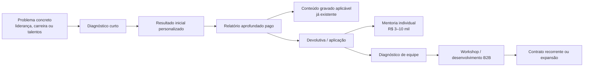
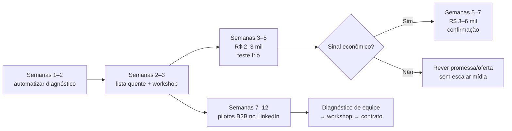

# Pesquisa de mercado: funis, ofertas e diagnósticos de personalidade, talentos e liderança

## Resumo executivo

**Conclusão principal:** a evidência encontrada favorece **diagnóstico/assessment como porta de entrada**, e não um curso longo de Eneagrama, sobretudo quando o objetivo final é vender desenvolvimento de liderança ou B2B. ETALENT, Sólides, Rock Ensina e Predictive Index seguem esse desenho. citeturn19view2turn19view4turn17view1turn21view8  
**Para tráfego frio B2C**, o padrão mais robusto é teste/quiz → resultado personalizado → relatório/produto pago; Truity, 16Personalities, Gallup e Rock mostram variações dessa arquitetura em escala. citeturn21view0turn21view10turn22search0turn11search0  
**Isso não prova H1 em sentido causal:** não encontrei teste controlado, no mesmo nicho e público, comparando quiz com VSL. Cases recentes de plataformas de quiz, porém, mostram geração de receita e high ticket a partir de diagnósticos. citeturn23search0turn23search1turn23search7  
**Não há evidência suficiente para afirmar H3:** encontrei ofertas brasileiras exatamente em R$197–497, mas não ROAS público comprovando que esse ticket se paga em tráfego frio. citeturn11search1turn11search7  
**No B2B, H6 é a hipótese mais forte:** players maduros entram por perfil, assessment, diagnóstico, teste de equipe ou demonstração; o curso aparece depois, como desenvolvimento. citeturn17view0turn17view1turn17view2turn3search7  
**Para esta mentora, eu não colocaria o Eneagrama como produto de aquisição principal.** Ele é mais defensável como camada explicativa dentro de um mapa de talentos/padrões e como aprofundamento pago.  
**Também não faria o comprador “descobrir sozinho seu tipo”.** O problema observado no piloto — 6 de 9 líderes sem autoidentificação — encontra paralelo em ofertas que incluem interpretação, relatório ou devolutiva profissional. fileciteturn0file0 citeturn19view8turn11search1  
**Primeiro teste recomendado:** lista quente → aula/workshop único → diagnóstico/aplicação → mentoria; não porque H4 tenha sido causalmente provada, mas porque é a opção com menor dependência de mídia e reaproveita ativos já existentes.  
**Primeiro teste frio recomendado:** diagnóstico curto orientado a situações de liderança/talentos → resultado inicial útil → relatório aprofundado pago → curso ou devolutiva como ascensão.  
**Para buscar +R$20 mil/mês de lucro, o low ticket deveria ser tratado prioritariamente como mecanismo de aquisição/qualificação; high ticket e B2B têm de carregar a maior parte da margem.**  
**Com R$3–9 mil, eu faria no máximo um conceito de funil frio e uma iteração séria — não quatro ofertas simultaneamente.**

A pesquisa abaixo segue o briefing anexado, inclusive os critérios A/B/C, a exigência de separar fato de leitura e a proibição de inferir números inexistentes. fileciteturn0file0 **Data de acesso das fontes: 22 de setembro de 2026**, salvo quando indicada a data original de publicação.

## Fichas das referências

**Rock Ensina — Brasil — Grau B**

**Página/oferta:** Teste das Cores Individual e ecossistema Rock Ensina. Página principal: `https://www.rockensina.com.br/`; landing pública do individual: `https://www.rockensina.com.br/voce/teste-das-cores-individual/`. O site informa 25 mil+ pessoas impactadas, 22 mil+ laudos, 200+ empresas e 98% de aprovação; a página individual encontrada oferecia o teste por R$37, contra referência de R$79,90. citeturn17view1turn11search0

**Página Meta:** o próprio ecossistema aponta para `facebook.com/rockensina/`; a página pode ser identificada como **Rock Ensina**. Não usei a Biblioteca de Anúncios e, portanto, **não confirmei que esta página está anunciando agora nem qual anúncio específico leva a qual URL**. citeturn10view0

**Entrada e quiz:** o B2C entra por um **teste comportamental pago**; no B2B há “análise gratuita”, com promessa de resultado em poucos minutos, e depois diagnóstico, aplicação e desenvolvimento. O número exato de perguntas, posição do e-mail e sequência integral de checkout não ficaram verificáveis nas páginas indexadas. citeturn17view1turn11search4

**Público:** individualmente, profissionais que querem se conhecer e evoluir na carreira; corporativamente, líderes/equipes com problemas de comunicação, pressão, decisão, alinhamento e desenvolvimento. A empresa mostra clientes corporativos e apresenta mentoria de carreira e mentoria executiva na arquitetura. citeturn17view1

**Promessa e mecanismo:** em vez de “descubra qual caixa você é”, o mecanismo é o **Teste das Cores**, traduzindo padrões comportamentais em decisões práticas. A própria explicação enfatiza combinações de perfis e contexto, e não simplesmente “uma pessoa = uma cor”. citeturn11search0turn17view1

**Oferta/ascensão:** teste individual de baixo preço → mentoria de carreira; no corporativo, diagnóstico → “Rock Experience” → treinamento/desenvolvimento → mentoria executiva. Uma oferta de treinamento de vendas observada em setembro de 2026 custava R$697 e incluía o teste completo, ilustrando como o assessment é incorporado ao produto seguinte. citeturn11search6

**VSL:** não apareceu como mecanismo primário verificável.

**Leitura:** é o concorrente brasileiro mais próximo do desenho desejável para o caso porque une **assessment simples, linguagem não determinista, B2C low ticket e expansão B2B** sem depender de uma biblioteca enorme de vídeo.

**Não verificado:** ROAS de tráfego frio; volume de vendas do teste de R$37; bump; taxa de compra da mentoria; anúncio ativo e URL efetiva de destino.

**ETALENT — Brasil — Grau A**

**Página/oferta:** ETALENT / 36 Talentos / gestão comportamental. `https://etalent.com.br/`. O ecossistema liga diretamente sistema, cursos e consultoria e possui experimentação gratuita e demonstração comercial. citeturn17view0

**Evidência A:** o case público da Cacau Show relata piloto e resultados observados: lojas com perfis próximos aos desenhados tiveram NPS de 83%, 100% atingiram meta de sell-out e 89% a de ticket médio; no grupo de perfis opostos, 100% não atingiram a meta de sell-out e apenas 9% chegaram à meta de ticket médio. Em 2019, o NPS reportado foi 88 contra meta de 85. É evidência atribuível de resultado de cliente, embora não seja evidência de ROAS do funil de aquisição. citeturn19view2

**Página Meta:** o link de Facebook no site oficial leva a `https://www.facebook.com/etalentdisc/`; identificador público **ETALENT** / `etalentdisc`. Atividade publicitária atual não verificada. citeturn18view0turn17view0

**Entrada:** há um microdiagnóstico “Talento em 2 clicks”; o usuário escolhe características e recebe por e-mail um resumo, com CTA para conhecer os 36 talentos. O inventário completo descrito pela ETALENT utiliza 24 perguntas. Para empresa, a ascensão comercial é teste/experimentação → demonstração de cerca de 30 minutos → proposta conforme necessidade. citeturn1search11turn19view3turn1search4

**Público:** RH, gestão de pessoas, líderes e organizações lidando com seleção, produtividade, liderança, carreira, times e sucessão. A própria homepage organiza as ofertas em torno desses problemas, não em torno da sigla DISC. citeturn17view0

**Mecanismo:** comportamento → talentos → correlação pessoa/cargo/time → decisões de gestão. O DISC existe dentro do mecanismo, enquanto a linguagem comercial externa usa “gestão do comportamento”, “36 talentos”, liderança e resultados. citeturn17view0turn19view3

**Oferta:** a principal oferta B2B é consultiva; preço público do contrato não foi especificado. Há sistema, cursos e consultorias, o que cria expansão natural após o diagnóstico. citeturn17view0

**Leitura:** é uma das referências mais fortes para H6 e para a decisão de **não vender a ferramenta primeiro**. A tecnologia é mecanismo; o problema empresarial é a categoria de entrada.

**Não verificado:** CAC, taxa diagnóstico→demo, preço médio do contrato, anúncios ativos, bump/upsell de checkout.

**Sólides Profiler — Brasil — Grau A**

**Página/oferta:** `https://solides.com.br/profiler-mapeamento-comportamental/`. O Profiler é apresentado como software de perfil/mapeamento comportamental; a Sólides reporta mais de 9 milhões de relatórios, mais de 50 informações comportamentais e uso corporativo. citeturn1search9turn17view2

**Evidência A:** no case Arplast, a Sólides publica a realização de 639 Profilers e redução de 47% no tempo de recrutamento. Esse é um resultado quantitativo atribuível a cliente, embora novamente não revele CAC de mídia. citeturn19view4

**Entrada e público:** demonstração/teste da solução para empresas, com problemas de contratação, turnover, produtividade e gestão. A página institucional comunica resultado empresarial antes de aprofundar o framework comportamental. citeturn17view2turn7view0

**Oferta:** existe compra avulsa de créditos: a loja oficial mostrava pacote de 20 créditos Profiler por R$1.358,30 em promoção, contra R$1.598 de referência. Um relatório simples utiliza um crédito. citeturn19view5turn1search17

**Mecanismo:** assessment comportamental incorporado a processos de RH; a marca afirma combinar DISC com outras metodologias. Alegações de precisão/validação feitas pelo fornecedor não foram tratadas nesta pesquisa como validação científica independente. citeturn1search9

**Ascensão:** relatório/assessment → plataforma/RH tech → implementação empresarial. Não há evidência de que um curso seja a principal porta de entrada. citeturn17view2

**Página anunciante e destino de anúncios:** **não verificados** sem recorrer à Biblioteca Meta. Landing pública candidata à checagem: a URL do Profiler acima.

**Leitura:** excelente referência para B2B porque o diagnóstico não é vendido como curiosidade psicológica; ele é conectado a uma decisão economicamente relevante.

**Não verificado:** CPA, gasto em anúncios, taxa demo→cliente, anúncios ativos e nome exato da conta anunciante.

**MAPER — Brasil — Grau B**

**Página/oferta:** Maper Test, `https://www.mapertest.com.br/`. O fornecedor informa uso por mais de 400 empresas, mais de 100 mil profissionais e operação desde 1994. O instrumento trabalha com competências, estilos de liderança e perfis profissionais. citeturn11search1

**Entrada:** aqui aparece a escada de preço mais diretamente comparável à hipótese H3: relatório-base em pequenas quantidades por R$95; avaliação com devolutiva em áudio/IA por R$197; versões com PDI por R$297; e oferta de R$497 com personalização/devolutiva mais profunda. Há ainda solução de equipe. citeturn11search1turn11search7

**Público:** profissionais, líderes, consultores e organizações interessados em desenvolvimento, liderança e composição de equipes. citeturn11search1

**Mecanismo:** assessment → múltiplas dimensões → interpretação/PDI. O valor aumenta não porque aparecem “mais aulas”, mas porque aumenta a **profundidade da interpretação e da devolutiva**. citeturn11search7

**Quiz/processo:** o teste é enviado após a compra; a página informa aproximadamente 10–20 minutos para preenchimento e prazo maior para entregas personalizadas. O número de perguntas não ficou especificado. citeturn11search1

**Ascensão:** R$95 → R$197 → R$297 → R$497 → solução para empresas. É muito próximo de uma good/better/best ladder, e não de “curso + bump + upsell”. citeturn11search1turn11search7

**Página anunciante/destino:** atividade Meta não verificada; landing pública acima.

**Leitura:** a Maper **confirma que existe mercado brasileiro para uma escada R$197–497 de relatório/devolutiva**. Não confirma que esses preços se pagam em cold traffic.

**Não verificado:** quantidade de compradores por faixa, mídia paga, CAC/ROAS, bump, garantia.

**CIS Assessment / Febracis — Brasil — Grau B**

**Página/oferta:** CIS Assessment; uma página pública de “degustação” solicita dados antes da experiência e apresenta versão parcial do diagnóstico, com opção posterior de relatório completo. O fornecedor descreve o relatório completo como contendo dezenas de informações e mais de 40 páginas. citeturn4search7turn19view7

**Entrada/quiz:** a captura observada ocorre **antes do resultado**, solicitando nome, e-mail, sexo, localização e celular. Depois da amostra, aparece a oportunidade de adquirir o relatório mais completo. citeturn4search7turn4search17

**Público:** desenvolvimento pessoal/profissional, liderança e aplicação empresarial dentro do ecossistema Febracis. citeturn4search0

**Mecanismo:** mapeamento de perfil comportamental → interpretação ampla → aplicação. Um dado particularmente relevante para o caso: o suporte oficial diz que o relatório pode ser adquirido isoladamente, mas considera fundamental a devolutiva de um analista. citeturn19view8

**Oferta:** preço atual do relatório isolado não ficou verificável. Não encontrei estrutura pública confiável de bump/downsell.

**Página anunciante/destino:** não verificados. A página de degustação indexada é pública, mas não foi possível estabelecer que seja o destino de uma campanha ativa.

**Leitura:** esta é uma boa evidência contra a ideia de que “personalizado” obrigatoriamente significa “100% self-service”. A própria categoria vende **interpretação humana como camada de valor**, o que é especialmente relevante diante dos 6/9 contratipos do piloto da mentora.

**Não verificado:** preço, número de perguntas, conversão degustação→relatório, CAC/ROAS, anúncios ativos.

**Febracis / Método CIS / eventos de entrada — Brasil — Grau B**

**Entrada:** foram encontradas páginas de treinamento gratuito on-line, incluindo “O Poder da Ação” e uma jornada de três dias, capturando nome, e-mail e telefone e autorizando comunicações posteriores sobre Método CIS. Também há experiências presenciais de entrada. citeturn5search1turn5search12turn5search3

**Escada:** o Método CIS é um intensivo pago de vários dias; em uma página regional observada, o preço promocional era R$2.097,90 contra R$2.997. Outros pacotes/eventos observados adicionavam assessments e mentorias em tiers superiores. citeturn4search2turn4search3turn5search14

**Escala:** uma página pública da Prefeitura de São Paulo que descreve uma parceria com o programa cita alcance de mais de 1 milhão de pessoas em 83 países, um forte sinal externo de escala. citeturn4search6

**Público/promessa:** mais amplo que liderança: desenvolvimento pessoal, comportamento e performance, com subsequente venda de programas de maior ticket. citeturn5search1turn5search12

**Mecanismo:** experiência/aula → mudança percebida → programa intensivo → produtos/mentoria. A ferramenta comportamental aparece em bundles e aprofundamentos, não necessariamente como headline inicial.

**Página anunciante/destino:** não verificados. Há diversas landing pages públicas no domínio/ecossistema, inclusive páginas de VSL e oferta, mas não foi possível associá-las a anúncios específicos sem violar a restrição do briefing de não utilizar a Biblioteca Meta. citeturn5search18

**Leitura:** sustenta que **evento gratuito/experiência ao vivo pode ser uma porta de entrada repetida para programas mais caros**. Não sustenta H4 em sua formulação forte — “melhor que qualquer funil frio” — porque não há comparação controlada.

**Não verificado:** CAC, conversões etapa a etapa e vendas atribuídas a cada evento.

**Instituto Márcio Schultz — Brasil — Grau B**

**Página atual:** `https://marcioschultz.com.br/`. O Instituto posiciona o “Eneagrama 3.0” em torno de competências emocionais, gestão de pessoas e desenvolvimento, e mantém teste gratuito como entrada. citeturn16search5

**Público:** líderes e profissionais de desenvolvimento humano, além de analistas/instrutores que desejam aplicar Eneagrama em gestão, coaching, mentoring e consultoria. citeturn16search2turn16search4

**Promessa/mecanismo:** em vez de reduzir a pessoa ao número do Eneagrama, a metodologia enfatiza pontos fortes e **competências emocionais**, incorporando psicologia positiva e inteligência emocional. A oferta DNA da Inteligência Emocional também trabalha uma leitura mais ampla, com relatório, SWOT e devolutiva/mentoria. citeturn16search5turn19view11

**Oferta:** uma página indexada do GP1 EAD apresentava R$1.690, curso gravado, material, certificado, suporte especializado e bônus; outra página do GP1 ao vivo apresentava R$4.400 à vista, gravações e grupo de suporte. Ambas informavam garantia de sete dias. Como esses snapshots são mais antigos que algumas fontes deste relatório, trato esses preços como **preços publicados observados, não como preço atual confirmado em 22/09/2026**. citeturn19view9turn19view10

**Evidência de escala:** a página ao vivo registra mais de 40 mil alunos e inclui depoimento corporativo descrevendo uma implantação inicial com 96 líderes e perspectiva de expansão. É sinal forte de escala, porém sem receita pública atribuída ao funil analisado. citeturn13search1

**Ascensão:** teste gratuito → curso/aprofundamento → formação profissional/mentoria → aplicação corporativa. citeturn16search5turn16search2

**Página anunciante/destino:** não verificados.

**Leitura:** esta é a referência mais importante para provar que **o Eneagrama não precisa ser vendido como “caixinha”**. Mas seu ticket/formato também sugere que Eneagrama aprofundado funciona melhor quando já existe intenção ou consciência da ferramenta do que como commodity de aquisição em massa.

**Não verificado:** mídia fria, CAC/ROAS, performance específica do teste gratuito e preço atual dos GP1.

**Truity — Estados Unidos — Grau B**

**Página:** `https://www.truity.com/test/enneagram-personality-test`. Em setembro de 2026, a página mostrava 351.222 testes de Eneagrama nos 30 dias anteriores; a empresa informa um dataset superior a 10 milhões de usuários para esse assessment. citeturn21view0

**Quiz:** aproximadamente **105 perguntas**, 10–15 minutos. O usuário recebe resultado básico gratuitamente e pode comprar o relatório aprofundado. O e-mail **não é obrigatório para ver o resultado básico**; após o teste, a criação de conta por e-mail é opcional, e a empresa diz não enviar o resultado por e-mail. citeturn21view0

**Outro dado de escala:** o DISC da Truity mostrava 349.805 testes nos 30 dias anteriores, usa 38 questões/≈5 minutos e segue a mesma arquitetura: resultado gratuito → relatório completo pago → Truity@Work para equipes. citeturn21view1

**Público/promessa:** B2C, curiosidade/autoconhecimento, carreira e relacionamentos no Eneagrama; para DISC, trabalho, comunicação, produtividade e equipe. Ou seja, a mesma empresa muda a promessa conforme a ferramenta e o contexto. citeturn21view0turn21view1

**Mecanismo:** no Eneagrama, motivações, medos e crenças explicam o “porquê” do comportamento; no DISC, o foco é estilo de trabalho observável. A versão “Enneagram for the Workplace” custa a partir de US$9 por membro e entrega relatório de 15 páginas; a individual profissional também parte de US$9/teste. citeturn14search12turn14search13

**Ascensão:** teste gratuito individual → relatório premium → plataforma profissional/equipes. Pacotes B2B oferecem compra de testes em volume. citeturn21view3

**Página anunciante/destino:** página Meta e anúncios atuais não verificados. Landing pública acima.

**Leitura:** esta referência **derruba a versão absoluta de H2**. Nomear “Eneagrama” claramente pode gerar enorme volume e monetização; o que não foi demonstrado é que esse tráfego tenha poder de compra equivalente ao tráfego orientado a problemas de liderança.

**Não verificado:** preço exato do relatório premium B2C na sessão observada, CAC, origem paga versus orgânica dos testes.

**16Personalities — global/EUA — Grau B**

**Entrada:** teste de personalidade gratuito em escala massiva; a empresa afirma que o teste foi feito mais de um bilhão de vezes desde 2011 e está disponível em 49 idiomas. citeturn14search1turn2search19

**Oferta pós-diagnóstico:** o Premium Career Suite foi encontrado a US$29 em páginas localizadas e inclui guia de carreira de 40+ páginas, ferramentas/mentores de IA e orientação personalizada para trabalho e relações profissionais, com garantia de 30 dias. citeturn14search0turn14search2

**Escada:** existe ainda Pro Suite com conteúdos e ferramentas abrangendo todos os 16 perfis, encontrada a €99 na localização observada. citeturn21view11

**Público:** profissionais que querem entender a si mesmos, escolher ou mudar carreira, trabalhar melhor com outras pessoas e tomar decisões profissionais. Depoimentos na página explicitam momentos como “o que vem depois na minha carreira?”, empreendedorismo e progressão a liderança. citeturn14search1

**Promessa/mecanismo:** primeiro identidade/autocompreensão; depois aplicação concreta em carreira, comunicação e decisões. A monetização não tenta vender “17 aulas sobre personalidade” imediatamente: **vende a interpretação individualizada do resultado**. citeturn21view10

**Página anunciante/destino:** não verificados.

**Leitura:** é forte evidência de que “talentos/personalidade/carreira” cria topo de funil enorme e aceita uma monetização relativamente baixa de interpretação. Não há dado para concluir que seu CAC seja menor que o de liderança, portanto a primeira metade de H5 continua sem prova.

**Não verificado:** taxa free→premium, CAC, receita por usuário, mix orgânico/pago.

**Gallup CliftonStrengths — Estados Unidos/global — Grau B**

**Entrada/oferta:** CliftonStrengths é um assessment pago de talentos. O CliftonStrengths 34 estava listado a US$59,99 e entrega perfil completo, relatórios personalizados e materiais digitais; o Top 5 aparece por US$24,99. citeturn22search0turn22search3

**Escada por intenção:** em vez de apenas um upsell genérico, a Gallup cria versões de aplicação: Managers e Leaders por US$49,99, além de produtos específicos para vendas e estudantes. citeturn22search0turn22search9

**Escala:** a página principal de CliftonStrengths mostrava dezenas de milhões de usuários do sistema. citeturn21view4

**Público:** profissionais, gestores, vendedores, estudantes, coaches e equipes. A promessa é descobrir talentos naturais e aprender a aplicá-los à função, relacionamento e performance. citeturn22search0turn22search9

**Mecanismo:** “talento” é o objeto de diagnóstico; a monetização vem da **aplicação do mesmo perfil a um contexto de valor maior** — liderança, vendas, gestão — e não de multiplicar tipos de personalidade.

**Ascensão B2B:** o sistema permite aquisição e distribuição de códigos para grupos/equipes. citeturn2search15

**Página anunciante/destino:** não verificados.

**Leitura:** é provavelmente o melhor modelo conceitual para a “ficha de talentos”: um núcleo de diagnóstico personalizado que depois ganha **camadas de aplicação por contexto**. Isso é mais próximo dos vencedores que criar sete ferramentas independentes como sete produtos.

**Não verificado:** cold-media ROAS, origem das compras individuais, funil de coaching específico.

**The Predictive Index — Estados Unidos — Grau B**

**Entrada:** Behavioral Assessment de aproximadamente seis minutos e chamada para demonstração. A empresa diz atender mais de 10 mil organizações. citeturn3search12

**B2B:** a solução “PI Design” organiza a experiência em entender o indivíduo, entender o time e alinhar o time à estratégia. O Demo Center permite solicitar uma demonstração ou experimentar assessments; o formulário comercial solicita dados empresariais. citeturn3search7turn21view8

**Público:** líderes, gestores e times; aqui o comprador não é o curioso interessado em personalidade, mas quem precisa contratar, organizar e desenvolver pessoas no trabalho. citeturn3search12turn3search7

**Mecanismo:** assessment comportamental → leitura de equipe → alinhamento à estratégia. A promessa externa gira em torno de “people strategy” e trabalho, e não do nome de uma tipologia. citeturn3search7

**Oferta:** preço não especificado publicamente no material analisado; a principal CTA é demo/conversa.

**Página anunciante/destino:** não verificados. Landing pública: `https://www.predictiveindex.com/demo/`.

**Leitura:** uma das melhores referências para a versão B2B da mentora: **o diagnóstico abre a venda, mas a unidade econômica é o time/organização**.

**Não verificado:** preços, CAC, conversão da demo, mídia paga e anúncios ativos.

**Crystal — Estados Unidos — Grau B**

**Entrada:** a estrutura publicada é “perfil gratuito; pague quando ele passa a ser usado no trabalho”. A empresa reporta mais de 10 milhões de perfis. citeturn3search3

**Oferta:** perfil individual gratuito; Premium a US$49/mês; produto de assessments a partir de US$99/mês, com tiers que aumentam quantidade de participantes/relatórios; há aplicações específicas para equipe, conflito, onboarding e relações de trabalho. citeturn3search3

**Público:** profissionais no nível gratuito e equipes/empresas quando o perfil passa a orientar comunicação, colaboração e processos.

**Mecanismo:** transforma traços/perfis em recomendações contextuais de interação. Ou seja, monetiza o **uso da informação**, não apenas a informação sobre “quem você é”.

**Oferta/ascensão:** free profile → individual premium → assessments/team use → assinatura. A estrutura substitui o order bump típico por expansão de uso e número de participantes. citeturn3search3

**Página anunciante/destino:** não verificados.

**Leitura:** forte referência para uma ficha de talentos que não deve terminar no PDF: o ativo econômico real é “o que fazer com esta leitura no trabalho, no time e nas conversas difíceis”.

**Não verificado:** origem das aquisições, CAC/ROAS, churn e vendas de planos atribuíveis a anúncios.

## Análise transversal

**O padrão A/B mais importante é “diagnosticar primeiro, ensinar depois”.** ETALENT, Sólides, Rock Ensina e Predictive Index colocam assessment, análise gratuita, teste ou demonstração antes do desenvolvimento aprofundado. Nos negócios B2C de escala, Truity, 16Personalities e Gallup também monetizam o resultado personalizado antes de tentar transformar o comprador em aluno de uma longa formação. citeturn17view0turn17view1turn17view2turn21view0turn21view10turn22search0

**O segundo padrão é que a personalização vale mais que “mais conteúdo”.** Maper aumenta ticket de R$95 para R$197/R$297/R$497 adicionando interpretação e PDI; Gallup cria relatórios específicos por função; Crystal monetiza a aplicação profissional; 16Personalities vende um pacote de carreira após o resultado gratuito. citeturn11search1turn11search7turn22search0turn3search3turn14search1

**O terceiro padrão é a separação entre linguagem de aquisição e mecanismo.** No B2B, palavras recorrentes são **liderança, comunicação, equipe, comportamento, performance, recrutamento, desenvolvimento, talentos, produtividade e alinhamento**; a sigla/ferramenta tende a aparecer como explicação secundária. ETALENT fala de desafios organizacionais antes de DISC; Sólides liga Profiler a problemas de RH; PI liga o assessment a estratégia de pessoas. citeturn17view0turn17view2turn3search7 No B2C amplo, aparecem **autoconhecimento, carreira, talentos, potencial, forças, relações e “quem sou eu”**. citeturn21view0turn14search1turn22search0

**Quarto padrão: não encontrei order bump como peça dominante entre os vencedores de assessment.** A arquitetura mais recorrente é free/basic → premium/personalizado → contexto de maior valor → time/empresa/coaching. Isso não significa que bump não funcione; significa que a evidência pesquisada não autoriza tratá-lo como componente indispensável.

**Quinto padrão: o curso gravado aparece melhor como etapa posterior.** ETALENT literalmente combina sistema diagnóstico, cursos e consultoria; Rock faz diagnóstico → experiência → T&D; Gallup parte do assessment para aplicações; Márcio Schultz usa teste para levar ao aprofundamento em Eneagrama. citeturn17view0turn17view1turn22search0turn16search5

A matriz dos concorrentes mais úteis fica assim:

| Referência | Entrada | Unidade que monetiza | Promessa dominante | Caminho de ascensão | Grau |
|---|---|---|---|---|---|
| Rock Ensina | diagnóstico/teste | relatório + aplicação | clareza para carreira/equipe | mentoria/T&D/B2B | B citeturn17view1 |
| ETALENT | microteste/demo | sistema/assessment | gestão de talentos/comportamento | cursos + consultoria | A citeturn19view2 |
| Sólides | assessment/demo | créditos + HR tech | recrutamento/gestão | plataforma empresarial | A citeturn19view4 |
| Maper | teste pago | profundidade da devolutiva | carreira/liderança/PDI | empresa | B citeturn11search1 |
| Truity | teste gratuito | relatório | autoconhecimento/work style | equipe/coach | B citeturn21view0turn14search12 |
| Gallup | assessment pago | perfil/talentos | forças aplicadas ao trabalho | manager/team | B citeturn22search0 |
| Predictive Index | assessment/demo | solução organizacional | people strategy | contrato B2B | B citeturn21view8 |
| Crystal | perfil gratuito | aplicação profissional | entender/interagir melhor | assinatura/equipe | B citeturn3search3 |

**Mercado saturado.** “Descubra seu tipo”, “conheça seus pontos fortes”, “descubra seus talentos”, “comunique-se melhor” e “forme times de alta performance” aparecem em múltiplas categorias. Truity, Gallup, 16Personalities, ETALENT, Rock e PI cobrem boa parte desse território. citeturn21view0turn22search0turn14search1turn17view0turn17view1turn3search7 Portanto, simplesmente colocar “talentos”, “propósito” ou “perfil” no nome não constitui mecanismo diferenciado.

**Espaço menos ocupado na amostra:** diagnóstico que explicita que o indivíduo **não é um tipo fixo**, combina padrões e contexto e conecta a leitura diretamente a decisões reais de liderança. Rock é o concorrente que mais se aproxima; Truity também reconhece combinações/subtipos em DISC e flexibilidade em aspectos do Eneagrama; Márcio Schultz desloca a narrativa para competências emocionais. citeturn11search0turn21view1turn16search5 **Leitura:** a filosofia não determinista da mentora pode virar uma vantagem, desde que seja operacionalizada no produto — por exemplo, entregando padrões, tensões e contextos, não apenas um rótulo.

**Outro espaço aparente é a combinação Eneagrama + talentos + múltiplas ferramentas.** Nenhum vencedor B2B analisado faz dessa multiplicidade a headline. **Leitura:** isso pode ser oportunidade, mas também aviso. Para o cliente, sete instrumentos podem aumentar complexidade sem aumentar valor percebido. A lição dos vencedores é unificar a complexidade em **um resultado compreensível**, como “36 Talentos”, “CliftonStrengths”, “Profiler” ou “Teste das Cores”, e manter a engenharia metodológica nos bastidores. citeturn19view3turn22search0turn17view2turn17view1

**Sobre quizzes em aquisição:** fora dos doze benchmarks principais, há evidência quantitativa adicional de plataformas de quiz. Em case publicado em junho de 2026, o coach Greg Faxon atribui 20.631 leads a dois quizzes de personalidade e diz que esse formato se tornou seu lead magnet mais consistente após experimentar outros. citeturn23search0 Outro case da Interact atribui 84 de 140 matrículas de um curso a um quiz, em um funil pelo qual passaram mais de 5 mil pessoas. citeturn23search1 Em um case de ScoreApp publicado em 2026, Thea Brook atribui mais de £100 mil adicionais ao scorecard e relata aumento do fechamento de cerca de 30% para cerca de 80%; um novo cliente veio de LinkedIn → scorecard → compra, sem relação prévia presencial. citeturn23search7 Esses são **cases de fornecedores**, portanto têm menor independência que auditorias financeiras, mas atendem ao critério do briefing de case público com números atribuíveis.

**Veredito de H1 — parcialmente sustentada, mas a formulação “converte melhor” é inconclusiva.** O teste/quiz personalizado é um padrão claramente escalável: Truity tem centenas de milhares de testes mensais, 16Personalities ultrapassa um bilhão acumulado e cases recentes de Interact/ScoreApp ligam quizzes a leads, cursos e high ticket. citeturn21view0turn14search1turn23search0turn23search7 O que **não existe na evidência encontrada** é um A/B no mesmo nicho comparando quiz versus VSL de curso. Portanto: **modelo recomendado, hipótese causal não comprovada**.

**Veredito de H2 — inconclusiva e excessivamente forte.** A primeira metade é contrariada pelo fato de a Truity usar “Enneagram” explicitamente e operar em enorme escala. citeturn21view0 A segunda metade tem forte apoio estrutural no B2B: ETALENT, Sólides e PI vendem problema/resultados antes da ferramenta. citeturn17view0turn17view2turn3search7 Portanto: **para B2B e liderança, liderar com o problema é a escolha mais bem sustentada; dizer que “Eneagrama atrai apenas curioso pobre” não está provado.**

**Veredito de H3 — inconclusiva.** Maper demonstra exatamente a existência de uma ladder brasileira em R$197–497, e Rock demonstra assessment ainda mais barato. citeturn11search1turn11search0 Nenhuma das fontes revelou ROAS de tráfego frio suficiente para afirmar que R$197–497 + bump + upsell “se paga”. **Não usar essa premissa no plano financeiro até um teste próprio comprová-la.**

**Veredito de H4 — plausível e recomendável operacionalmente, mas não confirmada como superior.** Febracis usa repetidamente aulas/eventos gratuitos como entrada para programas pagos, mostrando que live → oferta é um modelo vivo no segmento. citeturn5search1turn5search12 Não encontrei comparação pública “lista quente + workshop” versus “qualquer funil frio” para mentoria individual. A razão para testar isso primeiro é **economia de aprendizado para este caso**, não uma falsa certeza estatística.

**Veredito de H5 — parcialmente sustentada.** Autoconhecimento/carreira chega a audiências gigantescas em Truity e 16Personalities e é monetizado a tickets relativamente baixos como US$29 na oferta de carreira da 16Personalities. citeturn21view0turn14search1 Leadership/HR, em contraste, termina em contratos, demos e soluções de equipe em ETALENT, Sólides e PI. citeturn17view0turn17view2turn21view8 Isso sustenta **maior potencial econômico por comprador no B2B**, mas não encontrei CAC comparável que prove “mais barato de alcançar”.

**Veredito de H6 — confirmada como padrão de mercado na amostra A/B.** ETALENT, Sólides, Rock, PI e Crystal estruturam a entrada empresarial ao redor de diagnóstico/assessment/perfil/demonstração, e o treinamento é etapa posterior ou complementar. citeturn17view0turn17view1turn17view2turn3search7turn3search3 Não é experimento causal, mas é o padrão competitivo mais consistente encontrado.

As três referências mais fortes para cada decisão são:

| Decisão | Referências para modelar | Por quê |
|---|---|---|
| Produto frio | **Truity, Rock, Maper** | free→premium, low-ticket assessment e ladder de interpretação. citeturn21view0turn11search0turn11search1 |
| Quem compra | **ETALENT, Sólides, 16Personalities** | separam claramente RH/liderança de profissional em decisão de carreira. citeturn17view0turn17view2turn14search1 |
| Promessa | **ETALENT, PI, Gallup** | mostram transição de ferramenta para problema/contexto de valor. citeturn17view0turn3search7turn22search0 |
| Mecanismo | **Rock, Márcio Schultz, Truity** | evitam, em graus diferentes, leitura excessivamente binária do perfil. citeturn11search0turn16search5turn21view0 |
| Oferta | **Maper, Gallup, Crystal** | valor aumenta por personalização, aplicação e uso por equipe. citeturn11search7turn22search0turn3search3 |
| Funil/ascensão | **ETALENT, Rock, PI** | diagnóstico → aplicação/demo → desenvolvimento/contrato. citeturn17view0turn17view1turn21view8 |

## Decisão recomendada e plano de implementação

A recomendação central é **não escolher entre “curso de Eneagrama” e “produto de talentos” como se ambos precisassem ser front ends independentes**. A arquitetura com mais sustentação usa a **ficha/diagnóstico como eixo econômico**, e os conteúdos existentes como ativos que aumentam valor depois.

O desenho seria:

**Para tráfego frio B2C:** começaria por um assessment que pergunta sobre **situações, comportamentos, talentos, tomada de decisão e liderança**, e não “qual tipo de Eneagrama você acha que é”. Essa decisão ataca diretamente o problema dos 6/9 líderes do piloto e é coerente com ofertas em que o sistema calcula/analisa o perfil e a interpretação vem depois. fileciteturn0file0 citeturn21view0turn19view8

O resultado inicial deveria ser útil sem exigir que a pessoa memorize uma tipologia. A ficha paga pode então explicar padrões, forças/talentos, pontos de tensão e aplicações. **Leitura:** Eneagrama e Desenho Humano podem funcionar como componentes internos do método; a evidência de mercado não recomenda colocar a lista de sete ferramentas como a própria proposta de valor.

A escada que eu testaria é estruturalmente próxima de Rock/Maper/Gallup:

| Camada | Função | Faixa para teste* | O que entrega |
|---|---|---:|---|
| Diagnóstico inicial | aquisição | grátis | leitura curta + problema prioritário |
| Relatório personalizado | monetização inicial | R$97–197 | mapa de talentos/padrões + aplicações |
| Versão aprofundada | aumentar valor | R$297–497 | relatório + plano/PDI ou devolutiva assíncrona |
| Curso existente | aprofundamento | upsell/bundle | compreensão de pessoas/Eneagrama aplicado |
| Mentoria | margem/high ticket | R$3–10 mil | aplicação individual |
| Diagnóstico de equipe | porta B2B | proposta/piloto | mapa agregado + riscos/forças do time |
| Desenvolvimento B2B | expansão | proposta | workshop, liderança e acompanhamento |

\*Essas faixas são **recomendação de teste, não preços “provados” para a mentora**. A referência comercial mais próxima para R$197–497 é Maper; Rock mostra que um assessment pode entrar muito abaixo; Gallup mostra monetização paga direta de assessment. citeturn11search1turn11search0turn22search0

Eu **não colocaria R$497 como requisito de break-even desde o dia um**. O objetivo inicial deve ser descobrir três métricas: custo por diagnóstico completo, taxa diagnóstico→compra e receita de 30 dias por lead. Um front end de R$197 jamais pode sustentar CAC superior a R$197 apenas com sua própria receita bruta; depois de taxas, impostos, reembolsos e custo de entrega, o limite real é menor. O upsell só deve entrar na conta quando houver take rate observado.

Isso também muda a interpretação da meta de +R$20 mil de lucro. A R$297, seriam necessárias cerca de 68 vendas para gerar R$20 mil de receita bruta antes de mídia e demais custos; a R$497, cerca de 41. Em contraste, quatro vendas de R$5 mil geram os mesmos R$20 mil brutos. **Leitura:** o front end não precisa produzir os R$20 mil; ele precisa reduzir dependência de prospecção manual, qualificar demanda e alimentar ofertas com margem superior.

Para a **lista quente**, eu executaria a aula de três horas antes de colocar verba relevante no frio. Mas a aula não deveria acabar em “quem quiser, marque uma conversa de 1h30”. Isso mantém a dependência que a nova arquitetura deveria remover. Melhor: aula → formulário/diagnóstico curto → resultado/fit → conversa apenas com candidatos compatíveis. Eventos gratuitos como etapa de ascensão são utilizados no ecossistema Febracis; scorecards também têm cases recentes de melhoria significativa na qualificação de calls de high ticket. citeturn5search1turn5search12turn23search7

Para o **B2B no LinkedIn**, a porta deve ser um diagnóstico de equipe, não “comprem meu curso de Eneagrama”. O padrão ETALENT/Rock/PI é muito claro: assessment → leitura do time → intervenção. citeturn17view0turn17view1turn3search7 Uma versão inicial pode mapear um time pequeno, gerar um relatório agregado e apontar temas como comunicação, tomada de decisão, conflito, complementaridade e talentos. Depois vem o workshop/desenvolvimento.

A SWOT para o caso é:

| | Favorável | Desfavorável |
|---|---|---|
| **Interno** | **Forças:** curso já produzido; quiz/sistema existente; ficha personalizada já usada em empresas; lista de ex-clientes; experiência B2B; posicionamento anti-rótulo. fileciteturn0file0 | **Fraquezas:** ficha manual; mentoria depende de call longa; baixa propensão a gravar; falha de autoidentificação em 6/9 líderes; nenhuma economia de mídia validada ainda. fileciteturn0file0 |
| **Externo** | **Oportunidades:** mercado utiliza diagnóstico como entrada; há escadas pagas de relatório/devolutiva e expansão para equipes. citeturn11search1turn17view0turn17view1 | **Ameaças:** testes gratuitos e baratos em enorme escala tornam “descubra seu perfil” commodity; “talentos” e “autoconhecimento” sozinhos são categorias pouco diferenciadas. citeturn21view0turn14search1turn22search0 |

Com **R$3–9 mil de mídia total**, eu não distribuiria dinheiro igualmente entre três produtos. O desenho mais informativo é sequencial:

**Etapa inicial, semanas 1–2 — productização.** Automatizar o máximo possível da ficha que hoje é manual, escolher um único resultado central e criar três níveis de profundidade: resultado inicial, relatório pago e aplicação premium. Estimativa operacional minha: **20–35 horas** entre arquitetura de scoring, templates, automações, checkout e sequência. Não exige vídeo novo relevante.

**Semanas 2–3 — lista quente.** Realizar uma única aula/workshop e direcionar para diagnóstico/aplicação. Medir presença, diagnósticos completos, aplicações, calls realmente qualificadas e vendas. Estimativa: **6–10 horas** de preparação/operação, reaproveitando conteúdo existente.

**Semanas 3–5 — primeiro teste frio.** Investir aproximadamente **R$2–3 mil** em **um mesmo diagnóstico**, variando apenas ângulo de problema — por exemplo, problema de liderança versus clareza de talentos — em vez de testar produtos diferentes. A variável de interesse é a intenção que cada promessa traz, não simplesmente o CTR.

**Semanas 5–7 — iteração.** Com orçamento total próximo a R$6 mil, colocar os R$3–4 mil seguintes apenas na variante que mostrou melhor combinação de custo por diagnóstico + compra + qualificação. Se o orçamento total for apenas R$3 mil, eu encerraria o teste ali e não fingiria que existem dados para três “tentativas”.

**Semanas 7–12 — trilha B2B.** Em paralelo, usar LinkedIn e a base relacional para oferecer pilotos de diagnóstico de equipe. Estimativa operacional: **8–15 horas** para padronizar relatório agregado, formulário B2B, proposta e debrief do piloto.

O que considero **viável** nessa verba é validar uma arquitetura de diagnóstico, uma ou duas promessas e uma escada de oferta; fazer a aula para a base; e abrir pilotos B2B. O que considero **não sustentado pela evidência** é gastar R$3–9 mil tentando simultaneamente curso de Eneagrama, curso de talentos, teste pago e workshop frio; construir uma grande VSL antes de comprovar a oferta; ou planejar a empresa supondo que R$197–497 automaticamente se paga em mídia.

## Tabela-resumo

| Referência | País | Formato de entrada | Preço de entrada observado | Grau | Link/evidência |
|---|---|---|---:|:---:|---|
| Rock Ensina | Brasil | teste/diagnóstico | R$37 individual; análise B2B gratuita | B | citeturn11search0turn17view1 |
| ETALENT | Brasil | microdiagnóstico + demo | grátis / B2B não especificado | A | citeturn1search11turn19view2 |
| Sólides Profiler | Brasil | assessment/demo | pacote 20 créditos R$1.358,30 observado | A | citeturn19view4turn19view5 |
| Maper | Brasil | teste pago | R$95; ladder R$197–497 | B | citeturn11search1turn11search7 |
| CIS Assessment | Brasil | degustação/teste | não especificado | B | citeturn19view7turn19view8 |
| Febracis / Método CIS | Brasil | aula/evento gratuito | grátis → R$2.097,90 observado | B | citeturn5search1turn4search2 |
| Instituto Márcio Schultz | Brasil | teste gratuito / curso | teste grátis; GP1 R$1.690 em página indexada | B | citeturn16search5turn19view9 |
| Truity | EUA | teste gratuito | grátis → premium; workplace desde US$9 | B | citeturn21view0turn14search12 |
| 16Personalities | Global | teste gratuito | grátis → Career Suite US$29 | B | citeturn14search1 |
| Gallup CliftonStrengths | EUA/global | assessment pago | US$24,99 / US$59,99 | B | citeturn22search0turn22search3 |
| Predictive Index | EUA | assessment + demo | não especificado | B | citeturn3search12turn21view8 |
| Crystal | EUA | perfil gratuito | grátis → US$49/mês; assessment desde US$99/mês | B | citeturn3search3 |

A tabela evidencia um ponto importante: **nas doze referências qualificadas, não apareceu um caso de grau A/B em que “VSL de curso completo de personalidade” fosse inequivocamente a principal porta de entrada e houvesse prova pública de cold-traffic economics**. Em contraste, assessment/quiz/demo aparece repetidamente. Isso não prova que VSL não funcione; apenas impede recomendá-la como primeira aposta neste caso.

## O que ficou sem verificação e metodologia

A maior lacuna é justamente a mais importante para uma decisão de mídia: **ROAS de cold traffic no Brasil**. Nenhuma das referências brasileiras encontradas publicou, de forma atribuível e suficientemente recente, gasto em mídia + CAC + receita do front end de personalidade/liderança para provar H3. Por isso, “R$197–497 se paga” permanece hipótese, não benchmark.

Também **não foi possível atribuir com rigor anúncios atuais a cada referência** sem usar a Biblioteca de Anúncios da Meta, que o briefing proibiu expressamente. Para Rock e ETALENT foi possível confirmar o link para a página oficial de Facebook a partir do ecossistema público; para as demais, preferi escrever **“não verificado” a inventar o nome de uma conta anunciante**. Da mesma forma, as URLs apresentadas são páginas públicas de oferta/funil observadas, e não devem ser lidas como “URL confirmada do anúncio atualmente rodando”. citeturn17view0turn18view0

Não foi possível verificar de modo uniforme **order bump, downsell e taxa de upsell**. Esse próprio vazio é informativo: entre os players de assessment mais maduros analisados, a estrutura publicamente visível é mais frequentemente **tiers de relatório, aplicação profissional, equipe, demo, treinamento e consultoria** do que bump clássico de checkout. citeturn11search7turn22search0turn3search3

Não encontrei dados suficientes para afirmar que anúncio contendo a palavra **“Eneagrama”** possui comprador mais pobre. A Truity é forte contraexemplo de escala usando a palavra diretamente; o que a análise sustenta é uma afirmação mais estreita: **nas referências B2B de maior escala, a promessa externa tende a começar pelo problema de pessoas/negócio, deixando a tipologia como mecanismo.** citeturn21view0turn17view0turn17view2turn3search7

Também não foi encontrada evidência causal que prove que **“talentos/propósito tem mídia mais barata”**. 16Personalities, Truity e Gallup provam mercado amplo; ETALENT/Sólides/PI provam monetização organizacional; nenhum conjunto publicou CACs comparáveis por ângulo. citeturn14search1turn21view0turn22search0turn17view0turn17view2

A pesquisa priorizou **fontes oficiais e primárias**, páginas de produto/checkouts, cases dos próprios fornecedores e páginas institucionais; cases de plataformas como Interact e ScoreApp foram usados apenas como evidência complementar e identificados como tal. Uma alegação de “validação científica”, “precisão” ou eficácia feita por um fornecedor **não foi convertida automaticamente em evidência científica independente**; este relatório avaliou principalmente evidência **comercial e de estrutura de funil**, conforme solicitado no briefing. citeturn21view0turn1search9

O resultado, portanto, é mais forte onde há convergência estrutural entre referências independentes: **diagnóstico primeiro; interpretação personalizada como monetização; aplicação como mecanismo de aumento de ticket; problema/contexto antes da tipologia no B2B; equipe/empresa como expansão econômica**. É mais fraco justamente nas afirmações de performance de mídia — H1 em comparação direta, H2 em qualidade de comprador, H3 em break-even, H4 em superioridade e H5 em CAC — que exigiriam dados internos ou experimentos próprios para serem resolvidas. citeturn17view0turn17view1turn19view4turn11search1turn21view0turn22search0