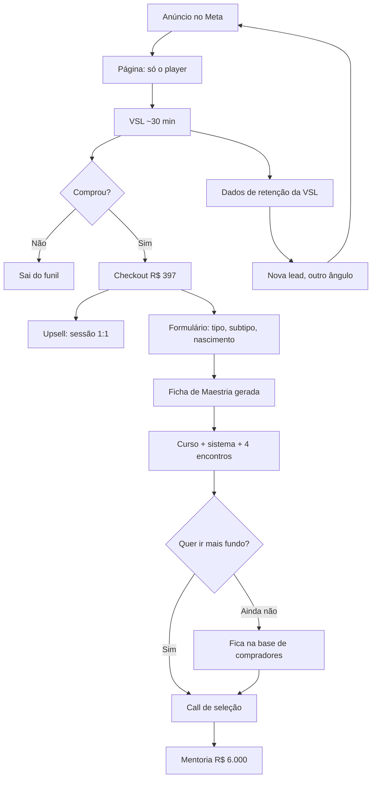
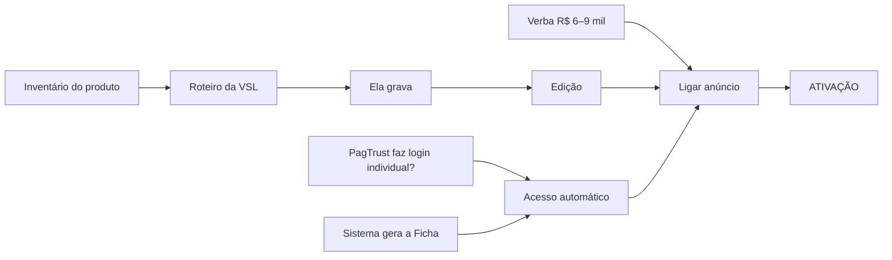

# O funil de Direct Response — estrutura e implementação

> **Tipo:** física do funil (fonte) · **Escrito:** 18/09/2026 · **Dono:** Victor
> **Etapa:** 1 do circuito `CLAUDE.md` §6.3 — **classificação e esqueleto. Não é copy, e copy não sai daqui.**
> **Método:** `100-métodos/METODO-FUNIL-DE-VSL.md` · `METODO-PONTOS-LOGICOS.md` · `METODO-ESTRUTURA-INVISIVEL.md` · `METODO-TRAFEGO-PAGO.md` §4
> **Base factual:** destilação da call de 16/09 (`C-01` a `C-60`) + `AUDITORIA-DESTILACAO-2026-09-16.md`
> **Alçada:** `REGRA Nº 0` — promessa, mecanismo, ordem e elementos são decisão nossa. **Preço, capacidade e verba são dela.**

---

# ⭐ O FUNIL, EM UMA TELA

> **Primeira aplicação do `METODO-CAMADA-DE-VER.md` (18/09).** ~~A matriz de raias × fases do BPMN de 27/08~~ era tabela: informava e não destravava. **Isto é grafo — tem decisão, tem as duas saídas rotuladas, e tem loop.**



> 🔴 **Os dois pontos que só o desenho mostra:**
>
> **1 · O loop de baixo é o funil.** `VSL → dados de retenção → nova lead → anúncio`. **Sem ele isto é campanha, não funil** — e é a alça que o `METODO-FUNIL-DE-VSL.md` §5.1 chama de maior alavanca: *"toda alteração começa pelo topo"*.
>
> **2 · Quem não compra a mentoria não sai.** Vira **base de compradores** — e a melhor lista que existe é a de quem já pagou (§2-bis.2). **O nó `L` é o ativo que o funil constrói e que ninguém vê no texto.**

## E o que trava o quê



> ⭐ **Nó sem seta entrando é o que pode começar hoje: `Verba`, `Inventário`, `PagTrust` e `Sistema`.** **Três dos quatro dependem de uma resposta dela, e nenhum depende de produção nossa** — é a confirmação visual do que o `METODO-ESTIMATIVA-DE-CARGA.md` diz: **o gargalo é latência, não produção.**

---

# PARTE 0 · OS TRÊS GATES, ANTES DE QUALQUER DESENHO

| Gate | Estado | O que falta |
|---|---|---|
| **2.1 · Congruência** | 🟡 **parcial** | P1 ✅ (ICP decidido 15/09) · **P4 🔴 — o inventário é do produto NOVO e não existe** |
| **2.2 · Caixa** | 🔴 **REPROVA** | **R$ 6.000–9.000 reservados para 2–3 tentativas. Hoje: zero, e a palavra "verba" não foi dita em 2h03 de call** |
| **2.3 · Ativos mínimos** | ✅ **passa** | rosto ✅ · produto na faixa ✅ (curso existe) · prova coletável ✅ (depoimentos de 15/09 + acervo) |

> ## 🔴 O gate de caixa reprova, e isso decide o que se faz agora.
>
> **`METODO-FUNIL-DE-VSL.md` §2.2:** *"quem só tem capital para uma tentativa não tem capital para VSL: tem para um teste de mensagem."*
>
> **O que isso NÃO impede:** desenhar, fechar oferta, escrever roteiro, gravar, montar página e checkout. **Tudo isso pode andar.**
> **O que isso impede:** 🔴 **ligar mídia.** O primeiro real de anúncio não sai sem a reserva declarada.
>
> ⭐ **E isso é útil, não é freio: dá até a ativação para resolver o dinheiro, em vez de descobrir na véspera.**

---

# PARTE 1 · A ARQUITETURA — cinco peças, e a VSL é uma delas

```
ANÚNCIO  →  PÁGINA (moldura do player)  →  VSL  →  CHECKOUT  →  UPSELL
```

| # | Peça | O que é, nesta conta | Dono |
|---|---|---|---|
| **1** | **Anúncio** | Meta (Instagram/Facebook) — **par anúncio↔lead, não anúncio↔página** | nosso |
| **2** | **Página** | moldura do player, atrito zero. **Não é página de vendas longa: é o vídeo com um botão** | nosso |
| **3** | **VSL** | ~30 a 40 min, ela na câmera, ambiente real | roteiro nosso · **gravação dela** |
| **4** | **Checkout** | PagTrust + liberação automática de acesso | nosso · 🔴 **depende da verificação técnica prometida** |
| **5** | 🔴 **UPSELL** | **obrigatório desde o MVP** — ver 2.4 | nosso |

> ⚠️ **Sobre o canal, e ela precisa ouvir isso separado:** *"não tenho vontade de postar no Instagram"* `[09:52:59]` **é sobre postar.** Anúncio pago no Meta não exige que ela publique nada. **São duas coisas e ela pode estar juntando as duas.**

---

# PARTE 2 · FASE 0 — as decisões, tomadas

> **`REGRA Nº 0`: isto vai decidido, com a razão junto. O que volta a ela é objeção de congruência, não escolha.**

## 2.1 O público — e é aqui que mora 40% do resultado

> ### O líder com gente sob responsabilidade. Porta A: ele mesmo paga.

**Razão:** produto de R$ 297–497 em tráfego frio **é comprado por pessoa física, nunca por empresa.** Empresa não compra curso gravado de R$ 397 por anúncio.

> ## ⭐ E é isto que responde o *"meu foco maior é ir para empresas"* `[09:25:49]` — **o funil não compete com a porta B, ele alimenta.**
>
> **Cada líder que compra o curso é um líder dentro de uma empresa.** Ele testa em si, leva para o time, e vira a porta de entrada que hoje só chega por indicação. **O funil é a máquina de gerar os "Gabis" que hoje aparecem por acaso.**
>
> 🔴 **Dito assim, ela ganha a frente que quer — sem que o funil precise vender para empresa.** É o argumento que a faz querer o funil, e é verdadeiro.

## 2.2 O produto de entrada

> ### O curso de Eneagrama que já existe. Caminho 4 do §3.2.

**O método lista três caminhos e os três pressupõem criação** (resumo, extrair módulo, tema em alta). ⭐ **Esta call inventou o quarto: usar produto pronto e parado.** É mais barato que os três e **vale virar linha do método.**

**O que existe, conferido na fonte:**

| Ativo | Estado | Fonte |
|---|---|---|
| Curso de Eneagrama | **~7h, 100+ aulas** | `C-11` · `[10:22:55]` |
| 27 vídeos de subtipo | ~2h20 do total | `C-12` · `[10:23:21]` |
| Sistema de conhecimento | existe, **senha global** | `C-22`, `C-24` |
| 🔴 Maestrias/talentos | **NÃO gravados** | `C-17` · *"eu não gravei todas as maestrias"* |
| 🔴 Caminhos de crescimento | **NÃO estão no curso** | `C-18` |

> 🔴 **Consequência de oferta, e ela é dura: o curso é menor do que a promessa que se quer fazer.** Maestria e crescimento **saem da promessa do curso** ou entram declarados como parte do **sistema**, não do vídeo. **Prometer o que não está gravado é a forma mais rápida de gerar reembolso.**

## 2.3 A oferta — o que entra, o que não entra

| Entra | Não entra |
|---|---|
| curso de Eneagrama completo | ❌ maestrias gravadas (não existem) |
| acesso ao sistema de conhecimento | ❌ caminhos de crescimento no vídeo |
| **4 encontros ao vivo em grupo** com ela | ❌ entrevista individual *(vira upsell — 2.4)* |
| — | ❌ teste externo de identificação *(licença e custo não resolvidos, `C-20`)* |

🔴 **Resolver antes de escrever:** *"bônus perene"* `[11:02:25]` × *"três primeiros meses"* `[10:41:17]` **se contradizem** (`C-51`). **Decisão nossa: os 4 encontros são bônus de campanha inicial, com data-limite declarada na página.** Bônus perene que depende da agenda dela vira dívida que cresce com a venda.

## 2.4 ⭐⭐ O UPSELL — obrigatório, e ele já estava na call

> ### A sessão individual de identificação, 1:1 com ela. Vagas limitadas.

**Por que este, e a razão é a melhor deste documento:**

O `C-13` diz que **o ponto fraco do produto é a identificação**: *"o processo de autodescoberta pode ser mais demorado, dependendo do nível de consciência da pessoa"*. E o §6.1 do método diz que **a objeção invisível de toda venda é *"seu método funciona, mas eu não vou conseguir executar"*** — e que **só done-for-you alcança essa objeção.**

> ## 🔴 A fraqueza do produto vira o upsell: *"não consegue se identificar sozinho? Eu identifico com você."*
>
> **É done-for-you puro, resolve exatamente a dúvida que o próprio curso gera, e ela já disse que faz** — `C-20`, *"tem a entrevista que eu falei que eu podia fazer"*.
>
> ⭐ **E a limitação de agenda dela deixa de ser problema e vira escassez verdadeira** — a única que a Lei 9 aceita.

🟡 **A comunidade a R$ 150/mês** (`C-06`) **não é o upsell do MVP.** Ela mesma vetou cobrar antes de testar (`C-32`). **É o passo seguinte, depois dos 4 encontros rodarem.**

## 2.5 O preço

> **Faixa da categoria: R$ 279–497.** Curso gravado é infoproduto e essa é a classe comparável certa.
>
> ### Recomendação: **R$ 397**, e a razão é a distância para a mentoria.

| Por que não R$ 297 | Por que não R$ 497 |
|---|---|
| ancora o trabalho dela como "curso barato" e **encurta demais a distância até a mentoria de R$ 6.000** | sem prova de conversão (n=0), o teto alto reduz volume justo quando se precisa de volume para aprender |

🔴 **O número é dela** (`REGRA Nº 0`: preço é fato de negócio). **A arquitetura é nossa, e ela diz:** o front-end **não pode competir com a mentoria** nem parecer descartável. **R$ 397 com 4 encontros ao vivo é a única combinação da faixa que sustenta as duas coisas.**

## 2.6 A distribuição do esforço

> **40% público · 40% oferta · 20% copy.**

⚠️ **E isso é um aviso para nós:** copy é onde somos mais fortes e é **a menor alavanca**. Se estivermos gastando mais horas escrevendo do que fechando o inventário e a oferta, **estamos pesados no lugar errado.**

---

# PARTE 3 · A VSL — os quatro blocos

> **`LEAD → HISTÓRIA → MECANISMO → OFERTA`. E se escreve de trás para frente: a oferta é a primeira coisa definida.**

## 3.1 OFERTA — já está em 2.3 e 2.5

**Sequência canônica, que não se reordena:**
`produto → benefícios → para quem é / para quem NÃO é → conteúdo → ancoragem → preço → CTA → garantia → bônus → recapitulação → fecho com dois caminhos`

🔴 **Pendências que travam este bloco:** garantia (qual, quantos dias) · duração do acesso · regra dos 4 encontros.

## 3.2 MECANISMO — a tese, e é o maior bloco

> **Cadeia, não lista. 5 a 6 elos. E a conclusão NÃO se escreve** (`METODO-PONTOS-LOGICOS.md`).

**A cadeia, montada com a língua dela — todos os elos têm fonte na call:**

| # | Elo | Onde nasce |
|---|---|---|
| **1** | Você já tentou mudar a relação com alguém difícil **mudando o seu próprio jeito** | cena a colher |
| **2** | Não durou — porque comportamento é superfície. **O que produz o comportamento é o que aquela pessoa precisou desenvolver para sobreviver** | `C-16` *"eu mostro a criança daquela personalidade e o que essa criança desenvolveu para sobreviver"* |
| **3** | E isso **não se adivinha olhando**: estruturas diferentes resolvem o mesmo problema de jeitos opostos | `C-42` *"se eu desse pra ele o prazo real, ele vai atrasar"* |
| **4** | Quando você sabe qual estrutura está na sua frente, **para de adivinhar e passa a falar na moeda de troca daquela pessoa** | `C-46` *"você conversa na moeda de troca da pessoa"* |
| **5** | E o primeiro lugar onde isso muda é **você** — porque a mesma estrutura que te dá talento te dá armadilha | `C-47` *"a personalidade te dá talentos, mas ela também te dá armadilhas"* |
| **—** | 🔴 **a conclusão fica com o leitor, e não vai para a peça** | método |

> ⚠️ **Teste de encadeamento obrigatório antes de escrever:** remova o elo 3 — o elo 4 ainda se sustenta? **Se sim, não era cadeia.**
>
> 🔴 **E o gate de congruência dela, que veta metade do que se poderia escrever:** `C-15` — *"se você dá o eneagrama na perspectiva de rótulo, eu aumento o julgamento, eu coloco você numa caixinha"*. **Nada de determinismo, nada de "descubra seu tipo e saiba tudo sobre você".**

## 3.3 HISTÓRIA — o menor volume que o nicho aceitar

**Hierarquia: história própria > de um cliente > da descoberta do método.**

🔴 **LACUNA:** temos a história dela como líder (a Arco, o antagonista) — **mas ela serve à narrativa de liderança, não à do Eneagrama.** Falta: **como ela chegou ao Eneagrama e o que mudou para ela.** É uma pergunta, e é de fato.

## 3.4 LEAD — o bloco mais sensível

> **Mesma copy, trocando só a lead: uma versão dá prejuízo, a outra dá lucro.**

**Regra: mínimo 3 leads, de ângulos DIFERENTES** — não três versões do mesmo.

| # | Ângulo | Entrada |
|---|---|---|
| **1** | **a pessoa que não muda** | o liderado/filho/sócio com quem nada funciona |
| **2** | **o esforço que não vira resultado** | *"eu explico, ela concorda, e faz do jeito dela"* |
| **3** | ⭐ **o espelho** | o padrão se repete com pessoas diferentes — então não é sobre elas |

**Formato dos primeiros 30 segundos, em todos os três:** `mecanismo + promessa + prova` — **antes de qualquer contexto.**

## 3.5 ⭐⭐⭐ DEMONSTRAÇÃO — 30 segundos, para ela SE VER

> 🔴 **Isto não é copy aprovada. É rascunho de demonstração**, e existe por um motivo diagnosticado: ela disse *"**não consigo visualizar eu fazendo**"* `[10:13:21]`. **Argumento não resolve isso. Ver resolve.**

> *"Tem uma pessoa no seu trabalho com quem nada funciona.*
>
> *Você já explicou com calma, já foi mais dura, já tentou dar espaço. Ela concorda na hora e depois faz do jeito dela.*
>
> *Eu passei anos achando que era falta de clareza minha. Não era.*
>
> *O que eu vou te mostrar nos próximos minutos é por que o comportamento dela nunca foi sobre você — e o que muda no dia em que você para de adivinhar o que aquela pessoa precisa ouvir."*

**Para que serve:** ela lê em voz alta. **Se soar como ela, o bloqueio de visualização começa a ceder.** Se não soar, ela corrige — **e a correção dela é o insumo mais valioso que existe para o roteiro.**

---

# PARTE 4 · O QUE PRECISA SER FEITO

## 4.1 🔴 Bloqueadores — nada ativa sem isto

| # | O quê | Dono | Sem isso |
|---|---|---|---|
| **B1** | **Verba de teste: R$ 6.000–9.000 reservados** (2–3 tentativas) | **ela** | não liga mídia. Gate §2.2 |
| **B2** | **Inventário fechado do curso + sistema** — o que exatamente o comprador recebe | **ela responde, nós fechamos** | P4 bloqueia copy |
| **B3** | **Login individual + liberação automática** — PagTrust faz? | **nós** *(prometido `[11:04:27]`)* | sem entrega, não há venda |
| **B4** | **Trocar a senha global** | **ela** | credencial em claro, e acesso não é individual |

## 4.2 Nosso, e começa agora

| # | O quê | Etapa |
|---|---|---|
| **N1** | **Calendário novo com data de ativação** | 🔴 **prometido "essa semana" — vence 21/09** |
| **N2** | **Benchmark: 3 VSLs do nicho com prova de que vendem** | Fase 1 · `METODO-BENCHMARKING.md` |
| **N3** | **Ficha da oferta** — entra, não entra, preço, garantia, acesso, regra do bônus | Fase 0 |
| **N4** | **Roteiro da VSL** — 4 blocos, de trás para frente | Fase 2 · **depende de B2** |
| **N5** | **3 leads de ângulos diferentes** | Fase 2 |
| **N6** | **Página (moldura do player) + checkout + upsell** | circuito etapas 2 e 4 |
| **N7** | **Anúncios: par anúncio↔lead** | `METODO-TRAFEGO-PAGO.md` §4 |
| **N8** | **Instrumentação**: pixel, evento de compra, **retenção da VSL** | sem isso o teste não ensina nada |

## 4.3 Dela — e é pouco, de propósito

| # | O quê | Tempo |
|---|---|---|
| **D1** | Responder o inventário (B2) | 15 min |
| **D2** | Reservar a verba (B1) | decisão |
| **D3** | Trocar a senha (B4) | 10 min |
| **D4** | **Contar como chegou ao Eneagrama** — a história do bloco 3.3 | 20 min de conversa |
| **D5** | 🔴 **Gravar a VSL** | **1 sessão**, ambiente real dela |
| **D6** | Localizar os depoimentos do curso *(ela diz que já subiu no site)* | 15 min |
| **D7** | Confirmar o preço | decisão |

> ⭐ **Total dela, fora a gravação: ~1 hora.** **É isso que precisa ser dito em voz alta** — e é a resposta direta ao *"não consigo visualizar eu fazendo"*.

## 4.4 ⚠️ As quatro crenças que sabotam a peça — tratar ANTES, não depois

**`METODO-FUNIL-DE-VSL.md` §7-bis: descrença não aparece como objeção, aparece como pedido de alteração.**

| Crença | O pedido que ela vai fazer | A resposta, já pronta |
|---|---|---|
| *"VSL longa ninguém assiste"* | *"faz de 15 minutos"* | 🔴 **a nº 1 e a mais cara.** As referências de 40 min estão vendendo; a de 15 nunca foi testada |
| *"precisa de promessa forte"* | *"promete mais"* | o oposto escala. **Prova vence promessa** — e é o que ela já prefere |
| *"VSL é coisa de golpe"* | recusa do formato | o preconceito vem de peça **sem rosto**. **Com ela na câmera, o rosto é prova** |
| *"meu caso é diferente"* | reescrever a estrutura | ⚠️ **cuidado: o caso dela É diferente em uma coisa real** — o gate anti-rótulo do `C-15`. **Ceder nisso, e em nada mais** |

---

# PARTE 5 · O CALENDÁRIO NOVO

> 🔴 **O de 10/12 morreu.** Ele existia porque **o curso tinha que ser gravado**. Não tem mais. E foi a data que produziu a resistência: `[10:21:10]` *"a gente só vai ter essa resposta de validação em dez de Dezembro"*.

| Semana | O quê | Quem |
|---|---|---|
| **22 a 28/09** | inventário fechado · ficha da oferta · benchmark · **a demonstração de 30s na mão dela** | nós · 1h dela |
| **29/09 a 05/10** | roteiro completo + 3 leads + página | nós |
| **06 a 12/10** | 🔴 **ela grava** · edição | **ela** · nós |
| **13 a 19/10** | checkout, acesso, anúncios, instrumentação | nós |
| **⭐ 20/10** | **ATIVAÇÃO** | — |

> ## Sai de 10/12 para **20/10: 51 dias antes.**
>
> **E é isso que ela precisa ouvir primeiro na próxima conversa** — antes de qualquer explicação de VSL. **A objeção dela era o prazo, e o prazo mudou.**

⚠️ **Três coisas movem esta data, e vão declaradas:** a janela de gravação dela · a verificação da PagTrust · **a verba, que não adia a construção mas adia a ativação.**

---

# PARTE 6 · O QUE NÃO SE FAZ

- 🔴 **Não se liga mídia sem a reserva de R$ 6.000–9.000.** Uma tentativa é aposta; três são teste.
- 🔴 **Não se escreve o roteiro final antes do inventário (B2).** P4 bloqueia copy — e com produto novo, o P4 é novo.
- 🔴 **Não se promete maestria e caminhos de crescimento no curso.** Não estão gravados.
- **Não se reabre a renovação antes de entregar o calendário.** Ela decide depois de ver o caminho.
- **Não se vende "uma VSL" sem upsell.** Nasce no limite da viabilidade.
- ⚠️ **Não se "melhora" a peça.** A que vende no frio parece mais pobre do que sabemos fazer — **e resistir a enfeitar é parte do método.**

---

*Escrito em 18/09/2026. Etapa 1 do circuito §6.3. Nenhuma copy final aqui; a demonstração de 3.5 é rascunho declarado, para resolver a dificuldade de visualização registrada em `[10:13:21]`.*
