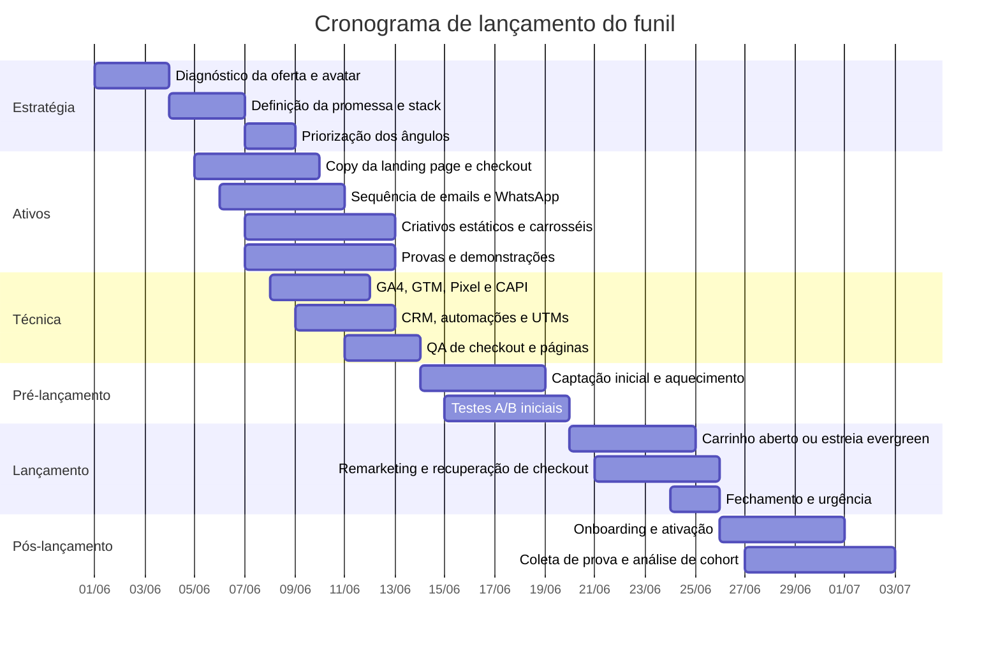

# Estrutura de Funil de Alta Conversão para o Método CS

## Resumo executivo

Assumindo como oferta-base o material enviado — **Método CS / Cartomante Sistêmico, Volume 1** — o produto atual se posiciona como uma formação/manual que integra **Tarô** e **Constelação Sistêmica Familiar** para aprofundar atendimentos, com temas explícitos como **amor, dinheiro, cinco feridas emocionais, prática de leitura sistêmica, frases de solução e estudo dos 22 Arcanos Maiores**. O avatar descrito no próprio material é majoritariamente formado por **cartomantes, terapeutas e profissionais de terapias holísticas**; ao mesmo tempo, o texto também toca buscadores espirituais em transformação pessoal. O maior problema comercial hoje não parece ser a falta de conteúdo, mas a falta de definição de **oferta comercial**: o arquivo não informa **preço**, **garantia**, **carga horária**, **formato final de entrega**, **nível de suporte**, **certificação**, **provas sociais públicas** nem **condições de checkout**. fileciteturn0file0

Por isso, a arquitetura de funil mais segura para escalar não é “tráfego frio direto para checkout” como tática principal. Para esse tipo de mecanismo — novo, híbrido e com crença forte a ser construída — o caminho com maior probabilidade de conversão é um **funil education-first**: anúncio ou conteúdo orgânico → ponte de crença e qualificação → página de vendas → checkout → onboarding → ascensão. Em paralelo, a camada técnica deve nascer já com **GA4** mapeando eventos de lead e compra, e com **Meta Pixel + Conversions API** em setup redundante, deduplicado por `event_id` + `event_name`, porque a própria Meta recomenda essa arquitetura para melhor medição e otimização. citeturn4view2turn4view3turn9view0turn5view2

Na camada de página, a recomendação é alinhar com o que o Google documenta hoje: **títulos únicos, descritivos e concisos**, no **mesmo idioma principal da página**, e **meta descriptions específicas e úteis**, sabendo que tanto o title link quanto o snippet podem ser **truncados conforme o dispositivo** e podem ser gerados a partir de múltiplas fontes, como `<title>`, título visível, `h1` e `og:title`. Além disso, a landing page deve funcionar muito bem em **mobile**, em **HTTPS**, sem **interstitials intrusivos** e com o **conteúdo principal claramente distinguível**. Como ponto prático importante em 2026, o Google anunciou a retirada dos **FAQ rich results** e já restringia esse recurso a sites governamentais ou de saúde; portanto, o FAQ da página deve existir para **objeção e conversão**, não como aposta de SEO. citeturn18view0turn18view1turn4view0turn20view0turn43view1turn43view2

A síntese estratégica é esta: **posicione a oferta como método aplicado para profissionais**, não como promessa ampla de “cura” ao consumidor final; use **diferenciação profissional**, **profundidade da leitura**, **aplicação em amor e dinheiro** e **segurança de método** como quatro alavancas centrais; e só aumente investimento quando o conjunto **promessa → página → checkout → onboarding** estiver validado por dados reais de conversão, não apenas por CTR. fileciteturn0file0

## Mapeamento da oferta e tese do funil

O material em PDF descreve um produto que, na prática, mistura traços de **livro-vivência**, **manual de método** e **formação introdutória**. Isso é bom para profundidade, mas ruim para conversão se a oferta comercial continuar ambígua. Para vender bem, a promessa precisa ficar mais nítida do que hoje está no material. fileciteturn0file0

| Elemento | Estado atual no material | Implicação estratégica |
|---|---|---|
| Nome da oferta | Método CS / Cartomante Sistêmico / Volume 1 | Bom nome-método; precisa de subtítulo comercial estável |
| Categoria | Manual/formação digital centrada em Arcanos Maiores | Pode ser vendido como entrada low-ticket ou núcleo de uma formação maior |
| Promessa central | Aprofundar atendimentos unindo Tarô e visão sistêmica familiar | Boa promessa-mecanismo; precisa sair do abstrato e entrar em benefício observável |
| Benefícios explícitos | Leituras mais profundas, leitura de emaranhamentos, trabalho com amor e dinheiro, uso de frases sistêmicas, prática com Arcanos Maiores | Excelente base de copy; já há pilares claros para ângulos de mercado |
| Entregáveis visíveis | Introdução ao método, ordens do amor, jornada do herói, amor/dinheiro, 5 feridas, leitura sistêmica, prática orientada, códigos simbólicos, 22 Arcanos Maiores, bibliografia viva | Conteúdo robusto; precisa virar stack de oferta, módulos e bônus |
| Avatar primário | Cartomantes, terapeutas, leitores de Tarô/Baralho Cigano, profissionais de terapias holísticas | Deve ser o foco principal da página de vendas |
| Avatar secundário | Buscadores espirituais em transformação pessoal | Pode comprar produto de entrada, mas em página separada ou segmentada |
| Autoridade | Autor se apresenta como terapeuta, cartomante, mentor, palestrante e professor | Base suficiente para seção “sobre o autor”, mas convém ampliar evidências públicas |
| Provas | O material cita casos e exemplos reais, além de comparações entre leitura comum e sistêmica | É preciso transformar isso em ativos públicos de prova |
| Preço | **Não especificado** | Lacuna crítica |
| Garantia | **Não especificada** | Lacuna crítica |
| Formato final de entrega | **Não especificado** além do PDF/manual enviado | Definir se é ebook, curso, formação com comunidade, mentoria ou híbrido |
| Suporte/comunidade/certificação | **Não especificados** | Isso afeta ticket, copy e tipo de funil |
| Ascensão natural | O próprio material antecipa Volume 2 sobre Arcanos Menores | Forte oportunidade de upsell/esteira | 

A recomendação mais importante aqui é de **foco de avatar**. O texto do material mistura linguagem para profissional e para buscador final, mas a maior parte dos capítulos fala de **atendimento**, **postura do cartomante**, **uso de frases sistêmicas**, **tiragens**, **clientes** e **movimento de campo**. Portanto, o funil principal deve vender o Método CS como **ferramenta de repertório e diferenciação para profissionais de leitura e terapia**, não como produto terapêutico genérico para qualquer pessoa. Essa escolha aumenta coerência de copy, qualifica melhor o lead e reduz ruído no checkout. fileciteturn0file0

A tese de oferta que mais tende a converter é:

**Promessa bruta do material**  
“Aprenda a metodologia que une Tarô e Constelação Sistêmica Familiar.”

**Promessa comercial recomendada**  
“Aprenda um método prático de leitura sistêmica com Tarô para conduzir atendimentos mais profundos, seguros e memoráveis em temas como amor, dinheiro e padrões emocionais.”

**Benefício observável**  
“Você deixa de fazer leitura rasa ou genérica e passa a ter linguagem, estrutura e mecanismo para conduzir atendimentos com mais profundidade.”

**Mecanismo único**  
“Arcanos Maiores + leitura do campo + frases sistêmicas + interpretação de feridas e emaranhamentos.”

Como o produto-base já é um PDF/manual, eu **não** recomendo usar “mais um ebook” como principal lead magnet. Isso tende a reduzir a percepção de valor do core offer e ainda cria pouca experiência emocional com o método. A ponte ideal é uma **mini-aula**, um **estudo de caso comentado** ou um **quiz diagnóstico** com desdobramento em email/WhatsApp. fileciteturn0file0

## Ângulos de mercado para escala

Os ângulos abaixo traduzem os pilares explícitos do material: a fusão entre Tarô e visão sistêmica, a diferença entre leitura comum e leitura sistêmica, o foco em amor e dinheiro, o framework das cinco feridas, a prática por Arcanos e a identidade do cartomante sistêmico. fileciteturn0file0

| Ângulo | Público-alvo | Gatilhos emocionais | Provas ideais | Objeções mais prováveis | Hooks e headlines sugeridos |
|---|---|---|---|---|---|
| Diferenciação profissional | Cartomantes e terapeutas que já atendem | Status, autoridade, medo de parecer genérico, desejo de cobrar melhor | Antes/depois de leitura comum vs. sistêmica; demonstração ao vivo; currículo visual do método; depoimentos de profissionais | “Já tenho meu jeito de ler”; “isso é só um nome novo para algo que já faço” | “Se suas leituras ainda parecem genéricas, o problema pode não ser dom — pode ser método.” “Pare de fazer tiragens certas e atendimentos esquecíveis.” |
| Da previsão à raiz | Leitores frustrados com superficialidade | Profundidade, verdade, responsabilidade, maturidade | Comparação explícita entre leitura comum e sistêmica; caso comentado; breakdown de 1 tiragem | “Meus clientes querem respostas rápidas”; “isso parece abstrato demais” | “Tarô não precisa prever mais. Precisa revelar melhor.” “O que a leitura comum não toca é justamente o que continua se repetindo.” |
| Amor e dinheiro como dores herdadas | Profissionais que querem atender temas de alta demanda | Relevância, compaixão, utilidade comercial, impacto | Aulas/módulos sobre amor e dinheiro; casos; roteiro de condução; prova de aplicação clínica | “Isso pode soar como promessa milagrosa”; “será que funciona fora do nicho esotérico?” | “As perguntas sobre amor e dinheiro quase nunca começam no presente.” “O cliente fala de relacionamento. O campo mostra outra história.” |
| As cinco feridas emocionais | Terapeutas e leitores que precisam de linguagem diagnóstica | Clareza, segurança, sensação de “agora entendi”, domínio conceitual | Mapa visual ferida → carta → fala terapêutica; material de apoio; checklists | “Já vi as 5 feridas em outros lugares”; “vai ser teórico demais” | “Quando o Louco, o Diabo ou o Enforcado aparecem, você sabe o que está sendo repetido?” “As cartas mostram muito — mas sem linguagem você perde a profundidade.” |
| Método e segurança prática | Iniciantes e intermediários em formação | Ordem, confiança, aplicabilidade, sensação de preparo | Passo a passo, scripts, frases prontas, mapa de sessão, demonstração de atendimento | “Sou iniciante”; “não atendo ainda”; “não sei se vou conseguir aplicar” | “Sensibilidade sem estrutura vira insegurança.” “Transforme percepção em método de atendimento.” |
| Chamado e identidade | Profissionais espirituais orientados por propósito | Missão, pertencimento, identidade, elevação do papel profissional | História do autor, visão do método, comunidade, prova de transformação de carreira | “Isso está místico demais”; “quero algo prático, não só inspiracional” | “Você não precisa apenas ler cartas. Pode ocupar um lugar.” “O cartomante que amadurece deixa de buscar respostas e começa a sustentar movimentos.” |

A ordem de teste que eu recomendo para escala é a seguinte. Primeiro, **Diferenciação profissional** e **Da previsão à raiz**, porque esses dois ângulos falam diretamente com dor profissional e criam filtro de público certo. Em seguida, **Amor e dinheiro como dores herdadas**, porque amplia interesse sem descaracterizar o método. Depois, escale **Método e segurança prática** para captar iniciantes qualificados. **Chamado e identidade** funciona melhor em remarketing, aquecimento e tráfego morno; frio demais, ele tende a gerar engajamento alto e compra mais baixa. fileciteturn0file0

Um cuidado importante: o ângulo “amor e dinheiro” é forte para clique, mas, se a página continuar vendendo formação para profissionais, o anúncio precisa deixar isso claro. Caso contrário, você atrai **consumidor final buscando alívio pessoal**, e não **profissional buscando método**. O resultado costuma ser CTR boa e compra ruim. A copy do anúncio precisa sempre fechar com algo como “para cartomantes e terapeutas” ou “para quem quer aplicar isso em atendimentos”. fileciteturn0file0

**Banco curto de headlines em pt-BR**

“Seu Tarô está certo. Mas ainda superficial.”  
“Aprenda a ler o campo, não só a carta.”  
“Saia da previsão rasa e conduza leituras com profundidade.”  
“Amor e dinheiro: o que se repete no cliente pode não ter começado nele.”  
“As 5 feridas emocionais também aparecem na mesa.”  
“Quando há método, o atendimento muda de nível.”  
“Transforme percepção em linguagem terapêutica.”  
“Um método para cartomantes que querem aprofundar seus atendimentos.”  

## Arquitetura de copy da página e dos emails

Do ponto de vista de SEO e arquitetura de mensagem, a landing page deve operar com **uma promessa principal** repetida de modo coerente no anúncio, na URL, no `<title>`, no H1, no subtítulo e no `og:title`. O Google documenta que pode gerar o title link a partir do `<title>`, do título visual principal, de headings como `<h1>` e até de `og:title`, além de recomendar **texto descritivo, conciso, sem keyword stuffing** e no **mesmo idioma** do conteúdo principal. Para meta descriptions, o Google recomenda resumos **curtos, relevantes, específicos** e observa que elas podem reunir informações importantes da página; não há um limite fixo formal, porque o snippet pode ser truncado conforme o dispositivo. Na camada de experiência, o Google recomenda olhar para **mobile**, **HTTPS**, ausência de **interstitials intrusivos** e separação clara entre **conteúdo principal** e o restante da interface. citeturn18view0turn18view1turn18view2turn4view0turn20view0

**SEO em pt-BR recomendado**

**Title principal**  
Método CS | Formação em Cartomancia Sistêmica para Cartomantes

**Meta description principal**  
Aprenda a integrar Tarô e visão sistêmica familiar para conduzir atendimentos mais profundos, com Arcanos Maiores, frases sistêmicas e aplicação prática.

**Variação de teste**  
Cartomante Sistêmico | Método para Leituras com Mais Profundidade

Como o produto atual parece um híbrido entre manual e formação, vale uma observação técnica importante: se a oferta final for realmente estruturada como **curso com aulas, módulos e instrutor**, o uso de **Course structured data** pode fazer sentido; mas o próprio Google define esse markup para conteúdo educacional com **lectures, lessons ou modules** e instrutor, e a disponibilidade do rich result de course list continua documentada como **em inglês**. Já o **FAQPage** não deve ser priorizado para este projeto: o Google anunciou a retirada dos FAQ rich results em 2026, e o recurso já era restrito a sites bem conhecidos de governo ou saúde. Em outras palavras: tenha FAQ para vender melhor, não para esperar rich result. citeturn41view0turn41view1turn43view1turn43view2

Abaixo está a arquitetura recomendada da página. Ela serve tanto para uma **sales page longa** quanto para uma **VSL page com apoio textual**.

| Seção da página | Objetivo da copy | Brief de conteúdo | Comprimento recomendado |
|---|---|---|---|
| Hero | Dizer em 5 segundos o que é, para quem é e por que importa | Headline com promessa profissional; subtítulo com mecanismo; CTA acima da dobra; microcredibilidade com nome do método + autor | 120–180 palavras |
| Bloco de diagnóstico | Fazer o visitante se reconhecer | Sintomas: leitura rasa, falta de linguagem, clientes com questões repetidas, insegurança em aprofundar | 120–220 palavras |
| Mecanismo único | Explicar por que essa abordagem é diferente | Tarô + visão sistêmica + feridas + frases + prática; linguagem simples, sem jargão excessivo | 180–320 palavras |
| Aplicação prática | Mostrar utilidade e valor concreto | Amor, dinheiro, padrões emocionais, leitura de campo, condução do atendimento | 180–280 palavras |
| O que você recebe | Transformar capítulos em oferta | Módulos, materiais, roteiros, mapa de arcanos, frases sistêmicas, casos comentados, bônus | 220–380 palavras |
| Para quem é | Aumentar qualificação | Cartomantes, terapeutas, leitores, profissionais em transição; separar primário e secundário | 100–180 palavras |
| Para quem não é | Filtrar e reduzir reembolso | Quem busca previsão rasa, promessa mágica, ou não quer estudar/aplicar método | 80–140 palavras |
| Prova e autoridade | Reduzir risco percebido | Bio do autor, experiência, casos, depoimentos, demonstração de leitura, imagens do material | 150–280 palavras |
| Oferta e condições | Dar clareza comercial | Preço, parcelamento, garantia, bônus, acesso, suporte, prazo, comunidade, certificação | 120–240 palavras |
| FAQ | Remover objeções | Iniciante ou não, pré-requisito, formato, validade para Baralho Cigano, aplicação em atendimentos, política de suporte | 300–700 palavras |
| Fechamento | Intensificar decisão | Reforço da promessa, quem deve entrar agora, CTA final, urgência real | 100–180 palavras |

**Estrutura de copy do hero**

- **Headline**: benefício observável + método.
- **Subheadline**: mecanismo + público + aplicações.
- **Bullets curtos**: três transformações tangíveis.
- **CTA primário**: um só verbo principal.
- **Microprova**: bio curta ou evidência do método.

**Hero recomendado em pt-BR**

**H1**  
Aprenda a conduzir leituras sistêmicas com Tarô e dê mais profundidade aos seus atendimentos

**Subheadline**  
Um método para cartomantes e terapeutas integrarem Arcanos Maiores, visão sistêmica familiar e frases de solução em atendimentos sobre amor, dinheiro e padrões emocionais.

**CTA**  
Quero conhecer o Método CS

**Bullets**  
Leituras mais profundas e menos genéricas  
Mais linguagem e segurança na condução do atendimento  
Aplicação prática em temas que mais chegam à mesa

A sequência de emails deve vender por **acúmulo de crença**, não por repetição de “compre agora”. O ideal é fazer o lead atravessar quatro pontes: **reconhecimento da dor**, **quebra de crença antiga**, **entendimento do mecanismo**, **decisão de entrar**.

| Disparo | Assunto sugerido | Abertura sugerida | Framework do corpo | CTA | Escassez/urgência |
|---|---|---|---|---|---|
| D0 após lead | Seu material chegou. Comece por aqui | “Se a sua leitura parece ‘certa’, mas ainda não toca a raiz, este é o ponto de partida.” | Entrega do lead magnet + 1 insight + convite para próxima peça | Assistir à aula / abrir o material | Nenhuma |
| D1 | O erro que deixa a leitura certa… e ainda superficial | “Muita gente acha que falta sensibilidade. Na maioria das vezes, falta método.” | Dor → erro comum → consequência → microsolução | Ver como o método funciona | Nenhuma |
| D2 | Tarô não é só previsão — e isso muda tudo | “Quando a carta deixa de ser resposta pronta e vira espelho do campo, o atendimento muda de nível.” | Quebra de crença → nova visão → exemplo simples | Entender a leitura sistêmica | Nenhuma |
| D3 | Amor e dinheiro: por que essas perguntas sempre voltam? | “Os temas que mais aparecem na mesa também são os que mais expõem padrão repetido.” | Padrão → relevância → utilidade prática da formação | Ver a aplicação prática | Nenhuma |
| D4 | As 5 feridas que aparecem nas cartas | “Você não precisa decorar mil significados. Precisa saber o que está se repetindo.” | Framework → exemplos de 2 ou 3 cartas → benefício de clareza | Ver o mapa do método | Nenhuma |
| D5 | O que você recebe dentro do Método CS | “Agora que você entendeu a visão, deixa eu te mostrar a estrutura.” | Stack da oferta → módulos → bônus → para quem é | Conhecer a formação | Pré-anúncio de abertura |
| D6 carrinho aberto | As inscrições para o Método CS estão abertas | “Se você quer levar profundidade e método para os seus atendimentos, este é o momento.” | Oferta → condições → valor percebido → CTA | Garantir minha vaga | Data de fechamento + bônus de entrada |
| D7 | É para iniciantes? Preciso já atender? | “Essas são as dúvidas que mais recebo antes da matrícula.” | FAQ orientado a objeção → resposta curta → CTA | Ver a página / entrar agora | Reforço do prazo e do bônus |
| D8 fechamento | Fecha hoje | “Se esse método faz sentido para o lugar que você quer ocupar, não deixe para depois.” | Reforço da consequência de adiar → resumo do que recebe → CTA final | Entrar na turma | Fechamento real, hora definida |
| D8 última chamada | Últimas horas para entrar | “Daqui a pouco, as condições de entrada deixam de existir.” | 3 bullets de decisão + CTA direto | Garantir acesso agora | Últimas horas |

**Regras de escassez e urgência que eu recomendo**

Escassez só deve existir se puder ser sustentada. As quatro alavancas mais saudáveis aqui são: **data real de fechamento**, **bônus de entrada com prazo**, **preço fundador para primeira turma** e **vagas limitadas apenas se houver feedback/supervisão humana**. Se a oferta for perpétua, troque “carrinho fecha” por **janela de bônus**, **turma mensal de onboarding** ou **sessão de implementação ao vivo**.

## Criativos para anúncios sociais

Os criativos devem fazer duas coisas ao mesmo tempo: **parar o scroll** e **filtrar o público certo**. No caso desta oferta, isso significa não ficar genérico demais em “cura” ou “espiritualidade”, porque o melhor comprador parece ser o profissional que busca **método, profundidade e diferenciação**, não apenas inspiração. O material dá base forte para anúncios sobre método, leitura de campo, amor/dinheiro, cinco feridas e identidade profissional. fileciteturn0file0

| Formato criativo | Melhor uso | Estrutura vencedora | Onde tende a performar melhor | Risco principal |
|---|---|---|---|---|
| Estático de promessa | Testar headline e avatar | Tensão + benefício + “para quem é” | Tráfego frio e testes rápidos | Clique curioso de público errado |
| Estático de prova | Reduzir objeção | Depoimento/case + frase-resumo + CTA | Remarketing e público morno | Falta de prova concreta visual |
| Carrossel de mecanismo | Educar sem VSL longa | Problema → erro → mecanismo → resultado → CTA | Frio qualificado | Complexidade demais por card |
| Carrossel de objeção | Fechar decisão | “É para mim?” → respostas → stack → CTA | Remarketing, engajados e leads | Ficar burocrático demais |

**Estrutura de estáticos**

**Estático A — Diferenciação profissional**  
**Headline na arte**: Seu Tarô está certo. Mas ainda superficial?  
**Texto principal**:  
Se você sente que suas leituras até fazem sentido, mas ainda não tocam a raiz do cliente, talvez o problema não seja sensibilidade. Talvez seja método.  
O Método CS integra Tarô e visão sistêmica familiar para aprofundar atendimentos em amor, dinheiro e padrões emocionais.  
**Legenda curta**: Formação para cartomantes e terapeutas.  
**Direção visual**: fundo sóbrio, carta em destaque, expressão concentrada do especialista, poucas palavras, contraste alto.

**Estático B — Aplicação em amor e dinheiro**  
**Headline na arte**: Amor e dinheiro quase nunca travam sozinhos  
**Texto principal**:  
As perguntas que mais chegam à mesa também são as que mais expõem repetições.  
Aprenda a interpretar o que a leitura comum não alcança e conduza atendimentos com mais profundidade.  
**Legenda curta**: Método CS | Cartomancia Sistêmica  
**Direção visual**: duas dores em contraste, ícones discretos, paleta mais emocional, foco em reconhecimento.

**Estático C — Método e segurança**  
**Headline na arte**: Sensibilidade sem estrutura vira insegurança  
**Texto principal**:  
Se você sente muito nas cartas, mas ainda não encontra a linguagem certa para conduzir o atendimento, o Método CS pode ser o próximo passo.  
**Legenda curta**: Transforme percepção em método  
**Direção visual**: clean, visual de caderno de método, checklist ou mapa visual.

**Carrossel A — Leitura comum versus leitura sistêmica**

**Texto principal do anúncio**  
Muita gente acha que aprofundar um atendimento depende de “dom”. Na prática, depende de método.

**Cards**
1. **Capa** — Leitura comum ou leitura sistêmica?  
   Visual: split screen com duas abordagens.
2. **Card** — A leitura comum responde à pergunta  
   Visual: “Vai ou não vai?” / “Dá certo ou não?”
3. **Card** — A leitura sistêmica revela o que está repetindo  
   Visual: raiz / campo / padrão invisível.
4. **Card** — O cliente fala de amor, dinheiro ou bloqueio  
   Visual: três sintomas em sequência.
5. **Card** — O método mostra feridas, lealdades e lugar no sistema  
   Visual: mapa simples com setas.
6. **Card final** — Aprenda a conduzir esse tipo de leitura  
   CTA: Conheça o Método CS

**Legenda**  
Para cartomantes e terapeutas que querem mais profundidade no atendimento.

**Carrossel B — As 5 feridas na mesa**

**Texto principal do anúncio**  
As cartas mostram muito. Mas, sem linguagem, você vê e não consegue conduzir.

**Cards**
1. **Capa** — As 5 feridas também aparecem nas cartas  
2. **Rejeição** — “Eu não pertenço”  
3. **Abandono** — “Tenho medo de ser deixado”  
4. **Humilhação / Traição** — “Eu me protejo controlando”  
5. **Injustiça** — “Eu só descanso se compensar”  
6. **Fecho** — Aprenda a identificar, nomear e conduzir isso no atendimento

**Legenda**  
Método para cartomantes e terapeutas que querem transformar percepção em profundidade.

**Mockups curtos em pt-BR**

> **Mockup de anúncio estático**  
> **Arte**: “Seu Tarô está certo. Mas ainda superficial?”  
> **Texto principal**: Aprenda um método de leitura sistêmica com Tarô para conduzir atendimentos mais profundos em amor, dinheiro e padrões emocionais.  
> **CTA**: Ver a formação

> **Mockup de anúncio em carrossel**  
> **Card 1**: “Pare de tentar prever tudo”  
> **Card 2**: “Comece a revelar o que está se repetindo”  
> **Card 3**: “Conheça o Método CS”  
> **CTA**: Assistir à aula

> **Mockup curto de hero da sales page**  
> **H1**: Aprenda a conduzir leituras sistêmicas com Tarô  
> **Subheadline**: Um método para cartomantes e terapeutas aprofundarem seus atendimentos com Arcanos Maiores, linguagem sistêmica e aplicação prática.  
> **CTA**: Quero conhecer o Método CS

## KPIs, rastreamento e fluxo do funil

Na camada técnica, a melhor estrutura é separar claramente o que é **funil de lead** do que é **funil de compra**. O GA4 documenta eventos recomendados para ambos: em lead gen, `generate_lead`, `qualify_lead`, `working_lead` e `close_convert_lead`; em vendas online, `begin_checkout`, `add_payment_info` e `purchase`. Para otimização de mídia paga e atribuição mais robusta, a Meta recomenda usar **Conversions API junto com Meta Pixel** em setup redundante e deduplicar por `event_id` + `event_name`; para eventos de website via CAPI, `event_source_url` é exigido, e `action_source` pode assumir valores como `website`, `chat`, `phone_call` e `business_messaging`. citeturn4view2turn4view3turn9view0turn5view2

**Fluxo de funil recomendado**

| Origem de tráfego | Entrada | Ponte de qualificação | Conversão | Pós-conversão |
|---|---|---|---|---|
| Meta Ads Feed/Reels | Mini-aula, quiz ou página ponte | Email + remarketing + WhatsApp opcional | Sales page → checkout | Onboarding + pedido de prova |
| Instagram orgânico / lives | Conteúdo curto + CTA para aula | Sequência de emails / lista quente | Sales page | Comunidade / upsell |
| YouTube / Shorts | Aula curta ou estudo de caso | VSL curta / página ponte | Sales page | Onboarding |
| Busca Google de alta intenção | Sales page direta ou VSL | Remarketing de página | Checkout | Upsell |
| Remarketing | Página de prova / FAQ / checkout recovery | Email e WhatsApp | Purchase | Pedido de depoimento |

**Mapa de eventos e KPIs**

| Etapa | KPI principal | KPIs auxiliares | Evento recomendado no GA4 | Observação de mídia |
|---|---|---|---|---|
| Visita à landing page | Sessões qualificadas | Engajamento, scroll, tempo | `page_view` + evento customizado `lp_view` | UTM obrigatória por ângulo e criativo |
| Clique no CTA da LP | CTR interno da página | Scroll 50%, clique por seção | `select_content` ou `cta_click` customizado | Mede qualidade do hero |
| Captação de lead | Taxa de lead | CPL, taxa por origem | `generate_lead` | Se usar WhatsApp, mapear também em Meta com `action_source=business_messaging` |
| Nutrição | Cliques de email / replies / view rate da aula | Abertura, visita à sales page | `email_click`, `video_start`, `video_progress` customizados | Foco em consumo, não só abertura |
| Página de vendas | Taxa de clique para checkout | profundidade de scroll, FAQ clicks | `view_item` + `cta_click` | `view_item` ajuda a padronizar análise |
| Checkout | Taxa de início de checkout | abandono, escolha de pagamento | `begin_checkout`, `add_payment_info` | Remarketing forte aqui |
| Compra | Taxa de compra | CAC, ROAS, taxa por origem e por ângulo | `purchase` | Evento central de otimização |
| Qualificação de serviço premium | Taxa de qualificação | show rate, avanço para call | `qualify_lead`, `working_lead`, `close_convert_lead` | Use esse caminho se a oferta migrar para mentoria/serviço |
| Ativação | Início de uso | login, avanço no módulo 1 | `sign_up`, `tutorial_begin`, `tutorial_complete` | Essencial para reduzir reembolso |
| Retenção | Reembolso / upsell / depoimento | NPS, prova coletada | `refund` + eventos customizados | Base de escala futura |

**Leitura de diagnóstico do funil**

Se o anúncio tem clique, mas a LP não gera lead, o problema costuma estar em **message match** ou em fricção de página.  
Se a LP gera lead, mas a aula não é consumida, o problema costuma estar em **ponte de interesse** e sequência.  
Se há visita à sales page, mas pouco checkout, o problema costuma estar em **promessa, prova ou clareza da oferta**.  
Se há bastante `begin_checkout`, mas pouca `purchase`, o gargalo normalmente é **preço, método de pagamento, risco percebido ou checkout ruim**.  
Se há compra, mas pouca ativação, a escala trava depois por **reembolso e falta de prova nova**.

Na operação com Meta, padronize os nomes de eventos em browser e servidor, gere `event_id` único e mantenha consistência. A Meta documenta que, quando browser e servidor enviam o mesmo evento, a deduplicação depende justamente da combinação de **nome do evento** e **ID do evento**, com janela de até **48 horas**. citeturn9view0turn5view2

## Cronograma de lançamento e checklist

Como o conteúdo-base já existe, mas a camada comercial ainda está indefinida, o cronograma ideal não é “subir anúncio amanhã”; é um ciclo curto de **definição de oferta, empacotamento, prova, copy, setup técnico e estreia controlada**. O próprio material indica espaço natural de esteira e expansão — especialmente com o gancho do Volume 2 — o que faz sentido estruturar desde o início onboarding e ascensão. fileciteturn0file0

| Frente | Entregáveis mínimos | Critério de pronto |
|---|---|---|
| Oferta | Nome final, headline principal, preço, parcelamento, garantia, bônus, formato de acesso, política de suporte | Qualquer pessoa do time consegue explicar a oferta em 20 segundos |
| Prova | Bio do autor, 3–5 depoimentos, 2 mini-cases, 1 demonstração de leitura ou breakdown prático | Existe prova suficiente para sustentar ads e FAQ |
| Copy | Sales page completa, checkout copy, sequência de emails, mensagens de WhatsApp, FAQ, recuperação de abandono | Todos os links e CTAs levam para o próximo passo certo |
| Criativos | 6–8 estáticos, 2 carrosséis, 3 variações de headline, 3 variações de texto principal | Há criativos suficientes para testar 3 ângulos sem fadiga imediata |
| Técnica | GTM, GA4, Search Console, Pixel, CAPI, UTMs, dedup, dashboards, automações | Todos os eventos críticos disparam corretamente |
| Operação comercial | SLA de resposta, roteiro de objeção, contingência de pagamento, política de reembolso, onboarding | O time sabe o que responder e em quanto tempo |
| Otimização | Backlog de testes, rotina diária de leitura de dados, plano de retargeting, relatório pós-coorte | Há processo claro para iterar, não só “olhar número” |

Para testes em URL separada, siga as recomendações do Google para não gerar ruído de indexação: usar `rel="canonical"` nas variações, **302** em redirecionamentos temporários e manter o experimento apenas pelo tempo necessário para obter sinal confiável. citeturn33view1turn33view2

A recomendação final de execução é simples: **não escale antes de fechar a narrativa da oferta**. O conteúdo já sustenta uma proposta forte; o que falta é transformar o Método CS em uma oferta comercial clara, provada e mensurável, com funil que filtre o avatar correto e converta crença em compra. fileciteturn0file0