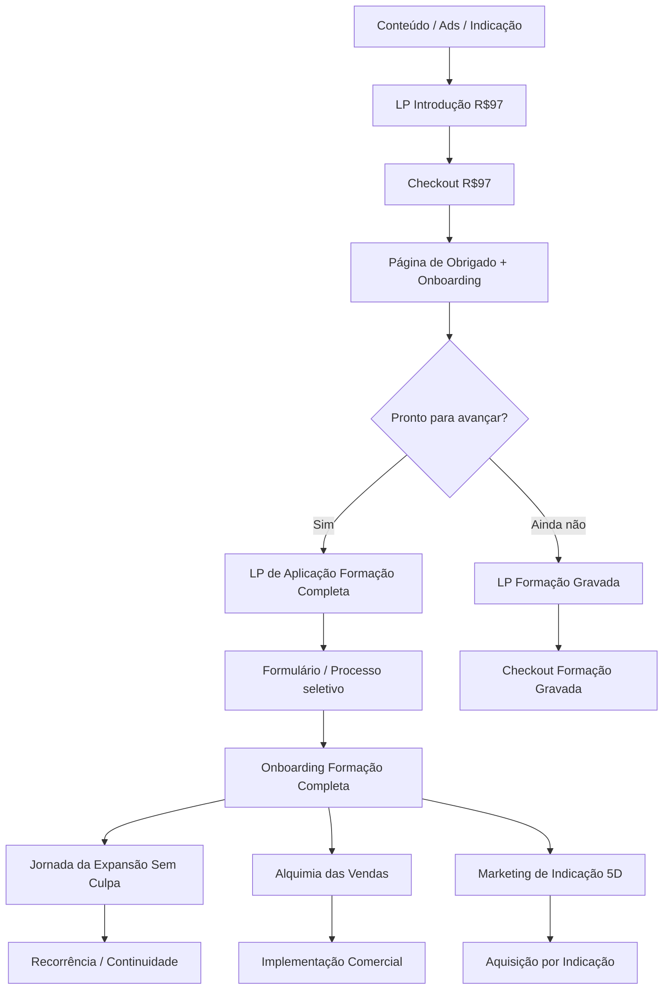

# Relatório analítico para design system e páginas de vendas do ecossistema

## Resumo executivo

A evidência mais consistente sobre landing pages de alta conversão aponta para cinco princípios que importam mais do que “truques” isolados: uma promessa única e específica por página, continuidade de mensagem entre origem do tráfego e headline, CTA primário inequívoco, prova social perto do ponto de decisão e fricção mínima em formulários e checkout. Isso aparece tanto na literatura de UX quanto em casos reais de CRO: usuários escaneiam páginas em vez de ler tudo; formulários aumentam carga cognitiva; CTAs funcionam melhor quando reduzem incerteza; páginas dedicadas convertem melhor quando mantêm alinhamento com a intenção de busca e a promessa do anúncio. citeturn34view5turn34view2turn34view3turn34view1turn34view8

Para o seu ecossistema, a melhor decisão não é criar seis “sites diferentes”, e sim padronizar tudo em **três templates-base**: **venda direta** para Introdução R$97, Formação Gravada, Alquimia das Vendas e Marketing de Indicação 5D; **aplicação/processo seletivo** para Formação Completa; e **continuidade/recorrência** para Jornada da Expansão Sem Culpa. Isso reduz custo de implementação, acelera testes A/B e mantém coerência visual e de experiência. A escolha é compatível com o que Unbounce, VWO, Hotjar, CXL e NN/g mostram em prática: páginas claras, dedicadas e iteráveis ganham de estruturas genéricas. citeturn34view0turn33view0turn13search0turn13search5

Minha recomendação de design system é **híbrida e pragmática**: usar **Atlassian/Carbon** para layout, ritmo e legibilidade; **Material 3/Polaris** para CTA, inputs e estados; e **Apple HIG** como referência de polimento visual, hierarquia e contenção de motion. Esse mix preserva acessibilidade e performance sem sacrificar percepção premium. citeturn21view0turn24view0turn22search9turn21view3turn8search0

## Benchmark de design systems

| Design system | Tokens e foundations | Componentes críticos para LPs | Acessibilidade e performance | Melhor uso no seu contexto | Fontes primárias |
|---|---|---|---|---|---|
| **Material 3** | Tokens semânticos para cor, tipografia e valores base; color roles; spacing em incrementos de 4dp; shape system. citeturn0search0turn22search2turn22search6turn22search10 | Forte em botões, cards, text fields, dialogs e navegação; excelente base para heros mobile-first, CTA blocks e formulários curtos. Hero/pricing/social proof são compostos a partir de layout + card + text + button. citeturn22search9turn22search14turn7search4 | Componentes já incorporam padrões de acessibilidade; best practice de alvo interativo 48×48 CSS px; Material Web é orientado a componentes acessíveis e mede tamanho de bundle para produção. citeturn27search7turn27search1turn20view10turn26search2turn26search5 | Use para **CTA, botões, campos, estado hover/focus/error e base mobile**. | citeturn27search5turn20view10turn26search2 |
| **Apple HIG** | A Apple publica menos “tokens” explícitos que Material/Atlassian, mas trabalha com **dynamic system colors**, **Dynamic Type text styles**, safe areas, margins e materiais semânticos. citeturn9search3turn9search14turn9search6 | Forte em componentes nativos e consistência de hierarquia; excelente referência para hero editorial, blocos de prova com respiro, composição visual minimalista e páginas que precisam parecer premium sem excesso. citeturn8search3turn8search6turn8search0 | Guia explícito sobre contraste, WCAG/APCA, text-size changes, adaptive layout e Reduce Motion. Em performance visual, a lógica é privilegiar frameworks e componentes do sistema, evitar excesso de motion e respeitar safe areas e adaptação contextual. citeturn8search11turn9search5turn9search8turn8search2 | Use como **camada de refinamento visual**: tipografia premium, respiro, hierarquia, motion comedida e “sensação de produto de alto nível”. | citeturn8search0turn9search3turn9search14 |
| **Atlassian Design System** | Tokens para cor, spacing, elevação, tipografia e motion; base de spacing em 8px; tipografia em rem; grid responsivo com 6 breakpoints públicos. citeturn20view2turn21view0turn21view1turn20view7turn23search9 | Muito bom para estruturas de conteúdo, blocos explicativos, FAQs, grids, forms, text fields, stacks e primitives. Excelente para “long-form sales page” com leitura organizada. citeturn21view7turn23search11 | Componentes já saem com keyboard support e ARIA sensata; o uso de tokens em código pode ser otimizado via Babel plugin que resolve fallbacks em build time. citeturn21view2turn25view2 | Use para **layout, seções, grids, FAQ, ritmo editorial e documentação do método**. | citeturn23search5turn21view2turn25view2 |
| **IBM Carbon** | Type tokens, spacing tokens e temas; spacing em múltiplos de 2/4/8; IBM Plex como fonte-base; distinção entre productive e expressive type sets. citeturn24view0turn20view3 | Biblioteca forte em buttons, form, text input, dropdown, modal, table, tile e patterns de login/forms. Muito útil para pricing, comparação de planos, sessões de módulos e prova estruturada. citeturn24view0turn21view6turn21view5 | Carbon é explícito: segue checklist de acessibilidade da IBM baseado em WCAG AA, Section 508 e standards europeus. Além disso, mantém bibliotecas open source e ecossistema maduro para React/Web Components. citeturn20view9turn24view1turn20view8 | Use para **páginas com pricing, comparação, currículo/módulos, e sensação de robustez/metodologia**. | citeturn24view1turn20view9turn20view8 |
| **Shopify Polaris** | Tokens de espaço, cor e texto; espaço com base em 4px e camadas semânticas/primitive tokens; tokens acessíveis via CSS variables. citeturn20view4turn20view5turn20view6turn25view0 | Muito forte em form layout, cards, page, media card, button, inputs e flows guiados. Para application pages e blocos de checkout é uma das referências mais práticas. citeturn2search7turn21view4 | Componentes testados com técnicas automáticas e manuais, suporte a assistive tech, HTML semântico e ARIA quando necessário. O novo Polaris baseado em Web Components ficou menor e mais rápido do que a geração anterior. citeturn21view3turn21view4turn25view1 | Use para **formulários, application pages, blocos de checkout e áreas de decisão**. | citeturn2search10turn21view3turn25view1 |

**Síntese prática:** para páginas de venda, “hero”, “pricing” e “social proof” raramente vêm como componentes prontos; os melhores sistemas fornecem os **primitivos certos** — grid, stack, text, card/tile, button, form, badge, avatar/logo — para montar esses padrões com consistência. É exatamente assim que os sistemas acima tratam construção de interface de alto nível. citeturn22search9turn21view7turn24view0turn2search7

## Estruturas de página por oferta

A ordem abaixo parte de um princípio simples: como pessoas **escaneiam** páginas, a parte inicial precisa entregar promessa, adequação e direção; como formulários geram esforço mental, o pedido de ação deve parecer simples e seguro; e como a confiança influencia decisão, prova e clareza precisam aparecer cedo e reaparecer perto do CTA. citeturn34view5turn34view2turn34view3turn34view4

| Oferta | Tipo de página recomendado | Ordem de seções | Microcopy sugerida | A/B tests prioritários |
|---|---|---|---|---|
| **Introdução R$97** | **Venda direta curta-média** com checkout | Hero com promessa + preço + CTA → barra de prova/autoridade → “para quem é / para quem não é” → o que a pessoa aprende → entregáveis/módulos → bônus → garantia → FAQ → CTA final | **Headline:** “Dê seus primeiros passos na Cartomancia Sistêmica com método, clareza e prática.” **Subheadline:** “Sem decorar significados soltos: você entra entendendo leitura, contexto e estrutura.” **CTA:** “Entrar por R$97” | Hero com vídeo vs. hero estático; preço visível no hero vs. só na oferta; CTA “Começar agora” vs. “Entrar por R$97”; prova social logo abaixo do hero vs. após benefícios |
| **Formação Completa** | **Página de aplicação** | Hero com transformação + CTA de aplicação → por que existe seleção → para quem é / anti-ICP → pilares do método → estrutura da formação → provas/resultados → bônus e suporte → FAQ do processo seletivo → formulário/CTA final | **Headline:** “A formação para quem quer dominar a Cartomancia Sistêmica com profundidade e prática real.” **Subheadline:** “Seleção para alunos prontos para formação séria, atendimento e expansão.” **CTA:** “Aplicar para a seleção” | Formulário embutido vs. two-step form; prova antes vs. depois do anti-ICP; CTA “Aplicar” vs. “Quero ser avaliado(a)”; calendário/processo explícito vs. copy evergreen |
| **Formação Gravada** | **Venda direta long-form** com opção de VSL | Hero → prova/autoridade → problema atual do aluno → método/estrutura → módulos em accordion → materiais e bônus → amostra/aula ou trecho → FAQ → garantia → preço/parcelamento → CTA final | **Headline:** “Acesso imediato à formação gravada para estudar Cartomancia Sistêmica no seu ritmo.” **Subheadline:** “Método estruturado, aulas organizadas e clareza para sair do estudo solto.” **CTA:** “Quero acessar a formação gravada” | VSL curta vs. hero com mockup; módulos em tabs vs. accordion; garantia no hero vs. perto do preço; CTA “Acessar agora” vs. “Quero estudar com método” |
| **Jornada da Expansão Sem Culpa** | **Recorrência/continuidade** | Hero com resultado e frequência → o que acontece em cada encontro/mês → para quem é → entregáveis recorrentes → provas e relatos → como se conecta com a formação → preço recorrente/cancelamento → FAQ → CTA final | **Headline:** “Expanda sem culpa, com acompanhamento, direção e prática contínua.” **Subheadline:** “Uma jornada para consolidar crescimento interno, posicionamento e movimento.” **CTA:** “Entrar na Jornada” | Oferta mensal vs. âncora anual; bloco de comunidade/prova antes vs. depois de entregáveis; agenda/calendário visual vs. descrição textual; CTA “Entrar na Jornada” vs. “Começar minha expansão” |
| **Alquimia das Vendas** | **Venda direta focada em objeção e transformação** | Hero → dor/objeção central (“não sei vender”, “travo ao ofertar”) → novo mecanismo → método/processo → scripts/modelos/entregáveis → prova → FAQ → preço → CTA | **Headline:** “Venda com direção, sem perder sua verdade e sem depender de improviso.” **Subheadline:** “Um método para transformar trava comercial em comunicação clara, segura e conversível.” **CTA:** “Quero vender com método” | CTA em primeira pessoa vs. CTA neutro; framework visual acima da dobra vs. benefícios diretos; depoimentos antes vs. depois do método; vídeo curto de objeção vs. texto |
| **Marketing de Indicação 5D** | **Venda direta orientada a sistema** | Hero → mecanismo da indicação → por que indicação falha hoje → framework 5D → playbooks/templates → prova/casos → implementação em etapas → FAQ → preço → CTA | **Headline:** “Ative um sistema de indicação que gera demanda com consistência e intenção.” **Subheadline:** “Sem depender só de conteúdo: construa um fluxo de indicação estruturado e replicável.” **CTA:** “Quero ativar o 5D” | Hero diagramático vs. hero com promessa simples; CTA “Quero indicações previsíveis” vs. “Quero ativar o 5D”; cases com números vs. depoimentos narrativos; CTA fixo mobile vs. CTA inline |

**Ordem padrão recomendada para todas as páginas diretas:** **headline → subheadline → CTA → prova curta → benefícios/transformação → detalhes do que está incluso → prova aprofundada → risco reverso → preço → CTA**. Essa ordem conversa com padrões de scanning, reduz esforço de interpretação e mantém o valor mais próximo da ação. citeturn34view5turn34view3turn34view9

**Microcopy universal que vale testar em todas as ofertas:** CTAs mais específicos e mais pessoais costumam performar melhor do que rótulos genéricos. Em VWO, uma mudança para CTA mais específico e em primeira pessoa elevou sign-ups; em Unbounce, o alinhamento fino entre palavra buscada e headline/CTA elevou conversões em 31,4%. citeturn31view4turn33view0

## Exemplos reais e o que copiar

| Exemplo real | Resultado | O que copiar | Fonte |
|---|---|---|---|
| **Campaign Monitor** | **+31,4%** de conversões | Message match radical entre query/ads e headline/CTA; a oferta parece “a resposta exata” para a intenção do visitante. | citeturn33view0turn34view8 |
| **Effin Amazing / Chupa Mobile** | **44%** de conversão logo de saída | Página simples, um único lead magnet, template enxuto, CTA contextual vindo do blog. Ótimo lembrete de que simplicidade pode vencer. | citeturn31view0 |
| **Brand24** | Conversões **quase 300% maiores** | Pequenas correções de fricção guiadas por comportamento real, não por opinião interna. | citeturn31view11 |
| **Materials Market** | **3x** na taxa de conversão em um mês | Heatmaps + recordings para encontrar vazamentos rapidamente; ótimo exemplo de melhoria operacional, não só estética. | citeturn31view8 |
| **Vendio** | **+60%** de sign-ups | Remover o formulário embutido da landing page e mover o cadastro para a etapa seguinte reduziu agressividade inicial. Nem sempre “menos cliques” converte mais. | citeturn14search1turn32view1turn32view3 |
| **Roeder Studios** | **+8,39%** de sign-ups | CTA mais específico, orientado a benefício e com linguagem mais pessoal. | citeturn31view4 |
| **LKRSM / Laura Roeder** | **+24,31%** de sign-ups | Headline com linguagem de prova/feedback real, mais atenção, subheadline com prova e CTA, botão grande e prova social visível. | citeturn32view4 |
| **Lyyti** | **+93,71%** para o trial | Pricing page melhorou quando deixou claras as features por plano e adicionou múltiplos pontos de CTA. | citeturn32view5 |
| **Acuity Scheduling** | **+268,14%** em paid sign-ups | Reposicionar a oferta de entrada — de plano gratuito limitado para trial premium — alterou a percepção de valor e a propensão a pagar. | citeturn31view6 |
| **Omnisend** | **+17,66%** de CR na landing page | Hero mais claro e prova social adicional aumentaram foco e credibilidade. | citeturn31view7 |
| **CCV** | **+38%** na taxa de conversão do site de marketing | Iteração orientada por comportamento e teste; bom benchmark para páginas de demanda/lead gen. | citeturn31view10 |

**Padrões que se repetem nesses casos:** clareza da oferta, melhor hero, melhor prova, menos fricção de formulário, pricing/comparação mais legível e testes A/B em elementos grandes — headline, oferta, estrutura e CTA — antes de microajustes cosméticos. citeturn31view7turn32view1turn32view5turn31view4

## Implementação técnica

A camada técnica deve sustentar conversão sem degradar performance, SEO e mensuração. Em prática: construir páginas dedicadas, com layout responsivo, componentes semânticos, imagens responsivas, lazy-load apenas abaixo da dobra, e um plano de tracking centrado no funil real. Google, web.dev e os próprios design systems são consistentes nisso. citeturn16search0turn16search3turn17search1turn17search2turn30search10

| Camada | Recomendação acionável | Evidência-base |
|---|---|---|
| **Layout responsivo** | Mobile-first. Empilhe hero, prova e CTA em 1 coluna até ~767px; use 12 colunas a partir de ~1024px; mantenha CTA sticky no mobile em páginas de compra. Preserve safe areas e hierarquia com tipografia escalável. | Atlassian publica breakpoints de 320–479, 480–767, 768–1023, 1024–1439 etc.; Apple reforça safe areas e adaptação contextual; Material recomenda layouts canônicos que escalam por window size class. citeturn20view7turn9search6turn22search1turn22search13 |
| **Velocidade** | Não lazy-load o asset LCP do hero. Lazy-load imagens/vídeos abaixo da dobra; use `srcset`/`sizes`; mantenha JS mínimo; carregue só o necessário por página. | web.dev recomenda responsive images e alerta para não lazy-loadar imagens em viewport/LCP; Google mede CWV por uso real; Material, Atlassian e Shopify têm mecanismos explícitos de otimização de bundle/tokens/componentes. citeturn17search1turn17search2turn16search3turn26search2turn25view2turn25view1 |
| **SEO on-page** | Uma página = uma intenção = um H1. Title link único e descritivo; meta description escrita para clique; alt text descritivo; se houver vídeo principal, idealmente uma página dedicada ao vídeo. | Google Search Essentials, title links, meta descriptions, image SEO e video best practices. citeturn16search0turn16search15turn29search0turn29search1turn30search0 |
| **Tracking GA4** | Marque `generate_lead` para envio de formulário/aplicação, `begin_checkout`, `add_payment_info`, `purchase` para vendas; complemente com eventos customizados como `cta_click`, `faq_open`, `section_view`, `video_start`. Transforme `generate_lead` e `purchase` em key events. | O GA4 recomenda eventos específicos para lead gen e ecommerce; o próprio Google mostra `generate_lead` como evento-chave adequado para páginas de captura. citeturn18search1turn18search4turn18search6 |
| **UTM e atribuição** | Padronize sempre `utm_source`, `utm_medium`, `utm_campaign`, `utm_content` e, se possível, `utm_id`. Persista UTM no clique de CTA, form hidden fields e checkout. | O Google recomenda parâmetros UTM para identificar campanhas e refere explicitamente o uso de URLs customizadas para atribuição. citeturn16search2 |
| **CRO operacional** | Acompanhe não só conversão final, mas também motivadores, barreiras e ganchos: scroll, abandono por seção, clique em CTA, drop-off de formulário, reprovação no checkout, objeções capturadas em FAQ/Survey. | A abordagem de CRO da Hotjar enfatiza motivadores, barreiras e ganchos como estrutura de diagnóstico. citeturn34view11turn34view12 |

**Faixas recomendadas de mídia para implementação imediata**

| Asset | Formato preferido | Tamanho recomendado | Observação |
|---|---|---|---|
| Hero estático | AVIF/WebP + fallback JPG | fonte 1600×900; export desktop ideal 180–300 KB; mobile 80–140 KB | Não lazy-load se for LCP; mantenha contraste legível |
| Logos/selos | SVG preferencial | largura visual 120–240 px | SVG reduz peso e mantém nitidez |
| Fotos de prova/depoimento | WebP | 400×400 a 600×600; 30–80 KB | Crop consistente melhora percepção de rigor |
| Mockups/módulos | WebP | 1200×800; 100–180 KB | Use `srcset` para servir menor no mobile |
| Vídeo hero ou VSL curta | MP4 H.264 ou HLS + poster WebP | 1280×720 | Use `preload="none"` se abaixo da dobra |
| Carrossel de capturas | WebP | 1200×800; máximo 5 slides | Evite carrossel como prova principal |
| Áudio opcional | MP3/AAC | 64–96 kbps | Melhor como complemento, não como mídia principal |

Esses tamanhos são **targets de implementação**, não regras absolutas; o objetivo é equilibrar nitidez visual e Core Web Vitals. O racional vem das práticas de responsive images, image performance e page experience do Google/web.dev. citeturn17search1turn17search4turn16search3turn30search14

**Checklist de implementação**

Conteúdo:
- promessa única por página;
- CTA primário único;
- barra de prova logo abaixo do hero;
- “para quem é / não é”;
- entregáveis concretos;
- objeções reais transformadas em FAQ;
- garantia clara quando houver venda direta.

Front-end:
- HTML semântico;
- um único H1;
- `button` para ação e `a` para navegação;
- labels visíveis em todos os campos;
- foco visível;
- contraste AA;
- tokens de cor/spacing/typography em CSS variables.

Dados e integrações:
- checkout com URL de obrigado própria;
- persistência de UTM até checkout;
- hidden fields em formulários;
- webhooks para CRM/email;
- deduplicação entre GA4 e pixels;
- key events configurados antes de tráfego pago.

**Templates/componentes reutilizáveis que eu padronizaria já**
1. `HeroOffer`
2. `ProofBar`
3. `BenefitsGrid`
4. `MethodSection`
5. `CurriculumAccordion`
6. `TestimonialCards`
7. `PricingCard`
8. `FAQAccordion`
9. `StickyCTAMobile`
10. `ApplicationFormBlock`
11. `CheckoutEmbedBlock`
12. `ThankYouBridgeBlock`

**Builders/CMS LP recomendados por cenário**
- **Velocidade de lançamento:** Unbounce, Webflow, Framer.
- **SEO + controle + escala:** Next.js / Astro com CMS headless.
- **Operação simples com blog acoplado:** WordPress com builder que permita controle de scripts, schema e performance.
- **Evite** builders que impeçam controle de eventos, hidden fields, lazy-load, meta tags e scripts de mensuração.

## Diagrama do funil e perguntas abertas

**Perguntas abertas / limitações**
- A recomendação de **tipo de página** para Formação Gravada, Jornada, Alquimia e Marketing de Indicação 5D assume o papel dessas ofertas no funil, mas **não** partiu de tickets finais confirmados nesta pesquisa. Se o ticket real mudar muito, o comprimento da página e o tipo de CTA podem mudar junto.
- A linha de **Apple HIG** usa um mapeamento semântico de foundations, porque a Apple não publica um catálogo de design tokens web tão explícito quanto Material, Atlassian, Carbon e Polaris. citeturn9search3turn9search14turn8search2
- Para **pixels de mídia paga**, o core deste relatório priorizou GA4 e práticas oficiais do Google; a orientação operacional é espelhar os mesmos marcos de funil em Meta/TikTok/Google Ads, com deduplicação e persistência de UTM. citeturn18search1turn16search2turn19search0