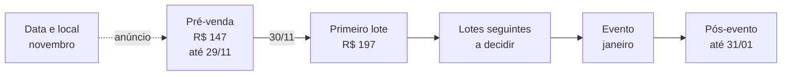

# Plano Estratégico 90 Dias — Jéssica Oliveira (Emotional Speaking)

> **Tipo:** entregável do escopo pago (2 páginas + plano estratégico 90D) · **Criado em:** 25/07/2026 · **Revisão 2:** 11/08/2026
>
> **Fontes:** Reunião Zoom 2 (20/07/2026) · **Call de 06/08/2026** · `ICP.md` · `OFERTA.md` · `METODO-EMOTIONAL-SPEAKING.md` · `DADOS-OPERACIONAIS.md` · `contexto/INVENTARIO-FONTES-2026-07-28.md`
>
> **Vigência:** 28/07/2026 → **31/01/2027** (estendida na revisão 6; a vigência original ia até 25/10/2026) · Revisão quinzenal no grupo de WhatsApp
> **Revisão 5:** 05/09/2026 · ~~evento em 17/10~~ (substituída)
> **Revisão 6:** 27/09/2026 · **evento em janeiro de 2027, pré-venda até 29/11, plano estendido até 31/01/2027, English Therapy**
>
> **Método:** Geração de Resultados (9 condições bem formuladas) + régua Continuum "resultado antes de construção"
>
> **Produto:** as ofertas citadas neste plano estão definidas em `vivencia-presencial/ARQUITETURA-DE-PRODUTO-LADIES-FLUENCY.md`. Este plano é de **implementação e consolidação** — não reabre decisão de produto.

---

## 1. Sumário executivo

| Núcleo | Definição |
|---|---|
| **Problema central** | O negócio vende bem no 1-a-1 (indicação + call de 30 min com alta conversão), mas a aquisição depende do acaso: não há motor previsível de novas conversas. |
| **Gargalo dominante** | Topo de funil. A conversão (WhatsApp → call → matrícula) já é forte; o que falta é volume qualificado entrando. |
| **Maior alavanca** | Colocar os ativos novos na ponta de **três** motores de demanda distintos: **Instagram → inglês (brasileiras)** · **Google → português para estrangeiros** · **Evento presencial → mentoria (empresárias de Floripa)**. |
| **O que NÃO será feito agora** | Curso digital gravado · mentoria para professoras · versão corporativa em auditório · English Flow presencial misto · comunidade com 6 presenciais por ano · novos canais (TikTok/YouTube). Tudo isso é ecossistema futuro — entra depois que os três motores rodarem. |
| **O que ENTROU na prioridade** | **Evento presencial (Motor 3)** e **carrosséis**, por motivos diferentes. Ver o quadro abaixo. |

**Regra que rege o plano inteiro:** conteúdo e tráfego são **via de audiência**; o dinheiro dos próximos 90 dias vem da **via de caixa** — indicações, base quente do WhatsApp, a call de matrícula que a Jéssica já domina, e agora o evento com pitch de mentoria. O plano acelera o que já funciona antes de construir o que ainda não existe.

> ### Duas coisas saíram da lista de exclusões, e por motivos diferentes
>
> **1. O evento presencial saiu porque virou prioridade.**
>
> A versão original excluía "eventos presenciais", e a exclusão foi escrita contra uma coisa diferente da que está na mesa. Continua excluído: evento como **produto novo**, com oferta própria, página própria e meta de bilheteria. **Passa a ser o Motor 3:** a Ladies Fluency Experience como vivência de aquisição, com teto de capacidade, ingresso de filtro e KPI único de **vendas de mentoria geradas**.
>
> A razão é estrutural: o §3 deste plano já identificou que o ativo de conversão mais forte da Jéssica é *"a call de 30 min com demonstração vivencial"*. O evento é essa demonstração acontecendo para quinze mulheres ao mesmo tempo. **Não é uma frente nova: é o mesmo ativo, multiplicado** — e por isso recebe seção própria (§12 a §15), cronograma próprio e prioridade de atenção no último terço do plano.
>
> **2. O carrossel saiu porque a razão da exclusão deixou de existir.**
>
> Ele estava fora por um motivo só, registrado no §6: carrossel exige design, e design é onde o perfeccionismo dela trava. **Os carrosséis agora chegam prontos, como bônus** (`conteudo-instagram/`). O custo que justificava a exclusão deixou de ser dela.
>
> **O que não muda:** ela continua não produzindo carrossel do zero. A capacidade de produção dela segue sendo 3 reels por semana, e nada mais.

---

## 2. Resultado bem formulado (o alvo dos 90 dias)

**Declaração no positivo:** "Até 25/10/2026, tenho um fluxo previsível de conversas qualificadas chegando por dois canais (Instagram e Google), com X novas matrículas/mês e as duas páginas convertendo visita em conversa no WhatsApp."

Pelas 9 condições:

1. **Positivo** — atrair e matricular; não "parar de depender de indicação".
2. **Evidência** — nº de conversas novas no WhatsApp/semana · nº de calls agendadas · nº de matrículas/mês · receita nova/mês. Baseline coletado na Semana 1 (hoje `a calibrar`: nº de alunas ativas, matrículas/mês atuais, seguidores).
3. **Específico** — Instagram: brasileiras 25+, inglês, método Emotional Speaking. Google: estrangeiros em Florianópolis, português. CTA único: WhatsApp corporativo final `{{CONFIRMAR_NUMERO}}` → call de 30 min.
4. **Recursos** — método validado · call de matrícula com alta conversão · 2 páginas (entrega Continuum ≤ 06/08) · 3 reels/semana de capacidade real · provas a documentar (§8).
5. **Controle** — dela: constância dos reels, resposta no WhatsApp, call. Cocriado: alcance do algoritmo, volume de busca dos gringos. O plano só cobra o que está no controle dela.
6. **Ecologia** — a agenda dela é o teto (máx. 4 encontros/semana por aluna, sem aula 5x). Crescer sem quebrar a entrega: quando a agenda encher, sobe preço/forma lista de espera — não se adiciona horas.
7. **Identidade** — o plano vende o método dela, na voz dela, sem transformá-la em "produtora de conteúdo". 3 reels/semana é o compromisso máximo — deliberadamente.
8. **Encaixe** — 3 fases de 30 dias (§6).
9. **Primeira ação** — Semana 1: coletar baseline + gravar o primeiro lote de 3 reels + fechar WhatsApp e as duas correções numéricas da oferta de português.

---

## 3. Diagnóstico (o que a call revelou)

**Forças já instaladas:**

- Método com mecanismo próprio (idioma + emoção + corpo + presença + experiência) e 6 anos de prática.
- Processo comercial maduro: WhatsApp → call de 30 min com demonstração vivencial → matrícula. Conversão alta em indicados.
- Cadeia de indicação ativa (aluna → marido → filha → novos alunos).
- História pessoal fortíssima para conteúdo (lutadora, autodidata, laptop da Xuxa, Wizard, certificação internacional).
- Novo produto com demanda observada localmente, formato ao vivo e tabela em reais já estruturados.

**Fragilidades a resolver:**

- Aquisição 100% dependente de indicação espontânea + Instagram sem sistema.
- Perfeccionismo histórico com conteúdo (superado em parte) — por isso o plano cabe na capacidade real: **3 reels/semana produzidos por ela**. Carrossel entrou porque passou a vir pronto, e não porque a capacidade dela mudou.
- Oferta de português passa para arquitetura, mas ainda exige duas correções numéricas, recorte geográfico e WhatsApp final (`OFERTA.md` §4).
- Existe um depoimento público documentado; provas de resultado mais fortes e uso identificado ainda exigem contexto e autorização.
- Capacidade solo: escala por hora-aula tem teto próximo.

---

## 4. Diretriz estratégica

**Um método, três motores, um destino.**

```
MOTOR 1 (Instagram)      MOTOR 2 (Google)       MOTOR 3 (Evento)
brasileiras · inglês     estrangeiros · PT      empresárias de Floripa
3 reels/semana           GBP + Search           Turbinar + base quente
      │                        │                        │
      ▼                        ▼                        ▼
Página Inglês            Página Português        Página do Evento
      │                        │                        │
      └───────────┬────────────┘                        ▼
                  ▼                            Ladies Fluency Experience
      WhatsApp corporativo                     (4h presenciais · outubro)
                  ▼                                      │
      Call de 30 min                                     ▼
   (o ativo de conversão dela)                  Pitch de Lapidação
                  ▼                                      │
             Matrícula                                   ▼
                                              Mentoria + Circle
```

A página não vende a aula; vende **a conversa**. O evento não vende o ingresso; vende **a mentoria**. Em ambos, o fechamento acontece onde a Jéssica é imbatível: numa sala, com gente na frente dela.

**A diferença entre os motores 1-2 e o motor 3:** os dois primeiros levam à esteira atual (aulas, R$ 497 a R$ 1.700/mês). O terceiro leva à esteira nova (Lapidação, R$ 4.997). É por isso que o Motor 3 tem prioridade de atenção no último terço do plano: **é a via de caixa mais curta e de maior valor unitário do ciclo inteiro.**

### 4.1 Por que Google (e não Instagram) para o português para estrangeiros — sim, é uma boa

- O estrangeiro em Floripa **busca com intenção** ("portuguese classes florianópolis", "portuguese teacher for foreigners", "learn portuguese brazil"). Busca = demanda declarada; Instagram dela é em português e fala com brasileiras — público errado para esse produto.
- Concorrência local nessas palavras é baixa comparada a nichos saturados; CPC tende a ser acessível.
- Complemento gratuito e imediato: **Perfil de Empresa no Google (Google Business Profile)** — "Portuguese teacher / language school" no mapa de Floripa captura busca local sem custo.
- **Condição de gate:** Google Ads só liga depois que a oferta estiver definida (nome, preço, formato, página em inglês no ar). Anúncio antes de oferta é dinheiro queimado.

### 4.2 Papel do Instagram

Instagram é o motor de **inglês para brasileiras**, com foco no método — não em "dicas de inglês" genéricas (isso é oceano vermelho de professor de inglês). O diferencial comunicável é a tese dela: **"não é sobre o idioma — é sobre quem você se torna quando consegue falar"**. Confiança e coragem (as duas palavras da bio) são o ângulo de todos os conteúdos.

---

## 5. Os três motores em detalhe

### Motor 0 — Caixa imediato (semanas 1–4, custo zero)

A via de caixa mais curta não é conteúdo — é a base que já existe:

1. **Campanha de indicação estruturada:** mensagem simples às alunas atuais ("quem você conhece que quer destravar o inglês? A conversa de 30 min é por minha conta"). Indicação deixa de ser acidente e vira rotina pós-feedback positivo.
2. **Reativação do WhatsApp:** varrer conversas antigas de interessadas que não fecharam; retomar com convite direto para a call.
3. **Passos até o dinheiro:** mensagem → call → matrícula = **3 passos, ciclo de dias**, com condições de R$ 327 por parcela semestral a R$ 1.700/mês. É o dinheiro mais rápido disponível no plano.

### Motor 1 — Instagram (inglês, brasileiras)

**Cadência:** 3 reels/semana **produzidos por ela**, mais os posts e carrosséis que chegam prontos (`conteudo-instagram/`). Sugestão de gravação em lote: 1 sessão semanal grava os 3.

**Pilares de conteúdo (rotação semanal fixa — 1 reel de cada por semana):**

| Pilar | Função no funil | Exemplos a partir da call |
|---|---|---|
| **1. Tese/Método** (quebra de crença) | Diferenciar — por que ela não é "mais uma teacher" | "Você não trava no inglês por falta de vocabulário — trava por vergonha" · "O que a escola tradicional nunca te contou sobre por que você entende mas não fala" · oratória bilíngue: postura, respiração, olhar |
| **2. Prova/Transformação** | Converter — gerar o "é isso que eu procuro" | História (anonimizada até ter autorização) da aluna que chorou na aula · do básico ao C1 · alunas que pedem o link antes da hora · demonstração de simulação de conversa real |
| **3. História/Conexão** | Reter e humanizar — construir a relação que a venda dela exige | Lutadora que aprendeu inglês sozinha · laptop da Xuxa · "pedi demissão quando não me deixaram dar aula" · bastidores das aulas |

**Estrutura de cada reel:** gancho em conflito nos 2 primeiros segundos (nunca contexto primeiro) → 1 ideia só → CTA falado + legenda ("me chama no WhatsApp" / "link na bio"). Roteiros entram na entrega de conteúdo da Continuum quando solicitados no grupo.

**CTA e bio:** bio reescrita com as duas palavras dela (confiança e coragem) + link da página nova (ou direto wa.me enquanto a página não sobe).

**Impulsionamento (Meta):** a partir da Fase 2, turbinar **apenas o reel vencedor da quinzena** (o de melhor retenção/DMs orgânicas), verba de teste modesta (R$ 150–300/quinzena), objetivo: perfil/DM primeiro; campanha de site via Gerenciador só quando a página estiver no ar e com histórico. Orientação técnica: Continuum (Victor, gestor de tráfego).

### Motor 2 — Google (português para estrangeiros)

**Sequência obrigatória (cada passo destrava o próximo):**

1. **Fechar a precisão da oferta (Semana 1–2, com a Continuum):** corrigir os dois valores divergentes, escolher o recorte geográfico, definir a mensagem em inglês e receber o número final do WhatsApp. A entrega, frequência, preço-base, moeda e idioma da página já estão definidos.
2. **Validação barata antes do anúncio (Semana 2–4):** 5–10 conversas reais com estrangeiros locais (os que ela já observa nos restaurantes/vizinhança + grupos de expats de Floripa no Facebook/WhatsApp). Objetivo: ouvir na voz deles dor, urgência e disposição de pagar — preenche o ICP que a call não trouxe (`ICP.md` §2).
3. **Google Business Profile (Semana 3–4, gratuito):** perfil como professora de português em Floripa, fotos, avaliações de ex-alunos gringos se houver. Captura busca local imediatamente.
4. **Página no ar em inglês (≤ 06/08, entrega Continuum).**
5. **Google Ads Search (Fase 2, D31+):** campanha de pesquisa, palavras de intenção em inglês, geolocalizada (Floripa + região; depois Brasil para online), verba inicial de teste **R$ 300–500/mês**, kill/scale por CPA de conversa iniciada no WhatsApp. Gestão: Continuum.

**Por que essa ordem:** régua-mãe da Continuum — resultado antes de construção. O anúncio é o último passo, não o primeiro; primeiro a oferta precisa existir e ter sido dita "sim" por gente de verdade.

---

### Motor 3 — Evento presencial (Ladies Fluency Experience → Lapidação)

**O que é:** uma tarde de 4 horas (14h–18h) em Florianópolis, em **janeiro de 2027** (dia e local a definir), 100% em inglês, para até 15 mulheres. Estrutura já definida pela Jéssica: corpo e respiração · apresentação em duplas · jogo de vocabulário · coffee break · fala sobre emoção e comunicação. **A estrutura da experiência não muda. O que este plano acrescenta é o que acontece das 17h20 às 18h.**

#### 5.3.1 O ponto que decide o motor inteiro: o que se vende na sala

> **Decisão: o pitch é da mentoria (Lapidação), não do Intensivão.**

Esta é a decisão comercial mais importante do último terço do plano, e ela contraria o instinto natural — o Intensivão VIP é hoje o único produto de ~R$ 10 mil no portfólio, e por isso parece o candidato óbvio ao palco. **Quatro razões o desqualificam.**

| # | Contradição | O que acontece se ignorar |
|:--:|---|---|
| **1** | **Diagnóstico.** A própria Jéssica define a dor da sala como *"não é mais falta de vocabulário, ela trava, ela gagueja, ela tem medo"*. O Intensivão é a resposta para "me falta volume e tempo" | oferecer mais aula a quem não tem problema de aula responde a uma pergunta que a sala não fez — e faz isso logo depois de quatro horas provando que ela entendeu a dor delas. A incongruência apaga a demonstração |
| **2** | **Mecanismo.** A tarde inteira prova que o destravamento acontece **no coletivo, com o corpo, em ambiente seguro**. O Intensivão é volume individual, online, na tela | vender individual depois de demonstrar que a cura é coletiva é vender o oposto do que se acabou de provar. A sala não articula isso, mas sente |
| **3** | **Identidade.** Empresária de 35 a 50 não se vê como "aluna fazendo quatro aulas de inglês por semana". "Aula" devolve ao lugar da escola — onde a vergonha nasceu | **"processo" é progressão de identidade; "aula" é regressão.** Para este público a diferença não é semântica, é decisória |
| **4** | **Escala.** *"Essa questão de vender tempo é uma coisa que eu não quero mais... dar duas, três aulas por dia, assim tá ótimo"* (Jéssica, 06/08). O Intensivão consome 16 aulas por mês por aluna, a R$ 106 a hora dela | vender Intensivão no evento é **usar o veículo da transição para acelerar exatamente o modelo do qual ela quer sair** |

**A razão positiva, que é mais forte que as quatro negativas:** o método dela conecta cinco dimensões (idioma · emoção · corpo · presença · experiência). Todos os produtos atuais vendem a primeira, com as outras quatro como diferencial — por isso têm preço de aula de inglês. **A mentoria inverte: vende emoção, corpo e presença, e usa o idioma como campo de prática.** Não é reposicionamento de marketing; é a tese literal do método (`METODO-EMOTIONAL-SPEAKING.md` §3). É também o que permite o preço: desenvolvimento emocional aplicado à fala não compete com escola de idioma.

**Comparação de resultado, sala de 15 pessoas:**

| Oferta no palco | Preço | Conversão exigida para R$ 20 mil | Hora da Jéssica por real | Veredito |
|---|---:|---:|---:|:--:|
| Intensivão VIP semestral | R$ 10.200 | 13% (52× o ingresso) | R$ 106/h | 🔴 |
| **Lapidação + Circle** | **R$ 4.997** | **27% (25× o ingresso)** | **R$ 1.363 a R$ 1.817/h** | 🟢 |

Metade do preço unitário, produto congruente com o que a sala acabou de viver, e **13 vezes mais receita por hora dela.** Detalhamento completo do produto: `vivencia-presencial/ARQUITETURA-DE-PRODUTO-LADIES-FLUENCY.md`.

#### 5.3.2 A oferta e a mecânica do pitch

| Momento | O que acontece |
|---|---|
| 14h–17h20 | a vivência, como ela já desenhou. **Zero menção a venda** |
| ~17h20 | ela nomeia o que acabou de acontecer: *"ninguém aqui travou por falta de palavra. Travou por outra coisa. Essa outra coisa tem nome e tem tratamento"* |
| 17h25 | apresenta a **Lapidação** — para quem é, o que não é, os 12 encontros, 6 vagas. **8 a 12 minutos, não mais** |
| 17h35 | condição de sala com prazo verdadeiro: vale até o fim do evento |
| 17h40 | **ficha física na mão de todas**: *quero a Lapidação* · *quero só o Circle* · *quero conversar sobre meu caso* |
| 17h45–18h | café final. Ela **agenda as conversas na hora**, com data e horário no celular da pessoa |

**Uma oferta no palco, três caixas na ficha.** Três ofertas faladas confundem; a confusão não compra. A ficha acomoda a diversidade da sala sem exigir que ninguém levante a mão — **é o item mais barato e mais decisivo do evento**, num público cujo traço definidor é vergonha de se expor.

**O que não fazer:** coletar nomes para marcar call depois. Isso adia a decisão para fora do momento quente, converte 20 minutos de palco em 7h30 de calls individuais, e seleciona as mais expressivas em vez das mais prontas.

#### 5.3.3 Aquisição: Turbinar, com verba pequena e recorte estreito

**Por que Turbinar e não Gerenciador:** escala local, verba pequena, sem pixel maduro e sem histórico de conta. Quando o objetivo cabe em centenas de reais e um raio de 30 km, a ferramenta simples é a correta. Gerenciador entra quando houver histórico e volume — não agora. *(Coerente com `METODO-TRAFEGO-PAGO.md` §5.3, verba pequena.)*

| Parâmetro | Definição |
|---|---|
| **Objetivo** | mais visitas ao site (link da página do evento). Se a página atrasar: mais mensagens no Direct |
| **Geografia** | Florianópolis + 30 km. Reforço no Campeche, Lagoa da Conceição, Centro e Norte da Ilha |
| **Perfil** | mulheres, 28 a 55 |
| **Interesses** | desenvolvimento pessoal · yoga e meditação · terapias integrativas · empreendedorismo feminino · viagem internacional · aprender inglês |
| **Verba** | R$ 20 a 30/dia por criativo, 5 a 7 dias. **2 ondas**, ~R$ 400 a 600 cada. Teto do ciclo: **R$ 1.200** |
| **Pré-venda** | **sem verba.** Base quente, stories e WhatsApp, com link de pagamento direto. Tráfego pago para oferta sem data converte mal em público frio |
| **Onda 1** | **do anúncio da data até 29/11.** É o momento mais forte do ciclo: data nova e preço prestes a subir, ao mesmo tempo |
| **Dezembro** | **sem verba.** Atenção dispersa com festas; o orgânico sustenta |
| **Onda 2** | **primeira quinzena de janeiro** |
| **Regra de corte** | criativo que gastar R$ 100 sem gerar 1 inscrição, pausa. Criativo com custo por inscrição abaixo da média, dobra a verba |
| **Nomenclatura** | `jessica-evento-[ângulo]-[formato]-h[n]-v[n]` — sem nomenclatura não há leitura de dado |

**Escassez real, nunca fabricada.** Tudo que for dito nos criativos precisa ser verdade verificável: **15 vagas** (teto de condução definido pela Jéssica em 11/08) · **preço sobe em data marcada, anunciada com antecedência** · **data única em janeiro** · **sem limite de vagas até o local ser escolhido: nenhuma escassez de vaga pode ser dita antes disso**. Nada de "últimas vagas" sem contagem real, nada de contador falso.

#### 5.3.4 Matriz de criativos

**Volume de lançamento: 9 criativos** (3 ângulos × 3 formatos), com 3 hooks por ângulo. Portfólio 70/30 na segunda onda: 70% iteração dos vencedores, 30% conceito novo. *(Regra: `METODO-TRAFEGO-PAGO.md` §4.)*

| # | Ângulo | Função | Hook (primeiros 3 segundos) |
|:--:|---|---|---|
| **A1** | **A trava não é o inglês** | quebra de crença — o ângulo mais forte, e o que diferencia de qualquer escola | *"Você não trava no inglês por falta de vocabulário."* · *"Tem mulher que sabe mais inglês do que consegue falar. Eu vejo isso toda semana."* · *"O problema não é o que falta na sua cabeça. É o que sobra no seu corpo."* |
| **A2** | **O lugar que você nunca teve** | dor literal do ICP: *"não tenho ninguém para praticar"* | *"Você já estudou inglês. O que você nunca teve foi onde falar."* · *"Estudar sozinha te leva até aqui. Depois daqui, só tem gente."* · *"Não é mais aula que te falta."* |
| **A3** | **A sala pequena** | escassez real + intimidade como benefício, não como limitação | *"Vinte mulheres. Uma tarde. Tudo em inglês."* · *"Eu podia colocar mais gente nessa sala. Não vou."* · *"Se você entrar, vai falar. Não tem onde se esconder numa roda de vinte."* |
| **A4** *(reserva)* | **Corpo antes de palavra** | mecanismo, fala direto ao público terapêutico | *"A comunicação começa no corpo, não na gramática."* · *"Antes de destravar a língua, destrava o diafragma."* |
| **A5** *(sazonal, só até 20/10)* | **Outubro de cuidar de si** | ancoragem no Outubro Rosa, sem apropriação da causa | *"Em outubro a gente lembra de cuidar do corpo. E da voz?"* |

**Corpo do criativo — estrutura obrigatória** (módulo 06 da skill de copy): **conflito primeiro, nunca contexto** → uma ideia só → pivô **E · Mas · Por isso** apontável em uma linha → CTA falado e escrito.

> **Modelo de corpo (A1, vídeo):** *"Você entende série sem legenda. Lê e-mail em inglês. E quando alguém te pergunta algo na sua frente, some tudo. [E] Você estudou de verdade, o conhecimento está aí. [Mas] o corpo fecha antes da palavra sair, e nenhuma aula nova resolve isso. [Por isso] eu criei uma tarde inteira em Floripa, só entre mulheres, só em inglês, pra trabalhar exatamente essa parte. Vinte vagas. Link na bio."*

**CTAs (rotacionar, nunca repetir o mesmo em criativos simultâneos):** *"Garanta sua vaga"* · *"Quero estar nessa sala"* · *"Ver as vagas do primeiro lote"* · *"Me conta: você trava mesmo sabendo?"* (este último só em criativo de comentário, para gerar sinal social).

| Formato | Quantidade | Observação |
|---|:--:|---|
| Vídeo curto, ela falando (talking head) | 4 | o formato que mais converte para ela: a voz e o rosto são o produto |
| Imagem estática com frase forte | 3 | frase do hook em tipografia limpa, foto da Casa Viva ou dela |
| Vídeo de bastidor / convite direto | 2 | ela na Casa Viva, mostrando o espaço, convidando |

**Fadiga e reposição:** frequência acima de 3,5 com CTR caindo 20% → pausa e repõe. Manter 3 criativos prontos na fila antes de cada onda.

#### 5.3.5 Posts de feed (o que sustenta entre um criativo e outro)

O criativo capta; o feed decide se ela é confiável quando a pessoa vai checar o perfil. **8 posts, 4 semanas antes do evento.**

| # | Post | Função |
|:--:|---|---|
| 1 | **O anúncio.** Data, lugar, para quem, quantas vagas | marca o início. Salva e compartilha |
| 2 | **Por que só mulheres** — com a história real do English Flow (*"os rapazes falavam tão bem que eu me senti inibida"*) | a decisão vira posicionamento, e desarma a pergunta antes que ela venha |
| 3 | **O que acontece na tarde** — os cinco blocos, sem entregar o conteúdo | reduz o medo do desconhecido, que é a objeção nº 1 de quem tem vergonha |
| 4 | **A Casa Viva** — fotos do espaço | o lugar é parte da oferta para este público |
| 5 | **A história dela** — a atleta que aprendeu sozinha, o caderno, a gravação da própria voz | autoridade por trajetória, não por credencial |
| 6 | **Depoimento de aluna** (com autorização) | a prova que o plano cobra desde a Fase 1 |
| 7 | **Objeção invertida** — *"e se meu inglês não for bom o suficiente?"* | é a objeção que mais mata inscrição neste público |
| 8 | **Últimas vagas reais** — com o número verdadeiro | fechamento, 5 a 7 dias antes |

**Divisão dos 3 reels semanais** (o teto de capacidade dela continua sendo 3):

| Período | Evento | Produto principal |
|---|:--:|:--:|
| Semanas 1–2 do motor | 1 | 2 |
| Semanas 3–6 | 2 | 1 |
| Últimas 2 semanas | 3 | 0 |

---

## 6. Fases (30/60/90)

### Fase 1 — Fundação (D1–D30 · 28/07 → 26/08)

| Ação | Dono | Prazo |
|---|---|---|
| ~~Enviar tabela de preços original~~ — recebida em 28/07; enviar fotos/certificação e confirmar WhatsApp | Jéssica | Semana 1 |
| Coletar baseline: alunas ativas, matrículas/mês, seguidores, conversas/semana | Jéssica + Continuum | Semana 1 |
| Campanha de indicação + reativação do WhatsApp (Motor 0) | Jéssica (mensagens fornecidas pela Continuum) | Semanas 1–2 |
| Entrega das 2 páginas (inglês + português p/ estrangeiros) | Continuum | ≤ 06/08 |
| Iniciar rotina 3 reels/semana (gravação em lote semanal) | Jéssica (ângulos/roteiros: Continuum via grupo) | Semana 1 em diante |
| Bio nova + link da página | Jéssica + Continuum | com a página |
| Corrigir valores, definir recorte geográfico e fechar mensagem da oferta de português | Jéssica + Continuum | Semana 2 |
| 5–10 conversas de validação com estrangeiros | Jéssica | Semanas 2–4 |
| Google Business Profile no ar | Continuum orienta, Jéssica publica | Semana 3–4 |
| Documentar 3 provas publicáveis (autorização + print/vídeo + contexto) | Jéssica | Semana 4 |

**Resultado da fase:** funil completo no ar (conteúdo → página → WhatsApp → call), caixa novo vindo de indicação/reativação, oferta de português definida e validada na rua.

### Fase 2 — Tração (D31–D60 · 27/08 → 25/09)

| Ação | Dono |
|---|---|
| Google Ads Search para português p/ estrangeiros (teste R$ 300–500/mês) | Continuum |
| Turbinar o reel vencedor da quinzena (Meta, R$ 150–300/quinzena) | Continuum orienta |
| Iterar reels pelos dados (retenção, DMs, conversas iniciadas) — dobrar no pilar que mais gera conversa | Jéssica + Continuum |
| Publicar as provas documentadas (depoimentos autorizados) na página e nos reels | Continuum + Jéssica |
| Ritual quinzenal de métricas no grupo (15 min: números → 1 decisão) | Continuum |

**Resultado da fase:** primeiro fluxo pago rodando nos dois motores, primeiras matrículas rastreáveis por canal.

### Fase 2-bis · Motor 3 em temporada (22/09/2026 → 31/01/2027) · revisão 6

**O evento saiu de outubro e foi para janeiro, decisão da Jéssica em 05/09:** alta temporada em Florianópolis, férias das aulas e o mês em que não entra receita de alunos. O Motor 3 deixou de ser o fim do ciclo e passou a ser o seu eixo, e **o plano foi estendido até 31/01/2027** para continuar dentro dele.

**Os preços sobem por data, não por venda.** Nenhum lote tem cota de vagas.

| Lote | Preço | Vale |
|---|---|---|
| **Pré-venda** | R$ 147 | de 22/09 **até 29/11** |
| **Primeiro lote** | R$ 197 | **a partir de 30/11** |
| lotes seguintes | a decidir | duração e quantidade definidas no anúncio da data |

*"R$ 147 até 29/11"* se diz sem contagem nenhuma: a urgência é o calendário, que é público e verificável. **Sem limite de vagas até o local ser escolhido**, e nenhuma escassez de vaga pode ser dita antes disso.

Quem preenche o formulário e não paga continua sendo interessada, e recebe movimento próprio de conversão na semana da virada de preço.



| Quando | Marco | Dono |
|---|---|---|
| **22/09** ✅ | Pré-venda aberta | Jéssica |
| **27/09** ✅ | **Página atualizada:** janeiro de 2027, Florianópolis, só mulheres, pré-venda R$ 147 até 29/11, sem número de vagas | Continuum |
| **até o anúncio** | 1 dos 3 posts da semana sobre o evento. Tema: o que é a tarde. Venda para a base que já conhece a Jéssica. **Sem verba** | Jéssica |
| **novembro** | Visita completa ao espaço alternativo (área coberta, capacidade, plano de chuva, custo). **Data e local fechados** quando a Casa Viva abrir as reservas de 2027 | Jéssica |
| **no anúncio** | Página atualizada com dia e local. Aviso primeiro para quem já comprou, depois post no feed. Duração e número dos lotes seguintes decididos | Jéssica + Continuum |
| **anúncio → 29/11** | **Onda 1 de Turbinar.** 2 dos 3 posts no evento. Última semana: *"R$ 147 até 29/11"*, com movimento direto para as interessadas que não compraram | Jéssica, com parâmetros da Continuum |
| **30/11** | **Primeiro lote, R$ 197** | Jéssica |
| **dezembro** | Sem verba: festas dispersam a atenção. 2 dos 3 posts no evento. Ângulo natural: começar o ano falando | Jéssica |
| **1ª quinzena de janeiro** | **Onda 2 de Turbinar.** 3 dos 3 posts no evento | Jéssica |
| **D-14 → D-2** | Ensaio do pitch, 2 rodadas com a Continuum. Fichas impressas. Condição de sala definida. Autorização de imagem no formulário | Jéssica + Continuum |
| **D-7** | Contagem para o coffee break | Jéssica |
| **janeiro** | **Ladies Fluency Experience, 1ª edição** | Jéssica |
| **D+1 → 31/01** | **Posts do próprio evento:** fotos, bastidores, falas autorizadas, e a turma de English Therapy que abriu na sala | Jéssica |
| **D+7** | Leitura de resultado contra o cenário base | Continuum |
| **31/01** | Revisão do ciclo e plano do próximo, que abre com o lançamento do English Therapy | Continuum |

**A condição que fecha o ciclo:** para a leitura de D+7 e a revisão caberem até 31/01, o evento precisa cair **até 24/01**. A preferência dela, **20/01**, cabe.

**A meta do evento muda de base.** O cenário de R$ 21,7 mil foi calculado sobre sala de 15. Sem teto, ele é refeito quando o local definir a capacidade.

### Fase 3 · Temporada, evento e ordenação (26/09/2026 → 31/01/2027)

| Ação | Dono |
|---|---|
| **Ladies Fluency Experience, 1ª edição · janeiro de 2027 (preferência: 20/01), Florianópolis, local a confirmar** | Jéssica |
| **Turma 1 de Lapidação aberta**, com início declarado no palco | Jéssica |
| Registro em foto e vídeo do evento → alimenta o pilar de prova por meses | Jéssica |
| Escalar o que provou CPA saudável (Google e/ou Meta); matar o que não provou | Continuum |
| Decisão de capacidade: agenda ≥ 80% cheia → subir preço de novas matrículas e/ou abrir lista de espera; priorizar grupos/duplas (melhor R$/hora dela) | Jéssica + Continuum |
| Estruturar English Flow como degrau de retenção/LTV (preço e formato definidos) | Jéssica + Continuum |
| **Leitura de resultado em D+7 do evento** contra o cenário base | Continuum |
| Revisão dos 90 dias → plano do próximo ciclo (aí entram: curso gravado a partir da turma 1, edição 2 do evento, versão corporativa, mentoria de professoras — na ordem que o caixa autorizar) | Continuum |

**Resultado da fase:** motores otimizados, agenda protegida por preço, **primeira turma de mentoria vendida** e a decisão do próximo ciclo tomada com dados — não com desejo.

**Meta do evento (cenário base, sala cheia de 15):** 2 combos + 1 mentoria + 3 Circle = **R$ 21.689**, com custo de local de R$ 250. Conservador R$ 10.725; otimista R$ 32.653. O ingresso não é receita: é filtro.

---

## 7. Métricas (painel único, simples)

| Métrica | O que responde | Cadência |
|---|---|---|
| Conversas novas no WhatsApp/semana (por origem: Insta, Google, indicação) | O topo está crescendo? Qual motor puxa? | semanal |
| Calls agendadas/realizadas | O meio converte? | semanal |
| Matrículas/mês + receita nova | O plano paga? | mensal |
| Retenção média dos reels + DMs geradas | Qual conteúdo trabalha? | quinzenal |
| CPA por conversa iniciada (Google/Meta) | O tráfego merece verba? | quinzenal |
| Ocupação da agenda (%) | Hora de subir preço? | mensal |
| **Inscrições no evento** | O Turbinar está enchendo a sala? | semanal, a partir da S3 |
| **Custo por inscrição (Turbinar)** | A verba merece continuar? | por onda |
| **Vendas de Lapidação na sala** | **A métrica que decide o Motor 3** | no dia + D+7 |

Regra de decisão: **toda revisão quinzenal termina com 1 decisão registrada** (dobrar, matar ou corrigir algo). Nenhuma métrica é decorativa.

---

## 8. Pendências que destravam o plano (insumos da Jéssica)

1. ~~Tabela de preços original.~~ **Recebida em 28/07/2026.**
2. ~~Definições centrais da oferta de português.~~ **Recebidas em áudio e mensagem em 28/07/2026.**
3. Número exato do novo WhatsApp corporativo.
4. Correção das duas divergências de preço da oferta de português (`OFERTA.md` §4).
5. Fotos para as páginas e certificação.
6. Autorização para reutilizar nome/arroba/print do depoimento do Instagram, ou decisão de anonimizar.
7. Endpoint e campos do Google Apps Script.

### 8-bis. As 7 decisões que destravam o Motor 3 (inseridas em 11/08)

Enquanto estas sete linhas estiverem abertas, a Fase 2-bis não começa:

| # | Decisão | Trava o quê |
|:--:|---|---|
| 1 | **Data em janeiro de 2027** (~~17/10~~, adiada em 05/09). Fecha em **novembro**, quando a Casa Viva abrir reservas de 2027. Preferência dela: 20/01 | 🟡 Jéssica |
| 2 | O que os R$ 250 incluem, e quanto custa o yoga da parceira | preço do ingresso e margem |
| 3 | **Nome final da mentoria e da comunidade** | copy dos criativos, página, pitch |
| 4 | **Preço final da mentoria e do combo** | página, pitch, projeção |
| 5 | **Ela vende no palco, ou só coleta nomes?** | **a receita inteira do evento** |
| 6 | Nível mínimo de inglês na inscrição | criativo, página, curadoria da turma |
| 7 | Quando começa a turma 1 de Lapidação | a promessa que ela faz no palco |

**A número 5 é a que separa caixa de boa lembrança.** É a que exige mais dela e a que mais vale ensaiar junto — estão previstas 2 rodadas de ensaio na S10.

---

## 9. Riscos e proteções

| Risco | Proteção |
|---|---|
| Perfeccionismo travar a cadência de reels | Padrão "bom e publicado > perfeito e engavetado"; lote semanal; 3/semana é teto e piso |
| Anúncio antes de oferta pronta (português) | Gate explícito do §5 Motor 2 — Ads é o passo 5, nunca o 1 |
| Crescer além da agenda e degradar a entrega | Régua de ocupação (§6 Fase 3): preço sobe/lista de espera abre; grupos priorizados |
| Promessa clínica/terapêutica no conteúdo | Formação em saúde integrativa ainda em conclusão — comunicar como abordagem, nunca como certificação terapêutica (`METODO` §10) |
| Depoimento sem autorização | Anonimizar ou usar nome/print somente com permissão registrada |
| **Sala com menos de 10 pessoas** | Ingresso é filtro, não receita: o evento se paga com 3 presentes. Piso de execução: **8 confirmadas**. Abaixo disso, adiar 3 semanas em vez de fazer sala vazia — sala pela metade mata o "ambiente seguro", que é o mecanismo |
| **O evento canibalizar a entrega das páginas** | A Fase 2-bis é adicional, não substituta. Se o Motor 3 atrasar o WhatsApp corporativo ou os 3 reels/semana, o Motor 3 recua |
| **Ela não conseguir vender no palco** | 2 ensaios na S10, ficha física que dispensa levantar a mão, e uma oferta só falada. Se ainda assim travar: ela lê o texto. Ler o pitch converte mais que não fazer o pitch |
| **Nível heterogêneo na sala travar iniciantes** | Nível mínimo declarado na inscrição (decisão 6 do §8-bis). Iniciante numa vivência 100% em inglês trava, e travar é o oposto do produto |
| **Escassez fabricada queimar a confiança do público local** | Só números verdadeiros nos criativos: 15 vagas, lote 1 de 6, data única. Este é um público pequeno e conectado — em Floripa, um exagero circula |
| **Promessa terapêutica na comunicação do evento** | O evento trabalha vergonha e medo **na comunicação**. Não é terapia, não trata trauma, não diagnostica. Formação em saúde integrativa ainda em conclusão: comunicar como abordagem, nunca como certificação |

---

## 10. Saída mínima (o que este plano decide)

- **Decisão:** crescer por três motores separados — Instagram vende inglês para brasileiras pelo método; Google vende português para estrangeiros por intenção de busca; o evento presencial vende **mentoria** para empresárias de Floripa. Nada de misturar públicos numa página só.
- **Decisão comercial do Motor 3:** o pitch na sala é da **Lapidação**, não do Intensivão. Metade do preço unitário, produto congruente com a dor demonstrada, e 13 vezes mais receita por hora da Jéssica.
- **Direção clara:** caixa primeiro (indicação + base quente), audiência em paralelo (3 reels/semana), tráfego pago só sobre oferta validada e página no ar. Turbinar com verba pequena e escassez real, nunca fabricada.
- **Ação coordenada:** cronograma do §6, donos definidos, revisão quinzenal no grupo. As 7 decisões do §8-bis destravam o Motor 3.
- **Impacto operacional:** funil previsível em 90 dias com o mesmo ativo de conversão que já funciona hoje — a Jéssica numa sala com gente na frente. E o início da travessia do modelo: de hora vendida a R$ 106–124, para turma vendida a R$ 1.363–1.817 por hora dela.

## 11. Atualização de insumos — 29/07/2026

- A oferta de inglês passou de tabela parcial para tabela confirmada, incluindo English Flow e grupos.
- A oferta de português passou de intenção para serviço estruturado: níveis, formato ao vivo, duração, materiais, frequência e preços foram enviados.
- Um depoimento público foi localizado no destaque `🏆feedback`.
- O bloqueio dominante deixou de ser “definir a oferta” e passou a ser **precisão final de publicação**: WhatsApp corporativo, duas correções de preço, ativos visuais/autorização de prova e endpoint do Apps Script.
- Nenhuma página, copy ou design foi iniciada nesta atualização.

## 12. Revisão 2 — 11/08/2026

**O que entrou:**

- **Motor 3 (§5.3):** a Ladies Fluency Experience deixa de ser exclusão e vira o terceiro motor, com Turbinar, matriz de 9 criativos, 8 posts de feed e escassez real declarada.
- **A decisão comercial do evento (§5.3.1):** pitch de mentoria, não de Intensivão, com as quatro contradições que sustentam a escolha e a comparação de receita por hora.
- **Fase 2-bis (§6):** cronograma semana a semana de 11/08 a 25/09 para construir o motor.
- **Sete decisões que destravam (§8-bis)** e seis riscos novos (§9).
- **Três métricas novas (§7):** inscrições sobre vagas, custo por inscrição, e vendas de Lapidação na sala.

**O que mudou de status:**

- As duas páginas foram entregues e aprovadas na call de 06/08. O bloqueio remanescente continua sendo o **WhatsApp corporativo** — ele trava as duas páginas e agora também a página do evento.
- A Jéssica está em rebrand: *Teacher J — Aulas particulares* → **Ladies Fluency Academy**. Toda peça nova já nasce sob o nome novo.
- O gargalo dominante do negócio deixou de ser topo de funil e passou a ser **ausência de produto de back-end formatado**. Sem ele o evento não tem o que vender. Resolvido em `vivencia-presencial/ARQUITETURA-DE-PRODUTO-LADIES-FLUENCY.md`.

**O que este plano deliberadamente não decide:** produto. Nome, promessa, preço, entrega e esteira vivem no documento de arquitetura de produto. Este plano os cita como fato e executa. É o que o mantém estável quando a decisão de produto for revisada.

## 13. Revisão 3 — 11/08/2026, tarde (call com a Jéssica)

Registro completo em `vivencia-presencial/REGISTRO-CALL-11-08-2026.md`.

### O que foi aprovado

- **O plano e o estudo da mentoria foram lidos e aprovados.** *"Li ele com calma e assim, gostei muito."*
- **A decisão de pitchar mentoria em vez de Intensivão foi aceita** depois da explicação da lógica. *"Tá ótimo."*

### O que foi vendido

**Página de eventos recorrentes, R$ 500** (preço cheio R$ 900), com modificações de nome, data, local e preço inclusas por 1 ano. **Entrega prometida: 18/08.** É a quarta entrega para a Jéssica desde 16/07.

Racional apresentado a ela: uma página reutilizável em vez de uma por edição. Com 4 eventos no ano, dá R$ 125 por evento — menos de uma inscrição.

### O que mudou de parâmetro

| Campo | Antes | Agora | Origem |
|---|---|---|---|
| **Capacidade do evento** | 20 vagas | **15, teto** | *"vinte pessoas eu já acho muita gente ainda"* |
| **Lote 1** | 8 vagas | **6 vagas** | com teto de 15, um lote de 8 entregaria mais da metade da sala no preço mais baixo |
| **Preços nas páginas 1 e 2** | na página | **removidos** | pedido dela: quer liberdade de precificar por perfil na call de 30 min |
| **Frequência dos eventos** | 4 a 6 por ano | **1 a cada 3 meses** | ela quer ganhar experiência antes de acelerar |
| Custos do evento | com som, crachá, material impresso | **nada disso.** Coffee feito por ela, filmagem no celular | levantamento na call |
| Sobra do ingresso, sala cheia | R$ 1.653 | **R$ 1.883** | menos custo variável |

### O movimento dela que muda o peso do Motor 3

Ela anunciou que vai **encerrar contratos com alunos desalinhados** e indicá-los a outros professores, para abrir agenda ao novo público:

> *"A minha agenda está cheia. Tá legal. Mas eu não quero que ela esteja cheia... eu quero abrir espaço para eu poder atrair pessoas, especialmente mulheres, para eu poder fazer esse projeto crescer."*

**Isso confirma a transição de modelo diagnosticada em 10/08 e a acelera.** Ela não está apenas mirando outro público: está cortando receita atual antes de a nova existir. **O Motor 3 deixa de ser a maior alavanca e passa a ser urgência de caixa.**

### Material de copy que a call produziu

Três frases que entram direto na página e nos criativos:

- **A tese com nome:** *"Inglês é um processo intuitivo. A primeira coisa que vem é a coisa certa. Só que aí vem um outro pensamento: 'ah, não, não é essa'."*
- **O corpo antes da palavra:** *"Se ela não controlar como ela se sente antes de começar a falar, quando ela começar a falar, ela vai travar."*
- **O sem-papel como diferencial:** *"Sair dessa questão que as escolas trazem, do excesso de papel. Lá fora não tem papel para a gente conferir."*

E dois eixos novos de posicionamento: **conexão** e **networking entre empreendedoras** — *"às vezes elas podem fazer negócio ali entre si, nacional ou internacional."*

## 14. Revisão 4 — 12/08/2026 (WhatsApp)

Registro completo em `vivencia-presencial/REGISTRO-WHATSAPP-12-08-2026.md`.

### Brief da página fechado

| Campo | Decisão |
|---|---|
| **Nome oficial** | **Ladies Fluency Experience** *(escrito por ela: a grafia é `Fluency`, não `Fluence`)* |
| **Ingresso** | 2 lotes: 6 vagas a R$ 147, 9 a R$ 197 |
| **Recebimento** | **InfinitePay**, conta que ela já opera |
| **Nível mínimo** | critério comportamental, não de nível: *"para quem já consegue se apresentar em inglês, mesmo travando"* |
| **Reembolso** | 30 dias após a compra, com teto de 7 dias antes do evento |
| Logo e data | a caminho, até 13/08 |

**A produção da página está liberada. Entrega em 18/08.**

### Decisão de canal: perfil principal e satélite

Ela perguntou se criava um Instagram novo para a Ladies Fluency Academy ou construía a marca no perfil de teacher que já tem.

**Decisão: o perfil dela continua sendo o ponto central.** O perfil da Academy existe como **satélite** — orbita o principal, guarda informação específica da marca, e não recebe foco agora.

**Por quê, registrado para não ser reaberto:**

1. Ela tem **um** ativo de audiência. Perfil novo começa do zero num momento em que ela precisa de caixa em 10 semanas.
2. A capacidade é de **3 reels por semana no total, não por perfil**. Dois perfis dividiriam o mesmo teto e alimentariam mal os dois. O Motor 1 (§5) depende do perfil principal funcionando.
3. O público do evento chega por Turbinar e convite direto. **Ninguém procura "Ladies Fluency Academy" no Instagram ainda.**

**A tensão que fica marcada:** o rebrand existe justamente para descentralizar do nome dela. Manter o perfil pessoal como central adia esse movimento — correto agora, e não pode ser esquecido.

**Gatilho de virada:** o satélite vira principal quando **existir equipe entregando** — outra professora dando aula pelo método. Antes disso, descentralizar é abrir mão de audiência sem ter o que colocar no lugar.

### Correção de grafia da marca

`Fluence` entrou no projeto por erro de transcrição automática e se propagou por 18 arquivos, incluindo dois PDFs já entregues. A grafia correta apareceu quando ela escreveu o nome em 12/08. **Corrigido em todo o repositório.**

**Régua que fica:** nome próprio de marca nunca se adota a partir de transcrição automática. Confirma-se por escrito com o dono da marca antes de entrar em qualquer artefato.

---

## 15. Revisão 5 — 05/09/2026

> ⚠️ **Substituída pela revisão 6 (§16).** O evento saiu de 17/10. Mantida como histórico.

Duas coisas mudaram desde a revisão 4, e a segunda é mais importante que a primeira.

### 15.1 O evento é 17/10, sábado

Confirmado com a Casa Viva em 19/08. Sábado, 14h às 18h, Campeche, até 15 mulheres.

O plano trabalhava com "fim de outubro". A diferença de oito dias parece pequena e não é: ela tira uma semana inteira da janela, e tira do lugar mais caro, que é o fim, onde a urgência trabalha sozinha.

Todo o calendário do Motor 3 foi recontado a partir do evento, não do fim do plano (§6, Fase 2-bis). Semanas relativas saíram e entraram datas com contagem regressiva, porque cronograma que exige cálculo não é executado.

### 15.2 ⚠️ Restam 42 dias, e 16 já passaram sem leitura

A página está no ar desde **20/08**. Hoje é **05/09**. **Dezesseis dias de venda já correram e não há um número registrado sobre eles.**

Este é o ponto que trava a revisão inteira. Todo o resto do plano depende de uma resposta que ainda não temos:

> **Quantas das 6 vagas do lote 1 já foram vendidas?**

A planilha de leads responde em trinta segundos. Sem esse número, o que vem abaixo é hipótese.

| Vagas vendidas até hoje | Leitura | O que fazer |
|---|---|---|
| **4 a 6** | no ritmo | seguir o cronograma. Abrir o lote 2 em 12/09 |
| **2 a 3** | atrasado, recuperável | **Onda 1 imediata**, verba concentrada em 7 dias, não diluída em 3 semanas |
| **0 a 1** | a página não está sendo vista | o problema não é a oferta, é distribuição. Publicação diária e Turbinar antes de qualquer ajuste de copy |

**Zero venda com página no ar há 16 dias não é sinal de oferta errada.** É sinal de que ninguém chegou nela. A ordem de investigação é: alcance primeiro, página depois. Trocar copy antes de olhar tráfego é resolver o sintoma.

### 15.3 O ponto de decisão é 12/09, e ele está a sete dias

Não é o evento. É a virada do lote.

Se as 6 vagas do lote 1 não saírem até lá, o lote 2 abre com quinze vagas para vender em cinco semanas, a R$ 197. O preço maior chega exatamente quando ainda falta vender tudo, que é a pior ordem possível.

**A saída, se chegarmos em 12/09 abaixo de 4:** manter o lote 1 aberto além da data, sacrificando o degrau de preço para proteger o volume. Sala cheia a R$ 147 vale mais que sala pela metade a R$ 197, porque **o ingresso não é a receita.** A receita está no que se vende das 17h20 às 18h, e ela é proporcional a quantas mulheres estão na sala.

### 15.4 A venda não fecha antes do evento

O plano dizia "inscrições fecham 7 dias antes". **Revogado.**

A escassez desta oferta é de vaga, não de calendário: são 15 lugares e acabou. Fechar em 10/10 cortaria a semana de maior urgência, que é onde compra quem adia. A única razão real para o corte era logística de coffee break, e isso se resolve com uma contagem em **10/10** e ajuste de número até **15/10**.

Na página: *"As inscrições fecham quando as vagas acabarem."*

### 15.5 O que saiu de pendência

| Item | Estado |
|---|---|
| Data do evento | ✅ 17/10 |
| Página do evento | ✅ no ar desde 20/08, com captação de nome e WhatsApp antes do pagamento |
| Lotes e recebimento | ✅ 6 vagas a R$ 147 e 9 a R$ 197, link de pagamento próprio por lote |
| Política de reembolso | ✅ 30 dias da compra, no máximo até uma semana antes do encontro |
| Filtro de entrada | ✅ critério de comportamento, não de nível declarado |
| Capacidade | ✅ até 15, com o "até" na página enquanto a venda não fechar |

### 15.6 O gargalo mudou de lugar

Até 19/08 o gargalo era **construção**: faltava página, faltava data, faltava checkout.

De 20/08 em diante o gargalo é **cadência de publicação**, e os 16 dias sem leitura sugerem que ele não foi assumido. A página existe, o pagamento funciona, o lead é registrado. Nada disso vende sozinho: 15 vagas em 42 dias dependem de quantas vezes o evento aparece no feed dela e de quanto a Onda 1 alcança.

**O que não muda por isso:** os 3 reels por semana continuam sendo o teto de capacidade dela, não uma meta a superar. A partir de 12/09, dois dos três vão para o evento; a partir de 26/09, os três.

### 15.7 O que este ciclo não vai fazer

Não abre segunda edição dentro dos 90 dias. Não vende o combo de sala fora da sala. Não amplia a capacidade acima de 15 mesmo com fila. **Não estende a data.**

O evento vale pelo que acontece das 17h20 às 18h, e isso exige sala pequena e condução inteira dela. Encher além do teto destrói exatamente o ativo que justifica o evento existir.

---

## 16. Revisão 6 · 27/09/2026

### 16.1 O evento foi para janeiro

Em 05/09 a Jéssica levou o evento para **janeiro de 2027**: *"Vou deixar pra fazer o evento em janeiro no verão"*, *"É uma oportunidade pra eu fazer um caixa extra"*, *"é um mês que não recebo dos alunos"*.

A leitura dela está certa por três razões ao mesmo tempo. Janeiro é alta temporada em Florianópolis. Ela está de férias das aulas e conduz a sala sem agenda em volta. E o evento cai exatamente no mês em que a receita recorrente para, que é quando caixa extra vale mais.

**Por isso o plano foi estendido até 31/01/2027.** O evento era o clímax de um ciclo que terminava em 25/10; em janeiro, ficaria fora dele junto com a maior linha de receita projetada.

### 16.2 A pré-venda vai até 29/11

**R$ 147 até 29/11. A partir de 30/11, R$ 197.** Os lotes viram por data, não por venda, e nenhum tem cota. Duração e quantidade dos lotes seguintes se decidem no anúncio da data.

O dia e o local fecham em novembro, quando a Casa Viva abre as reservas de 2027. **A pré-venda não espera por isso:** ela existe justamente para usar o tempo que a data ainda não tem. Quem compra agora fica sabendo do dia e do local antes de todo mundo.

**Sem tráfego pago até o anúncio.** Oferta sem data converte mal em público frio. A pré-venda é para quem já conhece a Jéssica. O Turbinar entra quando data nova e preço prestes a subir coincidem, que é a segunda quinzena de novembro.

### 16.3 A sala não tem mais teto de 15

O limite saiu na call de 22/09: o espaço alternativo comporta mais pessoas, e a Casa Viva recebe cerca de dez com conforto. **A capacidade será definida junto com o local.** Até lá, a página não fala em número de vagas.

### 16.4 English Therapy: a transição que o evento abre

Na call de 22/09 a Jéssica apresentou para onde o inglês dela vai, e o evento de janeiro é o primeiro passo desse caminho.

| O que ela decidiu | Fonte |
|---|---|
| O método passa a ser a marca **English Therapy** | call de 22/09, confirmado por escrito em 27/09 |
| O inglês passa a atender **homens e mulheres** | call de 22/09 |
| O foco passa a ser quem já está no **intermediário em diante** | call de 22/09 |
| A formação dela como **terapeuta integrativa** termina em **fevereiro de 2027** | call de 22/09 |
| **O evento continua só para mulheres** | call de 22/09 |

**Como isso entra no plano:**

**1. O que se vende na sala passa a ser a primeira turma de English Therapy.** A mentoria já desenhada (turma pequena, três meses) é a primeira turma da marca nova, com início em fevereiro, junto com a conclusão da formação. É isso que faz do evento o *"pontapé inicial"* que ela descreveu: a sala experimenta o método e sai com a porta aberta para ele. **O pitch declara o requisito: a turma é para quem já está no intermediário.** Preço e data de início da turma se confirmam com ela antes do ensaio do pitch.

**2. O perfil muda de nome em fevereiro, não agora.** De outubro a janeiro o perfil está vendendo o evento. Trocar o nome no meio da campanha divide a mensagem em duas no momento em que ela precisa ser uma só. A paleta atual (vinho, creme, serifa) já conversa com a página do evento e não precisa mudar.

**3. A página de inglês é reescrita como English Therapy no próximo ciclo.** Hoje ela diz *"do básico ao avançado"*. Até a reescrita, segue no ar, e a conversa de 30 minutos faz o filtro de nível.

**4. A promessa é o inglês; o terapêutico é a abordagem.** A marca se apresenta como um jeito de aprender inglês que trabalha emoção, corpo e presença, e **não promete tratar ansiedade, trauma ou saúde mental.** A regra vale antes e depois da formação: o que se vende é a fluência, e o como é o diferencial.

**Fica para o próximo ciclo:** a mentoria de oratória para quem já é fluente, o treinamento de professores, o caderno e as cartas. São frentes reais, e nenhuma cabe entre agora e janeiro sem tirar força do evento.

### 16.5 O trimestre de outubro a dezembro

É trimestre de **base**, não de lançamento. Os Motores 0, 1 e 2 seguem como estão, a Jéssica conclui a formação e o evento é sustentado por cadência: **três posts por semana**, com a fatia do evento subindo de 1 para 2 no anúncio e para 3 em janeiro.

### 16.6 O que este ciclo não vai fazer

Não usa tráfego pago antes de a data existir. Não usa verba em dezembro. Não anuncia número de vagas antes de o local existir. Não lança o English Therapy antes de fevereiro. Não abre segunda edição do evento. Não abre nenhuma das frentes do próximo ciclo.

---

*Plano elaborado pela Continuum AI Systems como parte do escopo contratado (2 páginas de vendas + plano estratégico 90D, venda de 16/07/2026). A arquitetura de produto e o estudo da mentoria são overdelivery de consultoria estratégica, fora do escopo contratado. Revisões e execuções conjuntas acontecem no grupo de WhatsApp.*
