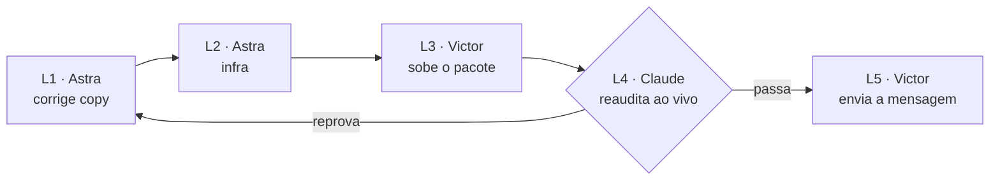

# ITERAÇÃO DO SITE — thegoldentemple.io · 25/09/2026

> **Fonte única desta rodada.** Substitui a §7 de `AUDITORIA-SITE-PRODUCAO-2026-09-25.md`, que passa a apontar para cá.
> **Decisões que sustentam cada item:** `DECISOES.md` DEC-2026-08-11-002 · DEC-2026-08-19-001 · DEC-2026-09-20-001 · DEC-2026-09-25-001.
> **Nenhum item depende de decisão pendente do Victor ou da Prana.**

---

## 0. A ORDEM — e ela não se inverte



🔴 **O link não vai para a Prana antes de L4 passar.**

---

## L1 · Astra · correção de copy — HOJE

> Destino: `clientes/PRANA KA/execução Codex/site-2026-09/` (§0 do `AGENTS.md`). Ao final, refazer `_entrega/site/`, `SHA256SUMS.txt` e o zip.
> **Objeto:** os 8 itens abaixo, nas 27 páginas. **Nada de layout, ordem de dobra ou texto fora da lista.**

| # | Onde | Trocar | Por |
|---|---|---|---|
| **1** | home PT/EN/ES | `[COPY PENDENTE]` · `[COPY PENDING]` · `[TEXTO PENDIENTE]` | **vídeo da Carol** — `https://www.youtube-nocookie.com/embed/3NbO7HBGbkU`, `loading="lazy"`, `title` e legenda *"Carol"* |
| **2** | Mentoria PT/ES/EN — **inclusive selo do hero e meta description** | toda menção a *"12 encontros"* · *"12 encuentros"* · *"12 meetings"* | selo do hero: **"a cada 14 dias"** · no texto: ***"encontros a cada 14 dias"*** |
| **3** | Mentoria, FAQ — as duas respostas com *"checkout"* | a frase que cita checkout ou aprovação de pagamento no checkout | ***"A entrada começa numa conversa com a Prana. Depois dela, você recebe o acesso à plataforma e o caminho dos oito Portais do Ventre."*** |
| **4** | Visão Uterina PT/EN/ES, bloco de investimento | *"Sessão individual e online, conduzida por Prana Ka."* | ***"Sessão individual de 1h30, online ou presencial, conduzida por Prana Ka."*** |
| **5** | Curso PT/EN/ES | o preço visível (R$ 97, 2× por página) | **oculto com `hidden`** — não apagar. CTA de WhatsApp permanece |
| **6** | home e Visão Uterina, cards de depoimento | os avatares circulares (`retrato-*.webp`) | **remover.** Manter nome e citação. ⚠️ **Não reutilizar `retrato-*.webp` em lugar nenhum: são recortes descartados** |
| **7** | Visão Uterina, CTA do topo | `text=` *"…quero saber o valor e os horários para uma sessão individual."* | ***"Olá, Prana! Vim pela página da Visão Uterina e quero agendar minha sessão."*** |
| **8** | Visão Uterina | *"R$333"* | ***"R$ 333"*** |

**Itens 2–4 em EN/ES são transcriação:** marcar `<!-- REVISAR: transcriação -->`.

**Gate de L1 — rodar e reportar com resultado real:**

- [ ] no **texto renderizado** das 27 páginas, zero ocorrências de: `PENDENTE` · `PENDING` · `PENDIENTE` · `12 encontros` · `12 encuentros` · `12 meetings` · `checkout` · `R$ 97` · `R$333`
- [ ] zero referências a `retrato-` no HTML
- [ ] diff limpo fora dos 8 itens
- [ ] Lighthouse mobile ≥ 90 nas páginas alteradas (home, Mentoria, Visão Uterina, Curso × 3 idiomas)
- [ ] console limpo em 390 / 1440

---

## L2 · Astra · infraestrutura — mesmo pacote

| # | Entrega | Especificação |
|---|---|---|
| **9** | `404.html` na raiz | na identidade do site, **PT com EN e ES abaixo**, três links: Templo (`/`), Visão Uterina, Mentoria. `noindex` |
| **10** | `.htaccess.proposta` na raiz do pacote | ver bloco abaixo. **Arquivo de proposta, não `.htaccess`:** o servidor pode já ter um, e sobrescrever derruba o HTTPS |
| **11** | `assets/og/og-default.jpg` | **1200×630 JPG**, `selo-templo` centralizado sobre marfim `#f3ebdd`. Trocar `og:image` nas 27 páginas + `og:image:width` / `height` |

```apache
# --- The Golden Temple · proposta de 25/09/2026 ---
RewriteEngine On

# www → domínio raiz
RewriteCond %{HTTP_HOST} ^www\.thegoldentemple\.io$ [NC]
RewriteRule ^(.*)$ https://thegoldentemple.io/$1 [R=301,L]

# caminhos antigos (DEC-2026-09-02-002: a Masterclass virou Visão Uterina)
RewriteRule ^masterclass/?$ /visao-uterina/ [R=301,L]
RewriteRule ^(v2|the-golden-temple|the-golden-temple-v2)(/.*)?$ / [R=301,L]

ErrorDocument 404 /404.html
```

---

### ✅ Pré-checagem do pacote L1–L2 — Claude, 27/09/2026

Rodado sobre `_entrega/site/` (28 HTMLs, texto que chega à tela, sem `[hidden]`, scripts e comentários):

| Item | Resultado |
|---|---|
| termos proibidos no texto e nos metadados | ✅ **zero** |
| `retrato-` no HTML | ✅ zero · avatares removidos |
| vídeo da Carol, 3 homes | ✅ `youtube-nocookie`, lazy |
| Visão Uterina · duração e formato | ✅ PT *"1h30, online ou presencial"* · EN *"90-minute session, online or in person"* · ES *"1 h 30 min, en línea o presencial"* |
| Mentoria · "a cada 14 dias" | ✅ 8× por idioma, meta description incluída |
| Curso · preço | ✅ 6 blocos com R$ 97 ocultos por `hidden`, reativáveis |
| `og-default.jpg` | ✅ 1200×630 RGB · tags de dimensão presentes |
| `404.html` | ✅ três idiomas, `noindex`, três caminhos |
| `.htaccess.proposta` | ✅ igual ao especificado |
| 🟡 **item 7 — WhatsApp** | **parcial.** O CTA do topo foi trocado; **dois links secundários por página ainda pedem *"o valor e os horários"***. O Astra seguiu a letra do contrato (*"CTA do topo"*). **A instrução estreita foi nossa.** Não bloqueia: vai para a próxima rodada |

⭐ **E o pacote entrou na fila do `STATUS-CODEX.md` no mesmo fechamento (26/09 22h23).** É a primeira vez em quatro pacotes seguidos.

**Veredito: liberado para L3.**

---

## L3 · Victor · subir

> 🔴 **Revisto em 27/09 por decisão do Victor: apagar tudo e subir de novo, sem mesclar nada.** Montado por Claude em `04 - web design/PUBLICAR-2026-09-27/`: o pacote L1–L2 com um **`.htaccess` completo** no lugar da proposta (HTTPS com guarda anti-loop, www → raiz, caminhos antigos, 404). Passo a passo em `COMO-SUBIR.md`. **Os três passos abaixo ficam superados.**
>
> **O que estava no ar até aqui:** o pacote **L7 de 21/09** (`execução Codex/site-2026-09/_entrega/THE-GOLDEN-TEMPLE-L7.zip`, hoje só no backup interno do Codex). Assinaturas conferidas ao vivo: `/css/quality.css`, `/assets/responsive/` e o `[COPY PENDENTE]`, que só existem no L7.

1. Substituir os arquivos do domínio pelo novo `_entrega/site/`
2. **Mesclar** `.htaccess.proposta` com o `.htaccess` existente do servidor — não substituir
3. ⬜ Conferir onde circulam links antigos (bio, Linktree, carrossel). **Se houver caminho fora dos três redirecionados, me passar**

---

## L4 · Claude · reauditoria ao vivo

Mesmo método de `AUDITORIA-SITE-PRODUCAO-2026-09-25.md`, mais:

- [ ] gate de L1 rodado **no domínio**, não no pacote
- [ ] `www` → raiz com 301 · `/masterclass` → `/visao-uterina/` · URL inexistente → `404.html` da casa
- [ ] prévia do link no WhatsApp com a imagem nova
- [ ] **revisão dos blocos de transcriação das três ofertas e da home** em EN/ES — os de conversão primeiro (`REVISAO-TRANSCRIACAO-L6.md`)

**Reprova → volta para L1.** Passa → L5.

### ✅ Resultado de L4 — Claude, 27/09/2026, no domínio

| Item | Resultado |
|---|---|
| 27 rotas | **200 nas 27** |
| termos proibidos no texto visível e nos metadados | ✅ **zero em 27/27** · zero `retrato-` |
| vídeo da Carol | ✅ renderiza. **É do canal da própria Prana** (*"Depoimento Templo Dourado"*), o que confirma a autorização por destinação |
| `www` → raiz · `/masterclass` → `/visao-uterina/` · `/the-golden-temple-v2/` → `/` | ✅ 301 conferido navegando |
| 404 | ✅ página da casa, status 404 real |
| `.htaccess` exposto | ✅ não — 403 |
| `og-default.jpg` | ✅ 200 |
| transcriação EN/ES | 🟡 **amostragem** de títulos e CTAs da home e das três ofertas: natural, sem erro de sentido. **A revisão completa dos 296 blocos deixa de ser gate desta entrega**: a Prana lê em português, as versões EN/ES ainda não têm tráfego e os marcadores de revisão são comentários, invisíveis ao visitante. **Decisão nossa, e é mudança do gate que eu mesmo escrevi** |

⚠️ **Achado de cache, não bloqueia:** a Hostinger serve CSS e JS com `max-age` de **7 dias**, e os nomes dos arquivos não mudam entre versões. Quem abriu o site entre 21 e 27/09 pode receber o HTML novo com o CSS antigo (`home.css` e `quality.css` mudaram). **O navegador deste teste mostrou exatamente isso até forçar a recarga.** Para o Victor: testar sempre em aba anônima.

**Veredito: L4 passa. L5 liberado.**

### Próxima rodada — não bloqueia L5

| # | Item |
|---|---|
| 1 | resíduo do item 7: **todo** `wa.me` da Visão Uterina com *"…quero agendar minha sessão."* |
| 2 | **cache-busting:** `?v=AAAAMMDD` em todo `<link>` de CSS e `<script>` de JS, e no `.htaccess` `Cache-Control: no-cache` para HTML. **Sem isso, toda atualização futura repete o problema acima** |
| 3 | revisão completa das transcriações EN/ES |

---

## L5 · Victor · enviar a mensagem

Texto em `ENTREGA-SITE-2026-09-25.md` §7.3, com as duas mudanças da auditoria §6: **link aberto, sem senha** · *"eu subo na segunda"* sai, entra ***"Se tiver algo que você queira mudar, me fala e eu ajusto."***

⬜ **Bloco 6 (fecho de escopo) aguarda decisão do Victor.** Não trava L1–L4.

---

## O que NÃO entra nesta rodada

| Item | Por quê |
|---|---|
| preço do Curso | fato da Prana — vai como pergunta única na mensagem. Página já sai sem preço |
| música e singles/DJ sets | default registrado: botão desligado, só canais oficiais, até ela mandar |
| 2 depoimentos extras | *"dependo das mulheres"* — entram quando chegarem |
| funil / curso de entrada | frente comercial própria, depois da call |
| **resíduo do item 7** — os dois links secundários de WhatsApp da Visão Uterina (PT/EN/ES) ainda pedem *"o valor"* · e os pré-preenchidos de EN/ES estão em português | **próxima rodada.** Instrução: **todo** `wa.me` da Visão Uterina usa *"…quero agendar minha sessão."*. Pré-preenchido em português nas versões EN/ES é aceitável — a mensagem chega à Prana, que fala português |
