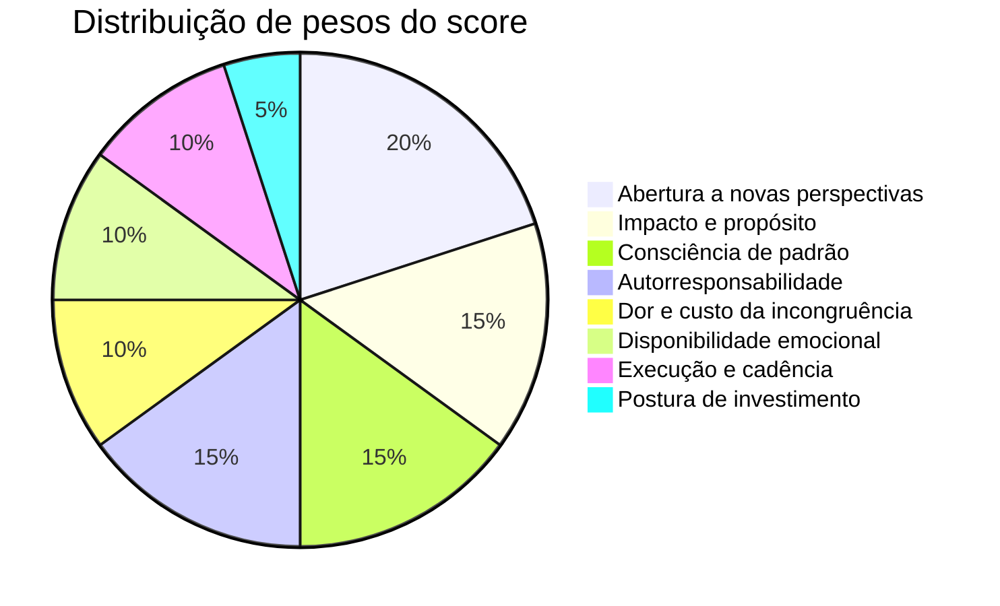
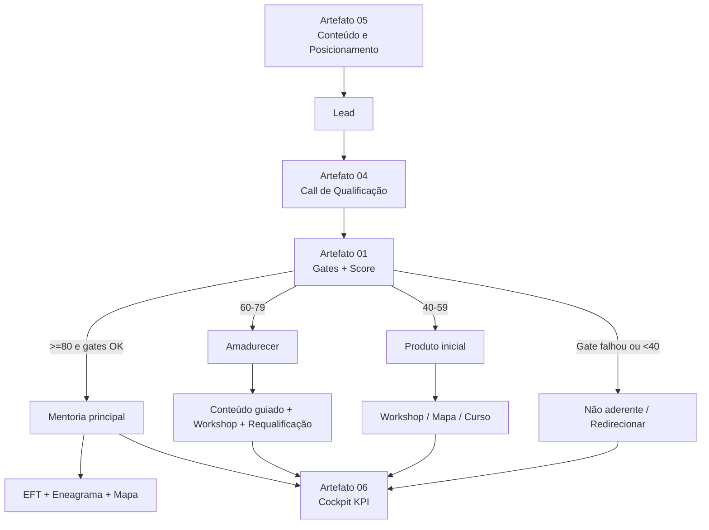
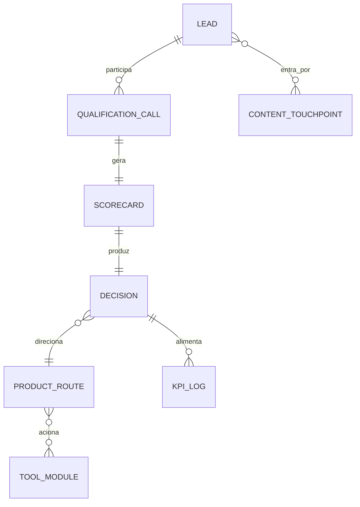

# Framework operacional de ICP e anti-ICP para Débora Delgado

## Sumário executivo

O corpus consultado no Google Drive mostra que a mentoria da Débora não é uma oferta de aconselhamento genérico nem um serviço terapêutico disfarçado: ela é apresentada como uma prática educacional de automaestria, que ajuda a pessoa a reconhecer padrões, compreender a própria dinâmica interna e agir com mais autonomia. Nessa lógica, o mecanismo central do método é o ciclo interpretação → emoção → reação → experiência; por isso, a entrada na mentoria depende menos de “gostar do tema” e mais de ter disponibilidade para revisar interpretações, sustentar desconforto produtivo e aplicar mudanças concretas. O EFT aparece como ferramenta útil dentro do processo, e o Eneagrama aparece como mapa de padrão, não como rótulo fixo. fileciteturn10file0L34-L74 fileciteturn10file0L218-L244 fileciteturn19file0L18-L24

Também no Google Drive, os materiais internos deixam claro que o problema central da oferta é “impacto sem congruência”: gente competente, valiosa e capaz, mas que trabalha, lidera ou contribui pagando um custo alto demais em energia, identidade, relações, valor e rotina. A transformação prometida é “impacto com congruência”: reconhecer o impacto natural que já gera, sustentar limites, parar de se adaptar ao que drena e receber por coerência. Os formulários de resposta da própria Débora reforçam que o público desejado quer mais propósito no trabalho, percebe que o mundo interno afeta o externo, tem coragem mínima de olhar para dentro e costuma ter alguma experiência prévia com processos emocionais; os sinais de não aderência incluem cabeça fechada, culpabilização do externo, recusa em sentir emoções, pressa excessiva e busca de solução apenas prática. fileciteturn14file0L8-L34 fileciteturn14file0L37-L63 fileciteturn14file0L66-L90 fileciteturn15file0L64-L73

A literatura externa converge com isso em quatro pontos. Primeiro, ICP deve descrever o tipo de cliente com maior probabilidade de comprar, ter sucesso e gerar valor de longo prazo, com base em dados reais, e não em suposições; ele não é a mesma coisa que buyer persona. Segundo, frameworks de qualificação robustos priorizam contexto, dor, impacto, urgência e processo decisório — não apenas “interesse”. Terceiro, readiness para mudança está associada a melhores resultados, e escalas curtas de 0 a 10 são úteis para extrair motivação e barreiras. Quarto, o oposto da prontidão não é “imaturidade”: é, com frequência, baixa abertura cognitiva, desconforto com ambiguidade e fechamento prematuro — exatamente o terreno do que aqui vale tratar como anti-ICP. citeturn1search2turn2search3turn2search4turn2search6 citeturn6search0turn6search1turn5search0turn5search1 citeturn0search0turn3search3turn3search6turn3search7 citeturn1search0turn7search0turn7search2turn7search3

A recomendação, portanto, é operacionalizar o sistema em três camadas: gates duros de escopo e segurança, score ponderado de adequação e prontidão, e roteamento inequívoco para uma de quatro decisões: entrar, amadurecer, produto inicial ou não aderente agora. O coração do sistema não deve ser setor, cargo ou “perfil corporativo”, mas sim a combinação de impacto, propósito, consciência de padrão, abertura a novas perspectivas, autorresponsabilidade e capacidade de execução. Isso é o que torna o framework imediatamente acionável e compatível com a tese da Débora.

## Base de evidências e premissas

No Google Drive, as fontes mais úteis para esta definição foram: o encontro sobre padrões e realidade, que explicita a diferença entre mentoria e terapia e o ciclo interpretação-emoção-reação-experiência; a aula sobre a importância do inconsciente, que descreve objetivos travados como efeito de crenças, dores e estratégias protetivas não conscientes; a aula sobre crenças de trabalho, que reposiciona trabalho como troca relacional de valor e desfaz a associação entre trabalho, sofrimento e valor pessoal; o documento da mentoria, que organiza promessa, dores, pilares e ganhos práticos; o Mapa de Valor Autêntico, que traz Ikigai, Menu do Entusiasmo, linha da vida, antivalores, medos e necessidades; e as respostas do formulário da própria Débora, que nomeiam exemplos de prontos, resistentes e encaminhamentos fora de escopo. fileciteturn10file0L34-L74 fileciteturn10file0L218-L244 fileciteturn9file0L28-L38 fileciteturn9file0L78-L100 fileciteturn9file0L306-L316 fileciteturn12file0L88-L116 fileciteturn12file0L138-L152 fileciteturn12file0L200-L264 fileciteturn13file0L29-L49 fileciteturn13file0L68-L118 fileciteturn13file0L128-L145 fileciteturn15file0L64-L73

Na literatura e nos referenciais de mercado, usei ICP e buyer persona da HubSpot e da RD Station para ancorar a diferença entre “quem vale a pena atender” e “como falar com a pessoa”; Salesforce para scoring e qualificação objetiva; Winning by Design para SPICED e handoff entre times; MEDDICC para dor, impacto, critérios e processo decisório; e artigos acadêmicos/open access sobre readiness, readiness rulers, need for cognitive closure e actively open-minded thinking. A síntese operacional abaixo não replica nenhum framework “de prateleira”: ela adapta essas referências ao método da Débora e aos sinais levantados nos seus próprios arquivos. citeturn1search2turn1search7turn2search0turn2search6 citeturn4search0turn4search2turn4search3 citeturn6search0turn6search1turn6search3 citeturn5search0turn5search1turn5search3 citeturn0search0turn3search2turn3search3turn3search6turn3search7 citeturn1search0turn7search0turn7search2turn7search3

Duas premissas operacionais não estavam documentadas de forma estruturada nas fontes consultadas, mas foram trazidas no briefing e precisam ser tratadas como regras de projeto: a mentoria principal é a oferta central e deve operar como LAB de evolução e autoridade, com capacidade protegida; workshops e produtos introdutórios funcionam como porta de entrada e fila; e o ticket semestral atual foi informado em R$ 4,88 mil, com referência futura de R$ 6 mil. Isso implica uma postura conservadora na entrada: o sistema deve maximizar qualidade de coorte, não volume de fechamento.

Outra premissa importante: o ICP não deve ser limitado ao “corporativo”. Os arquivos internos citam líderes e, em algumas respostas, mostram preferência por educação e saúde, mas o problema-âncora documentado é mais amplo: pessoas que geram ou querem gerar impacto com mais propósito e sofrem com a incongruência entre quem são e a forma atual de trabalhar. Em outras palavras, setor é contexto possível; o verdadeiro critério é a combinação impacto + propósito + prontidão. fileciteturn14file0L180-L221 fileciteturn15file0L72-L73

## Definições operacionais de ICP e anti-ICP

A melhor definição operacional de ICP para a Débora é: **pessoa com responsabilidade real sobre valor, contribuição, liderança, criação ou influência, que percebe custo de incongruência no modo atual de trabalhar/viver, quer alinhar propósito e impacto, reconhece que o externo não basta e está suficientemente aberta para revisar padrões, crenças e emoções sem terceirizar sua transformação**. Essa pessoa pode ser executiva, líder, empreendedora, especialista, profissional liberal, educadora, profissional de saúde, criadora de projeto autoral ou alguém em transição/expansão de carreira. O vínculo comum não é setor; é a natureza do problema e a prontidão para o método. Isso está alinhado tanto com a tese de “impacto com congruência” quanto com a definição externa de ICP como cliente mais propenso a comprar, ter sucesso e gerar valor de longo prazo. fileciteturn14file0L8-L34 fileciteturn14file0L126-L177 fileciteturn15file0L72-L73 citeturn1search2turn2search0turn2search6

A melhor definição operacional de anti-ICP é: **perfil de baixa aderência metodológica e/ou baixa abertura cognitiva, que tenta resolver um problema de congruência profunda só pelo lado externo, mantém respostas prontas, resiste a revisar crenças, evita contato emocional, culpa predominantemente o ambiente e não demonstra disposição prática para mudar rotina, postura e padrões**. Anti-ICP, aqui, não é insulto nem laudo; é uma categoria de risco operacional. O construto psicológico mais próximo é combinação de baixa actively open-minded thinking com traços de high need for closure: preferência por previsibilidade, desconforto com ambiguidade, close-mindedness e fechamento rápido sobre o que já “sabe”. fileciteturn15file0L64-L73 citeturn1search0turn7search0turn7search2turn7search3

A distinção crítica não é entre “ICP” e “não ICP”, mas entre **pronto**, **promissor porém não pronto**, **curioso sem profundidade suficiente** e **fora de escopo/agora não aderente**. A literatura de readiness ajuda aqui, mas com uma cautela importante: readiness é útil como contínuo e preditor de resultado; não deve ser tratada como um rótulo rígido e definitivo. Por isso, o sistema recomendado usa score contínuo e gates observáveis, não “estágios de mudança” como sentença. citeturn0search0turn3search3turn3search7 citeturn0search4turn0search6

| Dimensão | ICP operacional | Anti-ICP operacional | O que ouvir na fala do lead |
|---|---|---|---|
| Relação com o problema | Reconhece que o externo pesa, mas que existe participação interna | Vê o problema como 100% externo | “Já mudei contexto e o padrão continua” vs. “Se meu chefe mudasse, resolvia tudo” |
| Relação com propósito | Quer gerar impacto com sentido e não apenas aliviar dor imediata | Quer só apagar incêndio ou ganhar dinheiro rápido | “Quero alinhar trabalho e vida” vs. “Só preciso de um movimento prático” |
| Consciência de padrão | Percebe repetição, ambivalência ou automação | Nega padrão ou o trata como irrelevante | “Eu me vejo repetindo isso” vs. “Isso não tem a ver comigo” |
| Abertura cognitiva | Tolera rever crenças e testar novas lentes | Defende certezas e entra em debate defensivo | “Pode ser que eu esteja vendo errado” vs. “Já sei como isso funciona” |
| Relação com emoção | Aceita que emoção participa do processo | Rejeita emoção como tema de trabalho | “Entendo que isso mexe comigo” vs. “Emoção não entra aqui” |
| Relação com ação | Implementa algo quando entende sentido | Quer insight sem prática | “Se fizer sentido eu testo” vs. “Só preciso de clareza” |
| Escopo | Questão central é congruência, valor, padrão, posicionamento | Demanda primária é clínica, sistêmica familiar ou recolocação tática | “Quero entender meu padrão” vs. “Só preciso de um headhunter” |
| Postura frente a investimento | Avalia adequação e valor | Avalia apenas preço ou barganha cedo demais | “Quero entender se faz sentido” vs. “Tem desconto?” |

**Nota de evidência:** a fase “quero mais propósito”, “mundo interno reflete no externo”, “coragem de olhar pra dentro”, “curioso”, “gosta de aprender”, “coloca a mão na massa” veio explicitamente das respostas do formulário da Débora; a fase “cabeça fechada”, “criticar o outro”, “não querer sentir emoções”, “muita pressa” também. A noção externa de negative persona ou exclusionary persona reforça a utilidade de nomear quem não deve ser atendido agora. fileciteturn15file0L64-L73 citeturn8search6turn8search9

## Framework integrado recomendado

A arquitetura mais robusta para a Débora é um sistema com **gates duros**, **score ponderado** e **roteamento de produto**. Gates duros existem para proteger escopo e coorte; score ponderado existe para evitar decisões “no feeling”; roteamento existe para não perder gente promissora que ainda não está pronta.

### Gates duros de escopo

| Gate | Passa quando | Falha quando | Decisão padrão |
|---|---|---|---|
| Escopo clínico | Busca processo de mentoria/autoconhecimento aplicado | Pede diagnóstico clínico, terapia ou contenção aguda | Não aderente agora / redirecionar |
| Escopo sistêmico-familiar | O núcleo é individual e trabalhável no método | O peso maior está em emaranhamento familiar/sistêmico | Redirecionar para trabalho sistêmico |
| Escopo tático de recolocação | Busca congruência e padrão, não só vaga/emprego | Quer apenas reposicionamento externo ou recolocação | Redirecionar para headhunter/consultoria de carreira |
| Abertura mínima | Demonstra abertura ≥ 4/10 para novas perspectivas | Abertura 0–3/10 | Não aderente agora |
| Responsabilidade mínima | Reconhece alguma participação própria | Culpabiliza só o externo | Não aderente agora |
| Disponibilidade mínima | Tem espaço emocional e prático para um processo | Está em crise aguda ou sem condição de sustentar presença | Amadurecer ou redirecionar |

Os próprios casos relatados pela Débora reforçam esses gates: Felipe queria solução prática e não emocional; Guilherme tinha opinião forte e cabeça fechada; Kamila parecia precisar de trabalho sistêmico; Arthur buscava solução externa de emprego e seria melhor atendido por headhunter. fileciteturn15file0L66-L72

### Score ponderado recomendado

**Regra:** cada critério recebe nota 0, 1, 2, 3 ou 4. O score final é `peso x (nota/4)`. Total máximo: 100.  
**Importante:** os pesos abaixo são recomendação operacional, não um corte científico universal.

| Critério | Peso | O que mede | Âncora 0 | Âncora 2 | Âncora 4 |
|---|---:|---|---|---|---|
| Impacto e propósito | 15 | Desejo de gerar valor com sentido | Quer só sair do incômodo | Quer mais sentido, mas ainda vago | Nomeia impacto, contribuição e porquê |
| Dor e custo da incongruência | 10 | Quanto o modo atual cobra | Dor abstrata | Dor nomeada sem custo claro | Custo claro em energia, relações, valor ou rotina |
| Consciência de padrão | 15 | Percepção de repetição e automatismo | Não vê padrão | Percebe que algo se repete | Nomeia padrão, gatilho e efeito |
| Abertura a novas perspectivas | 20 | Disposição para rever crenças e interpretações | Defensivo, fecha | Oscila entre curiosidade e defesa | Busca rever lentes e tolera ambiguidade |
| Autorresponsabilidade | 15 | Capacidade de ver sua participação | Culpa só o externo | Mistura externo+interno | Reconhece explicitamente sua parte |
| Disponibilidade emocional | 10 | Capacidade de falar e trabalhar o que sente | Rejeita emoção | Tolera falar um pouco | Topa observar, sentir e processar |
| Execução e cadência | 10 | Tendência a aplicar o que faz sentido | Não implementa | Implementa irregularmente | Testa, observa, traz retorno |
| Postura de investimento | 5 | Avaliação por valor/adequação | Só preço e barganha | Está indeciso | Faz avaliação madura de valor e adequação |

Os maiores pesos foram colocados em abertura, consciência de padrão e autorresponsabilidade porque são exatamente os elementos mais coerentes com o método da Débora e com a literatura de readiness/open-mindedness: resultados melhores tendem a aparecer quando há mais prontidão, e a baixa abertura/alto fechamento cognitivo compromete a utilidade de processos que exigem revisão de crenças e tolerância ao não saber. fileciteturn10file0L218-L244 fileciteturn15file0L64-L73 citeturn0search0turn3search3turn3search7 citeturn1search0turn7search0turn7search2turn7search3

### Escala obrigatória de abertura 0–10

Esta pergunta deve ser **obrigatória** em toda call:

> “De 0 a 10, quão aberta você está a considerar que parte importante da solução passa por revisar a forma como você interpreta, sente e age — e não só mudar o externo?”

**Leitura recomendada:**

| Faixa | Leitura operacional |
|---|---|
| 0–3 | Rigidez alta; tende a anti-ICP |
| 4–5 | Abertura baixa; só entra via produto inicial ou amadurecimento |
| 6–7 | Abertura moderada; depende do resto do score |
| 8–10 | Boa a alta abertura; forte sinal de prontidão |

Para qualquer resposta 0–10, use duas perguntas-padrão do readiness ruler adaptado: **“Por que não um número menor?”** e **“O que precisaria acontecer para subir um ponto?”**. Isso extrai motivação, barreiras e qualidade da abertura, sem transformar a autoavaliação em dado solto. citeturn3search2turn3search6turn3search3

### Matriz de decisão

| Decisão | Condição operacional | Próximo passo | Requalificação |
|---|---|---|---|
| Entrar | Gates passam, score ≥ 80, abertura ≥ 7 | Oferta da mentoria principal | Não aplica |
| Amadurecer | Score 60–79, ou abertura 5–6, ou boa aderência com pouca sustentação | Conteúdo dirigido + workshop/diagnóstico + prática de 30–45 dias | Requalificar em 30–45 dias |
| Produto inicial | Score 40–59 e curiosidade maior que compromisso | Workshop / Mapa de Valor Autêntico / curso introdutório | Requalificar após consumo/aplicação |
| Não aderente agora | Score < 40 ou gate duro falhou | Redirecionar ou encerrar com elegância | Só volta se contexto mudar |

Em termos de portfólio, isso protege a mentoria principal como oferta premium e central, e transforma workshops/produtos iniciais em mecanismo de fila e maturação. O critério não deve ser “fecho quem quer pagar”; deve ser “aloco cada pessoa na profundidade que ela consegue sustentar agora”.

### Integração com EFT, Mapa de Valor Autêntico e Eneagrama

| Ferramenta | Papel na qualificação | Papel na entrega | Regra de uso |
|---|---|---|---|
| EFT | Não usar como gancho comercial principal | Liberar carga emocional de bloqueios identificados | Indicado quando há padrão claro + afeto acessível + segurança para trabalhar a carga |
| Mapa de Valor Autêntico | Excelente para produto inicial e diagnóstico de propósito/valor | Estruturar impacto, propósito, entusiasmo, antivalores e necessidades | Usar cedo quando a dor central é valor, propósito, direção e identidade de contribuição |
| Eneagrama | Ferramenta de hipótese e linguagem de padrão | Mapear defesa, dor evitada, tendência automática e recursos | Nunca usar como rótulo de marketing ou gate de entrada; usar como mapa, não sentença |

O desenho acima bate com os materiais internos: o EFT aparece como ferramenta de liberação dentro do processo; o Eneagrama aparece como mapa que ajuda a localizar “espinhos”/padrões; e o Mapa de Valor Autêntico organiza Ikigai, entusiasmo, linha da vida, antivalores e medos — o que o torna especialmente útil para o eixo propósito-valor-trabalho. fileciteturn10file0L38-L54 fileciteturn19file0L18-L24 fileciteturn13file0L29-L49 fileciteturn13file0L68-L118 fileciteturn13file0L225-L242

A lógica do fluxo combina o método interno da Débora com frameworks externos de qualificação: conteúdo atrai e filtra, call descobre contexto/dor/impacto/decisão, score disciplina a decisão, e o cockpit mede qualidade e evolução da fila. citeturn6search0turn6search3turn4search0turn4search3turn5search1

## Script diagnóstico e exemplos de falas

A call deve funcionar como uma **SPICED-lite adaptada ao método da Débora**: começar pelo contexto e pela dor, passar por impacto e urgência, e então aprofundar em padrão, abertura e autorresponsabilidade. Isso permite qualificar sem virar interrogatório e sem vender solução antes de entender aderência. citeturn6search0turn6search1turn5search1turn4search3

### Script recomendado de qualificação

| Bloco | Pergunta-base | O que observar | Campo do score |
|---|---|---|---|
| Impacto e propósito | “Que tipo de impacto ou valor você quer gerar hoje — e o que no jeito atual já não vibra com você?” | Se a pessoa fala de contribuição, sentido e custo da incongruência | Impacto e propósito |
| Dor e custo | “O que esse jeito atual vem cobrando de você em energia, relações, valor ou rotina?” | Se o custo é real e concreto | Dor e custo |
| Padrão | “O que tende a se repetir, mesmo quando o contexto muda?” | Se a pessoa reconhece repetição, defesa ou automatismo | Consciência de padrão |
| Causa interna | “O que você já tentou mudar do lado de fora e por que sente que ainda não resolveu?” | Se surge a percepção de que o externo não basta | Autorresponsabilidade |
| Abertura | “De 0 a 10, quão aberta você está a revisar crenças, interpretações e padrões — e não só buscar uma solução prática?” | Número, qualidade da resposta, defesa, curiosidade | Abertura |
| Profundidade emocional | “Quando esse tema aperta, você topa olhar o que sente ou quer evitar essa parte?” | Tolerância a emoção e desconforto | Disponibilidade emocional |
| Execução | “Quando algo faz sentido para você, o que costuma acontecer na prática?” | Históricos de implementação vs. paralisia total | Execução |
| Investimento | “Como você costuma decidir entrar em processos importantes de desenvolvimento?” | Se decide por adequação/valor ou só por preço | Postura de investimento |
| Fechamento | “Pelo que ouvi, faz mais sentido te indicar [mentoria / amadurecimento / produto inicial / redirecionamento]. Posso te explicar por quê?” | Aderência ao roteamento e maturidade diante do não | Decisão |

### Perguntas de aprofundamento obrigatórias na escala 0–10

Sempre que a pessoa responder a abertura 0–10:

- “Por que não um número menor?”
- “O que precisaria acontecer para subir um ponto?”
- “O que, em você, ainda quer defender o jeito antigo de funcionar?”
- “Se eu te dissesse que parte da solução depende de sentir algo desconfortável e agir diferente, isso te aproxima ou te afasta?”

### Exemplos de falas do lead

| Decisão provável | Falas típicas | Leitura operacional |
|---|---|---|
| Entrar | “Eu já troquei contexto e o padrão volta.” / “Não quero só mudar de trabalho; quero entender por que me traio para manter desempenho.” / “Se fizer sentido, eu aplico.” | Consciência + abertura + execução |
| Amadurecer | “Eu sei que tem algo em mim, mas ainda preciso começar por algo mais leve.” / “Quero olhar para dentro, mas não sei se sustento um mergulho agora.” | Boa aderência, pouca sustentação |
| Produto inicial | “Quero clareza sobre meu valor e propósito antes de me comprometer com algo maior.” / “Tenho curiosidade por autoconhecimento, mas ainda não quero algo profundo.” | Curiosidade real, prontidão parcial |
| Não aderente agora | “Meu problema é meu chefe / o mercado / minha família; se isso mudar, resolve.” / “Não vejo por que mexer em emoção.” / “Já sei como penso; preciso só de um passo a passo.” / “Não tenho tempo para praticar nada agora.” | Externalização, rigidez, baixa aderência |

Essas falas são coerentes com os sinais internos documentados pela Débora: prontos tendem a perceber que a solução começa neles, são curiosos, gostam de aprender e executam; resistentes reclamam, julgam, culpam o externo, acham que dinheiro resolve tudo ou que só soluções práticas bastam. fileciteturn15file0L64-L73

## Governança, playbook e implementação

Um sistema assim só funciona se virar rotina e memória operacional. Frameworks como o SPICED enfatizam linguagem compartilhada e handoff de contexto; Salesforce enfatiza scoring objetivo e atualização de dados; e os documentos internos da Débora mostram que a qualidade da entrega depende de não misturar mentoria profunda com casos fora de escopo. Portanto, governança aqui não é “administração”: é proteção de método. citeturn6search3turn4search0turn4search3 fileciteturn10file0L34-L74

### KPIs, frequência e owners

| KPI | Owner primário | Frequência | Meta inicial |
|---|---|---|---|
| % leads com gates + score + frase-evidência completos | Operação/Continuum | Diário | 100% |
| Taxa de acerto retrospectivo da classificação | Débora | Mensal | ≥ 80% |
| Conversão por faixa de score | Comercial/ops | Mensal | Crescente nas faixas altas |
| % amadurecer → mentoria em até 90 dias | Comercial/ops | Mensal | Acompanhar coorte |
| % redirecionamentos corretos | Débora | Mensal | ≥ 80% |
| Tempo médio entre lead e decisão | Ops | Semanal | ≤ 72h |
| Retenção/conclusão da coorte principal | Débora | Mensal | Alta e estável |
| % calls com abertura 0–10 registrada | Comercial | Diário | 100% |

### Checklist diário curto

- [ ] Revisar leads novos e calls pendentes.
- [ ] Aplicar gates duros antes de “explicar a oferta”.
- [ ] Registrar uma frase-evidência para cada critério do score.
- [ ] Definir uma única decisão por lead: entrar, amadurecer, produto inicial, não aderente.
- [ ] Agendar o próximo passo no mesmo dia.
- [ ] Atualizar cockpit com score, rota e data de requalificação.
- [ ] Revisar dois casos limítrofes da semana para calibrar critérios.

### Playbook de uma página para calls de qualificação

| Etapa | Tempo | Objetivo | Output |
|---|---:|---|---|
| Abertura franca | 2 min | Alinhar que a call serve para verificar fit, não para convencer a qualquer custo | Permissão para perguntas diretas |
| Contexto e impacto | 5 min | Entender trabalho, contribuição, propósito e desconforto atual | Hipótese de tese central |
| Padrão e custo | 8 min | Entender repetição, tentativas anteriores, custo da incongruência | Evidência de dor e padrão |
| Abertura e responsabilidade | 5 min | Aplicar escala 0–10 e checar autorresponsabilidade | Nota-chave e red flags |
| Execução e decisão | 3 min | Ver histórico de prática, disponibilidade e postura de investimento | Score completo |
| Fechamento | 2 min | Dar uma rota unívoca com racional claro | Próximo passo definido |

### Integração com os seis artefatos

| Artefato | Como o sistema entra |
|---|---|
| Sistema de ICP e Prontidão | Gates, score, falas, critérios, matriz de decisão |
| Arquitetura da Oferta e Mentoria | Linguagem de dores, transformação, limites e promessas compatíveis com o ICP |
| Funil de Consciência e Produto Inicial | Roteamento de amadurecer/produto inicial e gatilhos de requalificação |
| Protocolo de Qualificação Comercial | Script, objeções, registro de call e decisão |
| Sistema de Conteúdo e Posicionamento | Conteúdos que atraem ICP e filtram anti-ICP |
| Cockpit Operacional da Sprint | KPIs, backlog de revisão, calibragem de critérios e owners |

### Restrições de UX e implementação em HTML

As telas/artefatos devem ser instrumentos de operação diária, não peças de apresentação. Isso pede HTML único por artefato, pronto para WordPress, CSS interno, JS apenas se necessário, escopo `.debora-artifact`, sem assets externos e com estrutura privilegiando tabela de score, matriz de decisão, checklist, bloco “próxima ação”, registro de evidências e cards de status. O desenho correto é de **painel operacional**, não de landing page, aula ou apresentação.

A relação entre entidades acima garante que o sistema seja auditável: cada decisão deve nascer de uma call, cada call deve gerar um scorecard, cada scorecard deve produzir uma decisão única, e cada decisão deve alimentar o cockpit. Sem isso, o framework volta a ser opinião; com isso, ele vira operação.